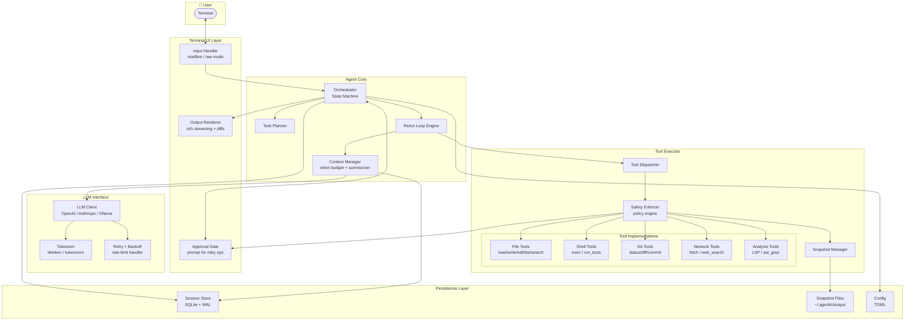
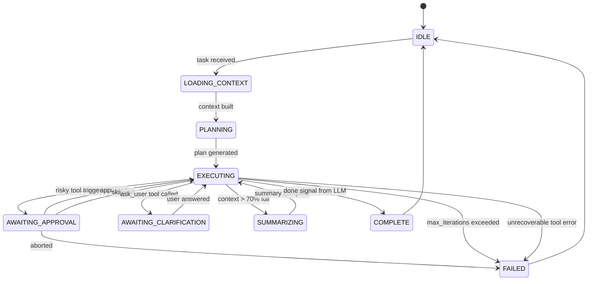
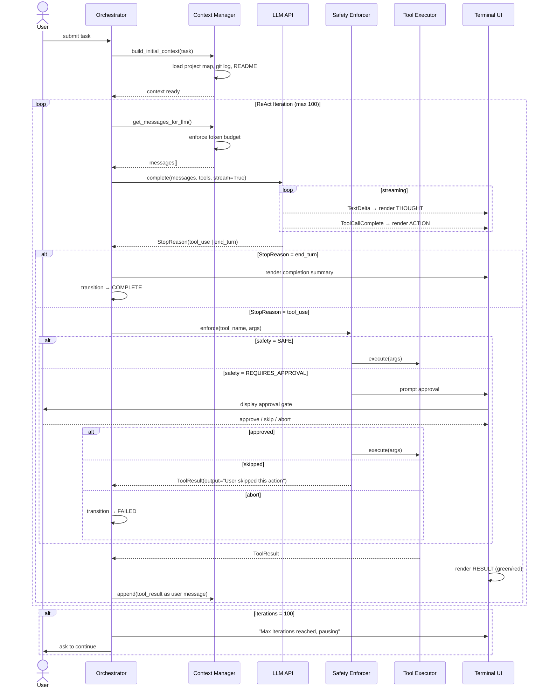

---

Design a terminal-based AI coding agent that can complete software engineering tasks.


---

# Terminal-Based AI Coding Agent: System Design

---

## 1. Overview and Goals

The system is a terminal-resident AI agent—invoked as `agentic` or similar—that accepts natural-language software engineering tasks and autonomously completes them: reading code, editing files, running tests, querying documentation, and committing changes. The agent operates inside the user's existing terminal, repository, and toolchain, requiring no browser or GUI.

**Core goals:**
- Execute multi-step coding tasks end-to-end with minimal human intervention
- Operate safely inside production codebases without destroying state
- Be observable: every action is visible, auditable, and reversible
- Be cost-aware: minimize LLM token spend per task

---

## 2. Requirements

### 2.1 Functional Requirements

| ID | Requirement |
|----|-------------|
| F1 | Accept a natural-language task description via STDIN or argument |
| F2 | Autonomously plan and execute multi-step workflows (read→edit→test→commit) |
| F3 | Read, write, and search files in the local filesystem |
| F4 | Execute arbitrary shell commands with user-configurable safety gates |
| F5 | Run the project's test suite and interpret pass/fail results |
| F6 | Perform git operations: status, diff, add, commit, branch |
| F7 | Fetch web pages and search documentation |
| F8 | Pause and request clarification from the user when blocked |
| F9 | Stream LLM output in real-time to the terminal |
| F10 | Support undo: restore any file modified during the current session |
| F11 | Maintain session history across invocations |
| F12 | Support pluggable LLM backends (OpenAI, Anthropic, Ollama) |

### 2.2 Non-Functional Requirements

| ID | Requirement | Target |
|----|-------------|--------|
| NF1 | First-token latency after task submission | < 3 s |
| NF2 | Context window utilization ceiling | 85% of model limit |
| NF3 | Maximum automatic iterations before pausing | 100 (configurable) |
| NF4 | Cost per "medium" task (~30 LLM calls) | < $1 USD |
| NF5 | Snapshot storage per session | < 100 MB |
| NF6 | Agent startup time | < 500 ms |
| NF7 | No data sent to third parties except the configured LLM API | Mandatory |

---

## 3. High-Level Architecture



---

## 4. Component Design

### 4.1 Terminal UI Layer

**Input Handler** wraps the terminal in raw mode using a readline library (e.g., `linenoise`, Python `prompt_toolkit`, Go `liner`). It handles:
- Multi-line task input (user types, hits `Ctrl+D` to submit)
- Mid-execution interrupt (`Ctrl+C`) which pauses the loop and prompts *"Abort task? [y/N]"*
- Hotkeys during streaming: `s` to skip current tool, `q` to quit

**Output Renderer** uses a streaming-aware display:
- LLM tokens stream character-by-character via SSE
- Distinct visual lanes: `[THOUGHT]` (dim), `[ACTION]` (cyan), `[RESULT]` (green/red)
- Inline diffs rendered with unified diff coloring when files are modified
- Spinner + elapsed time for long-running shell commands

**Approval Gate** intercepts tool calls classified as `REQUIRES_APPROVAL` or `DANGEROUS` by the Safety Enforcer and renders:
```
⚠  About to run: rm -rf ./build
   Reason: shell command matches denylist pattern 'rm -rf'
   [A]pprove  [E]dit command  [S]kip  [Q]quit task
```
This blocks the agent event loop until the user responds.

---

### 4.2 Agent Orchestrator

The orchestrator is a state machine with the following states and transitions:



State data persisted to SQLite on every transition, enabling crash recovery.

**Stuck detection:** If the same `(tool_name, hash(args))` tuple appears three consecutive times in the ReAct loop, the orchestrator injects a synthetic observation: *"You have called this tool with identical arguments three times. Step back, reconsider your approach, and try something different."*

---

### 4.3 Context Manager

The context manager owns the entire message list sent to the LLM on each call and enforces the token budget.

**Message structure (ordered, top to bottom):**

| Slot | Content | Approx Tokens | Eviction Priority |
|------|---------|---------------|-------------------|
| SYSTEM | System prompt + tool schemas | 2,000–4,000 | Never evicted |
| PROJECT_MAP | Dir tree + key file summaries | 3,000–8,000 | Never evicted |
| TASK | Original user task | 200–2,000 | Never evicted |
| PLAN | Generated task plan | 500–1,500 | Never evicted |
| HISTORY | Past (thought, action, observation) turns | Variable | Oldest evicted first |
| RECENT | Last 8 turns verbatim | ~8,000 | Never evicted |

**Token pressure algorithm:**

```
budget = model_context_limit × 0.85   # e.g., 0.85 × 128K = 108,800
reserved_output = 4,096                # space for LLM response
available = budget - reserved_output

on each LLM call:
  total = sum(token_count(m) for m in all_slots)
  if total <= available:
    send as-is
  elif total <= available × 1.15:
    summarize oldest 30% of HISTORY turns (one summarization LLM call)
    replace those turns with a single "Summary:" assistant message
  else:
    emergency: keep SYSTEM + PROJECT_MAP + TASK + PLAN + RECENT only
    prepend "WARNING: context condensed. Earlier steps summarized."
    emit a terminal warning to the user
```

**Summarization sub-call:** Uses a cheaper/faster model (e.g., `gpt-4o-mini` or `haiku`) with prompt: *"Summarize the following agent actions and observations into 3-5 bullet points, preserving file names, function names, and error messages exactly."* Cost: ~0.3% of total task cost.

**Token counting:** Uses the model's native tokenizer (`tiktoken` for OpenAI, `tokenizers` for Anthropic) synchronously in-process. Counting adds ~2 ms overhead per call.

---

### 4.4 LLM Interface

```
┌──────────────────────────────────────┐
│  LLMInterface                        │
│  ┌──────────────────────────────┐   │
│  │  Provider Adapters           │   │
│  │  OpenAI | Anthropic | Ollama │   │
│  └──────────────────────────────┘   │
│  ┌──────────────────────────────┐   │
│  │  Streaming SSE Consumer      │   │
│  └──────────────────────────────┘   │
│  ┌──────────────────────────────┐   │
│  │  Tool-Call Parser            │   │
│  │  (JSON schema validation)    │   │
│  └──────────────────────────────┘   │
│  ┌──────────────────────────────┐   │
│  │  Retry / Rate-Limit Handler  │   │
│  │  exponential backoff ×5      │   │
│  └──────────────────────────────┘   │
└──────────────────────────────────────┘
```

**Provider abstraction:** Each provider adapter converts the canonical internal message format to the provider-specific wire format. All providers are driven through a unified `complete(messages, tools, stream=True) → AsyncIterator[Event]` interface.

**Event types emitted:**
- `TextDelta(content: str)` – streamed token
- `ToolCall(id, name, partial_json)` – streaming tool invocation
- `ToolCallComplete(id, name, args: dict)` – tool call fully parsed
- `StopReason(reason: "end_turn" | "tool_use" | "max_tokens")`
- `Usage(input_tokens, output_tokens)`

**Retry policy:** On `429 RateLimitError`: exponential backoff starting at 1 s, max 5 retries, cap at 60 s. On `5xx`: 3 retries with 2 s initial backoff. On `context_length_exceeded`: trigger emergency summarization and retry once.

**Tool calling format:** Use native tool-use APIs (OpenAI `tools`, Anthropic `tools`). Fall back to XML-tag parsing for local models that don't support structured tool calls:
```
<tool_call>{"name": "read_file", "args": {"path": "src/main.py"}}</tool_call>
```

---

### 4.5 Tool System

#### Tool Interface Contract

Every tool implements:

```python
class Tool:
    name: str                     # snake_case identifier
    description: str              # natural language for LLM
    input_schema: JSONSchema       # validated before execution
    safety_class: SafetyClass     # SAFE | REQUIRES_APPROVAL | DANGEROUS
    timeout_seconds: int          # default per-tool
    
    async def execute(args: dict, context: ExecutionContext) -> ToolResult
```

`ToolResult` contains:
- `output: str` — what the LLM sees (≤ 8K tokens, truncated with notice if longer)
- `raw_output: bytes` — full output stored in session DB
- `metadata: dict` — structured data (exit_code, files_modified, etc.)
- `error: Optional[str]` — non-None triggers automatic retry suggestion

#### Tool Catalog

| Tool | Safety | Timeout | Description |
|------|--------|---------|-------------|
| `read_file(path, start_line?, end_line?)` | SAFE | 5s | Read file or line range |
| `write_file(path, content)` | REQUIRES_APPROVAL | 5s | Overwrite or create file |
| `edit_file(path, old_str, new_str)` | REQUIRES_APPROVAL | 5s | Surgical replace |
| `list_directory(path, depth?, include_hidden?)` | SAFE | 5s | Tree listing |
| `search_files(pattern, glob?, case_sensitive?)` | SAFE | 15s | ripgrep under the hood |
| `run_command(cmd, cwd?, env?, timeout?)` | REQUIRES_APPROVAL | 60s | Shell execution |
| `run_tests(command?, test_filter?)` | SAFE | 300s | Run test suite |
| `git_status()` | SAFE | 5s | Working tree status |
| `git_diff(staged?, file?)` | SAFE | 10s | Show diff |
| `git_add(paths)` | SAFE | 5s | Stage files |
| `git_commit(message)` | REQUIRES_APPROVAL | 5s | Create commit |
| `git_log(n?)` | SAFE | 5s | Recent commits |
| `fetch_url(url, extract_text?)` | SAFE | 20s | HTTP GET + HTML→text |
| `web_search(query, n_results?)` | SAFE | 15s | Search via SerpAPI/Brave |
| `ask_user(question)` | SAFE | ∞ | Pause for human input |
| `think(text)` | SAFE | 0s | No-op reasoning scratch pad |

**`edit_file` semantics (critical):**
The `old_str` must be a unique substring of the current file content. The implementation:
1. Reads the current file
2. Counts occurrences of `old_str` — if ≠ 1, return error: `"Found N occurrences of old_str; provide more context to make it unique"`
3. Replaces the single occurrence with `new_str`
4. Writes back
This prevents the LLM from applying diffs that are off by a few lines.

**`run_command` output handling:** Cap stdout at 16 KB returned to LLM. If output exceeds this, return the first 8 KB and last 8 KB with a `[... N bytes truncated ...]` marker. Store full output in session DB for `undo` and audit.

---

### 4.6 Safety Enforcer

The Safety Enforcer is a middleware layer between the Tool Dispatcher and tool implementations.

```
Inbound tool call
      │
      ▼
┌─────────────────────────────────┐
│  1. Schema validation           │  → ToolError if invalid JSON
├─────────────────────────────────┤
│  2. Path traversal check        │  → block if path escapes project root
├─────────────────────────────────┤
│  3. Denylist pattern match      │  → block or DANGEROUS flag
├─────────────────────────────────┤
│  4. Safety class check          │  SAFE → proceed
│                                 │  REQUIRES_APPROVAL → Approval Gate
│                                 │  DANGEROUS → Approval Gate + warning
├─────────────────────────────────┤
│  5. Snapshot trigger            │  snapshot file before write ops
├─────────────────────────────────┤
│  6. Execute with timeout        │
├─────────────────────────────────┤
│  7. Audit log write             │  → session DB
└─────────────────────────────────┘
```

**Denylist patterns (default, overridable in config):**

```toml
[safety.shell_denylist]
patterns = [
  "rm -rf /",
  "rm -rf ~",
  "> /dev/sd",       # disk wipe
  ":(){ :|:& };:",   # fork bomb
  "curl.*| bash",    # pipe to bash
  "chmod 777 /",
  "git push --force origin main",
  "git push --force origin master",
  "DROP TABLE",
  "DROP DATABASE",
]
```

**Path traversal:** For all file tools, resolve `path` to absolute, then assert it starts with `project_root`. Symlink targets are also checked.

**Resource limits on child processes:** `run_command` spawns via `subprocess` with:
- `ulimit -v 2097152` (2 GB virtual memory)
- `ulimit -t 60` (CPU seconds = tool timeout)
- New process group so `SIGKILL` on timeout kills children too

---

### 4.7 Snapshot Manager

Before any `write_file` or `edit_file` call, the Snapshot Manager:
1. Reads the current file content
2. Writes it to `~/.agentic/sessions/{session_id}/snaps/{timestamp}_{path_hash}.orig`
3. Records `(session_id, timestamp, original_path, snap_path)` in SQLite

**Undo command** (user types `undo` at the prompt):
```
Last 5 file modifications this session:
  1. src/auth.py    [2 min ago]
  2. src/utils.py   [3 min ago]
  3. tests/test_auth.py [5 min ago]
Restore which? (1-5 / all / cancel):
```

**Retention:** Snapshots are kept for 7 days, then pruned. Max 500 MB per session before oldest are pruned.

Git is treated as the primary undo mechanism when available. If the project is a git repo, the agent notes the HEAD SHA at session start; `undo all` can `git checkout HEAD -- .` as an escape hatch.

---

### 4.8 Session Store (SQLite)

Schema:

```sql
CREATE TABLE sessions (
  id TEXT PRIMARY KEY,          -- UUID
  started_at INTEGER,
  task TEXT,
  state TEXT,                   -- current orchestrator state
  project_root TEXT,
  model TEXT,
  total_input_tokens INTEGER,
  total_output_tokens INTEGER
);

CREATE TABLE messages (
  id INTEGER PRIMARY KEY,
  session_id TEXT,
  seq INTEGER,
  role TEXT,                    -- system|user|assistant|tool
  content TEXT,
  tool_call_id TEXT,
  tool_name TEXT,
  created_at INTEGER,
  input_tokens INTEGER,
  output_tokens INTEGER
);

CREATE TABLE tool_calls (
  id TEXT PRIMARY KEY,
  session_id TEXT,
  seq INTEGER,
  tool_name TEXT,
  args_json TEXT,
  result_text TEXT,
  result_raw BLOB,
  exit_code INTEGER,
  duration_ms INTEGER,
  safety_class TEXT,
  approved_by TEXT,             -- 'auto' | 'user' | 'skipped'
  created_at INTEGER
);

CREATE TABLE snapshots (
  id INTEGER PRIMARY KEY,
  session_id TEXT,
  original_path TEXT,
  snap_path TEXT,
  created_at INTEGER
);
```

SQLite in WAL mode for concurrent reads. The session store is the audit trail—every LLM message and tool call is recorded. The `agentic history` subcommand renders a readable replay.

---

## 5. ReAct Execution Loop

The core loop implements the **ReAct** (Reason + Act) pattern. Each iteration:



**Pseudocode for the loop:**

```python
async def react_loop(task: str, session: Session):
    context.append(system_message)
    context.append(project_map_message)
    context.append(user_message(task))
    
    plan = await generate_plan(task)  # lightweight LLM call
    context.append(assistant_message(f"Plan:\n{plan}"))
    
    for iteration in range(config.max_iterations):
        messages = context_manager.get_messages()   # applies budget
        
        events = await llm.complete(messages, tools=TOOL_SCHEMAS)
        
        stop_reason, tool_calls = None, []
        async for event in events:
            if isinstance(event, TextDelta):
                tui.stream(event.content)
            elif isinstance(event, ToolCallComplete):
                tool_calls.append(event)
            elif isinstance(event, StopReason):
                stop_reason = event.reason
            elif isinstance(event, Usage):
                session.record_usage(event)
        
        if stop_reason == "end_turn":
            break   # COMPLETE
        
        # execute all tool calls (may be parallel if independent)
        tool_results = await execute_tool_calls(tool_calls, session)
        
        context.append(assistant_message_with_tool_calls(tool_calls))
        for result in tool_results:
            context.append(tool_result_message(result))
        
        stuck_check(tool_calls)
    
    await summarize_and_commit_if_applicable(session)
```

**Parallel tool execution:** When the LLM emits multiple tool calls in one response (supported by OpenAI and Anthropic), the tool dispatcher checks if they are independent (no overlapping file paths). Independent safe tools run concurrently via `asyncio.gather`. Dependent or write tools are serialized.

---

## 6. Project Context Loading

On session start, before the first LLM call:

```
project_map = {
  "root": "/home/user/myapp",
  "type": "Python/FastAPI",         # detected from pyproject.toml
  "git_branch": "feature/auth",
  "git_dirty_files": ["src/auth.py"],
  "recent_commits": [...],           # last 5
  "tree": "src/\n  main.py\n  auth.py\n  ...",   # depth=3, gitignored excluded
  "key_files": {
    "pyproject.toml": "<content>",
    "README.md": "<first 100 lines>",
    "src/main.py": "<content>"        # entry points auto-identified
  }
}
```

**Project type detection heuristic (ordered priority):**

| File Found | Detected Type |
|-----------|--------------|
| `Cargo.toml` | Rust |
| `go.mod` | Go |
| `package.json` + `tsconfig.json` | TypeScript/Node |
| `package.json` | JavaScript/Node |
| `pyproject.toml` / `setup.py` | Python |
| `pom.xml` | Java/Maven |
| `build.gradle` | Java/Gradle |
| `*.csproj` | C#/.NET |
| None | Generic |

The project type influences the default test command, linting commands, and file extensions the agent prioritizes.

---

## 7. Capacity Planning and Cost Model

### 7.1 Token Budget per Task Tier

| Task Tier | Example | LLM Calls | Avg Input Tokens/Call | Avg Output Tokens/Call | Total Tokens |
|-----------|---------|-----------|----------------------|------------------------|-------------|
| Small | Fix a typo / rename var | 5 | 10,000 | 500 | 52,500 |
| Medium | Add a REST endpoint | 20 | 18,000 | 1,200 | 384,000 |
| Large | Refactor auth module | 50 | 25,000 | 1,500 | 1,325,000 |
| XL | Migrate DB layer | 100 | 30,000 | 2,000 | 3,200,000 |

### 7.2 Cost at Current API Prices (Claude 3.5 Sonnet: $3/1M in, $15/1M out)

| Tier | Input Cost | Output Cost | Total |
|------|-----------|-------------|-------|
| Small | $0.15 | $0.04 | **$0.19** |
| Medium | $1.08 | $0.36 | **$1.44** |
| Large | $3.75 | $0.99 | **$4.74** |
| XL | $9.60 | $3.00 | **$12.60** |

### 7.3 Rate Limit Analysis (Anthropic API Tier 2: 400K tokens/min)

- Agent cadence: 1 LLM call every ~8 s (5 s LLM + 3 s tool execution average)
- Tokens per call: ~19,200 input + 1,200 output = 20,400
- Calls per minute: ~7.5
- Tokens per minute: 7.5 × 20,400 = **153,000 tok/min**
- Headroom: 400K − 153K = **247K tok/min available**

A single agent instance is well within tier-2 limits. At 10 concurrent agent instances the figure reaches 1.53M tok/min, exceeding tier 2; tier 3 (800K) handles up to ~5 concurrent instances.

### 7.4 Disk Usage

- Session DB: ~2 MB per medium task (messages + tool call blobs)
- Snapshots: ~5 MB per medium task (10 modified files × 50 KB avg)
- Weekly pruning job keeps total under 1 GB for typical usage

### 7.5 Latency Budget per Iteration

| Step | p50 | p95 |
|------|-----|-----|
| Token counting | 2 ms | 10 ms |
| Context assembly | 5 ms | 20 ms |
| LLM first token (streaming) | 800 ms | 3,000 ms |
| LLM full response | 4,000 ms | 15,000 ms |
| Tool execution (file op) | 5 ms | 50 ms |
| Tool execution (shell cmd) | 2,000 ms | 30,000 ms |
| DB write | 3 ms | 15 ms |
| **Total iteration** | **~7 s** | **~48 s** |

---

## 8. Failure Modes and Mitigations

| Failure | Trigger | Detection | Mitigation |
|---------|---------|-----------|------------|
| **Context overflow** | Task spans hundreds of files | Token counter hits 85% | Summarization sub-call; progressive eviction |
| **Infinite loop** | LLM stuck retrying same action | Same `(tool, args_hash)` ×3 | Inject diversification prompt; increment counter toward max_iterations |
| **Hallucinated file path** | LLM writes to non-existent path | `write_file` returns path-not-found error | Return error to LLM; it retries with `list_directory` first |
| **Incorrect `edit_file`** | `old_str` matches 0 or >1 locations | Occurrence count ≠ 1 | Return specific error: "0 occurrences found, here are nearby lines: …" |
| **Test suite never terminates** | Runaway test | `run_tests` timeout (300 s) | SIGKILL process group; return truncated stdout with timeout notice |
| **LLM declares victory prematurely** | LLM says "done" but tests fail | Agent explicitly runs tests before accepting `end_turn` if tests were mentioned in plan | Force `run_tests` call in post-task validation hook |
| **Network failure** | LLM API unreachable | `httpx.ConnectError` after 5 retries | Pause, notify user, save state; resume when network recovers |
| **`rm -rf` accident** | Denylist miss or user approval mistake | File snapshots + git | `undo` command restores snapshots; `git checkout` as backstop |
| **Secret leakage** | Agent reads `.env` with API keys | .env in `read_file` path | Warn if file matches `*.env`, `*secret*`, `*credential*`; redact from session DB |
| **LLM produces malformed JSON** | Structured tool call fails schema | JSON schema validation | Return parse error to LLM; fall back to XML tool-call parsing |
| **Fork bomb / resource exhaustion** | Malicious or erroneous command | ulimit on child processes | Process killed; OS limits protect host |
| **Session DB corruption** | Power loss mid-write | SQLite WAL mode | WAL provides atomic commits; recovery restarts from last committed state |
| **Max iterations hit** | Task too complex | Iteration counter = 100 | Pause, show progress, ask user "continue 100 more?" |
| **Model context length exceeded** | Emergency summarization fails | `context_length_exceeded` API error | Retry with emergency-truncated context; warn user that early context was lost |

---

## 9. Key Tradeoffs

### 9.1 Autonomy vs. Safety

**Decision:** Default config requires approval for all file writes and shell commands; a `--yolo` flag enables full autonomy.

**Rationale:** New users need the safety net. Experienced users in sandboxed environments (Docker, CI) want uninterrupted execution. Approval gates add 5–60 s per risky action—significant friction for a 50-step task.

**Alternative considered:** Allowlist-only mode (pre-approve entire command families). Rejected because allowlists are hard to configure correctly and give false confidence.

---

### 9.2 One Big Plan vs. Continuous Replanning

**Decision:** Generate a high-level plan once (3–8 bullet points), then replan only when the LLM encounters a blocker it didn't anticipate.

**Rationale:** Upfront planning provides structure and reduces token waste on re-exploring the same space. But rigid plans fail on large codebases where the LLM doesn't know what's in files until it reads them. Hybrid: plan is advisory, the LLM can deviate.

**Cost:** Planning sub-call ≈ 3K input + 300 output tokens = $0.014 per task. Cheap insurance.

---

### 9.3 Cloud LLM vs. Local Model

**Decision:** Design the LLM interface as a pluggable provider. Default to cloud (Claude/GPT-4o). Support Ollama for local execution.

**Tradeoffs:**

| Dimension | Cloud (GPT-4o / Claude) | Local (Llama 3.1 70B via Ollama) |
|-----------|------------------------|----------------------------------|
| Code quality | Excellent | Good (degrades on complex multi-file) |
| Latency | 800 ms first token | 200–500 ms first token (GPU) |
| Cost | $1–15/task | $0 (electricity) |
| Privacy | Data sent to third party | Fully local |
| Context window | 128K–200K | 8K–128K depending on model |
| Tool-call support | Native | XML fallback required for many models |

Recommendation: Use cloud for important tasks, local for exploratory/prototype work.

---

### 9.4 `write_file` vs. `edit_file`

**Decision:** Expose both. Encourage `edit_file` for modifications, `write_file` only for new files or complete rewrites.

**Rationale:** LLMs struggle to reproduce entire large files accurately; a 1,000-line file re-written by the LLM drifts. `edit_file` with unique `old_str` anchors is precise. The downside is that `edit_file` fails if the file has been modified between the LLM's last read and the edit—detected and handled with a re-read.

---

### 9.5 Streaming vs. Batch LLM Responses

**Decision:** Always stream.

**Rationale:** Streaming allows the TUI to render tokens in real-time (~800 ms perceived first response vs. 5–15 s blank wait). The tool-call parser must handle partial JSON in the stream—using a streaming JSON parser (incremental mode) or buffering until the tool-call delta is complete (simpler, chosen here).

---

### 9.6 Per-Task Git Branch vs. Working Directly on Current Branch

**Decision:** Offer as an option. Default: work on current branch. `--branch auto` creates `agentic/task-{uuid}` before starting.

**Rationale:** Auto-branching is safest but creates workflow friction (user must merge/rebase). Working on the current branch is natural but riskier. The snapshot manager provides undo regardless.

---

### 9.7 Sandboxed Execution (Docker) vs. Native Execution

**Decision:** Native execution by default; Docker sandbox as an opt-in flag (`--sandbox`).

**Tradeoffs:**

| | Native | Docker Sandbox |
|---|--------|----------------|
| Setup friction | None | Docker required |
| Speed | Fast | +1–3 s startup per command |
| Safety | Relies on denylists + ulimits | Strong isolation |
| Access to host tools | Full | Only what's in image |
| File system access | Direct | Volume mount required |

Docker sandbox mounts `project_root` as `/workspace` read-write, exposes no network by default, and limits the container to 2 CPU/4 GB RAM. Appropriate for untrusted task inputs.

---

## 10. Configuration Reference

```toml
# ~/.agentic/config.toml

[llm]
provider = "anthropic"          # anthropic | openai | ollama
model = "claude-3-5-sonnet-20241022"
api_key_env = "ANTHROPIC_API_KEY"
max_tokens_output = 4096
temperature = 0.0               # deterministic for coding tasks
timeout_seconds = 120

[llm.fallback]                  # used for summarization sub-calls
provider = "anthropic"
model = "claude-haiku-20240307"

[context]
max_context_fraction = 0.85     # use at most 85% of model context
summarization_threshold = 0.70  # start summarizing at 70%
recent_turns_verbatim = 8       # always keep last 8 turns verbatim

[safety]
approval_mode = "standard"      # standard | strict | yolo
allow_shell = true
shell_timeout_seconds = 60
test_timeout_seconds = 300
auto_approve_safe_tools = true

[safety.shell_denylist]
patterns = ["rm -rf /", "rm -rf ~", "> /dev/sd", "curl.*| bash"]

[agent]
max_iterations = 100
stuck_detection_threshold = 3
auto_run_tests_on_complete = true
auto_commit = false             # requires explicit: --commit flag

[session]
data_dir = "~/.agentic/sessions"
snapshot_retention_days = 7
snapshot_max_mb = 500

[project]
respect_gitignore = true
auto_detect_type = true
max_tree_depth = 3
max_files_in_map = 50
```

---

## 11. Startup and Invocation

```
# New task
agentic "Add rate limiting middleware to the FastAPI app"

# With options
agentic --model gpt-4o --branch auto --commit "Fix the N+1 query in user listing"

# Resume interrupted session
agentic --resume session-abc123

# Read task from file
agentic --task-file task.md

# Replay session for audit
agentic history session-abc123

# Undo last file changes
agentic undo
```

Startup sequence:
1. Parse CLI args, load config (< 50 ms)
2. Detect project root (walk up from CWD looking for `.git`, `pyproject.toml`, etc.)
3. Open/create session in SQLite
4. Build project map (< 2 s for projects < 10K files)
5. Enter PLANNING state, emit first LLM call

---

## 12. Observability

**Structured log file** (`~/.agentic/logs/agent.log`) in JSON Lines format:
```json
{"ts": 1718000000, "session": "abc123", "event": "tool_call", "tool": "run_command", "args": {"cmd": "pytest -x"}, "duration_ms": 4231, "exit_code": 0}
```

**`agentic stats`** command:
```
Session abc123  [2024-06-10 14:23]  COMPLETE  elapsed: 4m 32s
Task: "Add rate limiting middleware to the FastAPI app"

LLM Calls:        23
Input tokens:     412,000   cost: $1.24
Output tokens:    24,000    cost: $0.36
Total cost:       $1.60

Tools called:     58
  read_file:      18    avg 4ms
  edit_file:      7     avg 6ms
  run_command:    12    avg 2,100ms
  run_tests:      3     avg 8,400ms
  git_diff:       5     avg 12ms
  ...

Files modified:   4
  src/middleware/rate_limit.py  (new)
  src/main.py
  tests/test_rate_limit.py  (new)
  requirements.txt

Context pressure:  peak 78% (no summarization needed)
Approvals:         2 required, 2 granted
```

---

## Summary: Design Principles

1. **Observe before acting:** The agent reads files before editing them—always. Tool results are the ground truth; LLM priors are not.

2. **Fail loudly, undo safely:** Every destructive action is snapshotted and logged. Errors return specific, actionable messages to the LLM rather than generic failures.

3. **Respect the token budget:** Context management is not an afterthought—it runs before every LLM call. Running out of context mid-task is a first-class failure mode.

4. **The approval gate is a feature, not a bug:** Human confirmation on risky operations is the primary safety mechanism. All other mitigations are defense-in-depth.

5. **Tests are the oracle:** The agent's definition of "done" is passing tests, not the LLM saying it's finished. If the plan involves code changes, `run_tests` executes at the end.