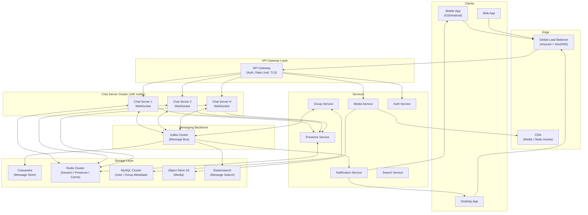
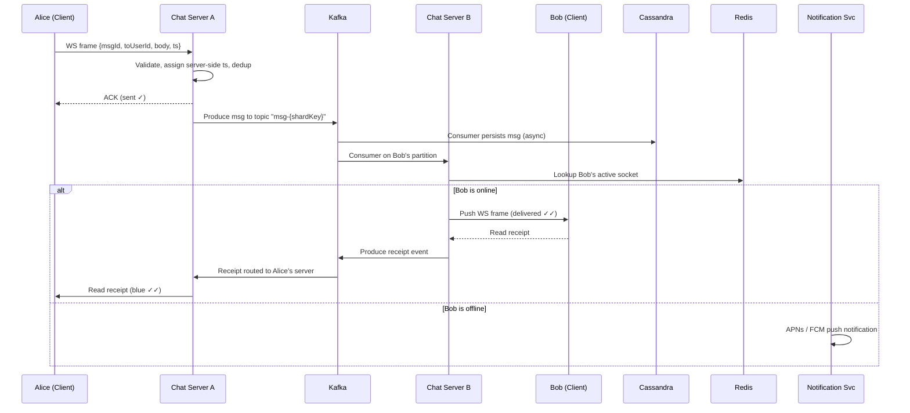
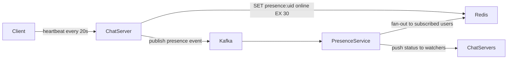
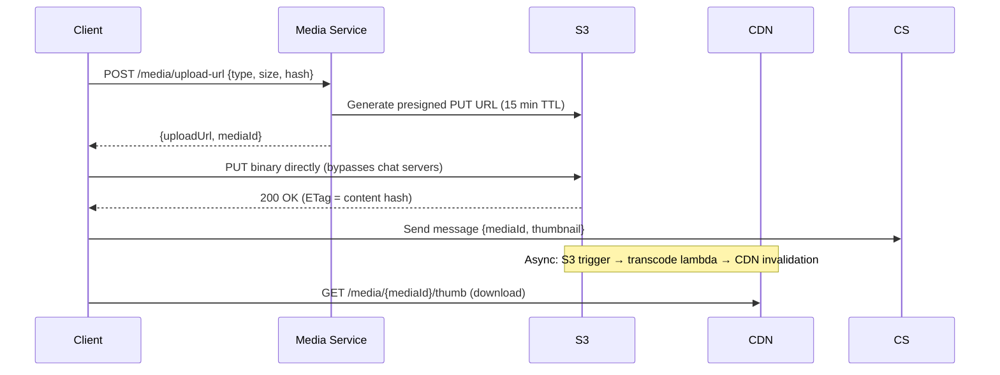

---

Design a real-time chat system like WhatsApp or Slack.


---

# Real-Time Chat System Design

## 1. Requirements

### Functional Requirements
- **1:1 messaging** and **group chats** (up to 1,000 members)
- **Real-time delivery** with online/offline fallback
- **Message statuses**: sent → delivered → read (double-tick model)
- **Media sharing**: images, video, audio, files (up to 100 MB)
- **Push notifications** for offline users
- **Message history / search**
- **Presence indicators**: online, last seen, typing
- **End-to-end encryption** (E2EE) for 1:1
- **Multi-device** support (up to 5 devices per user)

### Non-Functional Requirements
- **Scale**: 2 billion registered users, 500 million DAU
- **Message volume**: ~100 billion messages/day ≈ **1.16 million msg/sec** peak
- **Latency**: p99 message delivery < 500 ms (same region)
- **Durability**: messages retained 5 years; zero loss
- **Availability**: 99.99% (< 53 min/year downtime)

### Out of Scope
- Voice/video calls, payments, bots

---

## 2. Capacity Estimation

| Metric | Calculation | Result |
|---|---|---|
| DAU | given | 500 M |
| Avg messages/user/day | 200 | 100 B/day |
| Write throughput | 100B / 86400 | **~1.16 M msg/s** |
| Avg message size | 200 bytes (text) | — |
| Text storage/day | 100B × 200 B | **~18.6 TB/day** |
| Media messages (20%) | 20B / day × 500 KB avg | **~9.3 PB/day** |
| Active WebSocket connections | 500M × 70% online at peak | **~350 M connections** |
| Each chat server holds | 350M / 10K servers | ~35,000 conns/server |
| Message history (5 yr text) | 18.6 TB × 365 × 5 | **~34 PB text** |

---

## 3. High-Level Architecture



---

## 4. Deep-Dive: Message Flow

### 4.1 Sending a 1:1 Message



### 4.2 Message ID Generation

Use a **64-bit Snowflake ID**:
```
| 41 bits timestamp (ms) | 10 bits machine ID | 13 bits sequence |
```
- Monotonically increasing → natural sort order
- No coordination required
- ~8,000 IDs/ms per node

---

## 5. Data Models

### 5.1 Cassandra — Messages Table
```cql
CREATE TABLE messages (
    conversation_id  UUID,           -- partition key
    message_id       BIGINT,         -- snowflake, clustering key DESC
    sender_id        UUID,
    message_type     TINYINT,        -- 0=text,1=image,2=video,3=file
    body             TEXT,           -- encrypted ciphertext
    media_url        TEXT,
    status           TINYINT,        -- 0=sent,1=delivered,2=read
    created_at       TIMESTAMP,
    deleted_at       TIMESTAMP,
    PRIMARY KEY ((conversation_id), message_id)
) WITH CLUSTERING ORDER BY (message_id DESC)
  AND compaction = {'class': 'TimeWindowCompactionStrategy',
                    'compaction_window_size': '7',
                    'compaction_window_unit': 'DAYS'};
```

**Why Cassandra?**
- Write-optimized LSM tree → handles 1M+ writes/sec
- Partition per conversation → bounded hot partition
- TimeWindow compaction → cheap TTL-based expiry
- Multi-datacenter replication built-in

**Hot partition mitigation**: For viral group chats, sub-partition by `(conversation_id, bucket)` where `bucket = message_id % 16`.

### 5.2 MySQL — Users & Groups
```sql
CREATE TABLE users (
    user_id      BIGINT PRIMARY KEY,
    phone_hash   CHAR(64) UNIQUE,   -- SHA-256(E.164 number)
    display_name VARCHAR(100),
    avatar_url   VARCHAR(512),
    created_at   DATETIME,
    public_key   BLOB              -- for E2EE
);

CREATE TABLE conversations (
    conversation_id   BIGINT PRIMARY KEY,
    type              ENUM('direct','group'),
    name              VARCHAR(200),
    created_by        BIGINT,
    created_at        DATETIME
);

CREATE TABLE conversation_members (
    conversation_id   BIGINT,
    user_id           BIGINT,
    joined_at         DATETIME,
    last_read_msg_id  BIGINT,
    role              ENUM('member','admin'),
    PRIMARY KEY (conversation_id, user_id)
);
```

### 5.3 Redis — Session & Presence
```
# Which chat server holds user's WebSocket
HSET user:session:{userId}  server_id  "cs-42"
                             device_id  "iphone-xyz"
                             expire_at  1700000000

# Presence
SET presence:{userId}  "online"  EX 30    # refreshed every 20 s
ZADD recent_seen  <unix_ts>  {userId}     # sorted set for "last seen"
```

---

## 6. Connection Management & Routing

### 6.1 WebSocket Server Selection
- Client connects to **closest region** via GeoDNS
- Sticky session: once connected, user stays on same Chat Server for session lifetime
- Chat servers are **stateful** but routing metadata is in Redis → any server can look up any user's location

### 6.2 Cross-Server Message Routing

```
Alice (cs-3) → sends to Bob (cs-91)
cs-3: Redis lookup → Bob on cs-91
cs-3: Kafka produce to topic "user-{bobId % 1024}"
cs-91: Kafka consumer group "chat-servers" → receives msg → pushes to Bob
```

**Why Kafka instead of direct server-to-server?**
- Decouples producers from consumers
- Message durability (7-day retention) for replay on server crash
- Fan-out for group messages

### 6.3 Group Message Fan-out

For a 1,000-member group sending 1 msg/sec:
- **Naive fan-out**: 1,000 Kafka messages/msg → 1,000 × push operations
- **Optimized hybrid**:
  - Online members (≤ 100): direct fan-out via Kafka
  - Offline members: single notification record; pull on reconnect
  - Large groups (> 500): write once to Cassandra; members pull via cursor

```
Group fan-out decision:
  small group (≤ 100): push to each member's partition
  medium (100-500):    push to online, record offset for offline
  large (> 500):       write-once model + member cursor
```

---

## 7. Presence System



- **Heartbeat interval**: 20 s; TTL: 30 s → user goes offline if 1 heartbeat missed
- **Scale challenge**: 500M users × presence events = enormous fan-out
  - Solve with **subscription model**: you only get presence updates for contacts currently open in UI
  - Cap subscriptions per user to 50 active conversations
- **Last Seen**: stored as sorted set score in Redis, periodically flushed to MySQL

---

## 8. Media Handling



**Chunked upload for large files (> 10 MB)**:
- Split into 5 MB chunks
- Upload in parallel (S3 multipart)
- Resume on failure via part numbers

**Storage tiering**:
- Hot (0-30 days): S3 Standard
- Warm (30-180 days): S3 Infrequent Access
- Cold (180 days – 5 yr): S3 Glacier Instant Retrieval

---

## 9. End-to-End Encryption (E2EE)

Using **Signal Protocol** (Double Ratchet + X3DH):

```
Key Exchange:
  - Each device generates: Identity Key, Signed PreKey, One-Time PreKeys
  - Public keys uploaded to key server (MySQL)
  - Sender fetches recipient's keys, derives session key (X3DH)

Message Encryption:
  - Each message encrypted with unique message key (Double Ratchet)
  - Server stores only ciphertext + metadata
  - Forward secrecy: compromising one key doesn't expose past messages

Multi-device:
  - Sender encrypts once per recipient device (N copies for N devices)
  - Server fans out N ciphertexts
```

**Tradeoff**: Server cannot read messages, but also cannot:
- Search message body (only metadata searchable)
- Moderate content
- Provide server-side backup without key escrow

---

## 10. Message Search

- **Encrypted messages**: client-side search (index stored locally, not on server)
- **Unencrypted (Slack-like) workspace messages**:
  - Kafka consumer indexes messages into **Elasticsearch**
  - Index: `{workspace_id, channel_id, sender_id, body, ts}`
  - Shard by `workspace_id`; replicate ×2
  - Query: filtered on `workspace_id` + `channel_id` + full-text on `body`
  - Rate-limit: 10 searches/sec/user

---

## 11. Offline & Reliability

### 11.1 Message Queueing for Offline Users
```
Redis sorted set: inbox:{userId}
  ZADD inbox:{userId}  <msgId>  <msgId>    # score = msgId for ordering
  ZCARD → unread count
  
On reconnect:
  Client sends: {lastSeenMsgId}
  Server: ZRANGEBYSCORE inbox:{userId} (lastSeenMsgId, +inf) → deliver missed msgs
  Fallback: query Cassandra for msgs after cursor
```

- Redis inbox retained for 30 days (typical offline window)
- After 30 days: query Cassandra directly (slower but durable)

### 11.2 Acknowledgment & Retry
```
Client: send msg → start retry timer (5s)
Server: on receive → ACK immediately
Client: ACK received → cancel timer
Client: no ACK after 5s → retry (exponential backoff, max 3 retries)
Server: dedup by msgId (idempotency key in Cassandra with IF NOT EXISTS)
```

### 11.3 Push Notifications
- **APNs** (iOS) + **FCM** (Android) + **Web Push**
- Notification Service consumes from Kafka topic `offline-notifications`
- Batching: coalesce 5 notifications in a 200ms window → 1 push
- Priority: urgent (call) vs. normal (message)
- Include only metadata (not plaintext) in push payload for E2EE

---

## 12. API Design

### REST (for non-real-time operations)
```
POST   /v1/auth/login
POST   /v1/auth/refresh

GET    /v1/conversations                     → list conversations
POST   /v1/conversations                     → create group
GET    /v1/conversations/{id}/messages       → paginated history
DELETE /v1/messages/{msgId}                  → delete for everyone

POST   /v1/media/upload-url                  → get presigned URL
GET    /v1/users/search?q=                   → user discovery

GET    /v1/users/{userId}/presence
```

### WebSocket Protocol (binary, Protobuf-encoded)
```protobuf
message Envelope {
  string  msg_id      = 1;
  uint32  type        = 2;  // 1=text, 2=media, 3=receipt, 4=presence, 5=typing
  oneof payload {
    TextMessage   text    = 3;
    MediaMessage  media   = 4;
    Receipt       receipt = 5;
    PresenceEvent presence = 6;
    TypingEvent   typing  = 7;
  }
}
```

**Why Protobuf over JSON?**
- ~3-5× smaller wire size (critical at 1M msg/s scale)
- Schema enforcement, versioning via field numbers

---

## 13. Fault Tolerance & Disaster Recovery

| Failure Mode | Detection | Recovery |
|---|---|---|
| Chat server crash | Health check fails → LB removes | Client reconnects (< 5 s), Redis session cleared, Kafka rebalances |
| Kafka broker down | Replication factor 3, min ISR 2 | Auto-leader election, no data loss |
| Cassandra node down | Gossip protocol | RF=3, reads/writes continue with quorum |
| Redis primary down | Sentinel / Redis Cluster failover | < 30 s failover, mild presence data loss acceptable |
| Datacenter failure | Route 53 health checks | Traffic shifts to secondary DC (RPO=0, RTO < 60 s) |
| Message duplication | Server-side dedup (Cassandra IF NOT EXISTS) | Idempotent inserts, client dedup by msgId |

### Multi-Region Topology
```
Region US-East (primary):   Cassandra + Kafka + Chat Servers
Region EU-West (secondary): Cassandra + Kafka + Chat Servers
Region AP-South (secondary): ...

Cassandra: multi-DC replication (NetworkTopologyStrategy, RF=3 per DC)
Kafka:     MirrorMaker 2 for cross-region async replication (RPO ~seconds)
Users served from closest region, messages replicated asynchronously
```

---

## 14. Rate Limiting & Abuse Prevention

```
Per-user limits (in Redis token bucket):
  - Messages: 30/min per conversation
  - Media uploads: 10/min
  - API calls: 1000/min

Anti-spam:
  - Message content hash dedup (block copy-paste spam)
  - Velocity check: > 100 unique recipients in 1 min → flag account
  - ML classifier on metadata (not content for E2EE) for coordinated abuse
```

---

## 15. Monitoring & Observability

```
Metrics (Prometheus + Grafana):
  - message_delivery_latency_p50/p99
  - websocket_connections_active
  - kafka_consumer_lag_per_partition
  - cassandra_write_latency / read_latency
  - notification_delivery_success_rate

Tracing (Jaeger):
  - Distributed trace per message: client → CS → Kafka → CS → client
  - SLO: 95% of messages delivered end-to-end < 200 ms

Alerting:
  - Consumer lag > 100K messages → page on-call
  - p99 delivery > 1 s → alert
  - Chat server connection drop > 1% → alert
```

---

## 16. Key Tradeoffs Summary

| Decision | Choice | Tradeoff |
|---|---|---|
| Message store | Cassandra | Write-optimized, no strong consistency; acceptable for chat |
| Fan-out model | Kafka-mediated | Decoupled, durable; slight latency vs. direct server push |
| Presence TTL | 30-second heartbeat | Slight staleness (30 s) vs. massive write reduction |
| E2EE | Signal Protocol | Privacy win; server-side search/moderation impossible |
| Connection | WebSocket over HTTP/2 | Full-duplex; requires sticky LB, harder scaling than SSE |
| Media routing | Direct client → S3 | Offloads chat servers; URL expiry complexity |
| Group fan-out | Hybrid push/pull | Balanced; cursor model for huge groups avoids write amplification |

---

## 17. Scale-Out Path

```
Phase 1 (0–10M DAU):   Monolith + PostgreSQL + Redis
Phase 2 (10–100M DAU): Microservices, Cassandra, Kafka, horizontal chat servers
Phase 3 (100M–500M):   Multi-region, Kafka MirrorMaker, sharded Redis Cluster,
                        dedicated Presence/Notification/Media services
Phase 4 (500M+):        Custom transport protocol (WhatsApp's Erlang/BEAM),
                        edge PoPs for WebSocket termination, 
                        tiered storage with write-path compression
```

This design handles WhatsApp/Slack-scale traffic with real-time delivery, durability, multi-device support, and graceful degradation under failure — while remaining extensible for future features like calls or reactions.