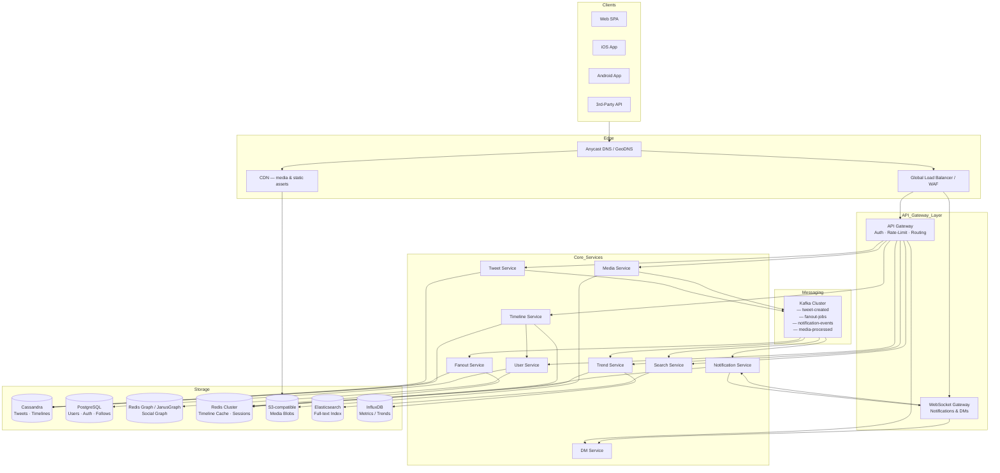
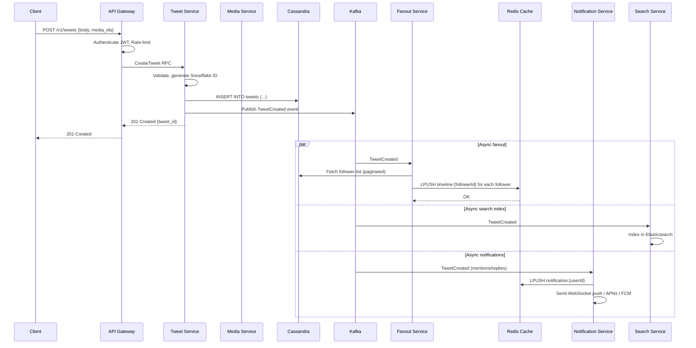
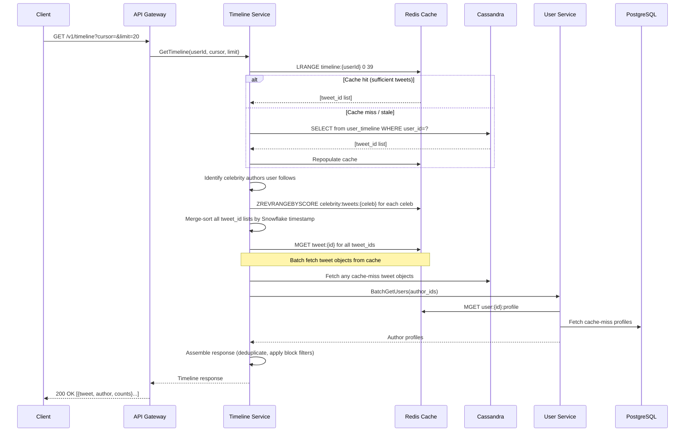
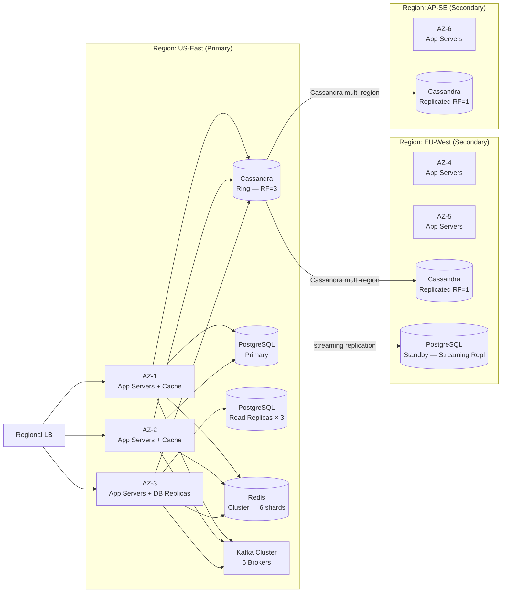
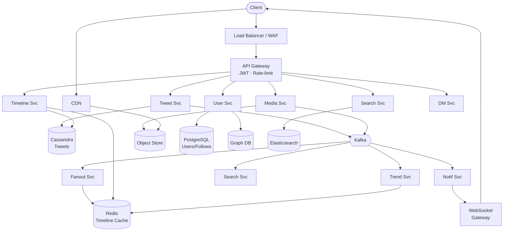

---

Design a microblogging platform like Twitter.


---

# Microblogging Platform — System Design

---

## 1. Requirements

### Functional Requirements
| # | Requirement |
|---|-------------|
| F1 | Users can post short text posts ("tweets") up to 280 characters with optional media |
| F2 | Users can follow / unfollow other users |
| F3 | Users see a home timeline of posts from people they follow |
| F4 | Users can like, retweet, quote-tweet, and reply to posts |
| F5 | Full-text search over posts and user profiles |
| F6 | Trending topics / hashtags |
| F7 | Direct messages (1-to-1 and group) |
| F8 | Notifications (likes, follows, replies, mentions) |
| F9 | Media upload (images, GIFs, short videos ≤ 2 min 20 s) |
| F10 | User authentication, 2FA, OAuth |

### Non-Functional Requirements
| # | Requirement |
|---|-------------|
| N1 | **Scale**: 500 M registered users, 150 M DAU, 600 K tweets/day peak ≈ 7 K tweets/s |
| N2 | **Read-heavy**: read:write ratio ≈ 100:1 |
| N3 | Timeline read **latency** ≤ 200 ms p99 |
| N4 | Post creation latency ≤ 500 ms p99 |
| N5 | **Availability**: 99.99 % (< 52 min downtime/year) |
| N6 | **Eventual consistency** acceptable for timelines; **strong consistency** for auth, follows |
| N7 | GDPR / CCPA compliance — data deletion within 30 days |
| N8 | Media served via CDN with < 50 ms TTFB for cached assets |

### Out of Scope
- Live streaming (Twitter Spaces-like)
- Ad serving pipeline (mentioned structurally only)
- Billing / subscription management

---

## 2. Capacity Estimation

### Users & Posts
```
DAU = 150 M
Avg posts per DAU per day = 0.4  → 60 M posts/day
Peak multiplier = 3×             → 180 M posts/day peak = 2 K posts/s sustained, 6 K burst
Avg post size (text) = 300 bytes compressed
Post storage/day = 60 M × 300 B = 18 GB/day → ~6.5 TB/year
```

### Timelines
```
Avg follows per user = 200
Timeline reads per DAU per day = 20
Read QPS = 150 M × 20 / 86 400 = 34 700 reads/s → peak ~100 K reads/s
```

### Media
```
10% of tweets contain media; avg media size = 1.5 MB (image) / 8 MB (video)
Images: 6 M/day × 1.5 MB = 9 TB/day
Videos: 0.5 M/day × 8 MB = 4 TB/day
Total media ingress ≈ 13 TB/day → ~5 PB/year
```

### Storage Summary
| Tier | Daily | Annual |
|------|-------|--------|
| Post metadata (Cassandra) | 18 GB | 6.5 TB |
| Media (object store) | 13 TB | 4.7 PB |
| Social graph (Neo4j/JanusGraph) | 2 GB | 720 GB |
| Search index (Elasticsearch) | 36 GB | 13 TB |
| Cache (Redis) | 2 TB working set | — |

---

## 3. High-Level Architecture



---

## 4. Core Service Deep Dives

### 4.1 Tweet Service

**API**
```
POST /v1/tweets               → create tweet
GET  /v1/tweets/{id}          → get tweet
DELETE /v1/tweets/{id}        → delete tweet
POST /v1/tweets/{id}/retweet  → retweet
POST /v1/tweets/{id}/like     → like/unlike
GET  /v1/tweets/{id}/replies  → paginated replies
```

**Create-Tweet Flow**
1. API Gateway authenticates JWT, checks rate-limit (write: 300 tweets/3h per user).
2. Tweet Service validates content, generates a **Snowflake ID** (64-bit: 41-bit ms timestamp | 10-bit machine | 12-bit sequence → 4 096 IDs/ms/node; globally sortable without coordination).
3. Stores tweet in **Cassandra** `tweets` table.
4. Publishes `TweetCreated` event to **Kafka** topic `tweet-created`.
5. Responds 201 to client (< 50 ms write path).

**Downstream (async)**
- **Fanout Service** consumes `tweet-created`, pushes tweet ID to followers' timeline caches.
- **Search Service** indexes the tweet.
- **Trend Service** increments hashtag counters.
- **Notification Service** fires mention/reply notifications.

---

### 4.2 Timeline Service & Fanout

**Two strategies**, chosen per author's follower count:

| Strategy | When used | Mechanism |
|----------|-----------|-----------|
| **Fan-out on write (push)** | followers ≤ 10 K | Fanout Service writes tweet_id to each follower's timeline cache in Redis |
| **Fan-out on read (pull)** | celebrity / > 10 K followers | Timeline Service merges celebrity tweets at read time from their personal tweet list |

**Hybrid Fanout Algorithm**
```
on TweetCreated(tweetId, authorId):
  followers = GraphDB.getFollowers(authorId)  // paginated, async
  if len(followers) <= CELEBRITY_THRESHOLD:
    for each follower in followers:
      Redis.LPUSH(f"timeline:{follower}", tweetId)
      Redis.LTRIM(f"timeline:{follower}", 0, 799)   // keep last 800
  else:
    // Mark author as celebrity; timelines pull at read time
    Redis.SADD("celebrity_authors", authorId)
```

**Read Path**
```
GET /v1/timeline?cursor=&limit=20

1. Fetch user's timeline list from Redis (O(1) LRANGE)
2. Identify celebrity authors the user follows
3. Merge-sort celebrity tweet streams with the cached list (real-time)
4. Hydrate tweet_ids → tweet objects (Redis cache → Cassandra fallback)
5. Hydrate author profiles (UserService; Redis LRU cache)
6. Return paginated, deduplicated feed
```

**Redis Timeline Structure**
```
Key:   timeline:{userId}           Type: List (sorted by insertion = recency)
Key:   tweet:{tweetId}             Type: Hash (text, authorId, ts, counts)
Key:   user:{userId}:profile       Type: Hash (TTL 5 min)
Key:   celebrity:tweets:{userId}   Type: Sorted Set (score = snowflakeId)
```

---

### 4.3 Data Models

#### Cassandra — Tweets Table
```sql
CREATE TABLE tweets (
  tweet_id     bigint,        -- Snowflake ID
  author_id    bigint,
  body         text,
  media_ids    list<uuid>,
  reply_to_id  bigint,        -- null if root
  retweet_of   bigint,        -- null if original
  like_count   counter,       -- approximate; exact in separate table
  retweet_count counter,
  created_at   timestamp,
  is_deleted   boolean,
  PRIMARY KEY (tweet_id)
) WITH default_time_to_live = 0
  AND compaction = { 'class': 'LeveledCompactionStrategy' };

-- Query by author (profile page)
CREATE TABLE tweets_by_author (
  author_id    bigint,
  tweet_id     bigint,
  created_at   timestamp,
  PRIMARY KEY (author_id, tweet_id)
) WITH CLUSTERING ORDER BY (tweet_id DESC);
```

#### PostgreSQL — Users & Follows
```sql
CREATE TABLE users (
  user_id      BIGSERIAL PRIMARY KEY,
  username     VARCHAR(15) UNIQUE NOT NULL,
  display_name VARCHAR(50),
  email        VARCHAR(255) UNIQUE NOT NULL,
  password_hash TEXT,
  bio          TEXT,
  follower_count INT DEFAULT 0,
  following_count INT DEFAULT 0,
  is_verified  BOOLEAN DEFAULT false,
  created_at   TIMESTAMPTZ DEFAULT now()
);

CREATE TABLE follows (
  follower_id  BIGINT REFERENCES users(user_id),
  followee_id  BIGINT REFERENCES users(user_id),
  created_at   TIMESTAMPTZ DEFAULT now(),
  PRIMARY KEY (follower_id, followee_id)
);
CREATE INDEX ON follows(followee_id);  -- reverse lookup
```

#### Likes — Cassandra (wide rows, high write rate)
```sql
CREATE TABLE likes (
  tweet_id   bigint,
  user_id    bigint,
  created_at timestamp,
  PRIMARY KEY (tweet_id, user_id)
);
```

---

### 4.4 Social Graph

- **Redis Graph** (or **JanusGraph** on HBase) stores follower/following relationships.
- Reads: "Does A follow B?" → O(1) set membership check.
- Follower list pagination for fanout uses cursor-based iteration.
- For large celebrity graphs (> 50 M followers), follower lists are sharded across nodes.

---

### 4.5 Search Service

**Architecture**
- **Elasticsearch** cluster (12 nodes, each 32 GB RAM, 2 TB NVMe SSD).
- Index sharding: by tweet creation date (monthly indices) → allows fast delete/archive of old data.
- **Ingest pipeline** (Kafka → Logstash → ES): indexes tweet body, hashtags, author, timestamp.
- **Query types**:
  - Keyword full-text (`match`, `multi_match`)
  - Hashtag (`term` on `hashtags` keyword field)
  - User search (`prefix` on `username`, `display_name`)
  - Geo-search (`geo_distance` if location attached)

**Index Mapping (simplified)**
```json
{
  "mappings": {
    "properties": {
      "tweet_id":    { "type": "long" },
      "author_id":   { "type": "long" },
      "body":        { "type": "text",    "analyzer": "english" },
      "hashtags":    { "type": "keyword" },
      "created_at":  { "type": "date" },
      "location":    { "type": "geo_point" },
      "like_count":  { "type": "integer" }
    }
  }
}
```

---

### 4.6 Trending Topics

```
Every 60 s per datacenter:
  1. Kafka Streams job counts hashtag occurrences in a 5-min sliding window
  2. Computes velocity = count[now-5m, now] - count[now-10m, now-5m]  (acceleration)
  3. Applies geographic filter (per country / global)
  4. Top-50 results written to Redis Sorted Set: ZADD trends:global <score> <hashtag>
  5. API serves cached results; cache TTL = 60 s
```

---

### 4.7 Media Service

```
Upload flow:
1. Client requests presigned upload URL from Media Service
2. Client uploads directly to S3-compatible store (bypasses app servers)
3. S3 triggers "ObjectCreated" → Kafka topic "media-raw"
4. Media Processing Worker:
   - Images: resize to [original, 1280px, 400px, 150px], re-encode as WebP
   - Videos: transcode to HLS (1080p, 720p, 360p) via FFmpeg workers
   - Extract EXIF metadata, strip GPS
   - Run NSFW classifier (ML model)
5. Processed URLs stored in media table; CDN origin = object store

Storage:
  - Hot tier: S3 Standard (< 90 days)
  - Warm tier: S3-IA (90 days – 2 years)
  - Cold tier: Glacier (> 2 years)
  - Global CDN with 40+ PoPs; cache-control: max-age=31536000 (immutable)
```

---

### 4.8 Notification Service

- Stores notification events in **Cassandra** (wide-row per user, TTL 90 days).
- Real-time delivery via **WebSocket** connections maintained by WebSocket Gateway.
- Fan-out push notifications via APNs / FCM for mobile.
- In-app badge counts stored in Redis (increment/decrement atomically).

```
notification:{userId} → Redis List (last 200 unread)
unread_count:{userId} → Redis String (INCR / DECR)
```

---

### 4.9 Direct Messages

- **End-to-end encrypted** option using Signal Protocol.
- Stored in Cassandra:
```sql
CREATE TABLE messages (
  conversation_id  uuid,
  message_id       timeuuid,
  sender_id        bigint,
  ciphertext       blob,
  sent_at          timestamp,
  PRIMARY KEY (conversation_id, message_id)
) WITH CLUSTERING ORDER BY (message_id ASC);
```
- Delivered in real-time over WebSocket; fallback to push if recipient offline.
- Message fan-out inside group conversations (up to 50 members) is handled similarly to tweets.

---

## 5. API Gateway

| Concern | Implementation |
|---------|----------------|
| Authentication | JWT (RS256), 15-min access token + 7-day refresh token in HttpOnly cookie |
| Rate Limiting | Token-bucket per user: 300 writes/3h; 1500 reads/15 min; burst allowance |
| Throttle by IP | 100 req/s unauthenticated (bot mitigation) |
| Request routing | Path-based routing to downstream microservices |
| Protocol | gRPC internally (Protobuf), REST/JSON externally |
| Versioning | URI versioning `/v1/`, `/v2/` |

---

## 6. Detailed Component Diagram — Write Path



---

## 7. Detailed Component Diagram — Read Path (Timeline)



---

## 8. Infrastructure & Deployment



**Deployment Stack**
- **Kubernetes** (EKS/GKE) with HPA on CPU + custom metrics (queue depth).
- **Service Mesh**: Istio for mTLS, circuit-breaking, retries, observability.
- **IaC**: Terraform + Helm charts.
- **CI/CD**: GitHub Actions → Docker build → Argo CD (GitOps).
- **Secrets**: Vault (dynamic DB credentials, API keys).

---

## 9. Caching Strategy

| Cache Layer | Technology | Data | TTL | Eviction |
|-------------|------------|------|-----|----------|
| L1 Application | In-process LRU (Caffeine, 256 MB) | User profiles, tweet objects | 30 s | LRU |
| L2 Distributed | Redis Cluster (2 TB) | Timelines, tweet objects, sessions, counters | 5–60 min | LRU + TTL |
| CDN | Fastly / CloudFront | Media, static assets | 1 year (immutable) | Purge API |
| DB Query | PostgreSQL pg_bouncer + read replicas | User lookups | — | Connection pool |

**Cache Invalidation**
- Tweet deleted → `DEL tweet:{id}` + remove from timeline lists.
- User profile update → `DEL user:{userId}:profile`.
- Follow/Unfollow → async rebuild of affected timeline caches.

---

## 10. Consistency & Availability

| Operation | Consistency Model | Rationale |
|-----------|------------------|-----------|
| Post tweet | Eventual (Cassandra `QUORUM` write) | AP; slight delay in fan-out acceptable |
| Read timeline | Eventual | Followers may see tweet 1–2 s late |
| Follow / Unfollow | Strong (PostgreSQL transaction) | Immediate effect expected by user |
| Like count | Approximate / Eventual (Cassandra counter) | Exact count less critical |
| Authentication | Strong (PostgreSQL + Redis session) | Security-critical |
| DM delivery | At-least-once (Kafka) | Deduplication at consumer |

**Conflict Resolution**
- Last-Write-Wins with Snowflake timestamp for tweet metadata.
- Cassandra `SERIAL` consistency for "has user liked tweet?" (lightweight transaction).

---

## 11. Scalability Bottlenecks & Mitigations

| Bottleneck | Problem | Mitigation |
|------------|---------|------------|
| Celebrity fan-out | Katy Perry tweets → 100 M followers → 100 M Redis writes in seconds | Hybrid fan-out: pull for celebrities at read time |
| Hot tweet | Single tweet getting millions of likes/second → Cassandra hot partition | Counter sharding: 100 sub-counters per tweet, aggregate on read |
| Timeline cache miss storm | 150 M users open app simultaneously at 9 AM | Warm cache on login; staggered TTL jitter; background refresh |
| Kafka consumer lag | Fanout consumers fall behind during viral events | Auto-scale consumer group; increase partition count; prioritize recent events |
| Search indexing lag | Elasticsearch write throughput saturated | Bulk indexing with 1-s flush interval; separate index clusters per region |
| PostgreSQL follows table | Hot rows for high-follow-count users | Read replicas (× 5); denormalized follower counts in Redis |

---

## 12. Failure Scenarios

| Failure | Detection | Response |
|---------|-----------|---------|
| Tweet Service pod crash | k8s liveness probe → restart within 5 s | Stateless; Kafka retains unprocessed events; replay on restart |
| Cassandra node failure | Gossip protocol; RF=3 so 1 node loss → still QUORUM reads/writes | Automatic repair via `nodetool repair`; replace node |
| Redis primary failure | Sentinel / Redis Cluster re-election (< 30 s) | Slaves promoted; brief elevated Cassandra reads; circuit breaker limits cascade |
| Kafka broker down | ISR (in-sync replicas = 3) | Leader re-election < 10 s; producers retry with exponential backoff |
| Fanout Service crash mid-batch | Kafka offset not committed → event replayed | Idempotent: `SETNX` before timeline push; dedup by tweet_id |
| Media upload failure | Client receives error | Client retries; presigned URL valid 30 min; idempotent PUT |
| Region failover | Health check from Route53 fails for 3 consecutive probes | Route53 failover routing to EU-West; Cassandra multi-region syncs; PG standby promoted |
| DDoS attack | Spike in 4xx / anomalous IP range | WAF at edge (rate-limit by IP / ASN); Anycast absorbs flood; Cloudflare Magic Transit |

---

## 13. Security

| Concern | Mechanism |
|---------|-----------|
| Authentication | JWT RS256; refresh token rotation; device fingerprinting |
| Password storage | bcrypt (cost=12) |
| 2FA | TOTP (RFC 6238) + SMS fallback |
| Transport | TLS 1.3 everywhere (internal via Istio mTLS) |
| SSRF / injection | Input validation at gateway; parameterized queries |
| Media safety | NSFW ML classifier; perceptual hash (PhotoDNA) for CSAM |
| Data isolation | Row-level tenant isolation; PII encrypted at rest (AES-256) |
| Secrets | Vault + k8s Secrets; no secrets in code/env |
| Audit log | Immutable append-only audit log (Kafka → S3 → Athena) |
| GDPR | Account deletion job: soft-delete → async purge all PII within 30 days |

---

## 14. Observability

```
Metrics:   Prometheus → Grafana dashboards
           SLOs: p99 timeline read < 200 ms; error rate < 0.1%
Tracing:   OpenTelemetry → Jaeger (distributed traces across all services)
Logging:   Structured JSON → Fluent Bit → Elasticsearch/Kibana
Alerting:  Alertmanager → PagerDuty (SEV1 < 5 min response)
Synthetic: Canary tests every 60 s per region (post tweet, read timeline)
Chaos:     Chaos Monkey weekly in staging; quarterly game days in prod
```

**Key SLIs**
- Timeline P99 latency
- Tweet creation success rate
- Fanout consumer lag (Kafka offset delta)
- Cache hit rate (target > 95%)
- Elasticsearch indexing lag (target < 5 s)

---

## 15. Design Tradeoffs Summary

| Decision | Chosen | Alternative | Tradeoff |
|----------|--------|-------------|----------|
| Timeline storage | Redis List + Cassandra | Pure Cassandra | Redis is faster (sub-ms) but expensive; Cassandra is cheaper for large history |
| Fan-out model | Hybrid push/pull | Pure push or pure pull | Pure push overwhelms Redis for celebrities; pure pull too slow for large follow lists |
| Post ID | Snowflake (time-sortable) | UUID v4 | Snowflake enables chronological sorting without ORDER BY; UUIDs are random (bad cache locality) |
| Graph DB | Redis Graph / JanusGraph | Neo4j | Neo4j single-node; JanusGraph scales horizontally but more operationally complex |
| Search | Elasticsearch | Solr / Typesense | Elastic has richer geo + ML capabilities; higher ops overhead than Typesense |
| DB for users/follows | PostgreSQL | Cassandra | Strong consistency and ACID for auth/follows; Cassandra lacks transactions |
| Consistency for likes | Eventual (counters) | Strong | Exact like count < 100 M doesn't matter; eventual is 10× faster |

---

## 16. Summary Architecture in One View



This design supports **150 M DAU**, handles **6 K writes/s** and **100 K reads/s** at peak, achieves **< 200 ms p99 timeline reads** via Redis cache and hybrid fanout, and provides **99.99 % availability** through multi-region active-active deployment with Cassandra replication and PostgreSQL streaming standby.