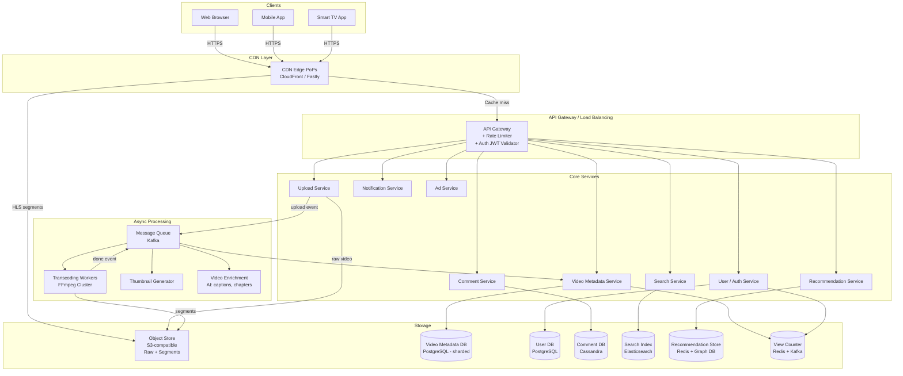
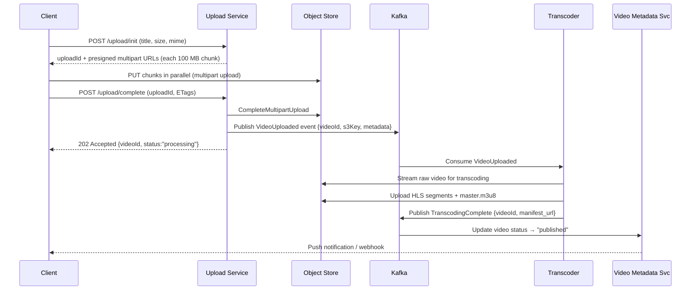
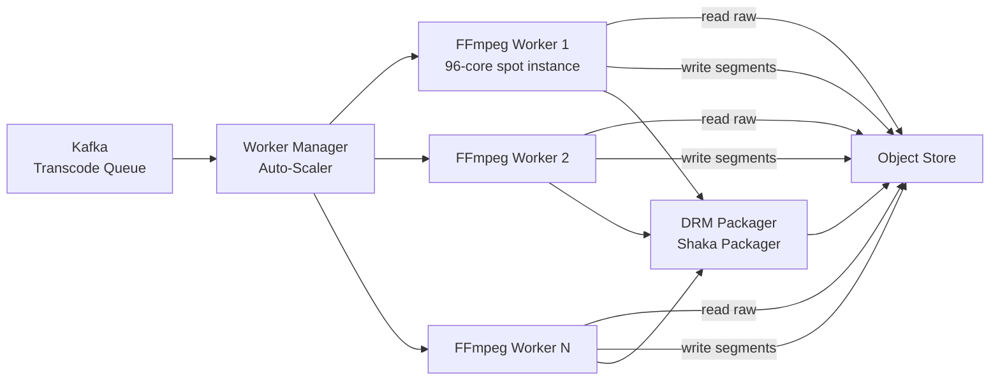
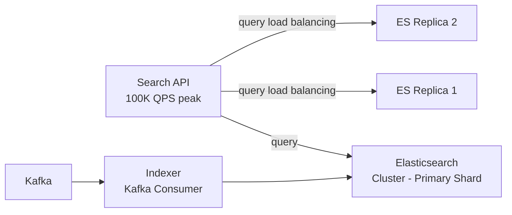
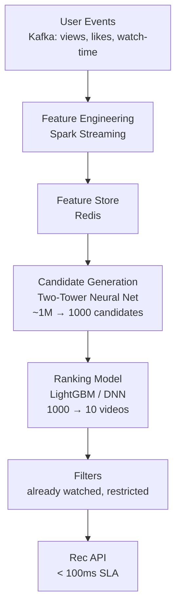
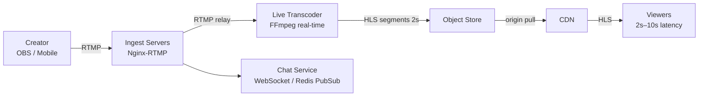
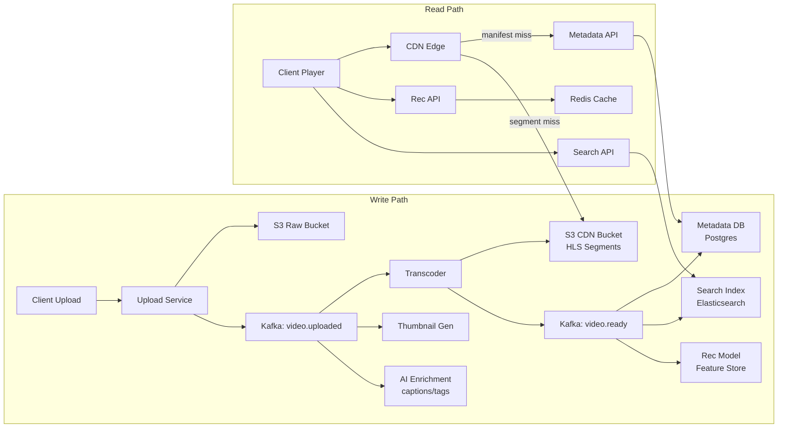
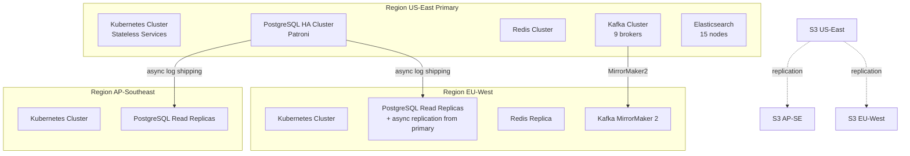

---

Design a video sharing platform like YouTube.


---

# Video Sharing Platform — System Design

---

## 1. Requirements

### 1.1 Functional Requirements
| Priority | Feature |
|---|---|
| P0 | Upload video (up to 10 GB, any common format) |
| P0 | Transcode to adaptive-bitrate (ABR) multi-resolution MP4/HLS |
| P0 | Stream video with adaptive quality (144p–4K) |
| P0 | Search videos by title, description, tags |
| P1 | User channels, subscriptions, notifications |
| P1 | Like / dislike, comments, view count |
| P1 | Recommendations feed (homepage, "up-next") |
| P2 | Live streaming |
| P2 | Analytics dashboard for creators |
| P2 | Ads insertion |

### 1.2 Non-Functional Requirements
- **Availability:** 99.99% for reads (< 53 min/year downtime); 99.9% for writes
- **Latency:** Video starts playing within 2 s (P95); search < 200 ms (P99)
- **Durability:** Zero data loss for uploaded content (3-region replication)
- **Consistency:** Eventual consistency acceptable for view counts, likes; strong consistency for user auth and billing
- **Scalability:** Horizontal scaling for all stateless services

---

## 2. Scale Estimates

### 2.1 Users
```
Total registered users:        2 B
Daily active users (DAU):    500 M
Concurrent viewers (peak):    50 M   (10 % of DAU)
```

### 2.2 Video Uploads
```
Uploads/day:                500,000 videos
Avg raw size per video:       2 GB  (= ~10 min at 1080p 30fps)
Raw ingest/day:             500,000 × 2 GB  = 1 PB/day
```

### 2.3 Transcoding Output
Ladder: 144p, 240p, 360p, 480p, 720p, 1080p, 1440p, 2160p (8 renditions)  
Average compressed size per rendition: ~150 MB (weighted average of all resolutions)  
```
Storage added per video:    8 renditions × 150 MB  = 1.2 GB
+ thumbnails/metadata:      ~50 MB
Total per video:            ~1.25 GB
Daily transcoded output:    500,000 × 1.25 GB = 625 TB/day
5-year cumulative:          ~1.1 EB
```

### 2.4 Streaming (Reads)
```
Videos watched/day:         1 B views
Avg watch duration:         7 min
Avg bitrate served:         2.5 Mbps  (mix of 720p/1080p)
Total bytes streamed/day:   1 B × 7 × 60 s × (2.5 Mbps / 8)
                          = 1 B × 420 s × 0.3125 MB/s
                          = 131.25 PB/day
Peak bandwidth (10× avg):   131.25 PB / 86400 s × 10 ≈ 15 Tbps egress
```

### 2.5 Metadata & Database
```
Videos table rows:          800 M (cumulative)
Comments/day:               50 M
Likes/day:                  200 M
Search queries/day:         2 B   (~23,000 QPS avg, 100,000 QPS peak)
```

---

## 3. High-Level Architecture



---

## 4. Component Deep-Dives

### 4.1 Upload Pipeline

#### Flow



**Key decisions:**
- **Resumable multipart upload** directly to S3 via presigned URLs — the upload service is not in the hot path for bytes, avoiding a bottleneck.
- Chunks are 100 MB; a 10 GB file = 100 chunks uploadable in parallel.
- Client retries any failed chunk independently.
- Raw video stored in a separate S3 bucket (cheaper, infrequent access) from the transcoded CDN bucket.

#### Upload Service Capacity
```
500,000 uploads/day = 5.8 uploads/s average
Peak ×10 = 58 uploads/s
Each init request is cheap (< 5 ms DB write); presigned URL generation is stateless
→ 5 replicas of the upload service handle this comfortably
```

---

### 4.2 Transcoding System

#### Architecture



#### Transcoding Math
```
Input: 10 min 1080p30 video at 50 Mbps (h264)
Rendition ladder (output):
  2160p 4K  → 15 Mbps HEVC  — 4K capable videos only
  1080p     →  5 Mbps h264
   720p     →  2.5 Mbps
   480p     →  1 Mbps
   360p     →  500 Kbps
   240p     →  250 Kbps
   144p     →  100 Kbps
Audio     →  128 Kbps AAC (2 ch) + 384 Kbps Dolby (premium)

Transcode speed on 96-core C6a instance (FFmpeg libx264 preset "fast"):
  ~30× realtime for 1080p per instance core
  10 min video = 600 s → transcodes in 600/30 = 20 s wall-clock for one rendition
  7 renditions sequentially: 140 s, or in parallel: 20 s

Throughput per worker: 1 video per 20-30 s ≈ 3 videos/min
Required workers for 500,000 videos/day:
  500,000 / (60 min × 24 h × 3 vids/min) = 500,000 / 4,320 ≈ 116 workers
  Add 50% headroom → ~175 workers
  Use spot/preemptible instances for cost (80% discount)
```

#### Segment Format
- **HLS (MPEG-TS + fMP4 for CMAF)**: 2-second segments for low latency
- **DASH** as a secondary format for Smart TVs
- Manifest (`master.m3u8`) lists all renditions; clients pick based on bandwidth estimation

#### DRM
- Widevine (Chrome/Android), FairPlay (Apple), PlayReady (Windows) packaged by Shaka Packager
- License server returns short-lived (4-hour) decryption keys; keys stored in HSM-backed KMS

---

### 4.3 Content Delivery Network

```
15 Tbps peak egress → requires a major CDN (Cloudflare, Fastly, AWS CloudFront)
CDN PoPs: 300+ globally

Cache strategy:
  Popular videos (top 5%): cached at every edge PoP indefinitely (LRU evicted)
  Long-tail (95%): cached only in regional tier; origin pull on miss
  
Cache hit ratio target: 95% for popular content, 60% overall
Without CDN cache hit 60%: origin must serve 40% × 131 PB = 52 PB/day → unworkable
With cache hit 95% for popular + 60% long-tail:
  Popular (5% videos, ~80% traffic): 95% hit → 4% origin pull
  Long-tail (95% videos, ~20% traffic): 60% hit → 8% origin pull
  Effective origin egress ≈ 12% of 131 PB ≈ 15.7 PB/day → 1.8 Tbps sustained
  → manageable with 3 origin regions each at ~600 Gbps
```

**Byte-range requests:** HLS clients request 2-second segments (≈ 600 KB at 2.5 Mbps). CDN caches segments individually. Popular videos stay hot; cache thrash is minimal.

---

### 4.4 Metadata Service & Database

#### Schema (simplified)
```sql
-- PostgreSQL (sharded by video_id)
CREATE TABLE videos (
    video_id       UUID PRIMARY KEY,
    channel_id     UUID NOT NULL,
    title          TEXT,
    description    TEXT,
    status         ENUM('uploading','processing','published','removed'),
    manifest_url   TEXT,
    thumbnail_url  TEXT,
    duration_sec   INT,
    resolution_max SMALLINT,
    tags           TEXT[],
    category_id    SMALLINT,
    language       CHAR(5),
    view_count     BIGINT DEFAULT 0,   -- eventually consistent; updated in batch
    like_count     INT DEFAULT 0,
    dislike_count  INT DEFAULT 0,
    created_at     TIMESTAMPTZ,
    published_at   TIMESTAMPTZ,
    is_age_restricted BOOLEAN DEFAULT FALSE
);

CREATE TABLE channels (
    channel_id    UUID PRIMARY KEY,
    user_id       UUID,
    handle        TEXT UNIQUE,
    subscriber_count BIGINT,
    ...
);

CREATE TABLE subscriptions (
    subscriber_id UUID,
    channel_id    UUID,
    subscribed_at TIMESTAMPTZ,
    PRIMARY KEY (subscriber_id, channel_id)
);
-- Sharded by subscriber_id; denormalized copy by channel_id for fan-out
```

#### Sharding Strategy
```
videos table: 800 M rows × 1 KB avg = 800 GB
Shard by video_id (consistent hash) across 16 PostgreSQL primaries
Each shard: 50 M rows = 50 GB — fits in RAM for hot pages
Replicas: 3 read replicas per shard (reads go to replicas via PgBouncer)
```

#### View Count — High Write Concurrency
```
1 B views/day = 11,574 view events/s average
Peak: ~60,000/s
Cannot write to Postgres directly (too many single-row updates)

Solution:
1. Client reports view → Kafka "view-events" topic (partitioned by video_id)
2. Flink streaming job aggregates per video_id in 10-second tumbling windows
3. Increments Redis counter: INCRBY video:{id}:views delta
4. Batch job every 5 minutes flushes Redis counts → Postgres (single UPDATE per video)
   → 60,000 QPS → 500 distinct videos in a 10-s window typical for trending
   → Postgres sees ~3,000 UPDATE/s (manageable)
```

---

### 4.5 Search Service



#### Index Design
```json
{
  "video_id": "uuid",
  "title": "text (analyzed: english stemmer, synonyms)",
  "description": "text (analyzed)",
  "tags": "keyword[]",
  "channel_name": "text",
  "transcript_snippets": "text (analyzed)",
  "view_count": "long",
  "published_at": "date",
  "language": "keyword",
  "category": "keyword",
  "_score_boost": "float"  // pre-computed quality score
}
```

**Relevance ranking** = BM25 text score × quality signal boost  
Quality signal = `log10(views + 1) × recency_decay × engagement_rate`

**Capacity:**
```
800 M documents × 2 KB avg index size = 1.6 TB
Elasticsearch: 5 primary shards × 3 replicas = 15 shards total
Each primary shard: 320 GB → fits on 2 TB NVMe nodes with room for merges
Cluster: 5 master-eligible nodes + 15 data nodes (i3.4xlarge)
Query latency: < 50 ms P99 for typical keyword search
```

**Autocomplete:** Dedicated "suggest" index using edge n-gram tokenizer, served from a separate smaller cluster backed by Redis for top-1000 queries.

---

### 4.6 Recommendation Engine



**Two-stage retrieval:**

1. **Candidate Generation** — Two-Tower model (user embedding + video embedding, cosine similarity) retrieves top-1000 from ~100M active video embeddings using approximate nearest-neighbor (FAISS / ScaNN on GPU).
   ```
   Embedding dim: 256
   Video index size: 100M × 256 × 4 bytes = 102 GB (fits in 8× A100 40GB GPU memory using quantization)
   ANN query latency: ~5 ms
   ```

2. **Ranking** — A 64-feature LightGBM model (+ a DNN layer for interaction features) scores 1,000 candidates.  
   Features: predicted watch-time, click-through rate, freshness, diversity penalty, user context (device, time-of-day, history).  
   Latency: ~20 ms.

3. **Pre-computation:** For returning users, run recs every 30 minutes offline; store top-50 in Redis with TTL 30 min. Fresh request merges cached candidates with real-time signals (last 5 actions).

---

### 4.7 Comments Service

**Requirements:** 50 M comments/day; nested threads (2 levels deep); sort by top/new.

**Storage: Apache Cassandra**
```
comments_by_video:
  PARTITION KEY: video_id
  CLUSTERING: (parent_comment_id, created_at DESC, comment_id)
  COLUMNS: user_id, body, like_count, is_top_level, is_deleted

Rationale: High write throughput (Cassandra optimized for writes),
read pattern is always "comments for a given video" (single partition key).
```

**Moderation pipeline:**  
All comments → Kafka → ML toxicity classifier (BERT fine-tuned) → if score > 0.9 → auto-remove + human review queue; else → publish.

---

### 4.8 Notifications Service

**Subscription fan-out problem:**
```
A channel with 50M subscribers posts a video.
Sending 50M push/email notifications = massive fan-out spike.

Strategy: Hybrid push/pull
- Mega-creators (> 5M subs): Pull model — notification is a flag in Redis;
  when subscriber opens app, they see "new video" badge.
- Mid-tier (100K–5M subs): Async fan-out via Kafka, rate-limited
  at 50K messages/s per worker fleet.
- Small creators (< 100K subs): Immediate fan-out (low cardinality).

Kafka partition key = subscriber_id shard → 256 partitions → 256 consumers
Each consumer writes to FCM/APNS/email in batches of 1000.
Total budget: 50M × (100 byte payload) = 5 GB per mega-creator event → fine.
```

---

### 4.9 User & Auth Service

- **Authentication:** OAuth 2.0 + OIDC (Google, Apple, email/password with bcrypt)
- **Session:** JWT access tokens (15-min TTL) + refresh tokens (30 days) stored in PostgreSQL with device binding
- **User DB:** PostgreSQL (64 shards by user_id), 2 B rows × 500 B = 1 TB total — fits on moderate cluster
- **Rate limiting:** Token bucket in Redis (per user_id, per IP); `SETNX` + `EXPIRE` for short windows

---

### 4.10 Live Streaming



- **Latency budget:** 2-second HLS segments + CDN propagation ≈ 6–10 s end-to-end (acceptable for most creators). For ultra-low-latency, switch to CMAF chunks (0.5 s) → ~2–3 s latency.
- **Ingest autoscaling:** Each RTMP ingest server handles ~500 concurrent streams; auto-scale based on stream count metric.
- **Failure recovery:** If ingest server crashes, creator reconnects within 30 s; DVR buffer preserved in S3.

---

## 5. Data Flow Summary



---

## 6. Storage Architecture

| Data Type | System | Replication | Retention |
|---|---|---|---|
| Raw uploaded video | S3 (IA tier) | 3-region | 90 days post-process, then archive |
| HLS segments (CDN origin) | S3 (Standard) | 3-region | Indefinite |
| Video metadata | PostgreSQL (sharded) | 3 replicas/shard | Indefinite |
| User data | PostgreSQL (sharded) | 3 replicas | Indefinite |
| Comments | Cassandra (RF=3) | 3 DCs | Indefinite |
| Search index | Elasticsearch | 3 replicas/shard | Indefinite |
| View/like counters | Redis Cluster | 3 replicas | 7-day hot, flush to PG |
| Recommendations | Redis + FAISS | Primary + 2 replicas | 24-hr TTL |
| Notification state | Redis + Kafka offsets | Replicated | 30-day TTL |

---

## 7. API Design (Key Endpoints)

```
# Video
POST   /v1/videos/upload/init         → {uploadId, presignedUrls[]}
POST   /v1/videos/upload/complete     → {videoId, status}
GET    /v1/videos/{videoId}           → VideoResource (metadata + manifest url)
DELETE /v1/videos/{videoId}           → 204
PATCH  /v1/videos/{videoId}           → update title/desc/tags

# Playback
GET    /v1/videos/{videoId}/stream    → 302 → CDN manifest URL
POST   /v1/videos/{videoId}/events    → heartbeat {watchedSeconds, quality}

# Social
POST   /v1/videos/{videoId}/likes     → toggle like
GET    /v1/videos/{videoId}/comments  → paginated (cursor-based)
POST   /v1/videos/{videoId}/comments  → {body, parentCommentId?}

# Discovery
GET    /v1/feed/home                  → [{videoId, ...}] (recommended)
GET    /v1/search?q=&category=&sort=  → [{videoId, ...}]

# Channels
GET    /v1/channels/{handle}          → ChannelResource
POST   /v1/channels/{handle}/subscribe
```

**Pagination:** All list endpoints use cursor-based pagination (`?cursor=<opaque_base64>`) — no OFFSET to avoid deep-scan performance issues.

---

## 8. Failure Modes & Mitigations

| Failure | Impact | Mitigation |
|---|---|---|
| CDN PoP outage | Portion of users can't stream | CDN failover to nearest PoP; origin fallback |
| Transcoder worker crash | Video stuck in "processing" | Kafka consumer group rebalances; idempotent job (check if segments already exist) |
| Metadata DB primary failure | Writes paused for 30–60 s | Patroni auto-failover to replica; connection pool drains gracefully |
| S3 regional outage | Can't read/write videos | S3 cross-region replication; CDN serves cached segments during outage; uploads queued |
| Search cluster overload | Search unavailable | Circuit breaker returns cached results; fallback to simple DB `LIKE` query for top-category |
| Kafka broker failure | Event processing lag | Kafka replication factor 3; controller election < 30 s; consumers resume from last committed offset |
| Recommendation model stale | Slightly worse recs | Pre-computed fallback (trending videos by category) served from Redis |
| DDoS on upload endpoint | Upload service overwhelmed | Rate limiting at API gateway (100 uploads/hour/user); IP-level throttle at CDN/WAF layer |
| Hot video spike (viral) | Origin overloaded | CDN absorbs 95%+; origin auto-scales; segment cache TTL extended |
| Comment spam flood | DB overloaded | Write rate limit per user (100 comments/hour); ML pre-filter drops bulk junk |

### Cascading Failure Prevention
- **Circuit breakers** (Hystrix/Resilience4j) on all synchronous inter-service calls
- **Bulkheads:** Transcoding queue isolated from read path; a transcoding backup never impacts streaming
- **Timeouts everywhere:** No unbounded waits; HTTP: 500 ms, DB queries: 2 s max
- **Backpressure:** Kafka consumers use manual offset commit; if downstream is slow, consumer pauses and Kafka buffers

---

## 9. Security

| Concern | Mechanism |
|---|---|
| Video piracy | DRM (Widevine/FairPlay), signed CDN URLs (expire in 4 h) |
| CSAM / illegal content | Microsoft PhotoDNA hash matching on upload; ML classifier; NCMEC reporting pipeline |
| Auth token theft | Short-lived JWT (15 min) + refresh rotation; device fingerprint binding |
| SQL injection | Parameterized queries; no ORM string interpolation |
| Upload abuse | Antivirus scan (ClamAV) of uploaded files; MIME-type validation |
| Rate limiting | API gateway: 1000 req/min per authenticated user, 60/min unauthenticated |
| Data at rest | AES-256 for S3 server-side encryption; envelope encryption for DB |
| Data in transit | TLS 1.3 everywhere; HSTS preloaded |

---

## 10. Monitoring & Observability

```
Metrics (Prometheus + Grafana):
  - Video start time (P50/P95/P99) per CDN region
  - Transcoding queue depth and lag
  - Buffer ratio (rebuffering events / total playback seconds)
  - Upload success rate, error rate by type
  - Search latency, cache hit ratio

Tracing (Jaeger / OpenTelemetry):
  - Trace ID propagated from client → all microservices
  - Slow video loads auto-sampled at 100%

Logging (ELK stack):
  - Structured JSON logs with trace_id, user_id, video_id
  - Retention: 30 days hot, 1 year cold (S3 + Athena for analysis)

Alerts:
  - Video start time P95 > 3 s → PagerDuty
  - Transcoding queue lag > 30 min → on-call
  - Error rate > 1% on any service → Slack + PagerDuty
  - S3 write failures → immediate page
```

---

## 11. Deployment & Infrastructure



- **Kubernetes** for all stateless services (HPA autoscaling on CPU + custom metrics like queue depth)
- **Spot/Preemptible instances** for transcoding workers (80% cost reduction; idempotent jobs handle interruptions gracefully)
- **IaC:** Terraform for cloud resources, Helm charts for K8s deployments, ArgoCD for GitOps continuous delivery
- **Blue-green deploys** for metadata/auth services; canary deploys (5% → 25% → 100%) for recommendation model updates

---

## 12. Cost Estimate (Monthly, Approximate)

| Component | Cost |
|---|---|
| CDN egress (131 PB/day × 30 ≈ 4 EB/month; $0.008/GB beyond free tier) | ~$32M |
| S3 storage (1.1 EB cumulative at $0.023/GB) | ~$25M |
| S3 PUT/GET operations | ~$3M |
| Transcoding (175 spot workers × $1/hr) | ~$126K |
| Compute (K8s services, 3 regions) | ~$2M |
| Databases (PostgreSQL, Cassandra, Redis, ES) | ~$4M |
| Kafka | ~$500K |
| **Total** | ~**$65M/month** |

> Reality check: YouTube's actual infrastructure cost is estimated at $3–6B/year, i.e., $250–500M/month. Our estimate is lower because (a) we're not including staff, (b) real traffic is higher, (c) we haven't counted ads serving, compliance systems, etc.

---

## 13. Key Tradeoffs

| Decision | Alternative Considered | Why Chosen |
|---|---|---|
| Presigned URL upload (client → S3 direct) | Upload through app server | Eliminates server as bottleneck; no double-bandwidth cost |
| HLS over DASH | DASH only | Better Apple ecosystem support; Safari requires HLS |
| Cassandra for comments | PostgreSQL | Better write throughput; natural partition by video_id |
| Eventual consistency for view counts | Strong consistency | Strong consistency would require distributed locking (slow, costly); stale by seconds is acceptable |
| Pull model for mega-creator notifications | Fan-out to all subscribers | Sending 50M messages per video is a thundering herd; pull is O(1) for the creator event |
| Pre-computed recommendations + real-time merge | Fully real-time | Purely real-time at scale requires expensive per-request ML inference; hybrid gives 80% of the freshness for 20% of the cost |
| Cursor-based pagination | Offset pagination | OFFSET N is O(N) scan in SQL; cursors maintain constant performance |
| Two-tier CDN (edge + regional) | Flat CDN | Long-tail videos don't justify caching at every edge; regional cache reduces origin load while controlling storage cost |

---

This design handles YouTube-scale traffic with proven technologies, explicit capacity math at every layer, and defense-in-depth for reliability. The most critical risk areas are CDN cost and operational complexity of distributed transcoding; both are manageable with the mitigations described above.