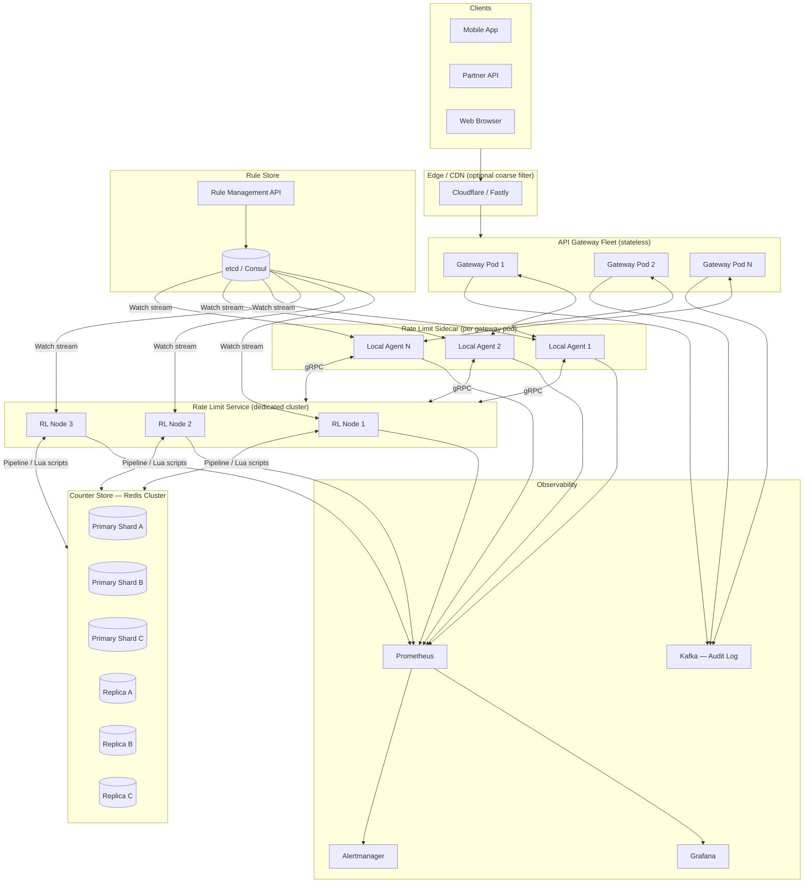
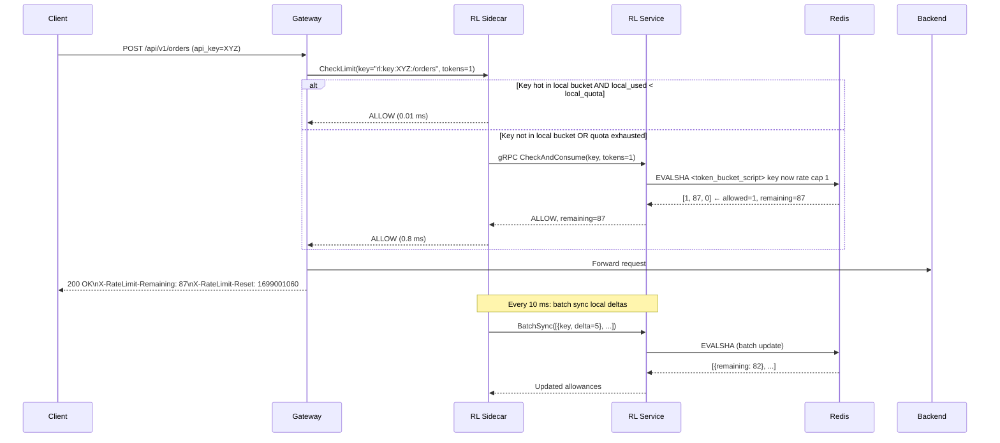
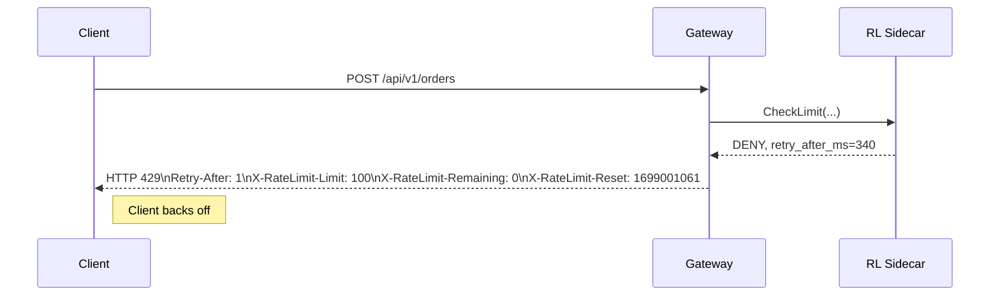
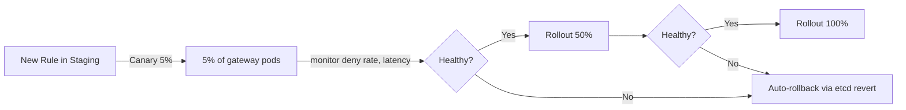

---

Design a distributed rate limiter to protect an API gateway.


---

# Distributed Rate Limiter for an API Gateway

---

## 1. Requirements

### Functional
| Requirement | Detail |
|---|---|
| Multiple limit dimensions | Per-user, per-IP, per-API-key, per-endpoint, per-tenant |
| Multiple algorithms | Token bucket (smooth), sliding window (strict), fixed window (cheap) |
| Rule management | Dynamic rule updates without restarts |
| Response contract | `429 Too Many Requests` + `Retry-After`, `X-RateLimit-*` headers |
| Burst handling | Configurable burst headroom above sustained rate |
| Soft vs. hard limits | Warn at 80%, reject at 100% |

### Non-Functional
| Requirement | Target |
|---|---|
| Latency overhead | < 2 ms p99 added to every request |
| Availability | 99.99% (must not be a single point of failure) |
| Throughput | 500 K RPS sustained across the gateway fleet |
| Rule propagation | < 5 s for a new rule to be enforced everywhere |
| False positive rate | < 0.01% (10⁻⁴) — never wrongly block a legitimate request |

### Out of Scope
- Application-level quotas (monthly billing caps) — handled by a billing service upstream
- DDoS L3/L4 mitigation — handled by CDN/WAF

---

## 2. High-Level Architecture



---

## 3. Component Deep-Dive

### 3.1 Rate Limit Sidecar (Local Agent)

Runs as a sidecar container in each gateway pod. Responsibilities:

1. **Classify the request** → extract the *limit key* (user\_id, api\_key, IP, endpoint path).
2. **Check local token bucket** (in-process, lock-free) for high-frequency keys → eliminates remote call for the common case.
3. **Sync with RL Service** every **10 ms** via a batched gRPC stream — uploads local delta counts and downloads updated allowances.
4. **Hard path**: on cache miss or first request for a key, call RL Service synchronously (still < 1 ms on LAN).

**Local token bucket (in-memory)**

```
struct LocalBucket {
    tokens:       f64       // current tokens
    capacity:     f64       // max tokens (= burst limit)
    refill_rate:  f64       // tokens/second
    last_refill:  Instant
    // sync metadata
    local_used:   u64       // uncommitted count since last sync
    sync_deadline: Instant  // force sync after 10 ms
}
```

- Refill is done lazily on each `try_consume()` call.
- Local agent is allowed to *locally approve* up to `floor(capacity * local_fraction)` tokens between syncs, where `local_fraction = 1 / num_gateway_pods` (pushed from rule store).
- This pre-allocation bounds overshoot: with 10 pods, each can locally approve ≤ 10% of burst capacity without consulting the central store.

### 3.2 Rate Limit Service

A small, CPU-bound Go service (3–5 instances). It does **no** business logic — pure counter math.

- Exposes a **gRPC streaming API**:
  ```protobuf
  service RateLimiter {
    rpc CheckAndConsume(stream RLRequest) returns (stream RLResponse);
    rpc BatchSync(BatchSyncRequest) returns (BatchSyncResponse);
  }
  ```
- On each call: executes a **Lua script** on Redis atomically (see §4).
- Caches hot-key counters locally with a **50 ms TTL** to reduce Redis round-trips. This is safe because the Lua script is the authoritative source; cache is only used to short-circuit obvious non-blocked keys.
- Shards requests across Redis cluster using consistent hashing on the limit key.

### 3.3 Counter Store (Redis Cluster)

- **3 primary shards + 3 replicas** (6 nodes total).
- Uses **Redis Cluster** (hash slots) — keys automatically distributed by `{key}` hash tag.
- Persistence: **AOF (appendfsync everysec)** — acceptable to lose 1 s of counter data on crash; counters self-heal within their window.
- Memory estimate: see §7.

### 3.4 Rule Store (etcd)

Each rule looks like:

```yaml
rule_id: usr-default
dimensions: [user_id]
algorithm: token_bucket
sustained_rps: 100
burst_capacity: 200        # tokens
window_seconds: 1
priority: 10               # lower = checked first
action_on_exceed: reject   # or: throttle, warn
endpoints:
  - /api/v1/*
tenant_override: {}
```

- Rules are stored as protobuf in etcd.
- Sidecar and RL Service **watch** etcd with long-poll; rule changes propagate in < 1 s.
- Rule Management API validates, signs, and writes rules; supports versioning and rollback.

---

## 4. Algorithm Selection

### 4.1 Token Bucket (Default — recommended)

**Properties**: Allows burst up to `capacity`, refills at `rate` tokens/s, smooth traffic.

**Redis Lua script** (atomic — no WATCH/MULTI needed):

```lua
-- KEYS[1] = rate limit key, e.g. "rl:user:42:POST:/orders"
-- ARGV[1] = now_ms, ARGV[2] = refill_rate (tokens/ms), ARGV[3] = capacity, ARGV[4] = requested_tokens

local key = KEYS[1]
local now = tonumber(ARGV[1])
local rate = tonumber(ARGV[2])       -- tokens per ms
local capacity = tonumber(ARGV[3])
local requested = tonumber(ARGV[4])

local data = redis.call("HMGET", key, "tokens", "last_refill")
local tokens = tonumber(data[1]) or capacity
local last_refill = tonumber(data[2]) or now

-- Refill
local elapsed = math.max(0, now - last_refill)
tokens = math.min(capacity, tokens + elapsed * rate)

local allowed = 0
if tokens >= requested then
    tokens = tokens - requested
    allowed = 1
end

redis.call("HMSET", key, "tokens", tokens, "last_refill", now)
redis.call("PEXPIRE", key, math.ceil(capacity / rate) + 1000)  -- auto-expire idle keys

return { allowed, math.floor(tokens), math.ceil((requested - tokens) / rate) }
-- returns: { 0|1, remaining_tokens, ms_until_retry }
```

**Single RTT** to Redis, fully atomic, no race conditions.

### 4.2 Sliding Window Counter

Used for strict per-minute/per-hour quotas where burst is not desired.

```
window_start = floor(now / window_ms) * window_ms
prev_key     = "{rl:user:42}:1699000000"   -- previous window
curr_key     = "{rl:user:42}:1699001000"   -- current window

-- weighted count
elapsed_fraction = (now - window_start) / window_ms
count = prev_count * (1 - elapsed_fraction) + curr_count
```

- Approximation error: at most `rate * window_duration` extra tokens vs. true sliding window.
- For 100 req/min, error ≤ 100 requests — acceptable for most APIs.
- True sliding window (using a sorted-set per key with timestamps) is available for premium tier but costs O(log n) per request and more memory.

### 4.3 Fixed Window Counter

Cheapest — used for coarse-grained limits (hourly, daily):

```lua
local key = "rl:user:42:2024-01-15T14"   -- hourly bucket
local count = redis.call("INCR", key)
redis.call("EXPIREAT", key, next_hour_epoch)
if count > limit then return 0 end
return 1
```

---

## 5. Request Flow



**Rejection path:**



---

## 6. Failure Modes & Mitigations

| Failure | Impact | Mitigation |
|---|---|---|
| **Redis primary crash** | Counter loss for 1 shard | Replica auto-promoted (Redis Sentinel / Cluster failover < 30 s); AOF replay limits data loss to ≤ 1 s |
| **Redis cluster partition** | Some keys inaccessible | Sidecar falls back to local-only enforcement (configurable: `fail_open` or `fail_closed`) |
| **RL Service pod crash** | Sidecar can't sync | Sidecar continues on stale local allowances for up to 60 s (hard TTL), then fails open to prevent customer impact |
| **RL Service overload** | High latency | Circuit breaker in sidecar; sidecar auto-degrades to in-process token bucket with reduced accuracy |
| **etcd unavailable** | Rule updates blocked | Last-known-good rules cached locally; stale rules serve traffic — this is safe (conservative) |
| **Clock skew between pods** | Window boundary errors | Use Redis server time (`TIME` command) inside Lua scripts, not client wall clock; mitigates NTP drift |
| **Hot key (celebrity user)** | Redis shard hot spot | Key sharding: append a suffix `{key}:shard_{hash(now/100) % 8}` to distribute across 8 sub-keys; aggregate on read |
| **Key cardinality explosion** | Redis OOM | Key TTL enforced by `PEXPIRE`; memory limits monitored; max 10M concurrent keys per deployment |
| **Sidecar crash** | Gateway unprotected | Gateway has a built-in fallback fixed-window counter (in-process) using a 1-second window; less accurate but prevents abuse |

### Fail-Open vs. Fail-Closed Policy

```
if (redis_unreachable AND rl_service_unreachable):
    if tenant.tier == "critical":
        apply in-process conservative limit (50% of normal limit)
    elif tenant.tier == "standard":
        fail_open()   # allow traffic, alert ops
    elif tenant.tier == "free":
        fail_closed() # reject with 503
```

---

## 7. Capacity Planning

### Traffic assumptions
- 500 K RPS across 50 gateway pods → 10 K RPS per pod
- Average 3 limit dimensions checked per request (user, api\_key, endpoint)
- 1.5 M Redis operations/s total

### Redis memory

| Item | Estimate |
|---|---|
| Keys per dimension | 2 M active unique keys at peak |
| Key size | `rl:user:{uuid}:{endpoint}` ≈ 60 bytes |
| Value per key (token bucket) | `tokens` (8B) + `last_refill` (8B) + overhead ≈ 128 bytes |
| Total per key | ~200 bytes |
| **Total for 2 M keys** | **~400 MB** |
| Safety headroom (3×) | **~1.2 GB per shard** |
| 3 shards | **~3.6 GB** |

Each shard runs on a `r6g.large` (16 GB RAM) — plenty of headroom.

### Redis RPS capacity
- Each `r6g.large` Redis handles ~200 K ops/s single-threaded
- With pipeline + Lua, effective throughput ≈ 150 K complex ops/s per instance
- 1.5 M ops/s ÷ 150 K = **10 shards** needed; we provision 3 shards with read replicas for now and scale horizontally.

> **Optimization**: Sidecar batching reduces Redis calls from 1.5 M/s to ~150 K/s (10x reduction via 10 ms batch windows), making 3 shards sufficient.

### RL Service sizing
- 5 pods, each handling 30 K gRPC calls/s (batched from sidecars)
- CPU: mostly Redis I/O wait — 4 vCPU per pod is sufficient
- Target: < 0.5 ms p99 for gRPC round-trip on LAN

### Network bandwidth
- Sidecar→RLS: ~50 bytes/req × 50 K RPS (after batching) = 2.5 MB/s — negligible
- RLS→Redis: ~100 bytes/command × 150 K/s = 15 MB/s per shard — well within 10 Gbps NIC

---

## 8. Response Headers Contract

```http
HTTP/1.1 200 OK
X-RateLimit-Limit: 100          # sustained limit
X-RateLimit-Remaining: 87       # tokens left in current window
X-RateLimit-Reset: 1699001061   # Unix epoch when bucket fully refills
X-RateLimit-Burst: 200          # max burst capacity
X-RateLimit-Policy: token_bucket; w=1; burst=200

# On 429:
HTTP/1.1 429 Too Many Requests
Retry-After: 1                  # seconds to wait (RFC 6585)
X-RateLimit-Remaining: 0
X-RateLimit-Reset: 1699001061
Content-Type: application/problem+json

{
  "type": "https://api.example.com/errors/rate-limited",
  "title": "Too Many Requests",
  "detail": "You have exceeded 100 requests/second on endpoint POST /api/v1/orders",
  "retry_after_ms": 340,
  "limit_dimension": "api_key",
  "rule_id": "key-default-v3"
}
```

---

## 9. Rule Priority & Composition

When multiple rules match a request, they are evaluated in priority order (lowest number = highest priority). All matching rules are checked; a request is rejected if **any** rule rejects it.

```
Request: user_id=42, api_key=PARTNER_XYZ, endpoint=POST /orders, tenant=acme

Rules evaluated (in order):
  1. [P=1]  tenant:acme   → 10,000 RPS  → ALLOW (9,543 used)
  2. [P=5]  api_key:PARTNER_XYZ → 500 RPS → ALLOW (423 used)
  3. [P=10] user:42       → 100 RPS    → DENY  ← 429 returned here
```

Short-circuit on first denial saves Redis calls for lower-priority rules.

---

## 10. Observability

### Metrics (Prometheus)
```
rl_requests_total{result="allow|deny|error", dimension="user|key|ip|endpoint", rule_id="..."}
rl_latency_seconds{quantile="0.5|0.95|0.99", path="local|rls|redis"}
rl_redis_ops_total{op="eval|get|set", shard="A|B|C", status="ok|error"}
rl_tokens_remaining{rule_id="...", p50, p95}
rl_sync_lag_ms   # sidecar→RLS sync latency
rl_rule_age_seconds  # how stale are cached rules
```

### Alerts
| Alert | Condition |
|---|---|
| **HighDenyRate** | `rate(rl_requests_total{result="deny"}[1m]) / rate(rl_requests_total[1m]) > 0.1` |
| **RedisSlow** | `rl_latency_seconds{path="redis", quantile="0.99"} > 0.005` |
| **RLServiceDown** | `up{job="rl-service"} == 0` for any pod for > 30 s |
| **StaleRules** | `rl_rule_age_seconds > 30` |
| **OverbudgetKey** | Any key consuming > 150% of its limit (indicates sidecar pre-alloc bug) |

### Audit Log (Kafka)
Every deny event is published to Kafka topic `rl.denied.v1`:
```json
{
  "ts": "2024-01-15T14:23:01.123Z",
  "request_id": "req-abc123",
  "client_ip": "1.2.3.4",
  "api_key": "PARTNER_XYZ",
  "user_id": "42",
  "endpoint": "POST /api/v1/orders",
  "rule_id": "key-default-v3",
  "limit": 500,
  "used": 501,
  "gateway_pod": "gw-pod-7"
}
```

---

## 11. Explicit Tradeoffs

| Decision | Chosen | Alternative | Reason |
|---|---|---|---|
| **Algorithm** | Token bucket | Sliding window log | Token bucket is O(1) space vs. O(n); burst control built-in |
| **Counter store** | Redis (single-threaded, Lua atomic) | Cassandra / DynamoDB | Redis gives < 1 ms latency; Cassandra is higher latency but better geo-distribution |
| **Sidecar vs. in-gateway** | Sidecar process | In-process library | Sidecar is language-agnostic, upgradeable independently, isolated failure domain |
| **Pre-allocation accuracy** | ±10% overshoot allowed | Exact (synchronous always) | 10% overshoot is tolerable; synchronous-always adds ~1 ms to every request |
| **etcd for rules** | etcd | Redis Pub/Sub | etcd has strong consistency and watch semantics; Redis pub/sub can lose messages |
| **Fail-open for standard tier** | Fail open | Fail closed | Availability > security for most APIs; free tier fails closed to prevent abuse |
| **Approximate sliding window** | Weighted two-bucket | True sorted-set log | 2-bucket is O(1) vs. O(log n); max error bounded and acceptable |

---

## 12. Deployment & Rollout



- Rules are versioned in etcd. Rollback = `etcdctl put rule_id <prev_version>`.
- Canary is implemented by tagging gateway pods with a `canary=true` label; rule store pushes to canary pods first.
- A/B testing of algorithms is supported by running two rule versions with disjoint user-id ranges.

---

## 13. Summary of Design Decisions

1. **Layered defense**: CDN coarse filter → local sidecar bucket (0.01 ms) → RL Service + Redis (< 1 ms) → backend. Most traffic is decided locally.
2. **Pre-allocation** trades a small accuracy loss (≤ 10% overshoot) for a 10× reduction in Redis load and sub-millisecond p99 for hot paths.
3. **Lua scripts** on Redis make the critical section atomic without distributed transactions.
4. **Fail-open by default** for paid tiers preserves availability; the sidecar is never a blocking SPOF.
5. **etcd** gives linearizable rule updates with watch semantics; rules propagate in < 5 seconds end-to-end.
6. **Clock skew** is eliminated by using Redis `TIME` inside Lua rather than client clocks.
7. **Hot-key sharding** distributes celebrity keys across 8 Redis sub-keys, preventing single-shard saturation.