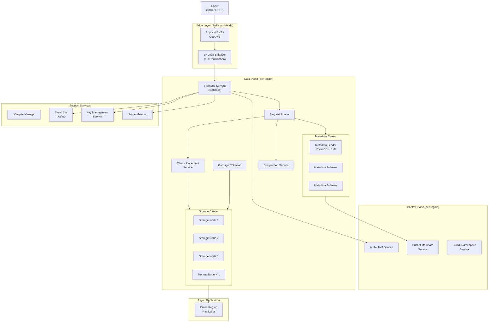
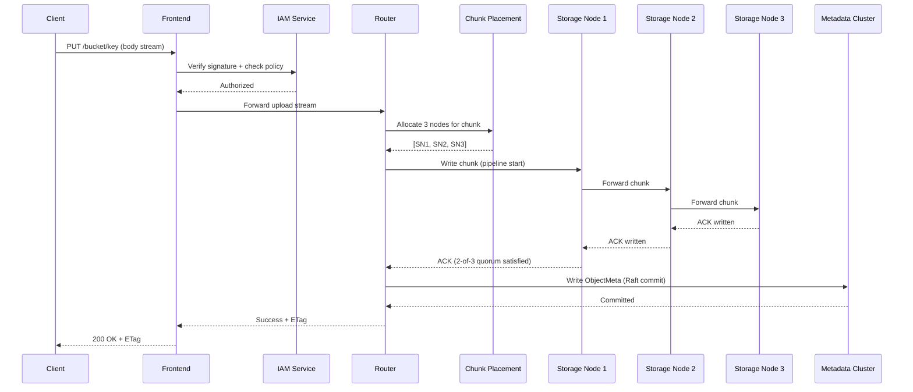
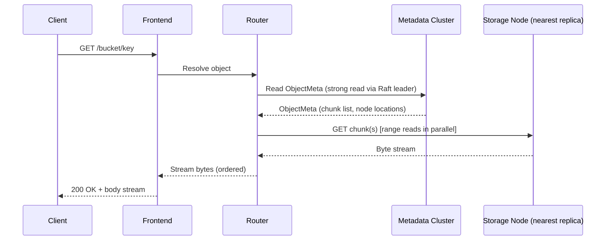

---

Design a global object storage system like S3.


---

# Global Object Storage System Design

---

## 1. Requirements

### Functional
- Store, retrieve, and delete arbitrary objects (1 byte – 5 TB each)
- Flat namespace: `bucket/key → object`
- Multipart upload for large objects
- Object versioning (per bucket)
- Bucket-level ACLs and object-level ACLs + IAM policies
- Presigned URLs for time-bounded anonymous access
- Lifecycle policies (expire, transition to cheaper tiers)
- Event notifications (object created/deleted)
- Server-Side Encryption (SSE-S3, SSE-KMS, SSE-C)
- Strong read-after-write consistency for new objects; eventual consistency for overwrites/deletes (relaxed later to strong)
- Cross-region replication (async)
- Object tags and user-defined metadata
- Batch operations (copy, delete, restore)

### Non-Functional
| Attribute | Target |
|-----------|--------|
| Durability | 99.999999999% (11 nines) |
| Availability | 99.99% per region |
| PUT latency (p99) | < 200 ms for objects ≤ 1 MB |
| GET latency (p99) | < 100 ms TTFB for objects ≤ 1 MB |
| Throughput | Millions of requests/sec globally |
| Max object size | 5 TB |
| Storage | Exabytes total |

---

## 2. Back-of-the-Envelope Capacity Planning

```
Assumptions:
  - 500 billion objects stored globally
  - Average object size = 100 KB (very skewed; many small, few huge)
  - Total raw data = 500B × 100 KB = 50 PB → scale up for real: ~1 EB raw
  - 3× replication minimum → 3 EB physical storage
  - 100M requests/sec peak globally
  - Average object key = 128 bytes
  - Metadata per object = ~256 bytes (key, ETag, size, ACL pointer, version ID, timestamps)
  - Metadata total = 500B × 256 B = 128 TB of metadata

Request breakdown (100M rps):
  - 70% GETs = 70M rps
  - 20% PUTs = 20M rps  
  - 10% other (HEAD, DELETE, LIST) = 10M rps

Bandwidth:
  - Read: 70M × 100 KB avg = 7 TB/s egress
  - Write: 20M × 100 KB = 2 TB/s ingress

Storage nodes:
  - 1 storage node: 100 TB usable (20 × 16 TB HDD, ~70% util)
  - For 3 EB physical: 3 EB / 100 TB = 30,000 storage nodes globally
  - With 10 regions: ~3,000 nodes/region

Metadata (128 TB, growing):
  - Distributed KV cluster per region; ~500 metadata nodes/region
```

---

## 3. High-Level Architecture



---

## 4. Data Model

### 4.1 Namespace Hierarchy

```
Region
  └── Bucket  (globally unique name, owned by account)
        └── Key (UTF-8 string, up to 1024 bytes)
              └── VersionId → ObjectMetadata → [ChunkList]
```

Bucket names are globally unique and resolve to a specific **home region** (where the bucket was created). Cross-region replication is explicit.

### 4.2 Object Metadata Record

```protobuf
message ObjectMeta {
  string   bucket_id       = 1;
  string   key             = 2;
  string   version_id      = 3;   // ULID for time-ordered sort
  bool     is_delete_marker= 4;
  int64    size_bytes       = 5;
  string   etag             = 6;   // MD5 of content (or multipart ETag)
  string   content_type     = 7;
  int64    created_at_ms    = 8;
  int64    last_modified_ms = 9;
  EncryptionInfo encryption = 10;
  repeated Tag tags         = 11;
  StorageClass storage_class= 12;  // STANDARD, IA, GLACIER
  repeated ChunkRef chunks  = 13;  // ordered list of chunk references
  map<string,string> user_meta = 14;
  AclRef   acl_ref          = 15;
}

message ChunkRef {
  string chunk_id    = 1;  // UUID
  int64  offset      = 2;  // byte offset within object
  int64  length      = 3;
  repeated NodeRef replicas = 4;  // primary + 2 secondaries
}

message NodeRef {
  string node_id   = 1;
  string disk_id   = 2;
  string file_path = 3;  // path on that node's local FS
}
```

### 4.3 Chunk Layout on Disk

Each **Storage Node** manages local HDD/SSD volumes. Objects are broken into **chunks** (default 64 MB for large objects, full size for small). Each chunk is stored as:

```
/data/<volumeId>/<chunkId>.dat      ← raw bytes
/data/<volumeId>/<chunkId>.idx      ← sparse index (for range reads)
```

Small objects (< 128 KB) use **inline packing**: many small objects are colocated into a single **blob file** (similar to Haystack/TitanDB). An in-memory index maps `chunkId → (blobFileId, offset, length)`.

---

## 5. Component Deep-Dives

### 5.1 Frontend (FE) Servers

Stateless HTTP/1.1 + HTTP/2 + gRPC servers. Responsibilities:
- TLS termination
- Request authentication (HMAC-SHA256 / SigV4-style signature validation)
- Rate limiting per account (token bucket, enforced locally with periodic sync to central counter)
- Request parsing and routing to the Router
- Streaming upload/download (never buffer full object in memory)
- Presigned URL validation (HMAC expiry check, no roundtrip needed)
- Multipart coordination

**Scaling:** Horizontally scale behind L7 LB. Target ~20K rps per FE node.

### 5.2 Metadata Cluster

The metadata cluster is the most critical subsystem. It stores the mapping `(bucket, key, versionId) → ObjectMeta`.

**Technology choice:** A **distributed B-tree / LSM store** built on top of Raft consensus (e.g., TiKV architecture or a custom Raft-based RocksDB cluster).

**Sharding:**
- Shard by `hash(bucket_id + key)` into **4096 virtual shards** (consistent hashing ring)
- Each shard has a Raft group of 3 replicas (one per AZ in a region)
- ~500 physical nodes per region, each hosting ~8 shards
- Total metadata per region: ~40 TB → distributed across 500 nodes = 80 GB/node (well within SSD capacity)

**Reads:** Strong reads go to the Raft leader; stale reads can go to any replica. We default to strong reads for GET (head-of-line consistency guarantee).

**LIST operations:** Lexicographic scan across a shard range. For prefix-heavy LIST requests (common for "folders"), a secondary index on `(bucket, key_prefix)` accelerates common patterns. LIST results are paginated via a `continuation_token` (base64-encoded last key seen).

**Hotspot mitigation:** Popular buckets (e.g., a public CDN bucket) get "virtual bucket sharding": the key space is split across multiple sub-shards automatically when request rate exceeds threshold.

### 5.3 Storage Layer

**Write path (PUT object):**
1. FE receives object stream
2. Router calls ChunkPlacement Service: selects N storage nodes (3 for STANDARD) from different racks/AZs
3. Router begins a **pipeline write**: streams chunk to SN1 → SN1 forwards to SN2 → SN2 forwards to SN3
4. Each node writes to local disk and ACKs upstream
5. Once 2-of-3 ACKs received (quorum write), Router writes `ObjectMeta` to Metadata Cluster
6. FE returns 200 + ETag to client

**Why pipeline write?** Reduces FE bandwidth: FE sends to one node, which fans out. Reduces total latency vs. scatter-gather.

**Read path (GET object):**
1. FE receives request
2. Router reads `ObjectMeta` from Metadata Cluster (gets ChunkRef list)
3. Router sends parallel range-read requests to nearest replica per chunk
4. FE streams bytes to client as chunks arrive (in order, reordered if needed)

**Erasure Coding (STANDARD_IA tier):**
For infrequent-access objects, use Reed-Solomon EC instead of 3× replication:
- **6+3 encoding** (6 data shards + 3 parity shards)
- Data spread across 9 storage nodes
- Can tolerate loss of any 3 nodes
- Storage overhead: 9/6 = 1.5× vs 3× for replication
- Tradeoff: Higher read latency (must read 6 shards) vs. 67% storage savings

```
STANDARD:       3× replication   → 200% overhead, fast reads
STANDARD_IA:    6+3 EC           → 50% overhead, slower reads
GLACIER:        EC + cold tiers  → tape/cold HDD, hours to restore
```

### 5.4 Chunk Placement Service

Responsible for selecting nodes for new chunks. Uses a **placement policy**:

```
Score(node) = f(free_capacity, IO_utilization, network_bandwidth, 
               AZ_diversity, rack_diversity, region_health)
```

- Maintain a live view of all nodes via heartbeat (every 5s)
- Nodes report: free_bytes, IOPS_used, bandwidth_used, error_count
- Soft-constraint: spread replicas across ≥ 2 AZs
- Hard-constraint: no two replicas on same rack (same TOR switch)
- On high write load: use **weighted random** (weighted by free capacity) rather than pure min-load to avoid thundering herd

### 5.5 Garbage Collector

Objects are **logically deleted** first (metadata marks `is_delete_marker = true` or entry removed), then **physically reclaimed** later.

- A background GC service scans for orphaned `ChunkRef` entries (chunks referenced by no live metadata)
- Two-phase: **mark** (find orphaned chunk IDs) → **sweep** (delete from storage nodes)
- Reference counting at the chunk level: chunks can be **deduped** across objects sharing identical content (content-addressed if dedup enabled)
- Compaction: blob files with > 50% dead space get rewritten (similar to LSM compaction)
- GC runs continuously but throttled to < 5% of disk IOPS

---

## 6. Consistency Model

### Strong Read-After-Write for New Objects

When a PUT completes:
1. Metadata is committed to Raft (linearizable)
2. Subsequent GET from same or different client sees the new object

This is possible because we route reads through the **Raft leader** for the metadata shard.

### Version Ordering

Version IDs use **ULIDs** (Universally Unique Lexicographically Sortable Identifiers): `timestamp(48 bits) + random(80 bits)`. This gives total ordering within a bucket+key with high probability, without needing a centralized sequence number.

### Conditional Writes (Optimistic Concurrency)

Support `If-None-Match: *` (create-only) and `If-Match: <etag>` headers:
- FE sends conditional write to Metadata Cluster
- Metadata leader performs compare-and-swap atomically
- Returns 412 Precondition Failed if condition not met

---

## 7. Multipart Upload

Large objects (> 5 GB or user-triggered) use multipart:

```
InitiateMultipartUpload → UploadId
  UploadPart(UploadId, partNumber, data) → PartETag   [parallel]
  UploadPart(UploadId, partNumber+1, data) → PartETag [parallel]
  ...
CompleteMultipartUpload(UploadId, [partNumber→ETag]) → final ETag
```

**State machine:**
- `InitiateMultipartUpload`: Creates an entry in a dedicated **multipart table** in metadata cluster: `uploadId → (bucket, key, initiated_at, parts[])`
- `UploadPart`: Stores the chunk(s) to storage nodes; updates parts list in metadata (atomic append)
- `CompleteMultipartUpload`: Validates all parts present, commits final ObjectMeta (replaces multipart entry), atomic swap
- `AbortMultipartUpload`: GC-eligible cleanup; lifecycle policy automatically aborts stale uploads (e.g., > 7 days)

Parts: 1–10,000 parts; each part 5 MB – 5 GB; final part can be smaller. ETag of complete object is MD5 of concatenated part ETags + `-N` suffix.

---

## 8. Security

### Authentication & Authorization

```
Request signing (SigV4):
  CanonicalRequest = method + URI + headers + body_hash
  StringToSign = algorithm + datetime + scope + hash(CanonicalRequest)
  Signature = HMAC-SHA256(signingKey, StringToSign)
```

- Per-request signature validation in FE (no DB lookup for valid sessions; shared secret)
- **IAM policy evaluation**: FE calls IAM service to evaluate bucket policy + identity policy. IAM responses are cached (TTL = 30s) to avoid per-request latency. Cache invalidation on policy update via event bus.

### Encryption

**SSE-S3:** AES-256-GCM; each object encrypted with a unique data key (DEK), DEK encrypted with a master key stored in KMS. DEK stored encrypted in ObjectMeta.

**SSE-KMS:** Customer-controlled KMS key; per-request KMS `GenerateDataKey` call (cached in envelope encryption pattern).

**SSE-C:** Customer provides key in request header; key never stored; only used for that request.

**Encryption at rest:** Storage node volumes use full-disk encryption (separate layer).

**TLS in transit:** All internal RPCs use mTLS.

---

## 9. Replication & Durability

### Within-Region: 3× Replication or EC

As described in §5.3. All replicas in different AZs for a 3-AZ region.

### Durability Calculation

For 3× replication across 3 AZs:
- Annual disk failure probability per disk = 2% (AFR)
- Probability of losing all 3 copies within MTTR window (assume MTTR = 4h = 4/8760 year)
- P(losing object) = P(first replica fails) × P(second fails before repair) × P(third fails before repair)
- For n=3, k=3 independent failures: ~P = (0.02) × (0.02 × MTTR/year) × (0.02 × MTTR/year) ≈ 10^-15
- Across 500B objects: expected annual loss ≈ 0.0005 objects → durability ~11 nines ✓

### Cross-Region Replication (CRR)

Async replication for disaster recovery and compliance:

```
StorageNode → Change Log (per-shard Kafka topic) 
           → CRR Agent (reads log, deduplicates, batches)
           → Remote Region FE (standard PUT API)
           → Acknowledge back to log (checkpoint)
```

- RPO (Recovery Point Objective): typically < 15 minutes
- RTO (Recovery Time Objective): minutes (failover DNS)
- Replication lag monitored as a metric; alerts if lag > 5 minutes

---

## 10. Request Flow Diagrams

### PUT Object Flow



### GET Object Flow



---

## 11. Lifecycle Management

Lifecycle rules are expressed per-bucket as JSON policies:

```json
{
  "rules": [
    {
      "id": "move-to-ia",
      "filter": { "prefix": "logs/" },
      "transitions": [
        { "days": 30,  "storageClass": "STANDARD_IA" },
        { "days": 90,  "storageClass": "GLACIER" }
      ],
      "expiration": { "days": 365 }
    }
  ]
}
```

**Lifecycle Manager** is a distributed batch processor:
- Periodically scans metadata cluster for objects matching lifecycle criteria
- Uses a cursor-based scan with daily checkpointing
- Issues internal `TRANSITION` or `DELETE` requests via the normal write path
- Throttled to avoid overwhelming the storage layer

---

## 12. Event Notifications

Every mutation (PUT, DELETE, copy, restore-complete, multipart-complete) emits an event to an **internal Kafka cluster**:

```json
{
  "eventType": "ObjectCreated:Put",
  "bucket": "my-bucket",
  "key": "photos/img.jpg",
  "size": 204800,
  "etag": "abc123",
  "versionId": "01ARZ3NDEKTSV4RRFFQ69G5FAV",
  "timestamp": "2024-01-15T10:30:00Z"
}
```

Customers configure destinations: SNS topic, SQS queue, Lambda endpoint, Webhook. The **Notification Fanout Service** reads from Kafka, applies per-bucket filters (prefix/suffix match, event type), and delivers to configured destinations. At-least-once delivery with idempotency key.

---

## 13. Global Architecture with Multiple Regions

```mermaid
flowchart LR
    subgraph US_East["Region: us-east-1"]
        FE_US["Frontend\nCluster"]
        Meta_US["Metadata\nCluster"]
        Store_US["Storage\nCluster"]
        CRR_US["CRR Agent"]
    end

    subgraph EU_West["Region: eu-west-1"]
        FE_EU["Frontend\nCluster"]
        Meta_EU["Metadata\nCluster"]
        Store_EU["Storage\nCluster"]
        CRR_EU["CRR Agent"]
    end

    subgraph AP_South["Region: ap-southeast-1"]
        FE_AP["Frontend\nCluster"]
        Meta_AP["Metadata\nCluster"]
        Store_AP["Storage\nCluster"]
    end

    subgraph GlobalCP["Global Control Plane"]
        GNS["Global Namespace Service\n(bucket → home region)"]
        GlobalIAM["Global IAM"]
        BillingAgg["Billing Aggregator"]
    end

    Client1["Client EU"] -->|GeoDNS| FE_EU
    Client2["Client US"] -->|GeoDNS| FE_US

    FE_EU -->|bucket lookup| GNS
    FE_US -->|bucket lookup| GNS

    FE_EU -.->|cross-region request\n(bucket in us-east)| FE_US

    Store_US --> CRR_US -->|async replication| FE_EU
    Store_EU --> CRR_EU -->|async replication| FE_US
```

**Global Namespace Service (GNS):**
- Single source of truth for bucket-name → home-region mapping
- Implemented as a **multi-region Paxos** cluster (Zookeeper-style) across 5 nodes in 3 regions
- Writes (bucket create/delete) are infrequent; reads are cached aggressively (TTL = 60s) in every FE
- A PUT to the wrong region is proxied to the home region transparently

---

## 14. Failure Modes & Mitigations

| Failure | Detection | Mitigation |
|---------|-----------|------------|
| Storage node crash | Heartbeat timeout (15s) | Raft group continues with 2/3; background re-replication to new node starts immediately |
| AZ outage | Health checks | Read/write continue via 2 surviving AZs (quorum maintained) |
| Metadata node crash | Raft election (< 2s) | New leader elected; reads/writes resume |
| Metadata partition | Raft refuses writes without quorum | Reads still served from stale followers with reduced consistency guarantee (configurable) |
| Hot key | Per-key request rate monitoring | Automatic key-level read fan-out: replicas promoted to multiple read-only caches |
| Hot bucket LIST | LIST latency SLO breach | Pagination enforcement; dedicated LIST worker pool |
| Disk silent corruption | Read-time checksum (CRC32C per chunk) | Detects bit rot; triggers re-read from other replica, then background heal |
| Network partition (cross-region) | CRR lag metric | CRR paused; resumes from checkpoint when partition heals; no data loss, only replication lag |
| CRR loop | Replication source tag in metadata | Agent skips objects already replicated (idempotency via source-version-id check) |
| GC too aggressive | Reference count reaching zero prematurely | Two-phase deletion with 48-hour hold before physical delete |
| Metadata cluster overload | CPU/latency alerts | Horizontal scale-out (add shard replicas); request shedding for LIST operations |

---

## 15. Performance Optimizations

### Small Object Optimization (< 128 KB)
- **Inline metadata**: For very small objects (< 4 KB), store data directly in the metadata record (bypasses storage nodes entirely)
- **Blob packing**: Group small objects into large blob files on disk (Haystack approach). Avoids per-file FS overhead; single sequential write for many objects

### Read Optimization
- **Byte-range requests**: Supported natively; only requested chunk(s) transferred
- **Parallel chunk reads**: For large objects, Router fires parallel reads to all chunks simultaneously; streams to client as ordered data arrives
- **Client-side SDK transfer acceleration**: Use nearest edge PoP; data flows over our optimized backbone rather than public internet

### Write Optimization
- **Upload acceleration**: Client opens connection to nearest PoP; data tunneled over optimized WAN to home region
- **Async durability acknowledgement** (for S3-like Express One Zone): Ack after 1 write, replicate asynchronously. Not offered for STANDARD.

### Caching
- Metadata: LRU cache in Router (512 MB per node), TTL = 30s. Invalidated on write.
- Chunk data: Hot objects cached in SSD tier on storage nodes. LRU eviction.
- IAM policies: Per-FE LRU cache, TTL = 30s with event-driven invalidation.

### Compression
- Transparent per-chunk compression (zstd) for applicable content types
- Compressibility check on first 4 KB of chunk; skip if ratio < 1.1×
- Decompression transparent to client

---

## 16. Billing & Metering

Every FE and Storage node emits **usage events** to a local Kafka topic:
- Bytes PUT, bytes GET, requests counted by type
- Storage delta (bytes added/removed)

A **Metering Aggregator** (Flink streaming job) computes per-account, per-bucket aggregates in 5-minute windows and writes to a billing database (Cassandra). Billing system reads daily/monthly rollups. Usage available in the console with ~5-minute delay.

---

## 17. Operations & Observability

### Metrics (Prometheus + Grafana)
- FE: rps by operation, latency p50/p95/p99, error rate 4xx/5xx
- Metadata: Raft leader election frequency, apply latency, queue depth
- Storage: Disk utilization, IOPS, throughput, repair queue depth
- CRR: Replication lag (seconds), pending bytes

### Distributed Tracing (OpenTelemetry)
- TraceId propagated across all services for every request
- Critical path analysis: identify which component adds tail latency

### SLO Dashboards
- GET availability (successful_GETs / total_GETs): target 99.99%
- PUT availability: target 99.99%
- Durability monitoring: daily check of replica count per chunk; alert if any chunk drops below 2 replicas

---

## 18. Key Design Tradeoffs Summary

| Decision | Choice | Alternative | Rationale |
|----------|--------|-------------|-----------|
| Consistency | Strong read-after-write (Raft) | Eventual (gossip) | Correctness >> complexity; clients expect it |
| Small objects | Blob packing / inline | One file per object | Avoids FS inode exhaustion; better IOPS |
| Large objects | Pipeline write | Scatter-gather | Lower FE bandwidth; lower latency |
| Metadata store | Distributed Raft (RocksDB) | Relational DB | Horizontal scale; no schema migrations |
| Replication | 3× for STANDARD, 6+3 EC for IA | All EC | EC has lower availability on reads; 3× simpler |
| Global namespace | Single-region GNS (cached) | Fully distributed | Simplicity; bucket ops are rare, cache hides latency |
| Deletion | Soft-delete + async GC | Synchronous delete | Safe, allows undelete; GC can reclaim in bulk |

---

## Summary

This design achieves 11-nines durability via 3× cross-AZ replication (or 6+3 EC for cold tiers), strong read-after-write consistency via Raft-based metadata, and global scalability via geographic sharding with a lightweight global namespace service. The separation of **metadata** (Raft cluster, ~TBs) from **object data** (storage nodes, ~EBs) allows each layer to scale and fail independently. The pipeline write path, blob packing for small objects, and async replication all address the practical performance challenges that arise at exabyte scale.