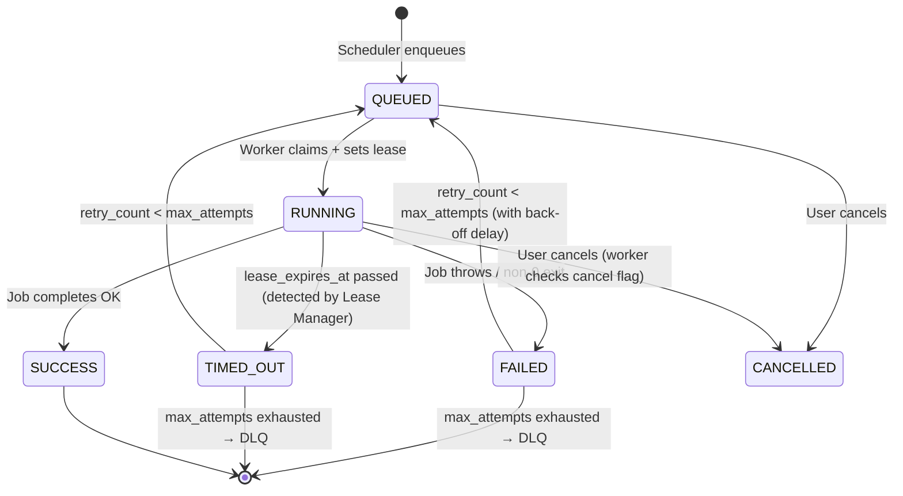
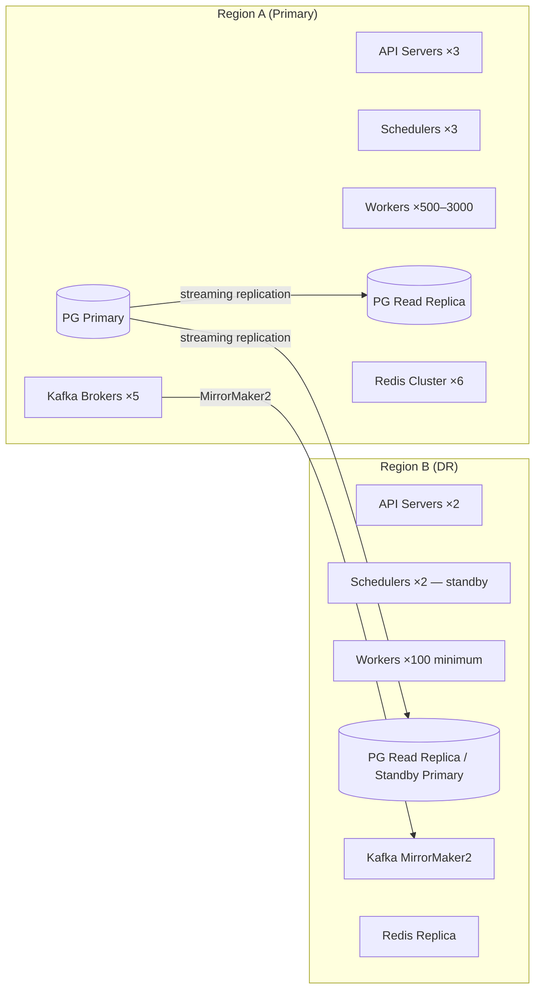

---

Design a distributed job scheduler.


---

# Distributed Job Scheduler — System Design

---

## 1. Requirements

### Functional
| Capability | Detail |
|---|---|
| Job types | One-time (fire-at-time), Recurring (cron), Event-triggered |
| Job executors | HTTP webhook, gRPC call, Container/Lambda invocation, Shell script |
| DAG dependencies | Job B runs only after Job A succeeds |
| Retry policy | Max attempts, exponential / linear / fixed back-off |
| Priority | 5 levels (critical → batch) |
| Lifecycle ops | Submit, pause, resume, trigger-now, cancel, delete |
| Observability | Run history, logs, metrics, alerts |

### Non-Functional
| Goal | Target |
|---|---|
| Scheduling lag | ≤ 1 s from `next_run_at` to enqueued |
| Availability | 99.99 % (< 1 hr downtime/year) |
| Throughput | 1,000 job dispatches/sec sustained; 10,000 burst |
| Exactly-once semantics | Effectively exactly-once via idempotency keys |
| Horizontal scalability | All components scale independently |

---

## 2. Capacity Estimates

### Job Volume
```
Daily jobs:       10 million / day
Average rate:     10M / 86,400 s  ≈  116 jobs/s
Peak (midnight):  assume 50× spike → ~5,800 jobs/s
```

### Storage
```
Job definition:        avg 2 KB  →  10M × 2 KB       =  20 GB active
Job run record:        avg 3 KB  →  10M/day × 90 days =  2.7 TB (hot/warm tiered)
Indexes + overhead:    ~40 %     →  add 11 GB + 1.1 TB
Total DB footprint:    ~35 GB active metadata, ~3.8 TB history
```

### Queue
```
At 5,800 jobs/s peak, payload 2 KB:
  5,800 × 2 KB = 11.6 MB/s write throughput → trivial for Kafka
  32 partitions × 5 priority topics = 160 partitions total
```

### Workers
```
Average job runtime: 10 s
At 5,800 jobs/s: 5,800 × 10 = 58,000 concurrent execution slots
At 20 threads/worker (I/O-heavy jobs): ~2,900 worker pods at peak
Auto-scale target: keep queue depth < 2× arrival rate
```

---

## 3. High-Level Architecture

```mermaid
flowchart TB
    subgraph Clients
        CLI[CLI / SDK]
        UI[Dashboard UI]
        API_GW[API Gateway]
    end

    subgraph Scheduler_Service["Scheduler Service (3–5 pods)"]
        SCHED_LOOP[Scheduling Loop\nSKIP LOCKED polling]
        DEPENDENCY[Dependency Checker]
        LEASE_MGR[Lease / Timeout Manager]
    end

    subgraph Job_Store["Job Store (PostgreSQL + read replicas)"]
        JOBS_TBL[(jobs)]
        RUNS_TBL[(job_runs)]
    end

    subgraph Queue_Layer["Queue Layer (Kafka)"]
        Q_P1[Topic: priority-1-critical]
        Q_P2[Topic: priority-2-high]
        Q_P3[Topic: priority-3-normal]
        Q_P4[Topic: priority-4-low]
        Q_P5[Topic: priority-5-batch]
        DLQ[Topic: dead-letter-queue]
    end

    subgraph Worker_Pool["Worker Pool (auto-scaled)"]
        W1[Worker]
        W2[Worker]
        W3[Worker]
        WN[Worker ...]
    end

    subgraph Execution_Targets
        HTTP[HTTP Endpoint]
        GRPC[gRPC Service]
        CONTAINER[Container / K8s Job]
        LAMBDA[Serverless Function]
    end

    subgraph State_Cache["Cache Layer (Redis Cluster)"]
        REDIS[Job state cache\nDistributed locks\nIdempotency keys]
    end

    subgraph Observability
        PROM[Prometheus]
        GRAF[Grafana]
        ALERT[Alertmanager]
        ELK[Elasticsearch / Kibana]
    end

    CLI --> API_GW
    UI --> API_GW
    API_GW --> Job_Store
    API_GW --> REDIS

    SCHED_LOOP -->|SKIP LOCKED SELECT FOR UPDATE| JOBS_TBL
    SCHED_LOOP --> DEPENDENCY
    DEPENDENCY --> RUNS_TBL
    SCHED_LOOP -->|INSERT job_run| RUNS_TBL
    SCHED_LOOP -->|enqueue| Q_P1 & Q_P2 & Q_P3 & Q_P4 & Q_P5

    LEASE_MGR -->|scan expired leases| RUNS_TBL
    LEASE_MGR -->|re-enqueue| Q_P3

    W1 & W2 & W3 & WN -->|consume| Q_P1 & Q_P2 & Q_P3 & Q_P4 & Q_P5
    W1 & W2 & W3 & WN -->|heartbeat lease| RUNS_TBL
    W1 & W2 & W3 & WN --> HTTP & GRPC & CONTAINER & LAMBDA
    W1 & W2 & W3 & WN -->|failed after max retries| DLQ
    W1 & W2 & W3 & WN -->|idempotency check| REDIS

    Scheduler_Service --> REDIS
    PROM --> GRAF --> ALERT
    W1 & W2 & W3 & WN --> PROM
    Scheduler_Service --> PROM
    W1 --> ELK
```



---

## 4. Data Model

### `jobs` table (PostgreSQL)

```sql
CREATE TABLE jobs (
  job_id            UUID        PRIMARY KEY DEFAULT gen_random_uuid(),
  name              TEXT        NOT NULL,
  job_type          TEXT        NOT NULL,          -- HTTP | GRPC | CONTAINER | LAMBDA
  payload           JSONB       NOT NULL DEFAULT '{}',
  cron_expression   TEXT,                          -- NULL for one-shot
  run_at            TIMESTAMPTZ,                   -- NULL for recurring
  next_run_at       TIMESTAMPTZ,                   -- maintained by scheduler
  last_run_at       TIMESTAMPTZ,
  timezone          TEXT        NOT NULL DEFAULT 'UTC',
  priority          SMALLINT    NOT NULL DEFAULT 3, -- 1 (critical) – 5 (batch)
  status            TEXT        NOT NULL DEFAULT 'ACTIVE',  -- ACTIVE|PAUSED|DELETED
  retry_config      JSONB       NOT NULL DEFAULT '{"max_attempts":3,"backoff":"exponential","initial_delay_s":10,"max_delay_s":3600}',
  timeout_s         INT         NOT NULL DEFAULT 3600,
  dependencies      JSONB       NOT NULL DEFAULT '[]',      -- array of job_ids
  tags              JSONB       NOT NULL DEFAULT '{}',
  lock_version      BIGINT      NOT NULL DEFAULT 0,         -- OCC version
  created_at        TIMESTAMPTZ NOT NULL DEFAULT NOW(),
  updated_at        TIMESTAMPTZ NOT NULL DEFAULT NOW()
);

CREATE INDEX idx_jobs_due    ON jobs (next_run_at) WHERE status = 'ACTIVE';
CREATE INDEX idx_jobs_status ON jobs (status);
CREATE INDEX idx_jobs_tags   ON jobs USING gin (tags);
```

### `job_runs` table

```sql
CREATE TABLE job_runs (
  run_id            UUID        PRIMARY KEY DEFAULT gen_random_uuid(),
  job_id            UUID        NOT NULL REFERENCES jobs(job_id),
  status            TEXT        NOT NULL DEFAULT 'QUEUED',
    -- QUEUED | RUNNING | SUCCESS | FAILED | TIMED_OUT | CANCELLED | SKIPPED
  attempt           SMALLINT    NOT NULL DEFAULT 1,
  worker_id         TEXT,
  scheduled_at      TIMESTAMPTZ NOT NULL,
  queued_at         TIMESTAMPTZ,
  started_at        TIMESTAMPTZ,
  ended_at          TIMESTAMPTZ,
  lease_expires_at  TIMESTAMPTZ,
  output            JSONB,
  error_message     TEXT,
  idempotency_key   TEXT        UNIQUE NOT NULL,   -- job_id || ':' || scheduled_at
  created_at        TIMESTAMPTZ NOT NULL DEFAULT NOW()
);

CREATE INDEX idx_runs_job_id  ON job_runs (job_id);
CREATE INDEX idx_runs_status  ON job_runs (status);
CREATE INDEX idx_runs_lease   ON job_runs (lease_expires_at) WHERE status = 'RUNNING';
```

---

## 5. Core Algorithms

### 5.1 Scheduler Loop

Each Scheduler pod runs this loop independently every **1 second**:

```
LOOP every 1 s:
  BEGIN TRANSACTION
    rows = SELECT * FROM jobs
           WHERE next_run_at  <= NOW() + interval '2 seconds'
             AND status        = 'ACTIVE'
           ORDER BY priority ASC, next_run_at ASC
           LIMIT 500
           FOR UPDATE SKIP LOCKED;   ← prevents double-scheduling

    for each job in rows:
      1. if job.dependencies not empty:
           pending = check_dependencies(job.dependencies)  -- look up job_runs table
           if pending: CONTINUE  (will retry next cycle)

      2. scheduled_at = job.next_run_at (or NOW() for one-shot)
         idem_key     = job.job_id || ':' || scheduled_at::text

      3. INSERT INTO job_runs
           (job_id, status, attempt, scheduled_at, queued_at, idempotency_key)
         VALUES (...)
         ON CONFLICT (idempotency_key) DO NOTHING;   ← deduplication

      4. if rows_inserted = 0: CONTINUE  (already scheduled by another pod)

      5. next_run_at = compute_next_cron(job.cron_expression, NOW())
                       OR NULL for one-shot
         UPDATE jobs SET next_run_at = ?, last_run_at = NOW()
         WHERE job_id = ? AND lock_version = job.lock_version;  ← OCC

      6. produce(kafka_topic[job.priority], {run_id, job_id, payload, timeout_s})

  COMMIT
```

**Why SKIP LOCKED instead of leader election?**  
Multiple scheduler pods divide work without coordination messages. A pod that is slow or paused simply skips rows held by others. This gives linear throughput scaling: 5 pods → 5× scheduling capacity.

---

### 5.2 Worker Execution Lifecycle



**Worker pseudo-code:**

```python
run = kafka_consumer.poll(priority_topics, ordered=True)

# Idempotency guard — Redis atomic check-and-set
if redis.set(f"idem:{run.idempotency_key}", "1", nx=True, ex=86400) is None:
    ack(); return          # already succeeded in a previous attempt

# Claim run with lease
rows = db.execute("""
  UPDATE job_runs
  SET status='RUNNING', worker_id=?, started_at=NOW(),
      lease_expires_at=NOW() + interval '? seconds'
  WHERE run_id=? AND status='QUEUED'
""", [self.id, LEASE_SECONDS, run.run_id])

if rows == 0: ack(); return   # claimed by another worker (rare race)

# Start background lease-renewal thread
start_lease_renewal(run.run_id, interval=LEASE_SECONDS/3)

try:
    output = execute_job(run)                    # HTTP/gRPC/Container/Lambda
    db.update_run(run.run_id, status='SUCCESS', output=output)
    redis.set(f"idem:{run.idempotency_key}", "done", ex=86400)
except JobTimeout:
    handle_failure(run, 'TIMED_OUT', ...)
except Exception as e:
    handle_failure(run, 'FAILED', str(e))
finally:
    stop_lease_renewal()
    ack()

def handle_failure(run, final_status, error):
    attempt = run.attempt + 1
    if attempt <= run.job.max_attempts:
        delay = backoff(run.job.retry_config, attempt)
        # Insert new QUEUED run after delay
        db.insert_run(run.job_id, attempt=attempt, scheduled_at=NOW()+delay)
        enqueue_delayed(run.run_id, delay)
    else:
        db.update_run(run.run_id, status=final_status, error=error)
        kafka.produce(DLQ_TOPIC, run)
```

---

### 5.3 Lease / Timeout Manager

Runs in each Scheduler pod every **30 seconds**:

```sql
-- Find runs whose lease expired but are still RUNNING
UPDATE job_runs
SET status = 'TIMED_OUT',
    error_message = 'Worker lease expired',
    ended_at = NOW()
WHERE status = 'RUNNING'
  AND lease_expires_at < NOW()
RETURNING *;
```

For each expired run, check retry budget → re-enqueue or send to DLQ.

---

### 5.4 Dependency Resolution (DAG)

```python
def check_dependencies(dep_job_ids: list[UUID]) -> list[UUID]:
    """Returns list of unsatisfied dependency job_ids."""
    pending = []
    for dep_id in dep_job_ids:
        latest_run = db.query("""
          SELECT status FROM job_runs
          WHERE job_id = ?
          ORDER BY created_at DESC LIMIT 1
        """, dep_id)
        if latest_run is None or latest_run.status != 'SUCCESS':
            pending.append(dep_id)
    return pending
```

Complex DAGs are evaluated by a dedicated **DAG Orchestrator** service that:
1. Reads a DAG definition (JSON adjacency list)
2. Maintains per-DAG run state in Redis
3. Uses topological sort (Kahn's algorithm) to dispatch in waves
4. Propagates cancellation downstream on failure

---

## 6. Failure Modes & Mitigations

| Failure | Detection | Mitigation |
|---|---|---|
| **Scheduler pod crash** | Kubernetes liveness probe; other pods continue with SKIP LOCKED | Zero downtime; in-flight selections roll back and are picked up by surviving pods |
| **Worker crash mid-job** | `lease_expires_at` passes without renewal | Lease Manager marks TIMED_OUT, re-enqueues with attempt+1 |
| **DB primary failure** | pgBouncer + Patroni leader election (~30 s failover) | Schedulers retry with exponential back-off; jobs remain QUEUED in DB |
| **Kafka broker failure** | Kafka controller detects leader absence (~5 s) | Replication factor 3 ensures continuity; producers retry with `acks=all` |
| **Double scheduling** | `idempotency_key` UNIQUE constraint; `ON CONFLICT DO NOTHING` | At most one `job_run` row per (job, scheduled_time) pair |
| **Clock skew between nodes** | NTP enforced; scheduler uses `NOW()` from DB server | Schedule horizon of 2 s absorbs ≤ 500 ms skew; DB clock is authoritative |
| **Thundering herd at midnight** | Metric: queue depth spike | Jitter ±30 s on cron jobs (configurable); horizontal auto-scale on queue depth |
| **Poison pill job (always crashes)** | Failure rate > threshold per job | DLQ after max_attempts; circuit-breaker flag pauses the job, alerts owner |
| **Redis failure** | Redis Sentinel / Cluster health check | Idempotency check degrades gracefully (allow execution; duplicates handled by downstream idempotency) |
| **Infinite retry storm** | Monitor retry rate per job | Max back-off cap (default 1 hr); optional `dead_after` TTL |

---

## 7. Scalability Strategies

### Horizontal Sharding of Job Store

When job table exceeds ~500 M rows, shard by `job_id % N`:

```
Shard 0: job_ids 00000000 – 3FFFFFFF
Shard 1: job_ids 40000000 – 7FFFFFFF
...
```

Each shard has its own Scheduler pods polling it. A **Shard Router** layer (similar to Vitess) routes API reads/writes.

### Worker Auto-Scaling

```
K8s HPA target:
  metric: kafka_consumer_group_lag{topic="priority-*"}
  target_value: 500  (scale up when lag > 500)
  min_replicas: 10
  max_replicas: 5000
  scale_down_stabilization: 300s
```

### Partitioned Kafka Topics

```
5 priority topics × 64 partitions = 320 partitions
Max throughput: 320 × ~5 MB/s = 1.6 GB/s  (far exceeds our 11.6 MB/s need)
Consumer group per worker pool; each worker owns 1–4 partitions
```

---

## 8. API Design

### REST API (versioned)

```
# Job CRUD
POST   /v1/jobs                      → 201 {job_id}
GET    /v1/jobs/{job_id}             → 200 Job
PUT    /v1/jobs/{job_id}             → 200 Job
DELETE /v1/jobs/{job_id}             → 204

# Lifecycle
POST   /v1/jobs/{job_id}/trigger     → 202 {run_id}
POST   /v1/jobs/{job_id}/pause       → 200
POST   /v1/jobs/{job_id}/resume      → 200

# Runs
GET    /v1/jobs/{job_id}/runs        → 200 [JobRun]  (paginated)
GET    /v1/runs/{run_id}             → 200 JobRun
POST   /v1/runs/{run_id}/cancel      → 200

# Search
GET    /v1/jobs?tags=env:prod&status=ACTIVE&page=2&limit=100

# DAG
POST   /v1/dags                      → 201 {dag_id}
POST   /v1/dags/{dag_id}/trigger     → 202 {dag_run_id}
GET    /v1/dags/{dag_id}/runs/{id}   → 200 DagRun

# Worker callback (internal)
POST   /internal/v1/runs/{run_id}/heartbeat  → 200
POST   /internal/v1/runs/{run_id}/complete   → 200
```

### Job Submission Example

```json
POST /v1/jobs
{
  "name": "daily-report",
  "job_type": "HTTP",
  "payload": {
    "url": "https://reports.internal/generate",
    "method": "POST",
    "body": {"type": "daily"},
    "headers": {"Authorization": "Bearer ${SECRET:report-token}"}
  },
  "cron_expression": "0 6 * * *",
  "timezone": "America/New_York",
  "priority": 2,
  "timeout_s": 1800,
  "retry_config": {
    "max_attempts": 3,
    "backoff": "exponential",
    "initial_delay_s": 60,
    "max_delay_s": 3600
  },
  "dependencies": ["550e8400-e29b-41d4-a716-446655440000"],
  "tags": {"team": "analytics", "env": "prod"}
}
```

---

## 9. Observability

### Key Metrics (Prometheus)

```
# Scheduling pipeline
scheduler_jobs_polled_total{scheduler_id}
scheduler_jobs_enqueued_total{priority}
scheduler_schedule_lag_seconds{quantile}   ← time from next_run_at to queued

# Execution
worker_jobs_executed_total{status, job_type}
worker_job_duration_seconds{quantile, job_type}
worker_lease_renewals_total
worker_lease_expirations_total             ← proxy for worker crashes

# Queue health
kafka_consumer_group_lag{topic, consumer_group}

# Reliability
job_retry_rate{job_id}
dead_letter_queue_depth
job_success_rate_5m{job_type}
```

### Alerts

```yaml
- alert: SchedulingLagHigh
  expr: scheduler_schedule_lag_seconds{quantile="0.99"} > 5
  for: 2m
  severity: page

- alert: DLQDepthGrowing
  expr: dead_letter_queue_depth > 100
  for: 5m
  severity: warning

- alert: WorkerLeaseExpirationSpike
  expr: rate(worker_lease_expirations_total[5m]) > 10
  severity: page   # many workers are crashing

- alert: NoSchedulersActive
  expr: count(up{job="scheduler"}) < 1
  severity: critical
```

### Distributed Tracing

Each job run carries a `trace_id` propagated from submission → scheduler → worker → execution target. Trace spans:

```
[submit_job] → [scheduler_poll] → [dependency_check] → [enqueue]
            → [worker_claim]   → [execute_http/grpc] → [complete]
```

---

## 10. Security

| Concern | Solution |
|---|---|
| Authentication | API Gateway: JWT (short-lived) + API keys for machine clients |
| Authorization | RBAC: `job:create`, `job:read`, `job:execute` per namespace/team |
| Secret injection | Payload references `${SECRET:name}`; resolved at runtime from Vault |
| Network isolation | Workers in private subnet; outbound traffic via egress proxy |
| Audit log | All API mutations + job executions written to append-only audit table |
| Job payload encryption | JSONB payload encrypted at rest (PG TDE or column-level AES-256) |

---

## 11. Deployment Topology



**Regional failover:**  
- Patroni promotes `PG_RR2` to primary (< 30 s)
- Schedulers in Region B start actively polling
- DNS TTL 30 s flips API traffic

---

## 12. Key Design Tradeoffs

| Decision | Chosen Approach | Alternative | Reason |
|---|---|---|---|
| Scheduler coordination | SKIP LOCKED (all schedulers active) | Leader election (one active) | Better throughput, simpler failure model |
| Execution semantics | At-least-once + idempotency keys | Exactly-once (2PC) | 2PC too expensive; idempotency covers 99.9 % of cases |
| Queue backend | Kafka | Redis Streams / SQS | Kafka replay enables auditing, back-pressure, and ordered per-partition delivery |
| Job store | PostgreSQL | Cassandra / DynamoDB | ACID transactions essential for atomic (schedule + dequeue) operations |
| Cron parsing | Server-side at scheduling time | Client-side pre-computed | Server side prevents inconsistencies across timezone changes/DST |
| Worker lease | DB row heartbeat | ZooKeeper ephemeral nodes | Fewer moving parts; DB already in the path |
| DAG execution | Orchestrator service for complex DAGs | In-scheduler graph evaluation | Separation of concerns; avoids bloating scheduler hot path |

---

## 13. What Could Go Wrong (and How We Know)

| Scenario | Symptom | Recovery |
|---|---|---|
| Scheduler loop slows down (DB contention) | `scheduler_schedule_lag > 5 s` alert fires | Reduce LIMIT, add read-replicas, shard jobs table |
| Back-pressure: workers slower than arrival | Kafka `consumer_group_lag` grows | HPA scales up workers; alert ops if lag > threshold |
| Duplicate runs slip through (bug in dedup) | Same `idempotency_key` seen twice in audit | `UNIQUE` constraint rejects second INSERT; Redis NX guard catches worker-side duplicates |
| Cron miscalculation at DST boundary | Jobs run twice or skipped in spring-forward/fall-back | All `next_run_at` computed in UTC; IANA timezone database used for wall-clock display only |
| Large job payload causes OOM in worker | Worker pod OOM-killed, lease expires | Store payload in object storage (S3), reference by URL in `job_runs.payload`; workers stream it |
| Runaway retry storm | `job_retry_rate` spikes → queue floods | Per-job circuit breaker: auto-pause after N consecutive failures; exponential back-off with 1-hour cap |

---

## Summary

The design centers on three core principles:

1. **Decoupled pipeline**: submission → DB → scheduler loop → Kafka → workers. Each stage fails independently and recovers without data loss.

2. **DB as the source of truth**: `SKIP LOCKED` gives lock-free horizontal scaling of schedulers; idempotency keys in PostgreSQL guarantee at-most-one `job_run` per scheduled event.

3. **Lease-based fault tolerance**: workers hold time-bounded leases on runs. A crashed worker's run automatically times out and is retried within `LEASE_SECONDS`, with no manual intervention.