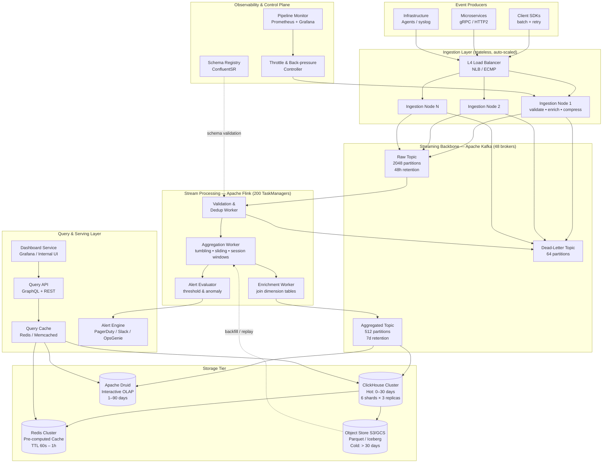
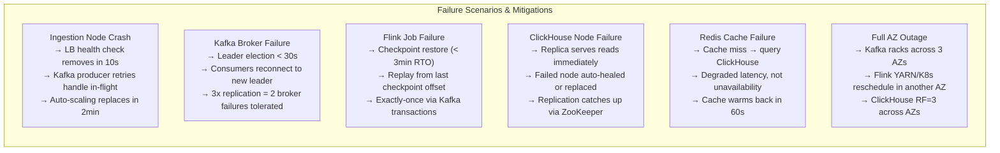
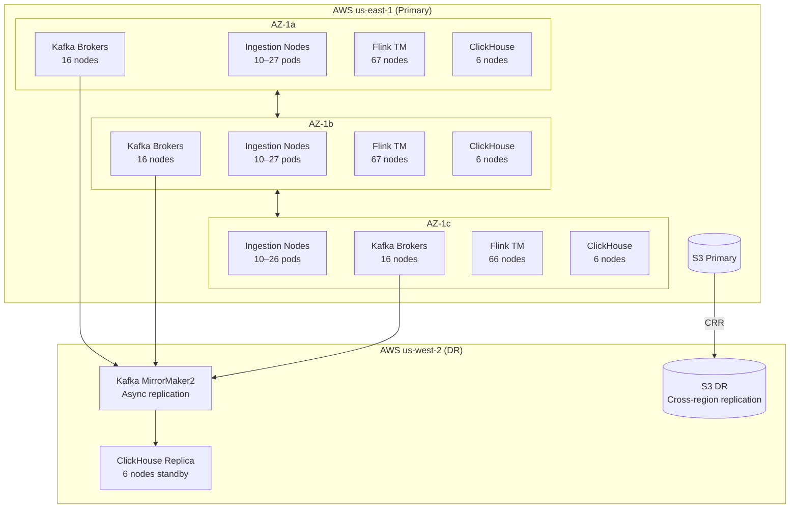

---

Design a real-time metrics aggregation pipeline that handles 100 billion events/day.


---

# Real-Time Metrics Aggregation Pipeline: 100 Billion Events/Day

---

## 1. Capacity Math — First Principles

| Metric | Calculation | Result |
|---|---|---|
| Average throughput | 100B ÷ 86,400 s | **~1.16M events/sec** |
| Peak throughput (3× multiplier) | 1.16M × 3 | **~3.5M events/sec** |
| Avg event size (compressed JSON + metadata) | — | **~200 bytes** |
| Average ingestion bandwidth | 1.16M × 200B | **~232 MB/s** |
| Peak ingestion bandwidth | 3.5M × 200B | **~700 MB/s** |
| Raw daily volume | 100B × 200B | **~20 TB/day** |
| After LZ4 compression (~8:1) | 20 TB ÷ 8 | **~2.5 TB/day compressed** |
| With 3× Kafka replication | 2.5 TB × 3 | **~7.5 TB/day on Kafka** |
| 30-day hot storage (ClickHouse, 5× rollup) | 2.5 TB × 30 ÷ 5 | **~15 TB hot** |
| 1-year cold storage (Parquet, S3) | 2.5 TB × 365 | **~912 TB/year** |

---

## 2. High-Level Architecture



---

## 3. Component Deep-Dive

### 3.1 Client SDKs & Producers

**Design decisions:**
- SDKs buffer events locally (ring buffer, 64 KB default) and flush every **500 ms or 500 events**, whichever comes first.
- SDK retries with **exponential backoff + jitter** (base 100 ms, max 30 s, 5 attempts).
- Events are pre-serialized to **Avro** (with schema ID header) before transmission to avoid per-event JSON parse at ingestion.
- Each event envelope:

```
{
  "schema_id": "uint16",      // 2 bytes
  "tenant_id": "uint32",      // 4 bytes
  "event_type": "uint16",     // 2 bytes
  "timestamp_ns": "int64",    // 8 bytes
  "trace_id": "uuid",         // 16 bytes
  "payload": "bytes"          // variable, avg 168 bytes
}                              // total avg ~200 bytes
```

- **UDP path** available for fire-and-forget telemetry (infrastructure metrics). No retry, no ack — trades reliability for throughput.

---

### 3.2 Ingestion Nodes

**Sizing:**
- Each node handles ~50K events/sec (conservative, single-threaded Netty pipeline bottleneck ~ 80K).
- At 1.16M avg: **24 nodes**; at 3.5M peak: **70 nodes** → auto-scale group, min 30, max 80.
- Instance type: `c6gn.4xlarge` (16 vCPU, 32 GB RAM, 25 Gbps network) — network-optimized ARM.

**Per-node responsibilities (ordered pipeline):**
1. **TLS termination** (TLS 1.3, session resumption)
2. **Schema validation** (schema registry lookup, cached locally with 5-minute TTL)
3. **Rate limiting** (token bucket per `tenant_id`, enforced via shared Redis counters)
4. **Deduplication hint** — attach ingestion timestamp + node ID to envelope header
5. **LZ4 compression** of batch
6. **Async Kafka produce** (librdkafka, `acks=1` for raw topic to minimize latency; `acks=all` for billing-critical tenants)

**Back-pressure handling:**
- If Kafka producer queue depth > 80% → return HTTP 429 with `Retry-After` header.
- Circuit breaker per Kafka broker (50% failure rate over 10 s → open 30 s).

---

### 3.3 Kafka Cluster

**Sizing math:**
- Peak write: 700 MB/s × 3 replicas = **2.1 GB/s total disk write**
- 48-hour retention × 7.5 TB/day = **15 TB** usable disk needed
- Per broker: 48 brokers → each handles ~44 MB/s writes, ~0.31 TB storage
- Use `i4i.2xlarge` (8 vCPU, 64 GB RAM, NVMe SSD, 10 Gbps) — NVMe critical for follower replication catch-up

**Topic design:**

| Topic | Partitions | Key Strategy | Retention |
|---|---|---|---|
| `events.raw` | 2048 | `tenant_id % partitions` | 48 hours |
| `events.aggregated` | 512 | `(tenant_id, metric_name)` hash | 7 days |
| `events.dead-letter` | 64 | none | 7 days |
| `events.alerts` | 128 | `alert_rule_id` | 24 hours |

**Why 2048 partitions on raw?**
- Flink has 200 TaskManagers × 4 slots = 800 parallel tasks reading `events.raw`
- 2048 partitions allows future growth without repartitioning
- Each partition ~350 KB/s writes at peak — well under per-partition limits

**Replication factor:** 3 for all topics; `min.insync.replicas=2`

**Compaction:** `events.aggregated` uses **log compaction** so downstream consumers re-reading after failure get latest aggregated value per key without full replay.

---

### 3.4 Stream Processing — Apache Flink

**Cluster sizing:**
- 200 TaskManagers on `r6i.4xlarge` (16 vCPU, 128 GB RAM each)
- Total: 3,200 vCPU, 25.6 TB RAM
- JobManagers: 3 (HA via ZooKeeper), `r6i.2xlarge`

**Processing jobs:**

#### Job 1: Validation & Deduplication
```
Source: events.raw (parallelism=2048)
  → Parse Avro (schema from registry)
  → Filter malformed → dead-letter
  → Dedup: probabilistic bloom filter per (trace_id, 5-min window)
    State backend: RocksDB, TTL 10 min
    False positive rate: 0.1%
  → Enrich: join static dimension tables (tenant config, metric metadata)
    Broadcast state from MySQL CDC stream
Sink: validated Kafka topic (internal) + metrics to Prometheus
```

#### Job 2: Aggregation Engine (Core)

Window types supported:

| Window Type | Use Case | Implementation |
|---|---|---|
| Tumbling (1m, 5m, 1h) | Counters, sums per period | `TumblingEventTimeWindows` |
| Sliding (5m/1m, 1h/5m) | Rolling averages | `SlidingEventTimeWindows` |
| Session (timeout=30s) | User session analytics | `EventTimeSessionWindows` |
| Global (keyed) | Cumulative totals | Managed keyed state |

Aggregation functions per window:
- COUNT, SUM, MIN, MAX
- AVG (sum + count → computed at query time)
- **P50/P90/P99 latency**: using **t-digest** per window (128-byte sketch, ~0.5% error at tails)
- **Cardinality** (unique users): **HyperLogLog** (12-bit, ~0.8% error, 4 KB per sketch)
- **Top-K**: Count-Min Sketch + min-heap (top 100 values, 5 KB per window)

**Watermark strategy:**
- Bounded out-of-orderness: **30 seconds** — covers network jitter, mobile clients buffering
- Per-partition watermarks, periodic advancement every 200 ms
- Late events (>30s, <5 min): routed to **side output** for reprocessing
- Late events (>5 min): dropped, counted as `late_event_dropped` metric

**State management:**
- RocksDB incremental checkpoints every 3 minutes to S3
- Recovery time objective (RTO): < 3 minutes (checkpoint interval + processing lag)
- State size estimate: 200 TaskManagers × 32 GB RocksDB = **6.4 TB** total state

#### Job 3: Alert Evaluator
```
Source: events.aggregated (parallelism=512)
  → CEP (Complex Event Processing) rules engine
  → Threshold evaluation: value > threshold for N consecutive windows
  → Anomaly detection: Z-score on rolling 1h baseline
  → Rate-limit alerts: at most 1 alert/rule/5min (keyed state)
Sink: events.alerts → Alert Engine → PagerDuty/Slack
```

---

### 3.5 Storage Tier

#### ClickHouse (Hot Storage, 0–30 days)

**Schema (MergeTree engine):**
```sql
CREATE TABLE metrics (
    tenant_id     UInt32,
    metric_name   LowCardinality(String),
    window_start  DateTime,
    window_size   Enum8('1m'=1, '5m'=5, '1h'=60),
    labels        Map(LowCardinality(String), String),
    count         UInt64,
    sum           Float64,
    min           Float64,
    max           Float64,
    tdigest       AggregateFunction(quantilesTDigest(0.5, 0.9, 0.99), Float32),
    hll           AggregateFunction(uniq, UInt64)
)
ENGINE = ReplicatedMergeTree('/clickhouse/tables/{shard}/{table}', '{replica}')
PARTITION BY (tenant_id % 64, toYYYYMMDD(window_start))
ORDER BY (tenant_id, metric_name, window_start)
TTL window_start + INTERVAL 30 DAY DELETE;
```

**Cluster topology:**
- 6 shards × 3 replicas = 18 ClickHouse nodes
- `m6i.8xlarge` (32 vCPU, 128 GB RAM, 6.4 TB gp3 SSD)
- Shard key: `tenant_id % 6`
- Total capacity: 18 × 6.4 TB = **115 TB**; at 15 TB hot data → 7× headroom

**Write path:**
- Flink writes via ClickHouse HTTP interface, batches of **100K rows**, async insert buffer
- Insert rate: ~1M rows/sec aggregated (much lower than raw 1.16M/s due to aggregation)
- Background merges handled by `MergeTree` — monitor `parts_to_merge` metric

**Materialized rollups:**
```sql
-- Auto-maintained by ClickHouse AggregatingMergeTree
CREATE MATERIALIZED VIEW metrics_1h
ENGINE = AggregatingMergeTree()
PARTITION BY toYYYYMM(window_start)
ORDER BY (tenant_id, metric_name, window_start)
AS SELECT ... GROUP BY tenant_id, metric_name, toStartOfHour(window_start);
```

Rollup hierarchy: raw 1-min → 5-min → 1-hour → 1-day (stored in ClickHouse)
Reduces query scan range by 1440× for daily queries.

#### Apache Druid (Interactive OLAP, 1–90 days)

- Used for ad-hoc slice-and-dice queries with multi-dimensional filtering
- Ingests from `events.aggregated` Kafka topic via **Druid Kafka Supervisor**
- Segment size: 5M rows / segment, auto-compacted hourly
- Deep storage: S3 for segment backup
- Query node: 8× `r6i.4xlarge` with 128 GB RAM for scan-heavy queries
- **Why both ClickHouse and Druid?** ClickHouse excels at time-series queries with known dimensions; Druid handles exploratory, high-cardinality filter queries better. They serve different query patterns.

#### Object Store (Cold, S3/GCS — >30 days)

- Flink writes **Parquet files** partitioned by `tenant_id/year/month/day/hour`
- Files use **Snappy compression** (better read performance than gzip for analytics)
- Organized as **Apache Iceberg** table for ACID updates and time-travel
- File size target: 128–256 MB (Parquet row group 1M rows)
- Lifecycle policy: S3 Standard → S3-IA after 90 days → Glacier after 1 year
- Query via **Athena** (Presto) for historical analysis; p50 latency ~10s acceptable
- Storage cost: 912 TB/year × $0.023/GB-month = **~$21K/month cold** (vs. $4M for equivalent SSD)

#### Redis Cluster (Pre-computed Cache)

- 12-node cluster (6 shards × 2 replicas), `r7g.2xlarge` (8 vCPU, 64 GB RAM)
- Stores pre-computed dashboard results for most-accessed metric queries
- Key structure: `cache:{tenant_id}:{metric_name}:{window}:{label_hash}`
- TTL: 60 s for live dashboards, 5 min for 1-hour windows, 1 hour for daily rollups
- **Cache warming**: Flink writes completed window aggregations directly to Redis simultaneously with ClickHouse — zero cold-start for common queries
- Hit rate target: **>85%** for dashboard queries (measured by `cache_hit_ratio` metric)

---

### 3.6 Query & Serving Layer

**Query API (12 nodes, `c6i.4xlarge`):**

```
GET /v1/metrics/query
  ?tenant_id=acme
  &metric=http.request.duration
  &start=2024-01-01T00:00:00Z
  &end=2024-01-02T00:00:00Z
  &step=5m
  &percentiles=p50,p99
  &filter=region:us-east-1,service:api-gateway
```

**Query routing logic:**
1. Check Redis cache → return if hit (< 5 ms)
2. Time range ≤ 30 days → ClickHouse
3. Time range 30–90 days → Druid
4. Time range > 90 days → Athena (async job, webhook callback)
5. Mixed range → fan-out, merge results

**Query optimization:**
- **Tenant isolation**: each query scoped by tenant partition key → no cross-tenant scans
- **Automatic downsampling**: queries spanning >7 days automatically use pre-aggregated rollup tables
- **Query timeout**: 30 s hard limit; slow queries return `202 Accepted` with job ID for polling

**SLOs:**
| Query Type | P50 | P99 |
|---|---|---|
| Last 1 hour, single metric | < 10 ms | < 50 ms |
| Last 24 hours, single metric | < 50 ms | < 200 ms |
| Last 7 days, 10 metrics | < 200 ms | < 1 s |
| Last 30 days (rollup) | < 500 ms | < 2 s |

---

## 4. Schema Registry & Data Governance

- **Confluent Schema Registry** (3 nodes, HA) with Avro/Protobuf schemas
- Schemas versioned with compatibility mode: `FORWARD` (new fields optional)
- Schema evolution: producers can add optional fields; consumers ignore unknown fields
- Each event carries `schema_id` (2 bytes) → ingestion nodes cache schemas locally
- **Schema promotion workflow**: dev → staging → prod with validation gates
- Rejected schemas (backward-incompatible changes) go to dead-letter with error metadata

---

## 5. Fault Tolerance & Failure Modes



**Exactly-once semantics:**
- Flink uses **two-phase commit** with Kafka transactions
- ClickHouse writes are idempotent via deduplication on `(tenant_id, window_start, metric_name)` primary key
- Flink checkpoints include Kafka offsets → replay from checkpoint avoids double-counting

**Data loss budget:**
- Kafka: `acks=all`, `min.insync.replicas=2` → tolerate 1 broker failure without data loss
- Fire-and-forget UDP telemetry: explicit SLA of "best-effort, <0.1% loss expected"
- Late/dropped events tracked via `events_dropped_total{reason="late"}` counter

---

## 6. Multi-Tenancy & Isolation

| Mechanism | Implementation |
|---|---|
| Ingestion rate limiting | Token bucket per tenant in Redis; 10K–500K events/sec tiers |
| Kafka partition assignment | Tenant ID–based partitioning → noisy tenant bounded to subset of partitions |
| Flink resource groups | Heavy tenants get dedicated task slots (YARN queues) |
| ClickHouse quota | Per-tenant `max_concurrent_queries=10`, `max_bytes_in_result=10GB` |
| Storage quota | Per-tenant TTL and data retention enforced via ClickHouse TTL expressions |
| Billing metrics | Separate `billing.events` Kafka topic, immutable, `acks=all`, 30-day retention |

---

## 7. Observability of the Pipeline Itself

**Meta-metrics (the pipeline monitors itself):**
- `ingestion_events_total{tenant, status}` — counters on each ingestion node
- `kafka_consumer_lag{topic, partition, consumer_group}` — alert if > 5-minute lag
- `flink_checkpoint_duration_seconds` — alert if > 60s (indicates state bloat)
- `clickhouse_insert_rows_per_second` — alert if drops > 50% in 5 minutes
- `query_latency_seconds{p50, p99}` — SLO burn rate alerts (multi-window)

**Alerting thresholds:**

| Alert | Condition | Severity |
|---|---|---|
| Kafka consumer lag | > 2M messages for 5 min | P1 |
| Ingestion error rate | > 1% in 1 min | P1 |
| Flink checkpoint failure | 3 consecutive failures | P1 |
| ClickHouse write latency | p99 > 5s for 3 min | P2 |
| Redis hit rate | < 70% for 15 min | P2 |
| Late event rate | > 5% of total for 10 min | P3 |

---

## 8. Deployment & Infrastructure



**Infrastructure as Code:** Terraform for AWS resources; Helm charts for all Kubernetes workloads  
**Kubernetes:** EKS for stateless layers (ingestion, query API, Flink); dedicated EC2 ASG for Kafka and ClickHouse (latency-sensitive, avoid noisy-neighbor)

---

## 9. Cost Estimate (AWS, monthly)

| Component | Instances | Cost/mo (est.) |
|---|---|---|
| Ingestion nodes (avg 30 × c6gn.4xlarge) | 30 | $7,800 |
| Kafka brokers (48 × i4i.2xlarge) | 48 | $38,400 |
| Flink TaskManagers (200 × r6i.4xlarge) | 200 | $130,000 |
| ClickHouse (18 × m6i.8xlarge) | 18 | $50,400 |
| Druid query nodes (8 × r6i.4xlarge) | 8 | $5,200 |
| Redis cluster (12 × r7g.2xlarge) | 12 | $15,600 |
| Query API (12 × c6i.4xlarge) | 12 | $5,500 |
| S3 storage (912 TB × $0.023) | — | $20,976 |
| Data transfer, misc | — | ~$15,000 |
| **Total** | | **~$289,000/mo** |

> At 100B events/day, this is **~$0.00003 per event** or **~$0.86 per million events**. Optimization levers: Reserved Instances (up to 40% reduction), Spot for Flink TMs (with checkpoint-based recovery), S3 Intelligent Tiering.

---

## 10. Key Tradeoffs & Design Decisions

| Decision | Chosen | Alternative | Rationale |
|---|---|---|---|
| Message broker | Kafka | Pulsar, Kinesis | Highest throughput/partition; battle-tested at this scale |
| Stream processor | Flink | Spark Streaming, Storm | True streaming (not micro-batch); strong exactly-once; rich windowing API |
| Hot storage | ClickHouse | InfluxDB, TimescaleDB | ClickHouse handles mixed-schema metrics far better; columnar compression is superior |
| OLAP engine | Druid | Pinot, Presto on Parquet | Druid has best sub-second latency for high-cardinality filter queries |
| Sketch algorithms | t-digest + HLL | Exact computation | t-digest: 0.5% error at 1/10,000th the memory. HLL: 0.8% cardinality error at 4 KB vs GB |
| Event time vs. processing time | Event time | Processing time | Correct aggregations despite network delays; requires watermarks |
| Cache warming | Write-through (Flink→Redis) | Lazy/read-through | Eliminates cold-start for dashboard refreshes; ~60% of queries pre-warmed |
| Exactly-once | Kafka transactions + idempotent writes | At-least-once + dedup | Correctness for billing; minor throughput overhead (~5%) worth it |

---

## 11. What Could Go Wrong (and How to Handle It)

| Failure Mode | Impact | Detection | Mitigation |
|---|---|---|---|
| Clock skew > 30s on producer | Events dropped as "too late" | Alert on `late_event_rate > 5%` | NTP enforcement; adaptive watermark stretching for known-slow sources |
| Kafka partition hot spot (1 tenant = 40% of events) | Partition consumer starved | Consumer lag alert per partition | Re-key hot tenants to multiple sub-partitions; dedicated Kafka topic for whale tenants |
| Flink GC pause > checkpoint interval | Checkpoint timeout → job restart | Flink GC metrics, checkpoint failure alert | Use ZGC (G1 avoidable at this heap); tune RocksDB off-heap to reduce JVM pressure |
| ClickHouse part explosion (too many inserts) | Write stall during merges | `parts_to_merge > 300` alert | Increase Flink batch size to 100K rows; use insert buffer; schedule maintenance merges off-peak |
| Schema evolution breaks consumers | Flink job parse failures → DLQ spike | DLQ rate alert | Schema Registry forward-compatibility enforcement; canary schema test in staging |
| S3 write throttling during replay | Checkpoint uploads slow | Flink checkpoint duration alert | Use S3 Multi-Part Upload; distribute checkpoints across prefixes; separate S3 bucket for checkpoints vs. cold data |
| Redis eviction under memory pressure | Cache hit rate drops | `cache_hit_ratio < 70%` alert | LRU policy + explicit TTL; pre-warm critical tenant dashboards on deploy |

---

## Summary

This design delivers **1.16M events/sec average** (3.5M peak) through a **six-layer architecture**: SDK batching → validated ingestion → Kafka durability buffer → Flink exactly-once stream processing → multi-tier storage (Redis/ClickHouse/Druid/S3) → query API with intelligent routing. The use of approximate sketches (t-digest, HyperLogLog, Count-Min) is the single most impactful decision — it reduces state size and storage by 3–4 orders of magnitude while keeping errors below 1%, which is invisible against real-world metric noise.