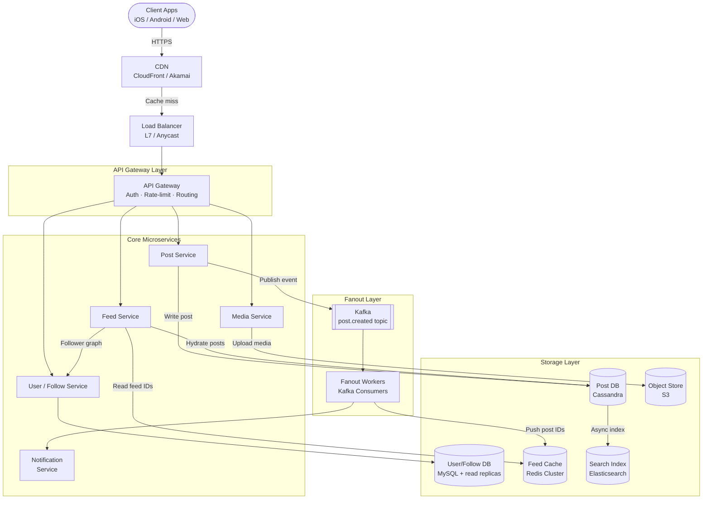
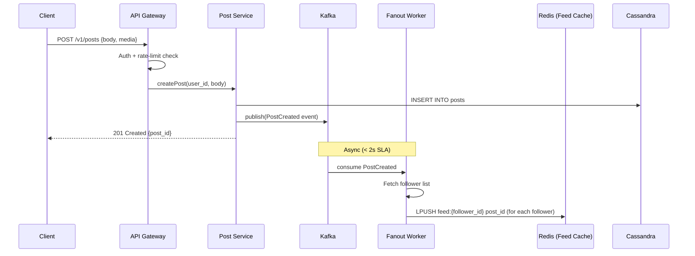
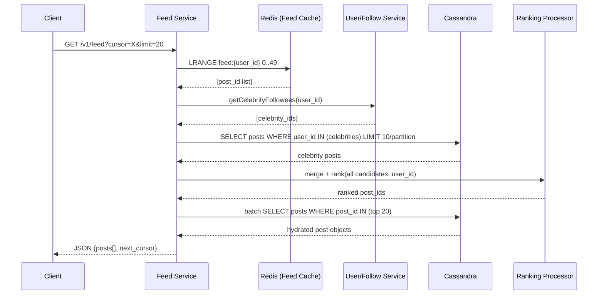
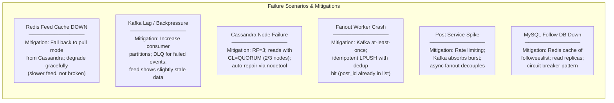

---

Design a news feed system like Twitter or Facebook.


---

# News Feed System Design

## 1. Requirements

### Functional Requirements
| # | Requirement |
|---|-------------|
| F1 | Users can post content (text ≤ 280 chars, images, videos, links) |
| F2 | Users can follow/unfollow other users |
| F3 | Each user has a home feed showing posts from followed users, ranked by relevance |
| F4 | New posts appear in followers' feeds within ~5 seconds (soft real-time) |
| F5 | Users can like, comment on, and share posts |
| F6 | Feeds support infinite scroll / pagination |
| F7 | Users can view any individual user's profile timeline |

### Non-Functional Requirements
| # | Requirement | Target |
|---|-------------|--------|
| NF1 | Availability | 99.99% (< 52 min/year downtime) |
| NF2 | Read latency | p99 < 200 ms for feed render |
| NF3 | Write latency | p99 < 500 ms for post creation |
| NF4 | Consistency | Eventual (feed staleness ≤ 5 s acceptable) |
| NF5 | Scale | 500 M MAU, 100 M DAU |
| NF6 | Durability | Zero post data loss |

### Out of Scope
- Ads ranking, direct messaging, search, notifications (separate systems)

---

## 2. Capacity Estimation

### Traffic
```
DAU = 100 M
Average posts/user/day = 2  → 200 M posts/day
Posts/second (peak 3×avg) = 200M / 86400 × 3 ≈ 7,000 writes/s

Average feed reads/user/day = 20 → 2 B reads/day
Reads/second (peak 3×avg) = 2B / 86400 × 3 ≈ 70,000 reads/s
Read:Write ratio ≈ 10:1
```

### Storage
```
Post record: 500 bytes (text + metadata)
200 M posts/day × 500 B = 100 GB/day raw post data
5-year retention: 100 GB × 365 × 5 ≈ 182 TB

Media: avg 30% posts have images/video (50 KB avg after CDN processing)
200M × 0.30 × 50 KB = 3 TB/day media → ~5.5 PB over 5 years (stored in object store)

Feed cache (fanout): 
  Each post fanned out to avg 200 followers (median; 99th %ile = 50k)
  200 M posts/day × 200 = 40 B fanout writes/day ≈ 460k/s
  Feed list per user: store 800 post IDs × 8 bytes = 6.4 KB/user in Redis
  100 M active users × 6.4 KB = 640 GB total feed cache RAM
```

### Bandwidth
```
Feed response: 20 posts × 500 B = 10 KB/request
70,000 reads/s × 10 KB = 700 MB/s egress (text only; CDN handles media)
```

---

## 3. High-Level Architecture



---

## 4. Detailed Component Design

### 4.1 Post Service

**Write path:**
1. Client calls `POST /v1/posts` with token.
2. API Gateway validates JWT, checks rate limit (e.g., 300 writes/user/hour via Redis sliding window).
3. Post Service generates a **Snowflake ID** (64-bit: 41-bit ms timestamp + 10-bit datacenter/worker + 12-bit sequence). This gives time-ordered IDs, enabling cursor-based pagination without scanning.
4. Writes to Cassandra (`posts` table, partition key = `user_id`, cluster key = `post_id` DESC).
5. Publishes `PostCreated` event to Kafka with full post payload. Returns 201 to client synchronously — fanout is async.

**Post schema (Cassandra):**
```
posts
  user_id    UUID  (partition key)
  post_id    BIGINT (cluster key DESC — newest first)
  body       TEXT
  media_urls LIST<TEXT>
  like_count COUNTER  (separate counter table)
  created_at TIMESTAMP
  is_deleted BOOLEAN
```

---

### 4.2 Fanout Service (Push vs Pull hybrid)

The core design tension: **push (fanout-on-write)** vs **pull (fanout-on-read)**.

| Strategy | Pros | Cons |
|---|---|---|
| **Push (fan-out on write)** | O(1) read; feeds pre-built | Celebrity problem: Elon (100M followers) → 100M writes per tweet |
| **Pull (fan-out on read)** | No celebrity problem | O(followees) reads per feed load; higher read latency |

**Hybrid strategy (used by Twitter/Instagram):**
- **Regular users** (< 10,000 followers): push post ID into all followers' Redis feed lists immediately.
- **Celebrity users** (≥ 10,000 followers): skip fanout. Instead, when a user loads their feed, the Feed Service fetches celebrity posts directly (pull) and merges with the pre-built list.
- Threshold is configurable and stored as a flag on the User record.

**Fanout Worker logic:**
```
on PostCreated(event):
  author = UserService.getUser(event.author_id)
  if author.follower_count < CELEBRITY_THRESHOLD:
    followers = FollowService.getFollowers(event.author_id, batch_size=1000)
    for batch in followers:
      redis.lpush(f"feed:{follower_id}", event.post_id)  // for each
      redis.ltrim(f"feed:{follower_id}", 0, 799)          // keep latest 800
  // else: handled at read time
  NotificationService.notify(event)
```

Kafka topic `post.created` has **32 partitions** (keyed by `author_id`); ordering within an author is preserved. Fanout workers are auto-scaled Kubernetes pods consuming this topic.

---

### 4.3 Feed Service (Read Path)

```
GET /v1/feed?cursor=<post_id>&limit=20

1. Authenticate user from JWT → user_id
2. Fetch pre-built list: redis.lrange("feed:{user_id}", 0, 49)
   → returns up to 50 post_id candidates
3. Identify celebrities the user follows:
   celebrity_ids = FollowService.getCelebrityFollowees(user_id)
4. For each celebrity, fetch latest posts from Cassandra:
   SELECT * FROM posts WHERE user_id IN (celebrity_ids)
   ORDER BY post_id DESC LIMIT 10 PER PARTITION
5. Merge + deduplicate all post_ids (push list + celebrity posts)
6. Apply ranking model (see §4.4) → ranked list of ~50 post_ids
7. Paginate using cursor (post_id as opaque token)
8. Hydrate: batch-fetch full post objects from Cassandra 
   (or L1 local cache with 30s TTL)
9. Return JSON with next_cursor
```

**Cache tiering:**
- **L1**: In-process LRU per Feed Service pod (30 s TTL, hot posts)
- **L2**: Redis Cluster (5 min TTL, full post objects by post_id)
- **L3**: Cassandra (source of truth)

---

### 4.4 Feed Ranking

A simple **scoring function** (can be replaced by an ML model):

```
score(post) = 
    recency_score(age_hours)         // exponential decay: e^(-λ·age)
  + affinity_score(author, viewer)   // interaction history weight 0–1
  + engagement_score(post)           // log(1 + likes + 3*comments + 5*shares)
  + content_type_boost               // video: +0.2, image: +0.1

recency_score = e^(-0.1 * age_hours)  // half-life ~7 hours
```

- Computed in-memory at read time on the 50-candidate set.
- Affinity scores are precomputed nightly by a Spark job and stored in Redis with key `affinity:{viewer_id}:{author_id}`.
- For users who haven't logged in for > 24 h, their feed cache is cold; a **lazy hydration** job rebuilds it on first login using pull from Cassandra.

---

### 4.5 User / Follow Service

**Follow graph storage:**
- MySQL (InnoDB) for OLTP: `follows(follower_id, followee_id, created_at)` with composite PK and indexes on both columns.
- For scale: shard by `follower_id % N` on a Vitess cluster.
- Read replicas absorb follower-list reads during fanout.
- **Hot path cache**: Redis set `followees:{user_id}` with 10-min TTL for feed assembly; `follower_count:{user_id}` for celebrity threshold check.

---

### 4.6 Media Service

1. Client requests a **presigned S3 upload URL** from Media Service.
2. Client uploads directly to S3 (bypasses application servers).
3. S3 `object.created` event → Lambda → transcoding pipeline (AWS MediaConvert / FFmpeg on ECS) to generate multiple resolutions.
4. CDN is fronted via CloudFront with **signed URLs** for private media; public posts use public CDN URLs.
5. Post record stores `media_urls` as CDN base URL only; resolution variant is chosen by client.

---

## 5. Data Flow Diagrams

### 5.1 Write Path (Post Creation)



### 5.2 Read Path (Feed Load)



---

## 6. Database Schema Summary

```sql
-- MySQL: users
CREATE TABLE users (
  user_id      BIGINT PRIMARY KEY,
  username     VARCHAR(50) UNIQUE NOT NULL,
  is_celebrity BOOLEAN DEFAULT FALSE,   -- cached flag updated by async job
  follower_count INT DEFAULT 0,
  created_at   TIMESTAMP
);

-- MySQL: follows (sharded by follower_id)
CREATE TABLE follows (
  follower_id  BIGINT NOT NULL,
  followee_id  BIGINT NOT NULL,
  created_at   TIMESTAMP,
  PRIMARY KEY (follower_id, followee_id),
  INDEX idx_followee (followee_id)       -- for "who follows me" lookups
);

-- Cassandra: posts
CREATE TABLE posts (
  user_id    UUID,
  post_id    BIGINT,          -- Snowflake; DESC cluster order
  body       TEXT,
  media_urls LIST<TEXT>,
  created_at TIMESTAMP,
  is_deleted BOOLEAN,
  PRIMARY KEY (user_id, post_id)
) WITH CLUSTERING ORDER BY (post_id DESC);

-- Cassandra: post_likes (separate to avoid write hotspot)
CREATE TABLE post_likes (
  post_id    BIGINT,
  user_id    UUID,
  created_at TIMESTAMP,
  PRIMARY KEY (post_id, user_id)
);

-- Redis key patterns
feed:{user_id}           → List of post_id (BIGINT), max 800 entries
post:{post_id}           → Hash of post fields (5 min TTL)
affinity:{a}:{b}         → FLOAT score
followees:{user_id}      → Set of followee_ids (10 min TTL)
ratelimit:{user_id}      → Sliding window counter
```

---

## 7. Scalability & Reliability

### 7.1 Horizontal Scaling Summary

| Component | Scaling Strategy |
|-----------|-----------------|
| API Gateway | Stateless pods; HPA on CPU/RPS |
| Post Service | Stateless; scaled independently |
| Feed Service | Stateless; hot-path L1 cache |
| Fanout Workers | Kafka consumer group; scale by partition count |
| Redis Feed Cache | Redis Cluster with 6 shards (3 primary + 3 replica); 640 GB fits |
| Cassandra | 12-node ring (RF=3), vnodes; add nodes for capacity |
| MySQL/Vitess | 8 shards by user_id; read replicas per shard |
| Kafka | 32 partitions; 3-broker cluster + replication factor 3 |

### 7.2 Handling the Celebrity Problem

- At write time: skip fanout for users with follower_count ≥ 10,000.
- At read time: Feed Service fetches their recent posts from Cassandra (hot rows cached in Redis).
- Posts from a celebrity with 50M followers cost **0 fanout writes** vs 50M.
- Celebrity status updated by a cron job every 15 minutes based on follower count change.

### 7.3 Cold Start / Inactive Users

- Feed cache has **TTL = 7 days**. If a user hasn't logged in for 7 days, cache is evicted.
- On next login, Feed Service falls back to **pull mode**: queries Cassandra for all followees' recent posts (last 48 h), merges, ranks, and writes back to Redis.
- Lazy rebuild is bounded: max 2,000 followees × 10 posts each = 20,000 Cassandra rows fetched.

### 7.4 Pagination

- Use **post_id (Snowflake) as cursor** — time-ordered, no offset scan.
- `next_cursor = min(post_id)` in current page.
- Client sends `?cursor=<post_id>` → Feed Service filters `post_id < cursor`.
- Avoids the N-offset anti-pattern (O(N) scans).

---

## 8. Fault Tolerance & Failure Modes



| Failure | Detection | Recovery |
|---------|-----------|----------|
| Redis cache miss / down | Cache hit-rate alert < 80% | Fallback to Cassandra pull; auto-restart |
| Kafka consumer lag > 30 s | Lag monitoring (Burrow) | Alert + scale consumer pods |
| Cassandra node failure | Nodetool status, heartbeat | RF=3 absorbs 1 failure; replace node |
| Post Service OOM | k8s liveness probe | Pod restart; circuit breaker for downstream |
| Hotspot user (viral post) | High RPS on single post_id key | Counter shard in Cassandra; Redis shard key spread |
| Data center outage | Latency spikes, health checks | Multi-region active-passive; Kafka MirrorMaker2 |

### Idempotency
- Post creation uses client-generated **idempotency key** (UUID v4 in header).
- Post Service stores `(idempotency_key → post_id)` in Redis (TTL 24 h).
- Duplicate requests return the already-created post.

---

## 9. Consistency Model

- **Writes**: strong consistency within a post (Cassandra `CL=QUORUM`).
- **Feed**: eventual consistency. A new post may appear in followers' feeds within 0–5 seconds.
- **Like counts**: approximate (Cassandra counters are eventually consistent; exact counts in async jobs). Display as "~1.2K" for large counts.
- **Follow/Unfollow**: read-your-own-writes via sticky routing or cache invalidation. Unfollow removes from Redis `followees` set immediately and tombstones fanout writes.

---

## 10. API Design (REST)

```
# Post
POST   /v1/posts                   → create post
GET    /v1/posts/{post_id}         → get single post
DELETE /v1/posts/{post_id}         → soft-delete (is_deleted=true)

# Feed
GET    /v1/feed?cursor=&limit=     → home feed (authenticated)
GET    /v1/users/{user_id}/posts?cursor=&limit=  → profile timeline

# Social Graph
POST   /v1/follows/{followee_id}   → follow
DELETE /v1/follows/{followee_id}   → unfollow
GET    /v1/users/{user_id}/followers?cursor=
GET    /v1/users/{user_id}/following?cursor=

# Engagement
POST   /v1/posts/{post_id}/likes   → like
DELETE /v1/posts/{post_id}/likes   → unlike

# Media
POST   /v1/media/upload-url        → get presigned S3 URL
```

Rate limits enforced via sliding window in Redis:
- 300 posts/hour per user
- 1,000 reads/minute per user
- 100 follow actions/hour per user

---

## 11. Monitoring & Observability

| Signal | Tool | Alert |
|--------|------|-------|
| Feed read p99 latency | Prometheus + Grafana | > 200 ms |
| Fanout lag (Kafka consumer) | Burrow | > 30 s |
| Redis cache hit rate | Redis INFO stats | < 80% |
| Cassandra read timeout rate | Cassandra JMX | > 0.1% |
| Post creation error rate | APM (Datadog) | > 0.01% |
| Feed cache memory utilization | Redis exporter | > 75% |

Distributed tracing (Jaeger / Zipkin) with trace ID propagated across all service calls. Every feed request has a full trace from API Gateway → Feed Service → Redis → Cassandra.

---

## 12. Key Design Decisions & Tradeoffs

| Decision | Choice | Tradeoff |
|----------|--------|----------|
| **Fanout strategy** | Hybrid push/pull | Complexity vs. read latency vs. write amplification |
| **Feed storage** | Redis list (post IDs only) | Fast O(1) read; cache eviction loses data (rebuild from DB) |
| **Post DB** | Cassandra | High write throughput, no SPOF; no complex joins, limited query patterns |
| **Follow graph DB** | MySQL + Vitess | ACID for follow/unfollow; sharding adds ops complexity |
| **ID scheme** | Snowflake (time-ordered) | Cursor pagination + DB sort order; clock skew risk mitigated with NTP |
| **Post ranking** | In-memory scoring on candidate set | Low latency; not as powerful as full ML re-ranking (future work) |
| **Media upload** | Client → S3 direct via presigned URL | Bypass app servers; S3 bandwidth; requires CORS config |
| **Consistency** | Eventual for feeds | Scale and availability; users tolerate ~5 s delay |

---

## 13. Future Enhancements

1. **ML-based ranking**: Replace heuristic scoring with a two-tower neural retrieval model + XGBoost re-ranker trained on engagement signals.
2. **Real-time push**: Add WebSocket / SSE layer to push new post IDs to connected clients without polling.
3. **Graph database**: Migrate follow graph to a dedicated graph DB (Neo4j / Amazon Neptune) for "friends-of-friends" suggestions.
4. **Event sourcing**: Store all engagement events (likes, shares, views) in Kafka + Flink for real-time analytics and ML feature pipelines.
5. **Content moderation**: Async ML pipeline consuming `post.created` events; block/quarantine posts before fanout completes.