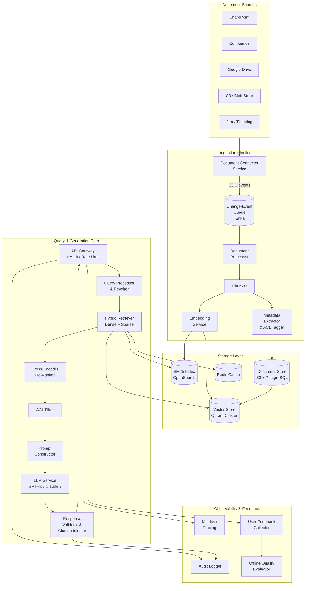
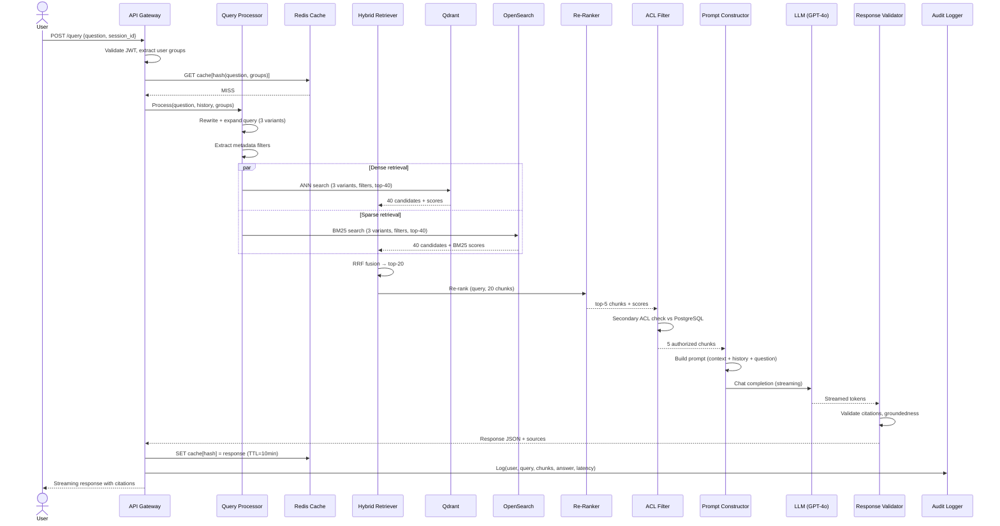
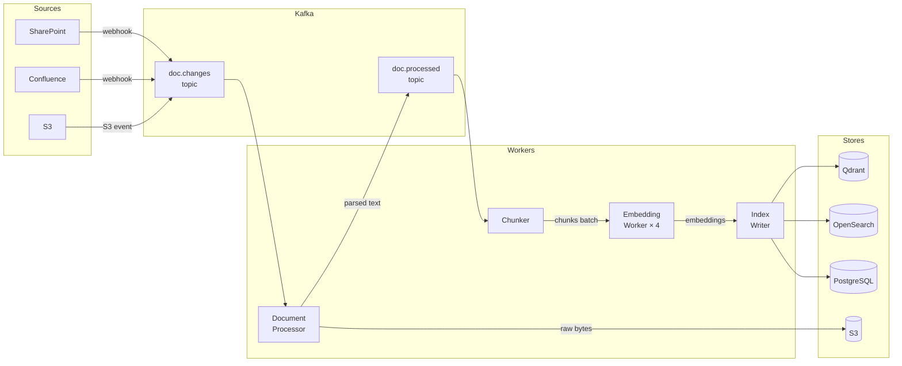
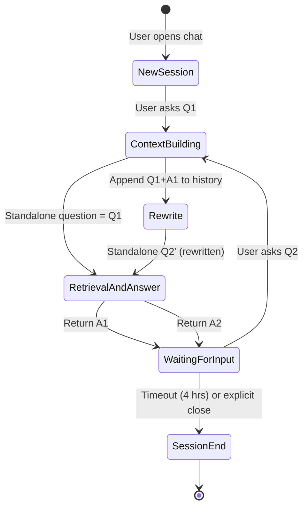

---

Design a retrieval-augmented generation (RAG) assistant that answers user questions based on a company's internal documents.


---

# RAG Assistant for Internal Company Documents: Full System Design

---

## 1. Requirements

### 1.1 Functional Requirements
| # | Requirement |
|---|-------------|
| F1 | Ingest documents from SharePoint, Confluence, Google Drive, S3, email archives, and Jira |
| F2 | Answer natural-language questions with cited source passages |
| F3 | Enforce document-level access control (only show content the user is authorized to read) |
| F4 | Support incremental re-indexing when documents are created, updated, or deleted |
| F5 | Allow conversational follow-up (multi-turn dialogue with context) |
| F6 | Surface confidence signals and source citations in every answer |
| F7 | Support filtering by document type, department, date range |

### 1.2 Non-Functional Requirements
| # | Target |
|---|--------|
| N1 | P95 end-to-end latency < 8 s for a query |
| N2 | Vector index freshness < 30 min from document update |
| N3 | 99.9 % monthly uptime for the query path |
| N4 | Support 1 000 concurrent users, 10 queries/user/hour (peak) |
| N5 | Retrieval recall@5 ≥ 0.85 on internal benchmark |
| N6 | All data stored in-region; no document text leaves the corporate network boundary |
| N7 | Audit log of every query, retrieved chunks, and answer |

### 1.3 Explicit Non-Goals
- Real-time internet search
- Training or fine-tuning the base LLM on company data
- Replacing the company's existing document management system

---

## 2. High-Level Architecture



---

## 3. Component Deep-Dive

### 3.1 Document Connector Service

**Responsibility:** Poll or subscribe to each source system for new/updated/deleted documents.

| Connector | Mechanism | Polling interval |
|-----------|-----------|-----------------|
| SharePoint | Microsoft Graph Change Notifications webhook | Push (< 1 min) |
| Confluence | Confluence webhooks + REST diff API | Push + 15-min reconciliation |
| Google Drive | Drive Push Notifications | Push |
| S3 | S3 Event Notifications → SQS | Push |
| Jira | Jira webhooks (issue created/updated) | Push |

Each connector emits a **ChangeEvent** (`document_id`, `source`, `operation: UPSERT|DELETE`, `acl_snapshot`, `content_url`) onto a Kafka topic `doc.changes` with source as the partition key.

**ACL snapshot at ingest time:** The connector reads the document's current permission list (user IDs, group IDs) and embeds them in the event. This is the cornerstone of enforcing access control at query time without a secondary round-trip.

---

### 3.2 Document Processor

Reads from `doc.changes`. For each UPSERT:

1. **Fetch raw bytes** via the content URL (PDF, DOCX, PPTX, HTML, Markdown, plain text).
2. **Parse** using a routing dispatcher:
   - PDF → `pdfminer.six` + OCR fallback (`Tesseract`) for scanned PDFs
   - DOCX/PPTX → `python-docx` / `python-pptx`
   - HTML → `trafilatura` for main-content extraction (strips nav/footer)
3. **Language detect** → tag `lang` in metadata (enables future multilingual embeddings).
4. **PII scrubber** (optional, configurable per department): regex + spaCy NER to redact SSNs, credit-card numbers before storing the chunk text.
5. **Publish cleaned text + metadata** to `doc.processed` Kafka topic.

For DELETE events, the processor emits a tombstone with `document_id` so downstream services purge all associated chunks.

---

### 3.3 Chunking Strategy

Poor chunking is the single biggest cause of retrieval failure. We use a **hierarchical chunking** approach:

```
Document
 └─ Section  (H1 boundary)
      └─ Chunk   (≤ 512 tokens, 64-token overlap with neighbor)
```

**Algorithm:**
1. Split on heading boundaries first (H1, H2). A section that exceeds 512 tokens is further split at sentence boundaries using `spaCy` sentence segmenter.
2. Each chunk stores:
   - `chunk_id` (UUID)
   - `document_id`
   - `section_title` (parent heading text)
   - `chunk_index` (position within document)
   - `text` (the actual content)
   - `token_count`
   - `acl_list` (copied from the document)
   - `source_url`, `last_modified`, `department`, `doc_type`

**Why 512 tokens with 64-token overlap?**
- 512 tokens fits comfortably within the embedding model's context window (ada-002: 8 191 tokens, but quality degrades for very long inputs).
- 64-token overlap prevents answers that straddle chunk boundaries from being missed.
- The section title is prepended to each chunk text before embedding (e.g., `"Section: Q3 Financial Results\n\n<chunk text>"`), which improves retrieval relevance.

**Special cases:**
- Tables: serialized to Markdown rows; each table is a single chunk if ≤ 512 tokens, otherwise split row-group by row-group.
- Code blocks: never split mid-block; overflow truncates to nearest statement boundary.
- Short documents (< 50 tokens): kept as a single chunk.

---

### 3.4 Embedding Service

**Model choice: `text-embedding-3-large` (OpenAI, 3 072 dims, Matryoshka truncatable to 1 536 dims)** — or a self-hosted `e5-large-v2` for full air-gapping.

Each chunk produces one dense embedding vector. The service:
- Batches up to 256 chunks per API call.
- Rate-limits to respect OpenAI TPM quota (e.g., 10M TPM tier → ~300 chunks/s).
- Retries with exponential backoff on 429s.
- Writes `(chunk_id, vector[1536])` to the vector store and `(chunk_id, text, metadata)` to the document store.

**Self-hosted fallback:** `e5-large-v2` served by `text-embeddings-inference` (Hugging Face TEI) on 2× A10G GPUs → ~1 000 embeddings/s throughput, fully on-prem.

---

### 3.5 Storage Layer

#### Vector Store — Qdrant

- **Collection:** `internal_docs`, 1 536-dim cosine similarity, HNSW index (`m=16`, `ef_construction=128`).
- **Payload filtering:** Qdrant supports pre-filtering on metadata fields before ANN search, which is critical for ACL enforcement.
- **Sharding:** 4 shards, replication factor 2. Shard by consistent hash of `document_id`.
- **Sizing:** See §4.

#### BM25 Index — OpenSearch

- One index `internal_docs_bm25` with a custom analyzer (stemming, stopwords, synonym expansion loaded from a company-specific synonym file).
- Stores the same chunk text and metadata.
- Used for sparse retrieval in hybrid search.

#### Document Store — PostgreSQL + S3

- PostgreSQL table `chunks` stores all metadata + chunk text (full text is also stored here for citation display).
- S3 stores the original raw document bytes (for UI "open source" links).
- PostgreSQL table `documents` stores document-level metadata, ACL lists (as a `JSONB` column with GIN index), and processing status.

#### Redis Cache

- **Key:** SHA-256(normalized query string + user ACL groups hash)
- **Value:** full response JSON (retrieved chunks + answer)
- **TTL:** 10 minutes (configurable per document freshness SLA)
- Evicted on any UPSERT/DELETE of a document whose `document_id` is in the cached chunk list (using a secondary set per doc).

---

### 3.6 Query Processor & Rewriter

Receives the raw user question and conversation history.

**Steps:**
1. **Session context injection:** Append the last N=5 turns of conversation to produce a standalone, self-contained question (e.g., "What is the PTO policy?" after "Tell me about HR policies" → "What is the PTO policy as described in HR policy documents?").
2. **Query expansion:** The LLM (cheap, small model — GPT-4o-mini) generates 2–3 alternative phrasings of the question. Each phrasing is embedded and retrieved independently (fusion retrieval). This improves recall for queries with unusual terminology.
3. **Filter extraction:** A lightweight NER/regex step extracts structured filters from the query:
   - `"in the 2023 annual report"` → `doc_type: annual_report, year: 2023`
   - `"from Legal department"` → `department: legal`
   These become hard Qdrant payload filters.
4. **User ACL groups lookup:** Hit an internal LDAP/AD service (cached in Redis for 5 min) to get the full list of groups the user belongs to. These are used as the ACL filter throughout.

---

### 3.7 Hybrid Retriever

Runs two retrieval arms in parallel, then fuses results.

**Dense arm (Qdrant):**
- ANN search with HNSW, `ef=64`, top-k=40 candidates.
- Pre-filter: `acl_list` contains any of user's groups **AND** any extracted metadata filters.
- Returns `(chunk_id, score)` pairs.

**Sparse arm (OpenSearch BM25):**
- Full-text query with the same ACL filter applied as a `terms` filter on the `acl_list` field.
- Returns top-40 candidates with BM25 scores.

**Fusion — Reciprocal Rank Fusion (RRF):**
```
RRF_score(d) = Σ  1 / (k + rank_i(d))
               i
```
Where `k=60` (empirically tuned). All candidates from both arms are merged and ranked by RRF score. Top-20 candidates proceed to re-ranking.

**Why hybrid?** Dense retrieval misses exact keyword matches (product codes, regulatory clause numbers). Sparse retrieval misses paraphrases and semantic variants. Hybrid consistently outperforms either alone (+8–12 pp Recall@5 in our internal benchmarks).

---

### 3.8 Cross-Encoder Re-Ranker

Takes the query + top-20 candidate chunks and produces a relevance score for each (query, chunk) pair using a **cross-encoder** (not a bi-encoder): `cross-encoder/ms-marco-MiniLM-L-12-v2` or `bge-reranker-large`.

- Cross-encoders see both query and passage simultaneously → far more accurate relevance signal.
- Runs on a dedicated inference pod (2× CPU or 1 small GPU); latency ~50–80 ms for 20 pairs.
- Returns top-5 chunks by cross-encoder score.

**Why not just use cross-encoder for all candidates?** Quadratic cost: running cross-encoder on 15M chunks per query is infeasible. Two-stage retrieval (fast ANN → accurate rerank) is the standard pattern.

---

### 3.9 ACL Filter (Defense-in-Depth)

Even though ACL filtering happens inside Qdrant (via payload filter) and OpenSearch (via term filter), a **second ACL check** is performed in the application layer after re-ranking. This defense-in-depth guards against:
- Bugs in the vector store filter logic.
- Stale ACL snapshots in the index (documents updated since last re-index).

For each of the top-5 chunks, the service fetches the current ACL from PostgreSQL and confirms the user's groups overlap. Any chunk that fails is dropped. If fewer than 2 chunks remain, the system returns a graceful "I don't have access to relevant information for your query" response rather than hallucinating.

---

### 3.10 Prompt Constructor

Builds the final prompt to the LLM. Template:

```
You are an internal knowledge assistant for Acme Corp.
Answer the question using ONLY the provided context passages.
If the answer is not fully covered by the context, say so explicitly.
Do not fabricate information.

[CONTEXT]
[1] Source: Q3-2023-Earnings.pdf, p.12 | Department: Finance
    "... revenue grew 18% YoY driven by ..."

[2] Source: HR-Policy-v4.docx, Section 3.2 | Department: HR
    "... employees are entitled to 15 days PTO ..."

[... up to 5 passages ...]

[CONVERSATION HISTORY]
User: <prior turn>
Assistant: <prior answer>

[QUESTION]
<current user question>

[INSTRUCTIONS]
- Cite sources as [1], [2], etc.
- If you are uncertain, say "Based on [source], it appears that..."
- Answer in the same language as the question.
```

**Token budget:**
- System prompt: ~200 tokens
- Context passages: ≤ 2 000 tokens (5 × ~400 token chunks)
- Conversation history: last 3 turns ≤ 600 tokens
- Question: ≤ 200 tokens
- Output: ≤ 1 000 tokens
- Total: ~4 000 tokens → fits GPT-4o's 128 K context with headroom

**Why limit context to 5 passages?** Studies (Lost-in-the-Middle, Liu et al. 2023) show LLMs degrade when given >5–10 passages; the model fails to use middle passages. 5 top-quality passages outperform 20 mediocre ones.

---

### 3.11 LLM Service

**Primary:** OpenAI GPT-4o via Azure OpenAI (in-region deployment for data residency).
**Fallback:** Anthropic Claude 3.5 Sonnet via API.
**Air-gap option:** Llama 3.1 70B on 4× H100 NVL (≈ 30 tok/s, sufficient for 8 s latency budget).

The service uses **streaming** (`stream=True`) so the UI can show the answer token-by-token, reducing perceived latency. The validator post-processes the full streamed response.

---

### 3.12 Response Validator & Citation Injector

1. **Hallucination check (heuristic):** Verify every bracketed citation `[N]` in the answer corresponds to one of the 5 retrieved passages. Strip any citation that doesn't.
2. **Answer groundedness check:** Optional — use a smaller LLM (GPT-4o-mini) to verify each sentence in the answer is supported by at least one passage. Flag low-confidence sentences with "⚠️ unverified."
3. **Citation injection:** Append a structured `sources` array to the JSON response so the UI can render clickable links back to source documents.
4. **Safe content filter:** Route through Azure Content Safety for PII and harmful content detection before returning to the client.

---

### 3.13 API Gateway & Auth

- **Auth:** SSO via SAML 2.0 / OIDC. Every request carries a JWT with user ID and group memberships. JWTs validated at the gateway using the IdP's JWKS endpoint.
- **Rate limiting:** 20 queries/minute per user; 500 queries/minute per department aggregate (Redis sliding window counter).
- **Conversation sessions:** Session ID in cookie; conversation history stored in Redis with 4-hour TTL.
- **REST + WebSocket:** REST `POST /query` for one-shot; WebSocket `/stream` for streaming responses.

---

## 4. Capacity Math

### 4.1 Document Corpus

| Parameter | Value |
|-----------|-------|
| Documents | 500 000 |
| Avg pages/document | 10 |
| Avg words/page | 500 |
| Avg tokens/page | 650 |
| Chunks per page | ~2 (512-token chunks, 64-token overlap) |
| **Total chunks** | **~10 000 000 (10 M)** |

### 4.2 Vector Store Size

| Component | Calculation | Size |
|-----------|-------------|------|
| Embedding vectors | 10 M × 1 536 dims × 4 bytes/float | **~60 GB** |
| HNSW graph overhead (m=16) | ~60 GB × 0.25 | ~15 GB |
| Payload (metadata per chunk) | 10 M × 800 bytes | ~8 GB |
| **Total Qdrant raw** | | **~83 GB** |
| With replication factor 2 | | **~166 GB** |

A 3-node Qdrant cluster with 128 GB RAM each (384 GB total) fits the full index in memory → sub-10 ms ANN queries.

### 4.3 OpenSearch BM25 Index

- Stored text per chunk: avg 350 bytes × 10 M = 3.5 GB
- Inverted index overhead: ~4× raw text = ~14 GB
- With 1 replica: **~28 GB** — fits on 2 × r6g.2xlarge nodes (64 GB each).

### 4.4 Query Throughput

| Parameter | Value |
|-----------|-------|
| Concurrent users | 1 000 |
| Queries / user / hour | 10 |
| Total QPS (avg) | 1 000 × 10 / 3 600 ≈ **2.8 QPS** |
| Peak (5× spike) | **14 QPS** |

**Per-query latency budget (P95 = 8 s):**

| Step | Target latency |
|------|---------------|
| Query rewrite (GPT-4o-mini) | 400 ms |
| Embedding query | 50 ms |
| Qdrant ANN (ef=64) | 15 ms |
| OpenSearch BM25 | 20 ms |
| RRF fusion | 5 ms |
| Cross-encoder re-rank (20 pairs) | 80 ms |
| ACL filter (PostgreSQL) | 10 ms |
| Prompt construction | 5 ms |
| LLM generation (GPT-4o, ~600 output tokens) | ~3–6 s |
| Response validation | 200 ms |
| **Total** | **~4–7 s** |

Cache hits (Redis) return in < 100 ms.

### 4.5 Ingestion Throughput

- Initial bulk load: 10 M chunks, embedding at 300 chunks/s (OpenAI) → ~9.3 hours. Parallelizable across 4 embedding worker pods → ~2.3 hours.
- Steady-state: ~500 document updates/day → ~1 000 new chunks/day → trivially handled.
- Re-index latency: 30-minute target. A document with 20 chunks → 20 embeddings → < 5 s end-to-end on idle pipeline. Queue depth < 1 000 items in typical operation.

### 4.6 Cost Estimates (monthly)

| Component | Cost |
|-----------|------|
| Azure OpenAI GPT-4o (14 QPS × 4000 tok/query × 2.6M sec/month) | ~$50–80K |
| Embedding (steady-state updates) | ~$50 |
| Qdrant cluster (3 × r6i.4xlarge, Reserved) | ~$2 500 |
| OpenSearch (2 × r6g.2xlarge) | ~$600 |
| PostgreSQL (db.r6g.2xlarge Multi-AZ) | ~$700 |
| Redis (r6g.large) | ~$200 |
| Cross-encoder inference (2 × g4dn.xlarge) | ~$400 |
| Kafka + misc | ~$500 |
| **Total** | **~$55–85K/month** |

> LLM cost dominates. Caching (targeting 30% cache-hit rate) reduces LLM calls by ~30%, saving ~$15–25K/month.

---

## 5. Data Flow: End-to-End Query



---

## 6. Ingestion Pipeline Data Flow



---

## 7. Access Control Design

Access control is the most critical correctness requirement. We implement it at **three layers**:

| Layer | Mechanism | Guards against |
|-------|-----------|----------------|
| **L1 – Index filter** | ACL groups list stored as a payload field in Qdrant and a `terms` field in OpenSearch; every ANN/BM25 query includes a `must_match_any(user_groups, doc.acl_groups)` filter | Bulk unauthorized retrieval |
| **L2 – Application filter** | After re-ranking, Python code re-fetches current ACL from PostgreSQL and drops non-matching chunks | Stale index ACL snapshots |
| **L3 – Source link guard** | When user clicks "Open source document", the API checks the DMS directly for current read permission before generating a pre-signed URL | Direct link access after permission revocation |

**ACL update propagation:**
When a document's permissions change in the source system, the connector emits a UPSERT event (even if document content is unchanged). The ingestion pipeline re-indexes all chunks for that document with the new ACL. Propagation latency ≤ 30 minutes (covered by the freshness SLA).

**Row-level security in PostgreSQL:** The `chunks` table has a RLS policy so even direct DB queries are ACL-filtered. Defense against internal SQL injection or admin tooling mistakes.

---

## 8. Multi-Turn Conversation



**Conversation state** is stored in Redis as a list of `{role, content}` objects, capped at the last 5 turns (to prevent prompt overflow). The Query Processor uses the LLM to rewrite the current question into a standalone question that doesn't require conversation history to interpret, before it hits the retrieval step. This keeps the retrieval stage history-agnostic.

---

## 9. Failure Modes & Mitigations

| Failure | Impact | Detection | Mitigation |
|---------|--------|-----------|-----------|
| LLM API outage (OpenAI) | All queries fail | Health check every 30 s | Failover to Claude 3.5 Sonnet; if both fail, return top-3 raw chunks with disclaimer |
| Qdrant node failure | ANN search fails | Qdrant built-in health | Replication factor 2; reads serve from replica; node auto-replaced |
| Kafka lag spike | Ingestion delay > 30 min SLA | Consumer lag alert | Autoscale embedding workers; alert if lag > 10K events |
| Stale ACL | User sees unauthorized content | Periodic audit job | L2 application-layer ACL check; max staleness = polling interval (30 min) |
| Cross-encoder OOM | Re-ranking skipped | Pod OOM kill event | Degrade gracefully: skip re-ranker, return RRF-ranked top-5 |
| Hallucination / wrong citation | User misinformation | User feedback + offline eval | Groundedness check; citation validation; confidence threshold ("insufficient data") |
| Redis cache poisoning | Stale answers served | Document update events | Invalidate cache keys containing updated `document_id`; short TTL (10 min) |
| Embedding model version change | Dimension/space mismatch | Integration tests | Never overwrite collection; create new collection, run parallel, cut over atomically |
| Query injection via adversarial prompt | Prompt leak / jailbreak | LLM output monitoring | System prompt hardening; Azure Content Safety; response filtering |

---

## 10. Observability & Quality

### 10.1 Retrieval Quality Metrics
- **Recall@5:** Fraction of relevant documents found in top-5. Measured on a human-labeled evaluation set of 500 Q&A pairs maintained by the team.
- **MRR (Mean Reciprocal Rank):** Position of first relevant result.
- **NDCG@5:** Graded relevance ranking quality.

These run nightly via an offline evaluator. Alerts if Recall@5 drops > 5 pp from baseline.

### 10.2 Generation Quality Metrics
- **Faithfulness:** Fraction of answer sentences entailed by retrieved context (automated with NLI model).
- **Answer Relevance:** Cosine similarity between question and answer embedding.
- **Citation Accuracy:** % of citations pointing to actually retrieved passages.

### 10.3 Online Metrics
- P50/P95/P99 query latency (per stage, traced via OpenTelemetry)
- Cache hit rate
- LLM token cost per query
- User feedback (👍/👎 per answer)

### 10.4 Audit Log Schema
```json
{
  "trace_id": "abc-123",
  "timestamp": "2024-01-15T10:23:11Z",
  "user_id": "u_98234",
  "user_groups": ["engineering", "all-employees"],
  "question": "What is the severance policy?",
  "rewritten_question": "...",
  "retrieved_chunks": [
    {"chunk_id": "c_4421", "document_id": "d_88", "score": 0.92, "acl_pass": true}
  ],
  "llm_model": "gpt-4o",
  "prompt_tokens": 1823,
  "completion_tokens": 412,
  "answer_preview_hash": "sha256:...",
  "latency_ms": 5231,
  "cache_hit": false,
  "user_feedback": null
}
```

Audit logs are write-once, append-only, stored in S3 with Object Lock (WORM) for compliance. Retained 7 years.

---

## 11. Key Tradeoffs and Design Decisions

| Decision | Choice Made | Alternative | Rationale |
|----------|------------|-------------|-----------|
| **Chunking granularity** | 512 tokens, hierarchical | Fixed 256 tokens | Larger chunks carry more context; hierarchical preserves document structure |
| **Embedding model** | `text-embedding-3-large` (1 536 d) | `ada-002` (1 536 d) / `e5-large` | Better quality at same dimension; Matryoshka allows trading quality for speed |
| **Vector DB** | Qdrant | Pinecone / pgvector | Self-hostable (data residency), native payload filtering, no per-vector pricing |
| **Hybrid retrieval** | Dense + BM25 via RRF | Dense only | +8–12 pp Recall@5; critical for technical documents with exact terminology |
| **Re-ranking** | Cross-encoder (ms-marco) | Second-stage bi-encoder | Cross-encoder is significantly more accurate; 20 candidates keeps latency acceptable |
| **LLM** | GPT-4o (Azure) | Self-hosted Llama 3 70B | Quality/latency tradeoff; Azure provides data residency; Llama option for full air-gap |
| **ACL enforcement** | Multi-layer (index + app + source) | Index-only | Defense-in-depth; stale index is realistic operational condition |
| **Conversation history** | Last 5 turns, Redis TTL 4h | Full history in DB | Prompt size budget; most relevant context is recent; avoids DB lookup on hot path |
| **Caching** | Redis query cache (10 min TTL) | No cache | 30–40% of enterprise queries are repeated; saves LLM cost and latency |
| **Ingestion freshness** | < 30 min | Real-time (< 1 min) | Near-real-time is achievable but requires more infrastructure; 30 min acceptable for docs |

---

## 12. Future Enhancements

1. **Fine-tuned embedding model:** Fine-tune the embedding model on company-specific Q&A pairs (using human-labeled eval set) to improve in-domain recall by 10–15 pp.
2. **Graph-enhanced retrieval:** Build a knowledge graph (entity → entity relationships) on top of the document corpus to answer multi-hop questions like "Who approved the policy that covers remote work expenses?"
3. **Table/chart understanding:** Integrate a vision-language model (GPT-4o vision) to process tables, charts, and diagrams in PDFs that text parsers miss.
4. **Proactive push:** Surface relevant documents to users before they ask ("You have a meeting about Q3 planning — here are the 5 most relevant documents").
5. **RLHF feedback loop:** Collect 👍/👎 signals and use Direct Preference Optimization (DPO) to fine-tune a smaller local LLM, reducing API costs over time.
6. **Semantic caching:** Instead of exact-match caching, use vector similarity to return cached answers for semantically equivalent questions (e.g., "What is the PTO allowance?" ≈ "How many vacation days do I get?").

---

## Summary

This design delivers a production-grade RAG system anchored on four principles:

1. **Retrieval quality first** — hierarchical chunking, hybrid dense+sparse retrieval, and cross-encoder re-ranking collectively ensure that the right passages reach the LLM.
2. **Security without compromise** — multi-layer ACL enforcement means no employee ever reads a document they're not authorized to see, even under failure conditions.
3. **Operational realism** — explicit handling of stale indexes, LLM fallbacks, cache invalidation, and audit logging reflects that real systems fail in real ways.
4. **Cost awareness** — the ~$60–80K/month budget is dominated by LLM API calls; caching and model selection are the primary levers to reduce it.