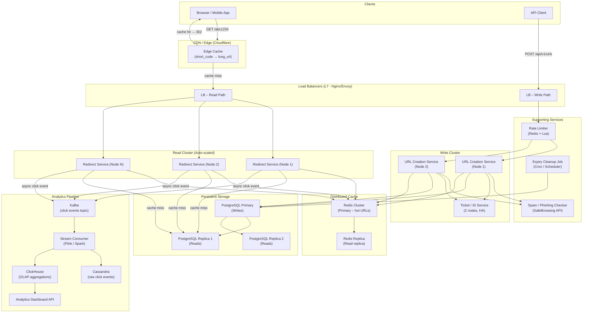

---

Design a URL shortener like bit.ly.


---

# URL Shortener System Design (bit.ly Scale)

---

## 1. Requirements

### Functional
- Shorten a long URL → unique short code (e.g., `https://sho.rt/aB3kZ9`)
- Redirect short URL → original URL (HTTP 301 or 302)
- Optional custom aliases (`https://sho.rt/my-campaign`)
- Optional expiry date per link
- Analytics: click count, referrer, geo, device, timestamp

### Non-Functional
- **Availability:** 99.99% (< 53 min/year downtime); reads are more critical than writes
- **Latency:** Redirect p99 < 10 ms; creation p99 < 100 ms
- **Durability:** No link must silently disappear
- **Security:** No open redirect abuse, rate-limiting, spam detection

---

## 2. Capacity Estimation

| Parameter | Value |
|---|---|
| New URLs created / day | 100 M |
| Redirect requests / day | 10 B (100:1 read:write ratio) |
| Write RPS | ~1,160 |
| Read RPS | ~115,700 |
| Peak read RPS (3×) | ~350,000 |
| Short code length | 7 chars (Base62) |
| 7-char Base62 space | 62^7 ≈ **3.5 trillion** codes |
| Avg URL size stored | 500 bytes |
| Metadata per record | ~200 bytes |
| New data/day | 100 M × 700 B ≈ **70 GB/day** |
| 5-year storage | 70 GB × 1,825 ≈ **128 TB** |
| Analytics events/day | 10 B × 200 B ≈ **2 TB/day** |

**Cache sizing:** 80/20 rule — 20% of URLs get 80% of traffic.  
Hot set = 0.2 × 100 M daily URLs × 700 B ≈ **14 GB** per cache node (easily fits in RAM).

---

## 3. Short Code Generation — Deep Dive

### Option A: Hash-based (MD5/SHA-256 + truncate)
- Hash(long_url) → take first 7 Base62 chars
- **Problem:** collisions when different long URLs hash to same prefix; must check DB and retry with salts

### Option B: Counter + Base62 encode ✅ (chosen for primary)
- Central auto-increment counter (via distributed ID service)
- Encode integer → Base62 string, zero-padded to 7 chars
- No collision by design; predictable but non-guessable if offset is random

### Option C: Random token
- Cryptographically random 7-char Base62 string
- Must check uniqueness in DB (probabilistic collision 1/3.5T — acceptable)

**Decision:** Use a **distributed counter** (Snowflake-style or Redis INCR) for system-generated codes; random token with DB uniqueness check for custom aliases.

### Counter Service Detail
- Two ticket servers (following Flickr's approach) each pre-allocate ranges of 10,000 IDs
- Ticket Server A: odd ranges; Ticket Server B: even ranges → avoids single point of failure
- Each app server holds a local batch of 1,000 IDs before refetching

---

## 4. API Design

### REST API

```
POST /api/v1/urls
Body: {
  "long_url": "https://example.com/very/long/path?q=1",
  "custom_alias": "my-code",          // optional
  "expires_at": "2025-12-31T23:59:59Z", // optional
  "tags": ["campaign-A"]              // optional
}
Response 201: {
  "short_url": "https://sho.rt/aB3kZ9",
  "short_code": "aB3kZ9",
  "long_url": "...",
  "expires_at": "..."
}

GET /{short_code}                     // public redirect endpoint
Response 302: Location: <long_url>
             X-Analytics-Id: <uuid>

GET /api/v1/urls/{short_code}         // metadata lookup
GET /api/v1/urls/{short_code}/stats   // analytics
DELETE /api/v1/urls/{short_code}      // soft delete
```

**301 vs 302:** 
- 301 (permanent) → browser caches, reduces server load, but analytics blind after first click
- 302 (temporary/found) → every redirect hits servers, full analytics
- **Decision: 302** for analytics accuracy; use aggressive CDN/cache layer to absorb load

---

## 5. Data Model

### URL Table (PostgreSQL, sharded by `short_code`)

```sql
CREATE TABLE urls (
  short_code     VARCHAR(16)   PRIMARY KEY,
  long_url       TEXT          NOT NULL,
  user_id        BIGINT,
  created_at     TIMESTAMPTZ   NOT NULL DEFAULT now(),
  expires_at     TIMESTAMPTZ,
  is_active      BOOLEAN       NOT NULL DEFAULT TRUE,
  click_count    BIGINT        NOT NULL DEFAULT 0,  -- approximate, updated async
  title          VARCHAR(512),  -- scraped page title
  checksum       CHAR(8)        -- first 8 hex of SHA256(long_url) for dedup
);

CREATE INDEX idx_checksum ON urls(checksum);  -- dedup lookup
CREATE INDEX idx_user_id  ON urls(user_id);
```

### Analytics Events (Kafka → Cassandra / ClickHouse)

```
clicks (
  short_code    TEXT,
  ts            TIMESTAMP,
  ip_hash       TEXT,   -- hashed for privacy
  country       TEXT,
  device_type   TEXT,   -- mobile/desktop/bot
  referrer      TEXT,
  user_agent    TEXT
)
PRIMARY KEY ((short_code), ts)  -- partition by code, cluster by time
```

### Rate Limit / User Table
```sql
users (id, api_key, plan, daily_quota, created_at)
rate_limit_counters → Redis (sliding window per api_key)
```

---

## 6. System Architecture



---

## 7. Read Path (Critical — 350K RPS)

```
Browser → CDN Edge
  └─ HIT  → 302 redirect (< 1ms, no server hit)
  └─ MISS → Redirect Service
               └─ Redis Cluster lookup (key: short_code)
                    └─ HIT  → 302 + async Kafka event + refresh TTL
                    └─ MISS → PostgreSQL Replica
                                └─ found  → populate Redis (TTL 24h) → 302
                                └─ not found / expired → 404
```

**Cache key:** `url:{short_code}` → JSON blob `{long_url, expires_at}`  
**CDN TTL:** 60 seconds (balance freshness vs load)  
**Redis TTL:** 24 hours (LRU eviction policy for cold URLs)  
**Expected cache hit rate:** ~95% (most traffic is to recently-created popular links)

---

## 8. Write Path

```
Client → Rate Limiter (Redis sliding window, 100 req/min free tier)
       → Spam/Phishing Check (Google SafeBrowsing async, 200ms timeout)
       → Dedup check: SELECT by checksum(long_url) → return existing if found
       → Ticket Service: get next ID batch → encode to Base62
       → INSERT INTO urls (PostgreSQL primary)
       → SET Redis key with 24h TTL
       → Invalidate CDN edge cache for custom aliases (if overwriting)
       → Return short_url to client
```

---

## 9. Analytics (Async, Eventually Consistent)

- **Ingest:** Redirect service fires a Kafka message (non-blocking) for every click
  ```json
  {"short_code":"aB3kZ9","ts":1700000000,"ip":"1.2.3.4","ua":"...","ref":"google.com"}
  ```
- **Stream Processing (Flink):**
  - IP → GeoIP lookup → country/city
  - UA parsing → device/OS/browser
  - Bot detection (filter known crawler UAs)
  - Enrich + write to Cassandra (raw) and ClickHouse (aggregated)
- **Aggregations stored in ClickHouse:**
  - clicks per hour/day/week per short_code
  - top referrers, top countries, device breakdown
- **Click counter on URL record:** Updated every 5 minutes via batch job (Cassandra aggregation → PostgreSQL UPDATE), not on every redirect (avoids hot-row lock contention)

---

## 10. Scaling Strategy

| Layer | Strategy |
|---|---|
| **Redirect Service** | Stateless; horizontal auto-scale on CPU/RPS |
| **Redis** | Cluster mode with 6 nodes (3 primary + 3 replica), consistent hashing |
| **PostgreSQL** | Shard by `short_code % N_shards`; each shard has 1 primary + 2 replicas; use Citus or Vitess |
| **Write Service** | Stateless; scaled to ~10 nodes for 1,160 WPS with headroom |
| **Kafka** | 32 partitions on click topic; 3 broker cluster; 7-day retention |
| **CDN** | Cloudflare or Fastly; PoPs in every region absorb global read traffic |

---

## 11. Database Sharding Detail

Short codes are already pseudo-random (Base62 of counter), so **hash-based sharding** distributes evenly:

```
shard_id = crc32(short_code) % NUM_SHARDS
```

- Start with 8 shards (each ~16 TB capacity headroom)
- Use consistent hashing ring so adding shards = minimal reshuffling
- Cross-shard queries (e.g., "all links for user X") → routed by application via user_id → shard mapping table stored in a small coordination DB

---

## 12. Failure Modes & Mitigations

| Failure | Impact | Mitigation |
|---|---|---|
| Redis node down | Cache miss storm → DB overload | Redis Cluster auto-failover (< 10s); circuit breaker in redirect service; DB read replicas behind connection pool |
| PostgreSQL primary down | Write failures | Automatic failover via Patroni (< 30s); writes queue in Redis list during failover |
| Ticket service down | Can't create new short URLs | 2 ticket servers in different AZs; app falls back to random token generation |
| CDN outage | Full traffic hits origin | Auto-failover to secondary CDN provider; origin servers auto-scale |
| Kafka lag spike | Analytics delayed | Auto-scale Flink consumers; clicks are still stored; analytics are eventually consistent by design |
| Hot URL (viral link) | Single cache key hammered | CDN absorbs most; Redis single key can handle ~100K RPS; add local in-process LRU cache (Caffeine) in redirect service for top-N URLs |
| Spam/phishing link created | Reputation damage | SafeBrowsing API on write; periodic async re-scan of existing URLs; takedown API for abuse reports |
| Short code enumeration | Privacy leak | Codes are Base62 of large counter (not sequential starting from 0); initial offset is randomized at 1B |
| Clock skew in expiry | Links expire early/late | Use UTC everywhere; expiry checked server-side against DB, not client |

---

## 13. Custom Alias Handling

```python
def create_custom_alias(alias: str, long_url: str) -> Result:
    validate_regex(alias, r'^[a-zA-Z0-9_-]{1,50}$')
    if alias in RESERVED_WORDS:  # 'api', 'admin', 'health', etc.
        raise ReservedAliasError
    
    # Optimistic insert with unique constraint on short_code
    try:
        db.execute("INSERT INTO urls(short_code, long_url, ...) VALUES (%s, %s, ...)",
                   alias, long_url)
    except UniqueViolation:
        raise AliasAlreadyTakenError
```

---

## 14. Security Considerations

- **HTTPS only** — HTTP requests redirect to HTTPS before any lookup
- **Rate limiting:** Sliding window in Redis per IP and per API key
  - Free: 100 creates/min, 10K redirects/min
  - Paid: configurable
- **URL validation:** Reject malformed URLs; check against SafeBrowsing
- **SSRF prevention:** Validate that long_url doesn't point to internal IP ranges (10.x, 192.168.x, 169.254.x)
- **API authentication:** JWT or API key in `Authorization` header for write endpoints
- **Audit log:** Every create/delete event stored in immutable append-only log

---

## 15. Monitoring & SLOs

| Metric | SLO | Alert threshold |
|---|---|---|
| Redirect latency p99 | < 10 ms | > 20 ms |
| Redirect availability | 99.99% | Error rate > 0.01% |
| Cache hit rate | > 90% | < 85% |
| URL creation p99 | < 100 ms | > 200 ms |
| Kafka consumer lag | < 10K events | > 100K events |

**Tooling:** Prometheus + Grafana for metrics; Jaeger for distributed tracing; PagerDuty for alerting; ELK stack for logs.

---

## 16. Summary of Key Decisions

| Decision | Choice | Rationale |
|---|---|---|
| Redirect response code | 302 | Full analytics at cost of extra server hop (mitigated by CDN) |
| Code generation | Distributed counter → Base62 | No collision, compact, non-sequential appearance |
| Primary DB | PostgreSQL (sharded) | ACID guarantees, mature ecosystem, good for lookups by PK |
| Cache | Redis Cluster | Sub-millisecond lookup, LRU eviction, cluster HA |
| Analytics store | Kafka + Cassandra + ClickHouse | Decouple ingest from query; time-series friendly; OLAP at scale |
| Sharding strategy | Hash on short_code | Uniform distribution, predictable routing |