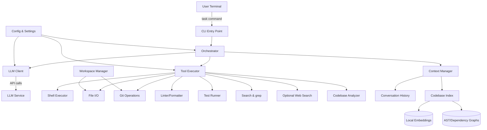
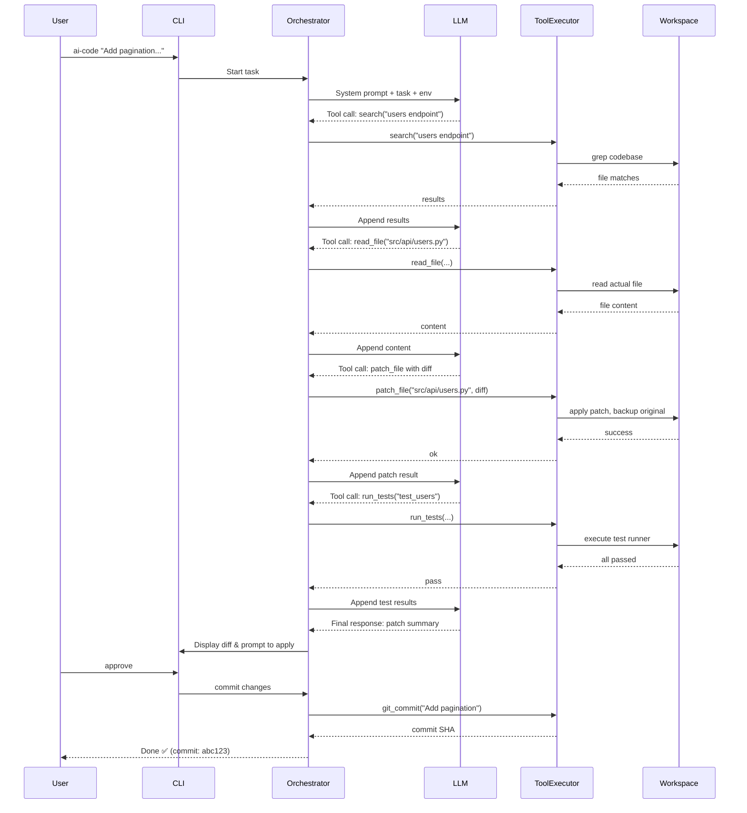

---

Design a terminal-based AI coding agent that can complete software engineering tasks.

---

# Terminal-Based AI Coding Agent: System Design

## 1. Overview
The system is a terminal-based autonomous agent that accepts natural language software engineering tasks, interacts with the local codebase, and produces concrete changes (patches, commits, test results). It leverages a large language model (LLM) for planning, reasoning, and code generation, while providing controlled access to the file system, shell, version control, and development tools. The design prioritizes safety, cost-efficiency, reliability, and an intuitive terminal UX.

## 2. Architecture
The agent is implemented as a single process with several internal modules. It runs inside the target project directory, with the ability to spawn subprocesses (shell commands) and read/write files. All tool use is orchestrated through the LLM in a ReAct-like loop.

## 3. Component Details

### 3.1 CLI Entry Point
- **Responsibility**: Parse user task and flags, initialize environment, display progress.
- **Interaction**: `ai-code "Implement sorting of files by size"`
- **Features**: 
  - `--model` to choose LLM (default: GPT-4o).
  - `--max-steps` (default 20).
  - `--auto-commit` / `--no-auto` (default: require manual approval).
  - `--sandbox` for dangerous operations (default: none, user must confirm).

### 3.2 Orchestrator
- **Core Loop**:
  1. Receive task description.
  2. Initialize context with system prompt and environment info (OS, project structure summary).
  3. Loop up to `max-steps`:
     - Send prompt + conversation history + available tools + current workspace state to LLM.
     - Receive LLM response: either a final answer or a tool call (JSON).
     - If tool call: execute via Tool Executor, capture output, append to history.
     - If final answer: extract patch/summary and present to user.
  4. Handle errors (e.g., LLM rate limits, tool failures) with retry and graceful degradation.

### 3.3 LLM Client
- **Function**: Abstraction over multiple LLM APIs (OpenAI, Anthropic, local models via Ollama).
- **Token management**: 
  - Keep total prompt+history under context limit (e.g., 128k for GPT-4o, 200k for Claude 3).
  - Truncate older messages when approaching limit, using a sliding window that preserves recent exchanges and a compressed summary of earlier ones.
- **Retry logic**: Exponential backoff for rate limits, fallback model if primary fails.
- **Cost tracking**: Log tokens consumed per call, estimate total cost.

### 3.4 Tool Executor
Provides a unified interface for all tools. Each tool is defined with a JSON schema (name, description, parameters). The executor handles:
- **Environment sandboxing** (see Safety below).
- **Timeouts** (default 30s for commands, 5s for searches).
- **Output truncation** (limit to 8000 chars per result to avoid flooding context).
- **Permission checks**: `--dangerous` flag or explicit user confirmation for risky operations (e.g., `rm -rf`, `git push --force`).

#### Tool Catalog:
| Tool         | Description                                         | Parameters                     |
|--------------|-----------------------------------------------------|--------------------------------|
| `run_command`| Execute shell command in project root               | `command: string`              |
| `read_file`  | Read contents of a file                             | `path: string`, `start_line`, `end_line` |
| `write_file` | Overwrite or create file (with backup)              | `path: string`, `content: string` |
| `patch_file` | Apply diff to file (generates atomic patch)         | `path: string`, `diff: string` |
| `search`     | grep/rg search with regex                           | `pattern: string`, `path_glob?`|
| `ast_query`  | Query code structure (functions, classes, etc.)     | `query: string`                |
| `git_log`    | Show recent commits                                 | `count: int`                   |
| `git_diff`   | Show working tree differences                       | `staged?: bool`                |
| `git_branch` | List or switch branches                             | `name?: string`                |
| `run_tests`  | Execute project test suite, return summary          | `subset?: string`              |
| `lint`       | Run linter on specified files                       | `paths: list`                  |
| `web_search` | Search the web (off by default)                     | `query: string`                |

### 3.5 Workspace Manager
- Manages the real file system in the project directory.
- Before writes, saves original file contents as backup (`.ai-code-backup/`) or uses a git branch (`ai-code/session-<id>`). Rollback supported on failure.
- Maintains a virtual file listing to avoid listing irrelevant directories (configurable `.gitignore`-style).

### 3.6 Context Manager
Maintains the prompt context sent to the LLM, consisting of:
1. **System prompt**: Role description, available tools, coding standards, safety rules.
2. **Task description**.
3. **Environment summary**: OS, shell, project language/framework (detected).
4. **Codebase index**: Compressed representations for navigation.
5. **Conversation history**: Recent tool calls and results, trimmed as needed.

The codebase index is built lazily:
- **File tree**: Flat list of files (ignoring common ignores).
- **Symbol index**: Key classes/functions extracted via AST (e.g., using Tree-sitter) for the most relevant files (identified by task or search).
- **Embedding search**: For large projects, a local embedding model (e.g., `all-MiniLM-L6-v2`) creates vector indexes of functions/chunks. On-demand queries retrieve semantically relevant code snippets.

### 3.7 Codebase Analyzer
- **AST Parser**: Uses Tree-sitter to build in-memory parse trees for files the agent touches.
- **Dependency graph**: For languages like Python/JS, builds import graphs to understand relationships.
- **Chunking**: Splits large files into logical blocks (functions, classes) for more precise context.

### 3.8 Config & Settings
Persistent config file (`~/.ai-code.toml`) storing:
- LLM API keys, model selection, endpoint overrides.
- Token limits, cost alerts.
- Enabled/disabled tools.
- Safety level: `confirm-all`, `auto-safe`, `sandbox` (Docker container).
- Project-specific overrides (`.ai-code.toml` in repo).

## 4. Interaction Flow (Sequence Diagram)
A typical task “Add pagination to the users endpoint” might unfold as follows:

## 5. Capacity Planning and Cost Estimation

### Assumptions
- Average software engineering task: 5–15 steps (tool calls + LLM turns).
- Each LLM turn: ~3,000 input tokens (history + context) and ~500 output tokens.
- Tools return ~500–2,000 tokens of output that is fed back next turn.
- Over a session of 10 turns:
  - Total input tokens: 10 × 3,000 = 30,000
  - Total output tokens: 10 × 500 = 5,000
  - With GPT-4o pricing ($5.00/1M input, $15.00/1M output): cost ≈ 30k/1M×$5 + 5k/1M×$15 = $0.15 + $0.075 = $0.225 per task.
- Per developer per day: ~10 complex tasks → $2.25.
- Larger codebases increase context size but the sliding window mitigates.

### Latency
- Network latency + LLM inference: ~2-5 sec per LLM turn.
- Tool execution: <1 sec for most (grep, read file); test runs may take longer but are only triggered occasionally.
- A 10-turn task finishes in ~30–60 seconds wall-clock time, acceptable for interactive use.

### Scaling
- The architecture is stateless per session; concurrent users can run separate instances (each a terminal process). No server component required.
- For teams, a shared LLM API key with rate limiting should be configured.
- Embedding index can be cached per project to avoid repeated computation.

## 6. Tradeoffs and Design Decisions

| Decision | Choice | Rationale | Tradeoff |
|----------|--------|-----------|----------|
| **LLM backend** | Remote (GPT-4o, Claude) default; fallback to local | Best accuracy, fast inference. | Cost and privacy. Mitigated by local option. |
| **Context management** | Sliding window with summary of older steps | Avoids losing recent specific details | Older content may be lost; summary must be accurate. |
| **Tool execution safety** | User confirmation for dangerous commands; optional Docker sandbox | Prevents accidental data loss without fully containerizing every session. | Adds friction for safe operations. |
| **Code search** | Hybrid: grep + AST + optional embeddings | grep is fast, AST finds symbols, embeddings for semantic needs. | Embedding index adds startup cost (can be lazy). |
| **File editing** | Apply diffs rather than full rewrite | Minimizes chance of breaking unrelated code; LLMs can generate unified diffs directly. | diff application can fail if context mismatches; fallback to full file write. |
| **Plan vs. interactive** | Interactive loop (no explicit planning step) | Adapts to real-time feedback from tools; more robust. | May spend more steps exploring. |
| **Single-agent vs. multi-agent** | Single agent | Simpler, sufficient for most tasks; multi-agent only needed for large parallelizable work (future feature). | No parallel task execution. |

## 7. Failure Modes and Mitigations

| Failure | Impact | Mitigation |
|---------|--------|------------|
| LLM hallucinates a tool call | Tool fails, wasted step | Return error message to LLM; let it self-correct. After N consecutive failures, abort and ask user. |
| Infinite loop (LLM cycles between states) | Task never finishes | Max step limit (20) enforced; detect repetitive actions and suggest new approach. |
| Destructive command (`rm -rf`) | Data loss | Safety policy: deny all `rm` with wildcards unless user explicitly confirms or sandboxed. |
| LLM produces syntactically invalid diff | Patch application fails | Tool returns error; LLM retries; fallback to full file write if repeated. |
| Context overflow (too large codebase) | LLM can’t handle full prompt | Truncate history; compressed codebase index; on-demand file reading only. |
| API rate limit / outage | Agent stalls | Retry with backoff; switch to fallback model (e.g., GPT-4o-mini). Notify user if all fail. |
| Test suite hangs | Blocks further progress | Timeout (2 min) on `run_tests`; agent can continue while tests run in background if needed. |
| Agent generates insecure code | Deployment risk | Optional linter integration (bandit, eslint) flags common issues; final diff review by human. |

## 8. Future Enhancements
- **Multi-agent delegation**: For large tasks, spawn sub-agents to work on separate modules.
- **Web access for up-to-date docs**: Allow fetching library docs during coding.
- **Automatic PR creation**: Integrate with GitHub CLI to open pull requests.
- **Learning from past sessions**: Store successful task patterns and tool sequences for few-shot prompting.
- **Voice input**: Terminal with speech-to-text for accessibility.

## 9. Conclusion
The proposed terminal-based AI coding agent provides an efficient, safe, and cost-effective assistant for software engineering tasks. By combining an LLM-driven interactive loop with a carefully designed tool set and context management, it can navigate, modify, and test code in real projects while keeping the developer in control. The design balances accuracy, safety, and usability, and can be incrementally extended with more advanced capabilities.