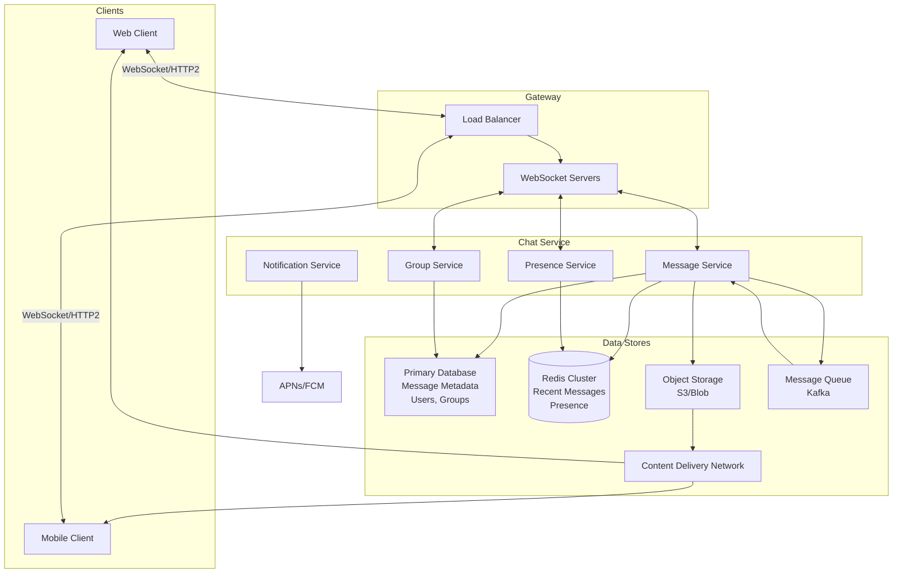
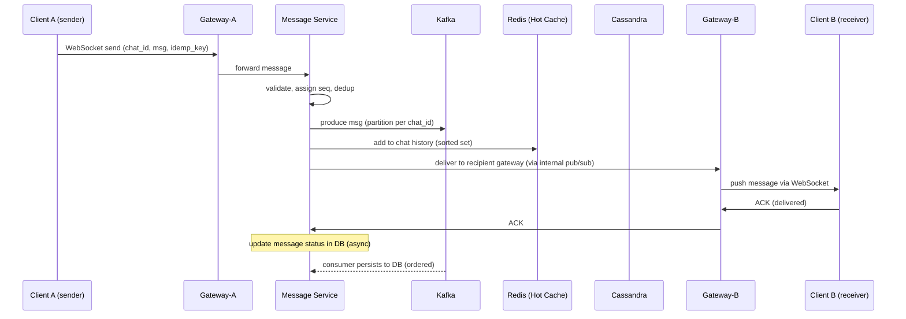

---

Design a real-time chat system like WhatsApp or Slack.

---

## Real-Time Chat System Design (Inspired by WhatsApp/Slack)

This design outlines a scalable, real-time messaging platform handling billions of messages per day. It supports one-to-one and group chats, presence, media attachments, and persistent history. We’ll ground the discussion with concrete numbers and explicit tradeoffs.

---

### 1. Requirements

**Functional**
- One-to-one and group messaging
- Message history with pagination
- Media attachments (images, videos, files)
- Online/offline presence status
- Push notifications for mobile devices (when app is in background)
- Read receipts / delivery status

**Non-Functional**
- High availability (99.99%+)
- Low latency (< 200ms p95 for message delivery between active users)
- Consistency model: at-least-once delivery with duplicate detection
- Scale: 1 billion monthly active users, 100 billion messages/day
- Store text messages indefinitely; media files for 30 days (configurable)

---

### 2. Capacity Estimation

Assume:
- **MAU** (monthly active users): 1 billion  
- **DAU** (daily active users): 500 million  
- **Messages/day**: 100 billion (average 200 messages per daily user)  
- **Message size**: average 1 KB text (metadata included)  
- **Media**: 10% of messages contain media, average 500 KB per media item  
- **Peak factor**: 2x daily average for writes (200 billion/day peak)  
- **Reads**: each message is read by 1 or more users (delivered) – total reads ~ writes * avg group size (1.5 for 1-on-1 dominance) → ~150 billion reads/day  
- **Connection load**: Assume 1 persistent connection per active device. Average user has 1.5 devices. 500M DAU → 750M concurrent connections at peak? Not all simultaneously active; peak concurrent online users may be 20% of DAU = 100M users with active connections, each 1.5 devices → 150M concurrent WebSocket connections.

**Storage Estimations:**
- Text messages per day: 100B * 1 KB = 100 TB/day → ~36.5 PB/year (raw). With compression and dedup, maybe 20-50 PB/year.  
- Media per day: 10B messages * 500 KB = 5 PB/day → 1.8 EB/year. That’s huge; object storage (S3) must be used. Retention limited.

**Bandwidth at Peak:**
- Inbound: 100B * 2 (peak) * 1 KB / 86400 s ≈ 2.3 GB/s  
- Outbound: 150B reads * 1 KB / 86400 ≈ 1.7 GB/s  
- Media: 5 PB/day = ~58 GB/s sustained; peak double → 116 GB/s. CDN required.

---

### 3. High-Level Architecture

A service-oriented design with a central message broker, storage layers, and push notifications.

- **WebSocket Servers**: terminate long-lived connections, authenticate, route messages to Message Service.
- **Message Service**: core logic for send/receive, persist, fan-out, deduplication.
- **Presence Service**: track online status, heartbeat management.
- **Group Service**: group membership, fan-out lists.
- **Notification Service**: pushes to mobile devices when offline.
- **Kafka**: asynchronous write path for reliable message persistence and replay.
- **Redis**: cache for recent messages (hotset), presence, and real-time pub/sub for delivery to online users.
- **Primary DB**: sharded NoSQL (Cassandra) or horizontally partitioned SQL for message metadata, user/group data.
- **Object Storage + CDN**: media files.

---

### 4. Data Models

**User Table (SQL/NoSQL)**
- user_id: UUID
- phone_number/email
- display_name
- profile_picture_url
- last_seen_timestamp
- state: online/offline/last active

**Message Metadata (NoSQL – wide column)**
- message_id: unique (timestamp + random)
- sender_id
- chat_id (for one-to-one: sorted pair of user_ids; for group: group_id)
- content_type: text/image/video/file
- content: text or media metadata (object storage URL, thumbnail, size)
- timestamp: client generated
- sequence_number: per chat (monotonic increasing)
- status: sent/delivered/read (per recipient)

**Group Chat**
- group_id
- name
- members: list of user_ids + roles
- created_at

**Presence Store (Redis)**
- user_id -> JSON { status, last_active, device_tokens[] }

**Media Store (Object Storage)**
- key: `chat_id/message_id/file_type`
- metadata in message DB.

**Message Archive (for older history)**
Same schema but on cold storage; hot recent messages in Redis/cache.

---

### 5. API Design

**REST Endpoints** (for app initial load, history, group management)
- POST /api/register
- GET /api/chats?cursor=&limit=
- GET /api/messages/{chat_id}?cursor=&limit=
- POST /api/upload (multipart media)
- POST /api/group/create
- POST /api/group/add_member

**WebSocket Protocol** (persistent)
- Authenticate: `{"type": "auth", "token": "JWT"}`
- Send Message: `{"type": "message", "chat_id": ..., "content": ..., "content_type": ..., "idempotency_key": "..."}`
- Delivery ACK: `{"type": "ack", "message_id": ..., "status": "delivered"}`
- Read Receipt: `{"type": "read", "message_id": ..., "chat_id": ...}`
- Presence: `{"type": "presence", "user_id": ..., "status": "online/offline"}` (both server-pushed and heartbeat)
- Historical sync: server sends missed messages upon reconnection (via `sync` message with last known sequence_no)

**Push Notification API** (side channel)
- Payload contains message preview, chat_id, message_id.

---

### 6. Detailed Component Design

#### 6.1 Connection and Authentication
1. Client establishes WebSocket connection to a gateway server (LB routes to nearest available instance).
2. Client sends an auth token obtained during REST login.
3. Gateway validates token with Auth service and registers the connection in a connection registry (Redis key `user:connections` mapping user_id to server_id + connection_id). For multi-device support, a user may have multiple active connections.
4. Gateway pings (30s interval) to detect disconnection; on close, registry entry removed and presence updated.

#### 6.2 Sending a One-to-One Message (Happy Path)
1. Client A sends message JSON over its WS connection to Gateway-A.
2. Gateway-A forwards to Message Service (MS). MS assigns a message_id (if idempotency_key provided, deduplicate) and sequence_number within the chat.
3. MS writes message to Kafka (topic per partition key = chat_id) for durable, ordered logging.
4. MS writes message metadata to the primary DB (Cassandra) asynchronously via a Kafka consumer (ensures ordering per chat). At the same time, MS updates the cache (Redis sorted set `chat:{chat_id}:messages`) with the new message for real-time access.
5. For fan-out delivery, MS uses the connection registry to check if the recipient(s) are connected.  
   - If recipient B has an active connection: MS delivers the message directly to that Gateway-B via an internal pub/sub (Redis channel or direct RPC). Gateway-B pushes the message to the client WebSocket.
   - If recipient is offline: MS enqueues a push notification to Notification Service, which sends via APNs/FCM.
6. Client B, upon receiving message, sends an ACK (`delivered`). Gateway forwards to MS, which updates the message status in DB for that recipient.
7. When Client B opens the chat and reads, it sends `read` receipt; MS updates status.

**Idempotency**: Clients generate idempotency_key (e.g., hash(client_id + timestamp + random)). MS stores processed keys in Redis with TTL (24h) to detect duplicates.

**Message Ordering**: Critical per chat. Sequence numbers are assigned by MS sequentially. If MS restarts, it recovers the last sequence from DB. Kafka partitioning ensures order for writes per chat. Clients display messages sorted by sequence_number.

#### 6.3 Group Messaging
Group sizes vary from 10 to 100,000+ (Slack channels). For small to medium groups (< 1000 members), MS does a direct fan-out: retrieves all member IDs and their connection status from Group Service, then delivers to each online member via their gateways, and pushes to offline ones.

For huge groups (broadcast channels), we use a “message queue per group” model: MS writes the message to a group-specific Kafka topic; dedicated fan-out workers consume and distribute to online members in bulk, using Redis pub/sub to notify all connected gateways. Offline members are not pushed individually per message; instead they pull updates when they come online (see below). This avoids fan-out storm.

**Offline Group Member**: When a user connects, they sync missing messages via a cursor (last known sequence_no). The client requests `GET /api/messages/{chat_id}?cursor=sequence_no` and pulls recent messages; for large gaps, pagination.

#### 6.4 Presence System
- Presence state stored in Redis with TTL.
- Heartbeat: client sends periodic pings (every 30s). Gateway updates `user_presence:{user_id}` `last_seen` timestamp and sets TTL (60s).
- If no heartbeat within TTL, the user is considered offline; a dedicated service (presence sweeper) detects expired keys and updates DB `last_seen` and publishes a presence event to interested users (contact list updates).
- To reduce write load, presence updates are batched (e.g., only publish change every 60s or on state transition).
- When a user sends a message, Gateway can implicitly refresh presence.

#### 6.5 Media Sharing
- Client requests pre-signed upload URL from REST API (POST /api/upload). MS generates a key, returns URL.
- Client uploads directly to object storage (S3/gcs). On success, client sends message with content: {type: image, key: "abc", size: ...}.
- MS validates the object existence and creates message.
- Media delivery: URLs are CDN-based. Clients can download via CDN; for privacy, signed URLs with short expiry (1h) and token validation (if needed).

#### 6.6 Message History & Pagination
- Recent messages (last 100 per chat) are served from Redis cache.
- Older messages served from DB. DB is partitioned by chat_id (consistent hashing). Index on (chat_id, sequence_no). Pagination using cursor (sequence_no).
- For one-to-one, chat_id = sorted(userA, userB) to ensure both sides query the same partition.
- Cassandara is good for time-series with partition key chat_id, clustering by sequence_no.

---

### 7. Tradeoffs and Key Decisions

| **Decision** | **Choice** | **Rationale** |
|--------------|------------|---------------|
| Consistency vs Availability | AP with eventual consistency | Messaging must be available; minor delays acceptable; at-least-once delivery with duplicates handled by idempotency. |
| Push vs Pull for real-time | Push via WebSocket | Lowest latency for active users; for offline, pull on reconnect. No wasteful long-polling. |
| Message ordering | Linearizable within a chat via Kafka partition + sequence no. | Essential for coherent conversation. Kafka ordering guarantees per partition. |
| Database | Cassandra for message metadata; Redis for hot data and presence; Kafka for write-ahead log | Cassandra handles high write throughput, horizontal scaling; Redis for low latency; Kafka ensures reliability and decouples persistence from real-time delivery. |
| Group fan-out | Small groups: direct fan-out from MS; large groups: queue-based with pull-to-fetch | Avoids fan-out explosion; scales to millions. |
| Presence accuracy | Approximate (up to 60s delay) | Tradeoff between low latency and server load; periodic heartbeats plus TTL reduce write rate. |
| Media storage | Object storage (S3) + CDN | Cost-effective and scalable; TTL-based retention automates cleanup. |

---

### 8. Failure Scenarios and Mitigations

**Scenario 1: Message Service crash during send**
- Client uses idempotency key; will retry upon timeout.
- If MS crashed after writing to Kafka but before sending ACK to client, the client retries; MS sees duplicate key and returns success, skips re-delivery.

**Scenario 2: WebSocket Gateway crash**
- Clients reconnect to another gateway; connection registry updated. MS reapplies delivery for any messages that were pending (via Kafka consumers tracking last delivered offset per device). Message guarantees at-least-once.

**Scenario 3: Database partition**
- If primary DB is unreachable, MS can still accept messages using Kafka as a buffer. Write via Kafka, delay consumption until DB is back. For reads, serve from Redis cache; eventual cache miss becomes error until partition heals. Availability over consistency.

**Scenario 4: Large fan-out causing latency spike**
- Implement back-pressure: if fan-out queue depth exceeds threshold, degrade to pull mode for less active members. Use group inbox approach.

**Scenario 5: Duplicate messages due to network retry**
- Client-side dedup via message_id check (local store) and server-side idempotency key.

**Scenario 6: Message burst from a celebrity**
- Rate limiting at gateway (per user and per chat). Throttle non-real-time pushes; for viral groups, switch to pull-based delivery for followers.

---

### 9. Sequence Diagram – Real-time Message Delivery

---

### Conclusion

This design balances real-time performance with reliability at massive scale. By separating concerns: Kafka for durable write-ahead log, Redis for speed, WebSocket for push, and a sharded database for storage, we achieve low latency and high throughput. Tradeoffs lean toward availability and performance, with mechanisms to handle duplicates and eventual consistency. The system can be extended with features like E2E encryption (handled at the client level, transparent to server) and search (Elasticsearch side-car consuming Kafka stream).