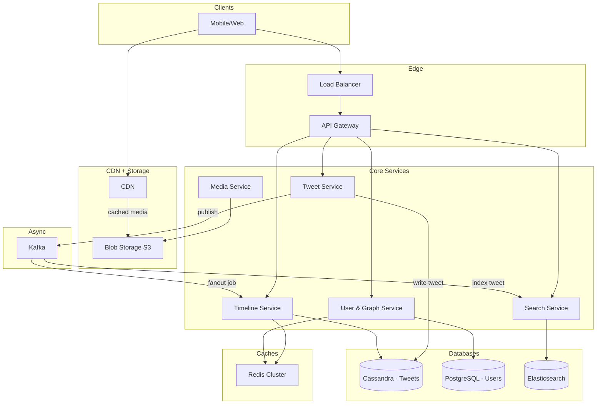

---

Design a microblogging platform like Twitter.


---

# Microblogging Platform System Design

## 1. Requirements

### Functional
- **Post a Tweet**: Text up to 280 characters, optional media (images, videos).
- **Follow / Unfollow** other users.
- **Home Timeline**: Reverse‑chronological list of tweets from followed users.
- **User Timeline**: All tweets from a specific user.
- **Search**: Full‑text search over public tweets, trending hashtags.
- **Engagement**: Likes, Retweets, Replies (these can be designed later, core is timeline).

### Non‑Functional
- **Availability**: 99.99% uptime (four‑nines). Eventual consistency acceptable for timelines.
- **Latency**: Tweet posting < 200ms (client‑perceived). Timeline load < 500ms p95.
- **Scalability**: 500M users, 300M DAU. Handle celebrity accounts with 100M+ followers.
- **Durability**: Never lose a tweet. All writes persisted redundantly.

## 2. Capacity Estimation

### 2.1 Traffic Numbers
- **DAU**: 300M
- **Average tweets per user per day**: 2  
  → **Total new tweets / day**: 600M  
  → **Average write QPS**: 600M ÷ 86400 ≈ **7,000 writes/s**  
  → **Peak write QPS**: 5× average ≈ **35,000 writes/s**
- **Average timeline refreshes per user per day**: 5 (each loads ~20 tweets)  
  → **Timeline requests / day**: 300M × 5 = 1.5B  
  → **Average read QPS**: 1.5B ÷ 86400 ≈ **17,360 reads/s**  
  → **Peak read QPS**: 5× ≈ **87,000 reads/s**
- **Tweets served per day**: 30B (assuming 100 viewed per user; most from cache)

### 2.2 Storage
- **Text**: 1 KB per tweet (JSON + index) → 600M × 1KB = **600 GB/day**  
  With 3× replication (e.g., Cassandra) → **1.8 TB/day** → **~660 TB/year**
- **Media**:  
  - 10% of tweets have images (avg 100 KB) → 60M × 100KB = **6 TB/day**  
  - 1% have videos (avg 5 MB) → 6M × 5MB = **30 TB/day**  
  **Total media**: 36 TB/day → **13 PB/year**  
  Stored in S3, served via CDN. Only metadata is kept in tweet store.
- **Social graph**: 500M users × 100 avg followees = 50B edges.  
  Each edge stored as `<follower_id, followee_id>` (~16 bytes) → **800 GB raw**, replicated 3× = 2.4 TB.

### 2.3 Bandwidth
- **Tweets served**: 30B/day × 1KB avg (text + small thumbnails) = 30 TB/day ≈ **2.8 Gbps avg**  
  Peak ~14 Gbps.  
- **Media (CDN)**: 36 TB/day → **3.3 Gbps avg**. Peak accordingly. CDN absorbs this.

## 3. High‑Level Architecture



## 4. Detailed Design

### 4.1 Data Models

**Relational (PostgreSQL) – User Account**
```sql
User:
  id (bigint, PK)
  username (varchar, unique)
  display_name
  created_at
  ...
```

**Graph (Cassandra / Redis) – Follow Relationships**
- `followers`: `(user_id, follower_id)` sorted by timestamp.
- `followees`: `(user_id, followee_id)` sorted.
- Each row ~16 bytes. Sharded by `user_id`.

**Tweet Store (Cassandra)**
```
Tweet:
  tweet_id (UUID, partition key)
  user_id
  content (text)
  media_urls (list)
  created_at (clustering key, DESC)
  retweet_of (nullable)
  like_count (counter)
  ...
```
Partition key = `tweet_id`. For user timelines we need a secondary index or dedicated table:
```
User_Tweets:
  user_id (partition key)
  tweet_id (clustering key, DESC)
  tweet_data (embedded)
```

**Timeline Cache (Redis)**
- Key: `timeline:<user_id>`, value: list of tweet IDs (most recent ~800).
- For heavy hitters, timeline is not stored; built on‑the‑fly.

**Search Index (Elasticsearch)**
- Document per tweet with full text, hashtags, user info, date.
- Indexed in near‑real‑time via Kafka consumer.

### 4.2 Microservices

#### Tweet Service
- **Write Tweet**:  
  1. Validate, resize media via **Media Service** → upload to S3, get URLs.  
  2. Generate UUID `tweet_id`.  
  3. Insert into `Tweet` table and `User_Tweets` (Cassandra).  
  4. Publish to **Kafka** topic `new_tweets` with payload `(tweet_id, user_id, content, created_at)`.  
  5. Return success (no fanout in critical path).  
  Latency < 50ms + Cassandra write < 100ms.

#### Timeline Service (Fanout Logic)
- **Home Timeline Request (read)**:
  1. Check if user is a *normal* user (followees < 10k). If yes, fetch from Redis cache `timeline:<user_id>` (pre‑built).  
  2. If user is a *heavy* user (followees > 10k) or cache miss, fall back to *pull‑based*:
     - Call **User Service** to get list of followees.
     - Fan‑out query to `User_Tweets` for each followee (limited to N most recent).  
     - Merge and sort in application layer.  
  3. Return tweet metadata (hydrate from `Tweet` table if needed).

- **Timeline Builder (Kafka Consumer)**:
  - Reads `new_tweets`. For each tweet, look up the set of **followers** of `user_id` (from User Service).  
  - For followers with “normal” status, **push** the `tweet_id` to their Redis list (`LPUSH`, trim to 800).  
  - For followers with > X followers (celebrities), do nothing – they will be pulled on read.  
  - This async process handles 7k writes/s → for users with avg 100 followers: 700k pushes/s. A Redis cluster can easily handle that.

**Trade‑off**: Push offers ~1ms reads for 99% of users but duplicates storage for each follower. For a tweet from a user with 1M followers, pushing would cause 1M Redis writes. Hence the threshold (e.g., >10K followers → pull). Also, fanout delay is typically <1s.

#### Search Service
- Kafka consumer reads `new_tweets`, builds Elasticsearch documents, bulk‑indexes.
- Trending: use rolling window counts from Kafka (or aggregations) to compute top hashtags.

#### User & Graph Service
- Manages follow/unfollow and provides follower lists.
- Uses PostgreSQL for relationships but heavily cached in Redis.
- Unfollow: remove edge from cache and DB; timeline cache will eventually remove stale entries (clean‑up by checking validity on read).

### 4.3 Caching Strategy
- **User profile**: Cached in Redis (LRU, TTL 1h) – lower latency than PostgreSQL.
- **Timeline**: Stored as Redis list per user. In case of cache miss, rebuild from DB and set with TTL 5min.
- **Tweets**: Recently accessed full tweet objects cached in Redis (key = `tweet_id`, TTL 1h) to avoid Cassandra reads during hydration.
- **Counters** (likes, retweets): Use Redis atomic counters, periodically flushed to Cassandra.
- **CDN**: All media files. TTL set to immutable (once uploaded, never change). Use versioned URLs.

### 4.4 Database Sharding
- **Cassandra (tweets)**:
  - `Tweet` table partitioned by `tweet_id` (random UUID – good distribution).  
  - `User_Tweets` table partitioned by `user_id` – guarantees all tweets of a user in one partition (good for `User Timeline` reads).  
  - For high‑follower users, partition can become hot; caching mitigates reads.
- **PostgreSQL (users)**:
  - Shard by `user_id` (modulo) across multiple masters with replication.
- **Elasticsearch**:
  - Horizontally scaled by tweet hash; indices rolled daily.

### 4.5 API Endpoints
- `POST /tweets` – body `{ content, media[] }` → `{ tweet_id }`
- `GET /timeline/home?max_id=&count=20` → list of tweets
- `GET /timeline/user/:user_id?max_id=&count=` → list
- `POST /follow` – `{ followee_id }`
- `DELETE /follow` – `{ followee_id }`
- `GET /search?q=...`

All require authentication (JWT).

## 5. What Could Fail & Mitigations

| Failure Scenario | Impact | Mitigation |
|------------------|--------|------------|
| Redis cluster partition / crash | Timeline reads miss cache, fall back to Cassandra → increased load | Multi‑region Redis with replicas; circuit breaker to DB |
| Fanout Kafka lag | New tweets not pushed to timelines, users see stale timelines | Monitor lag, auto‑scale consumers, alert |
| Hot shard – celebrity `User_Tweets` partition | Reads spike on a single Cassandra node | Use in‑memory cache for recent tweets, rate‑limit direct reads |
| User follow/unfollow inconsistency | Follower list and timeline out of sync | Timeline service on read checks if followee is still valid; expiry |
| Cassandra node failure | Data unavailable for writes/reads | Replication factor 3, consistency level QUORUM for writes, ONE for timeline reads |
| Elasticsearch cluster down | Search unavailable | Re‑index from Kafka when restored; fallback to DB scan for trending (degraded) |
| CDN outage | Media not loading | Multi‑CDN; fallback to direct S3 URLs with temporary tokens |

## 6. Trade‑offs Summary

- **Push vs Pull Timeline**: Push gives low‑latency reads for normal users but wastes resources for highly‑followed accounts (celebrity fanout). Hybrid approach balances both: threshold at 10k followers.
- **Eventual Consistency**: Timeline may miss very recent tweets for a few seconds, which is acceptable for user experience.
- **Separate Media Storage vs Inline**: Storing media in Blob store keeps DB size small and leverages CDN, but adds complexity of async upload.
- **Cassandra over MySQL**: Better write scalability, tunable consistency, but lacks ACID transactions – acceptable for tweets.
- **Kafka as buffer**: Decouples write from fanout and indexing, protecting against back‑pressure, but introduces latency ~100ms.

## 7. Evolution & Advanced Features (Out of Scope)
- Real‑time notifications (WebSockets)
- Trending hashtags (stream processing)
- Ads / promotion insertion
- Spam detection
- Multi‑datacenter replication

The design above handles the core microblogging workload with horizontal scalability and resilience to component failures, tailored to realistic numbers and trade‑offs learned from existing large‑scale social platforms.