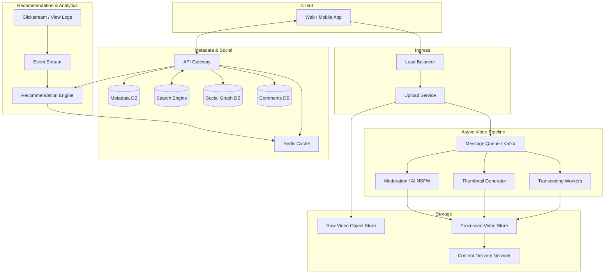

---

Design a video sharing platform like YouTube.

---

# Video Sharing Platform Design

## 1. Requirements & Scope

**Functional requirements** (core)
- Upload video (any length, up to 10 GB)
- Adaptive streaming (HLS/DASH) in multiple resolutions
- Search by title, description, tags
- Comments, likes/dislikes, subscriptions
- Recommendations (home feed, related videos)
- Channel/creator dashboard (analytics, monetization disabled for now)

**Non‑functional**
- High availability (99.95% uptime)
- Low latency video start (< 2 s)
- Eventual consistency for views/likes; strong consistency for upload metadata
- Support 500 million daily active users, 1 billion video watches/day
- Ingest 1 million hours of new video per day (~ 720 TB raw uploads)

**Out of scope**
- Live streaming
- DRM/licensing
- Monetization/ads

---

## 2. High‑Level Architecture

---

## 3. Detailed Design

### 3.1 Video Upload & Ingestion

**Upload flow**
- Client chunks file (5‑10 MB each) for resumable uploads.
- `Upload Service` coordinates:
  1. Create video entry in `Metadata DB` (status = UPLOADING).
  2. Client obtains presigned URLs from an object store (S3‑compatible) and uploads chunks directly.
  3. Finalise: send manifest of all chunks → service verifies, concatenates, sets status to PROCESSING.

**Failure modes**
- Chunk lost: client retries only missing chunks.
- Duplicate finalise: idempotent deduplication based on content hash (MD5 of all chunks).

### 3.2 Video Processing Pipeline

**Queue‑based fanout**
- New raw video → event to Apache Kafka (topic: `video.uploaded`).
- Workers consume:
  - **Transcoder** (FFmpeg) produces multiple renditions (144p, 360p, 720p, 1080p, 1440p, 2160p) + audio‑only.
  - **Thumbnail generator** extracts 3‑5 representative frames.
  - **AI Moderation** (pre‑warmed models) scans frames for nudity, violence; flags violations.
- Output segments (HLS `.ts` / DASH `.m4s`) + playlists written to processed video storage.

**Parallelism & Scaling**
- One hour of video = ~3600 seconds; a GPU‑accelerated transcode to 6 renditions can run in real‑time (1h input → ~1h processing).
- Need capacity: 1M hours input/day → compute needed = 1M core‑hours/day ≈ 41,667 cores continuously. Deploy thousands of containers (Kubernetes) with auto‑scaling. Use spot instances.

**Cost‑tradeoff**: could pre‑transcode only popular resolutions (360p, 720p) and generate others on demand via per‑title encoding (Mux HLS tech), saving storage but increasing start‑up latency.

### 3.3 Storage

| Data Type             | Technology          | Justification                                   |
|-----------------------|---------------------|-------------------------------------------------|
| Raw uploads           | Amazon S3 / MinIO   | Durable, cheap (standard → cold after 30 days)  |
| Processed videos      | S3 (warm storage)   | Accessed by CDN for caching; 1 year retention   |
| Thumbnails            | S3 + CDN            | Low latency, small files                        |
| Metadata (video info) | PostgreSQL sharded  | Strong consistency, rich queries                |
| User data / subs      | Cassandra or MongoDB| High write throughput, eventual consistency     |
| Comments              | Cassandra / HBase   | Time‑ordered, sharded by video_id               |
| Search index          | Elasticsearch       | Full‑text search, faceted, scalable             |
| Views / Likes (counts)| Redis counters + periodic persistence            | Fast reads, eventual consistency                |
| Session / hot data    | Redis / Memcached   | Caching popular videos, user sessions           |

**Capacity for raw video** (1M hours/day at avg 720 MB/h = 720 TB/day).  
- Processed copies: ~5x original size (multiple renditions) → 3.6 PB/day.
- Annual raw storage (keep 30 days hot, then glacier) ~ 21.6 PB hot; cooled ~ 100 PB glacier.  
- Annual processed ~ 1.3 EB — huge, require CDN to offload reads.

**Tradeoff**: Keep only highest‑performance renditions hot; lower ones generated on‑the‑fly for rarely watched content (saves 80% processed storage).

### 3.4 Video Streaming & CDN

- Processed HLS/DASH segments are small (~5‑10 seconds), heavily cacheable.
- Use a multi‑CDN strategy (Akamai, Fastly + own edge) to serve globally.
- Origin shielding: A mid‑tier cache between CDN and object store to avoid thundering herd when many edges request same segment.
- Adaptive bitrate: Client manifest lists available renditions; player dynamically switches based on bandwidth.

**Bandwidth estimate**: 1 billion views/day, each 10‑minute average → 300 seconds. Assume 2 Mbps average bitrate → 75 MB per view. Daily egress = 1B * 75 MB = 75 PB/day = ~6.9 Tbps continuous. CDN must handle that. CDN costs become dominant.

### 3.5 Metadata, Search & Comments

- **API Gateway** (lightweight GraphQL/REST) routes to microservices.
- **Video metadata** (title, description, tags, duration, stats) stored in Postgres with sharding on `video_id` (hash). Index `uploader_id` and `upload_date`.
- **Search**: Elasticsearch cluster ingests video metadata updates (Kafka CDC). Handles millions of queries per second (QPS). Tradeoff: near‑real‑time (seconds delay) but acceptable.
- **Social graph**: subscriptions stored in a graph DB (like JanusGraph over Cassandra) or simply a wide‑column table (follower_id → list of channel_ids). For the fan‑out on new upload, we don’t push to all subscribers; instead, a timeline service on‑demand merges subscriptions for the recommendation feed.
- **Comments**: append‑only, time‑ordered keyed by video_id. Use Cassandra with `video_id` partition key and comment timestamp as clustering key, enabling fast pagination.

### 3.6 Recommendation System

- Ingests view events, likes, watch time via Kafka.
- Uses offline model training (weekly) + online serving model (TF‑Serving).
- Candidate generation: collaborative filtering (embedding vectors for user & video), combined with content‑based.
- Ranking: predicts watch time / CTR.
- Pre‑computed “home feed” lists cached per user; real‑time merge when user refreshes.

### 3.7 Scalability & Fault Tolerance

- **Upload Service**: horizontal scaling behind load balancer; stateless.
- **Processing Pipeline**: Kafka partitions by video_id ensures ordered processing per video; workers are stateless and can be killed/restarted.
- **Database**: Sharding by video_id/user_id; replication with read replicas.
- **Cache**: Redis cluster mode; for video metadata, use write‑through.
- **Region failover**: multi‑region deployment of critical services (API, metadata) with geo‑routing. CDN inherently multi‑region.

---

## 4. Capacity Math Summary

| Metric                          | Calculation                                                  | Number              |
|---------------------------------|--------------------------------------------------------------|---------------------|
| Daily Active Users (DAU)        | Assumed                                                      | 500 million         |
| Video watches / day             | 2 per DAU avg                                                | 1 billion           |
| New video uploaded (hours/day)  | Assumed                                                      | 1 million hours     |
| Raw upload volume               | 1M h × 720 MB/h (avg bitrate ~1.6 Mbps)                     | 720 TB/day          |
| Processed video store           | 5 renditions × 2x avg bitrate → ~1.8 GB/h; 1.8 GB/h × 1M h = 1.8 PB/day | ~1.8 PB/day (after encoding) |
| Peak egress from CDN            | 1B videos × 75 MB (10 min @ 2 Mbps) = 75 PB/day → avg ~7 Tbps; peak 3x = 21 Tbps | 21 Tbps peak        |
| Transcoding compute             | 1M h/day × real‑time factor 1.0 = 1M core‑h/day; need ~42k cores | 42,000 CPU cores / GPU |
| Metadata DB (Postgres) write QPS | 1M uploads/day → ~12 TPS peak; reads (video page loads) ~500k QPS | 500k QPS (needs caching) |
| Search QPS                      | 10% of users search once per session → 50M searches/day = ~5800 QPS avg, peak 3x | ~17,400 QPS        |
| Comments per video              | Average 100 comments; 1B views, 10% comment → 100k new comments/day is low? Actually YouTube has billions. We'll scale down. Assume 100M new comments/day → ~1200 writes/s | ~1200 writes/s     |

---

## 5. Tradeoffs & Alternatives

| Decision                   | Alternatives & Tradeoffs                                                                                        |
|----------------------------|----------------------------------------------------------------------------------------------------------------|
| Transcoding: pre‑compute all renditions vs on‑demand | Pre‑compute uses more storage (5x) but gives instant playback. On‑demand saves storage but adds latency for first view; good for long‑tail. Hybrid: pre‑transcode popular, lazy‑transcode rest. |
| SQL vs NoSQL for metadata  | Postgres provides rich queries, ACID for critical metadata. NoSQL (Cassandra) would scale writes better but loses ad‑hoc queries. Use SQL with heavy caching. |
| CDN: build vs buy          | Build own edge (Netflix Open Connect) gives control and cost savings at very large scale, but huge operational overhead. We buy multi‑CDN. |
| Strong consistency for views | Would bottleneck writes under viral spikes. Use approximate counters (Redis HyperLogLog) and eventual persistence. |
| Upload via object store chunks vs streaming to servers | Direct‑to‑object store scales better, avoids server bottlenecks; but requires client logic for resumable uploads. |

---

## 6. What Could Fail

1. **Upload incomplete** due to network breakage: resumable upload with chunk retry; TTL on presigned URLs to avoid orphan chunks.
2. **Transcoding queue backlog** (viral event upload spike): auto‑scale workers, but may still be delayed. Implement priority queues (popular creators get faster processing) and gracefully degrade by serving raw source (lowest quality) only.
3. **CDN cache miss cascade**: popular video newly published; many CDN edges hit origin object store simultaneously. Mitigate: pre‑warm CDN (push popular videos) + use an origin shield layer with a pull‑through cache (e.g., Nginx caching proxy).
4. **Data loss**: raw video corrupted in S3 (rare, but possible). Use checksums and replica copies. Metadata DB – use streaming replication and daily snapshots. Comments and view data can tolerate some loss (eventual consistency).
5. **Hot partition in metadata DB**: a viral video’s `video_id` gets enormous read/write load. Use caching (Redis) with TTL 5 seconds – stale reads acceptable. For comments, shard by video_id means all comments for a viral video hit one node; use a secondary “comment counter” in Redis and limit DB reads by paginating via cursors.
6. **AI moderation misfires**: false positives (flagging legit content) can exasperate creators. Provide appeal mechanism and human review queue; use confidence thresholds.
7. **Recommendation system latency**: if real‑time model inference is slow, fallback to pre‑computed list. Degrade user experience but not availability.
8. **Cost explosion**: stored video forever; implement lifecycle policies (move old, unwatched raw source to glacier, delete transcoded copies after X years of inactivity).

The design prioritises availability and scalability, using eventual consistency for non‑critical data, heavy caching, and asynchronous processing pipelines to absorb bursts. The cost of storage and bandwidth is the primary long‑term operational challenge, mitigated through CDN compression, per‑title encoding, and tiered storage.