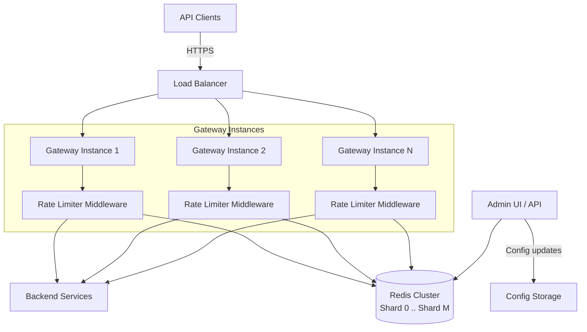

---

Design a distributed rate limiter to protect an API gateway.


---

## Distributed Rate Limiter Design for API Gateway

### 1. Problem Statement
The API gateway must enforce per-client (API key) rate limits to protect backend services from abuse, ensure fair resource allocation, and prevent cascading overloads. The system must operate at scale (millions of requests per second) with minimal added latency, remain highly available, and support dynamic limit configuration.

### 2. Requirements
**Functional**
- Rate limit incoming requests per unique API key (or IP, user ID).
- Configurable limits per key: sustained rate (requests/sec) and burst capacity (max instantaneous burst).
- Reject requests with `429 Too Many Requests` when limit exceeded; include `Retry-After` header.
- Admin API to read/update limits for any key at runtime.

**Non-Functional**
- **High throughput:** Support 1,000,000 requests per second (scalable).
- **Low latency:** p99 added latency < 5 ms.
- **High availability:** Survive node failures; rate limiter should not become single point of failure or block traffic.
- **Accuracy:** Limit enforcement within 1% of configured rate under normal conditions; eventual consistency acceptable for config updates.
- **Observability:** Metrics on allowed/denied counts per key, Redis latency, errors.

### 3. High‑Level Architecture
The rate limiter is implemented as a **middleware** inside each API Gateway instance. It uses a shared **Redis Cluster** as the coordination and state store. All gateway instances are stateless and scale horizontally; they connect to all Redis shards via a smart client that uses consistent hashing.



### 4. Detailed Algorithm: Token Bucket in Redis
**Choice Rationale**
- **Token bucket** provides constant memory per key (O(1)) regardless of request rate, making it ideal for high throughput.
- Sliding window log (sorted sets) is more precise but memory grows linearly with request rate; for a limit of 1000 req/s, each key would consume ~40 KB, which is acceptable but token bucket scales better to higher limits (10k+ req/s) with zero extra cost.
- Implementation uses **Lua scripts** for atomic read‑calculate‑write, avoiding race conditions.

**Data Model (per API key)**
For key `user123`:
- `{user123}:tokens` – currently available tokens (float).
- `{user123}:ts` – last refill timestamp (milliseconds).
- `{user123}:config` – hash containing `rate` (tokens/sec) and `burst` (maximum tokens).

All keys share the same hash tag `{user123}` so they are co‑located on the same Redis shard.

**Lua Script (pseudo‑code)**
```lua
-- KEYS[1] = tokens_key
-- KEYS[2] = timestamp_key
-- KEYS[3] = config_key
-- ARGV[1] = now (milliseconds)
-- ARGV[2] = request_cost (default 1)
local tokens_key = KEYS[1]
local ts_key = KEYS[2]
local config_key = KEYS[3]
local now = tonumber(ARGV[1])
local cost = tonumber(ARGV[2])

-- fetch config (rate and burst); if missing, apply default deny
local config = redis.call('HGETALL', config_key)
if #config == 0 then
    return {0, 0, 0}  -- no config, deny
end
local rate = tonumber(config[2])   -- tokens per second
local burst = tonumber(config[4])

-- read current state
local tokens = tonumber(redis.call('GET', tokens_key)) or burst
local last_ts = tonumber(redis.call('GET', ts_key)) or now

-- calculate refill
local delta = math.max(now - last_ts, 0)
local refill = delta * rate / 1000
tokens = math.min(burst, tokens + refill)

-- apply request
local allowed = 0
if tokens >= cost then
    tokens = tokens - cost
    allowed = 1
end

-- persist
redis.call('SET', tokens_key, tokens)
redis.call('SET', ts_key, now)

-- return: allowed, remaining tokens, retry-after (ms to next token)
local retry_after = 0
if allowed == 0 then
    retry_after = math.ceil((cost - tokens) / rate * 1000)
end
return {allowed, math.floor(tokens), retry_after}
```

**Request Flow**
1. Gateway extracts API key from request (header, JWT, etc.).
2. Middleware calls Redis `EVAL` with the script, three keys, and current timestamp.
3. Redis executes atomically: refills tokens, deducts if possible, persists.
4. Result: `allowed` (1/0), `remaining` tokens, `retry_after` ms.
5. If `allowed == 1`, forward to backend; else respond `429 Retry-After`.

### 5. Redis Cluster Deployment & Sharding
- **Sharding strategy:** Redis Cluster with N shards (e.g., 10 for 1M req/s). Each gateway’s Redis client (e.g., JedisCluster, go‑redis) hashes the `{key}` tag to locate the correct shard.
- **Capacity estimation (1M req/s):**
  - Each request invokes one `EVAL` script (a single round trip).
  - A typical Redis node can handle ~100k simple ops/s; with Lua scripts slightly less (~80k ops/s). For 1M req/s, 13 nodes provide ~1.04M ops/s (80k * 13). Grow shards linearly with traffic.
  - Network RTT inside same DC: ~0.2 ms; script execution: ~0.1 ms (single‑threaded, but pipelining hides some latency). Total added latency ≈ 0.3 ms, well within target.
- **Memory:** Each active key consumes ~100 bytes (two strings + hash). For 100,000 active keys, memory ≈ 10 MB, negligible. Config updates are tiny.

### 6. Handling Failures & High Availability
- **Redis cluster resilience:** Each shard can be replicated (Redis Cluster with replicas). If a master fails, a replica promotes; the client adapts. During failover, requests to the affected shard may fail for a few seconds – strategy: **fail‑open** with local backup.
- **Local fallback:** When Redis is unreachable, the middleware falls back to an in‑memory token bucket per key with a default limit (e.g., 100 req/s) and a short TTL. This prevents total outage of the gateway but allows limited traffic. The fallback is configurable (fail‑open vs fail‑closed).
- **Connection pooling:** Gateways maintain persistent connections to each shard, with timeouts (e.g., 10 ms) to avoid blocking.
- **Multiplexing:** To reduce Redis load, consider batching multiple requests’ token checks into a single Lua script? Not necessary at 1M req/s; but an optimization can combine `MGET` for many keys in one round trip using Lua (with hash‑slot restriction) if needed.

### 7. Dynamic Configuration
- An admin service updates rate limits by writing to `{key}:config` in Redis (HashSet). The Lua script reads it every request, so changes take effect within milliseconds.
- For massive updates (bulk config), a background process can directly `HSET` the config keys. No gateway restart required.
- Configurations can also be stored in a persistent DB and synced to Redis; Redis is the source of truth for rate enforcement.

### 8. Monitoring & Observability
Each gateway instance emits metrics:
- `ratelimiter_requests_total{key, decision}` – counter for allowed/denied.
- `ratelimiter_redis_duration_seconds` – histogram of Redis call latency.
- `ratelimiter_fallback_active` – gauge indicating local fallback in use.
Centralized monitoring (Prometheus/Grafana) aggregates across instances, alerting on denial spikes, Redis errors, or high latency.

### 9. Trade‑offs & Alternatives
| Approach | Accuracy | Memory | Latency | Complexity |
|----------|----------|--------|---------|-------------|
| **Centralised Redis token bucket (chosen)** | Good (~1% error due to clock skew and multiple gateways) | Low, O(1) per key | ~0.3 ms extra | Medium |
| Redis sliding window log (sorted set) | Excellent | Grows with request rate, O(n) per window | Slightly higher (ZREMRANGEBYSCORE + ZADD) | Medium |
| Local rate limiter + gossiped quotas | Eventual consistency, higher error under load | Minimal | No extra latency | High |
| Pure local (no global state) | Per‑instance only, not suitable for distributed gateways | Minimal | None | Low |

**Why not sliding window?** For a limit of 1000 req/s, memory is acceptable, but if limits later increase to 10k+, the sorted set overhead grows. Token bucket avoids this and gives predictable performance.

**Consistency caveat:** Multiple gateways may allow a combined burst slightly over the configured `burst` because each refills independently. The error is bounded by `rate * (number_of_instances * (network_jitter / 2))`, typically <1% in a stable datacenter. For stricter enforcement, a centralised coordinator could issue “quotas” to each gateway (like Google’s global rate limiter), but adds significant complexity.

### 10. Failure Modes & Mitigations
- **Redis shard permanently down:** Traffic to keys on that shard will be handled by local fallback (fail‑open). If fallback is disabled, those keys are denied entirely. Mitigation: redundant Redis replicas + fast failover.
- **Redis cluster full resharding:** During slot migration, requests to moving keys may be redirected. Use smart clients that follow `MOVED`/`ASK` errors. Temporarily increased latency but no data loss.
- **Script bugs:** Gateways should catch Redis errors and optionally fall back. Lua scripts are rolled out to all shards atomically via `SCRIPT LOAD` and `EVALSHA`.
- **Clock drift:** Token bucket uses server‑side timestamps (gateway passes `ARGV[1]`). If gateway clocks are unsynchronized, the refill calculation may be inaccurate. Mitigation: NTP on all gateways, or use Redis’ own `TIME` command inside Lua (adds a tiny overhead).

### 11. Capacity Scaling Plan
- **To scale horizontally:** Add more API Gateway instances – they are stateless, just more connections to Redis.
- **To scale Redis:** Add more shards and reshard the keyspace. Use `{key}` hash tags to ensure all three keys for a single API key move together. Plan for 2x headroom.
- **Multi‑region:** Deploy a Redis Cluster per region; rate limits are regional. Global limits can be approximated by dividing the global rate among regions.

### 12. Security
- TLS between gateways and Redis.
- API key extraction validated against a trusted identity service.
- Admin API authenticated and rate‑limited separately.

This design balances simplicity, performance, and accuracy, leveraging battle‑tested Redis primitives to provide a robust distributed rate limiter for high‑traffic API gateways.