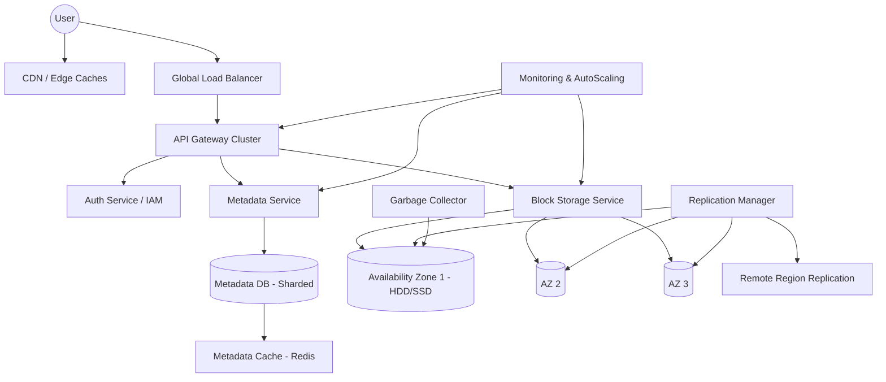

---

Design a global object storage system like S3.


---

# Global Object Storage System Design (S3-like)

## 1. Introduction and Requirements

We design a globally distributed object storage service akin to Amazon S3. It must store arbitrary objects (files) in flat namespaces called buckets, serve them via HTTP, and scale to exabytes of data with millions of requests per second while guaranteeing extreme durability and high availability.

### Functional Requirements
- **Buckets**: Create, list, delete buckets. Bucket names are globally unique, DNS‑routable.
- **Objects**: PUT (upload), GET (download), HEAD (metadata), DELETE. Objects can be up to 5 TB.
- **Multi‑region**: Data resides in a user‑chosen geographic region; optionally replicated across regions.
- **Consistency**: Strong read‑after‑write for new objects; eventual consistency for overwrites and listing.
- **Versioning**: Optional, to keep multiple versions of an object.
- **Access Control**: IAM policies, bucket policies, ACLs; signed URLs.
- **Cost Optimization**: Storage classes (standard, infrequent access, archive).

### Non‑Functional Requirements
- **Durability**: 99.999999999% (11 nines) annual durability.
- **Availability**: 99.99% (standard), 99.9% (infrequent access).
- **Latency**: Median PUT/GET < 100 ms within a region; < 300 ms cross‑continent.
- **Scalability**: Handle 100+ PB per region, >10^6 ops/s per region.
- **Security**: Encryption at rest, TLS in transit, integrity checks.
- **Cost**: Minimize storage overhead and operational complexity.

---

## 2. High‑Level Architecture



*Figure: High‑level architecture. Users access via CDN or directly to API gateways. The metadata service handles namespace and object metadata; block storage holds actual data as erasure‑coded chunks across multiple AZs.*

---

## 3. Core Components

### 3.1 API Gateway / Request Router
- Stateless HTTP servers (Nginx/Envoy) terminating TLS, routing requests based on bucket name and region.
- Global Anycast IP or geo‑DNS directs traffic to the nearest region, then intra‑region load balancers spread load across many gateway nodes.
- Rate limiting, request validation, response framing.

### 3.2 Identity and Access Management (IAM)
- Verifies credentials (Signature V4, tokens).
- Caches policies close to API gateways (eventually consistent, seconds TTL) to avoid auth‑path latency.

### 3.3 Metadata Service
- Stores all object metadata: key, ETag, size, MIME type, creation time, ACL, version ID, and **chunk location map** (logical pointers to blobs).
- The metadata is the source of truth for object existence.
- Implemented as a distributed, strongly consistent key‑value store (see §9.1).
- Bucket listing is served from a separate eventually‑consistent index.

### 3.4 Block Storage Service
- Manages raw data blobs (chunks) on disks.
- Organised by volume; each volume consists of many fixed‑size chunks (e.g., 64 MB).
- Writes use erasure coding to reduce storage overhead while maintaining durability.
- Each AZ has its own independent set of storage nodes (hundreds of commodity servers with JBOD‑attached HDDs).
- All writes are quorum‑based in a region before acknowledge to client.

### 3.5 Replication and Consistency Manager
- Ensures data is replicated across multiple AZs within a region (intra‑region) and optionally to other regions (cross‑region).
- Uses an asynchronous replication log for cross‑region.

### 3.6 Garbage Collection (GC)
- When an object is overwritten or deleted (with or without versioning), old chunks remain in storage until they are no longer referenced by any metadata.
- A periodic MapReduce‑style job scans metadata to compute reference counts, then deletes orphaned chunks.

### 3.7 Monitoring and Logging
- Distributed tracing (e.g., Jaeger), metrics (Prometheus), and log aggregation (ELK) for every tenant operation.
- Auto‑scaling triggers based on request latency, error rate, and storage utilisation.

---

## 4. Data Model

### 4.1 Bucket
```
{
    "name": "string (globally unique, DNS-compatible)",
    "region": "primary region code",
    "owner": "account ID",
    "created": "timestamp",
    "versioning": "enabled/suspended",
    "replication_rules": [...],
    "lifecycle_policies": [...],
    "cors": [...],
    "policy": "IAM policy JSON"
}
```

### 4.2 Object Metadata
```
{
    "bucket": "bucket-name",
    "key": "path/object",
    "version_id": "null or version UUID",
    "e_tag": "MD5",
    "size": "bytes",
    "content_type": "mime/type",
    "creation_date": "timestamp",
    "last_modified": "timestamp",
    "storage_class": "STANDARD",
    "acl": "...",
    "chunks": [
        { "chunk_id": "uuid", "offset_bytes": 0, "length": 67108864 },
        ...
    ],
    "custom_metadata": { ... },
    "deleted": false
}
```

- The metadata record is stored in the Metadata DB keyed by `(bucket, key, version_id)`.
- `chunks` is an ordered list of blobs that compose the object; each blob identified by a unique chunk ID.

---

## 5. Storage Design

### 5.1 Erasure Coding
A file is split into data blocks and parity blocks. For example, a 64 MB chunk is encoded into 12 fragments of equal size (10 data + 2 parity) — a (10,2) Reed‑Solomon code. This yields a storage overhead of 20%, while tolerating any 2 fragment failures per chunk. The fragments are placed on **distinct** disks, servers, and ideally across AZs.

### 5.2 Data Placement within a Region
- Each region contains 3 or more Availability Zones (AZs), each with many storage nodes.
- When the Block Storage Service receives a chunk write, it splits it into fragments, assigns a random set of target nodes (e.g., 12 nodes across at least 2 AZs), and writes them in parallel.
- **Write quorum**: Client write is acknowledged after `K` (e.g., 8) fragments are successfully written and flushed to disk (with fsync). This ensures data durability even if some writes lag.
- **Rebuilding**: If a storage node fails, missing fragments are reconstructed from surviving fragments and written to new nodes, driven by the Replication Manager.

### 5.3 Multi‑region Replication
- For buckets with cross‑region replication enabled, the API or a background process asynchronously copies new metadata and data to the target region.
- Consistency model is eventual – the target region is updated with a configurable delay (usually < 15 minutes). This is acceptable per S3 semantics.

---

## 6. Write Path

1. Client sends a PUT request to the API Gateway.
2. Gateway authenticates with IAM (cached policy check).
3. Gateway streams the object body to an **ingest buffer** (in‑memory or local SSD) while chunking it into fixed‑size pieces (64 MB). For small objects (< 64 MB), a single chunk is created.
4. For each chunk:
   a. A unique chunk ID is generated (UUID).
   b. The chunk is erasure‑coded and the fragments are sent to the Block Storage Service, which places them on a set of storage nodes.
   c. The Block Service returns success once the write quorum is met.
5. Once all chunks are safely written, the Gateway constructs the metadata record (including the chunk list) and sends it to the Metadata Service.
6. The Metadata Service writes the record to its strongly‑consistent store (e.g., via Paxos/Raft) and returns success to the Gateway.
7. Gateway responds HTTP 200 to client.
8. **Strong read‑after‑write**: Because the metadata is only visible after its commit, any GET request (which must read metadata first) will see the object immediately after a successful PUT.

*Note*: For very large objects, we can optimise by writing chunks and metadata in parallel, but we must ensure that the metadata is not committed until all chunks are durably stored.

---

## 7. Read Path

1. Client GET request arrives at API Gateway (or CDN edge).
2. Authentication and bucket existence verified.
3. Gateway queries Metadata Service for the object metadata (if versioning is used, the current version). This is a point read, fast (cached).
4. Metadata not found → 404.
5. If metadata exists, Gateway retrieves the chunk list.
6. It requests chunks from the Block Storage Service. The service locates the nearest AZ that has a complete set of fragments, reconstructs the chunk if needed (due to fragment loss), and streams the reassembled bytes back.
7. For optimal performance, the Gateway can request the first few chunks (maybe the whole object if small) and begin streaming to the client while later chunks are still being fetched (pipelining).
8. The response includes appropriate headers (Content‑Length, ETag, Last‑Modified, etc.).

*CDN integration*: Frequently read objects (public access) are cached in a content delivery network edge. The CDN respects standard HTTP caching headers. On cache miss, the CDN fetches from the origin (S3 API).

---

## 8. Consistency Model

| Operation              | Consistency              | Remarks |
|------------------------|--------------------------|---------|
| PUT (new key)          | Read‑after‑write strong  | After 200 response, all GETs see the object. |
| PUT (overwrite) / PUT with existing key | Eventual | Reads may see old version for a short time. Metadata updates propagate asynchronously to cache. S3 standard behaviour. |
| DELETE                 | Eventual                | Similar to overwrite. |
| List (objects in bucket) | Eventual               | Index is built asynchronously; new objects may take seconds to appear. |
| Cross‑region replication | Eventual               | S3 guarantees eventual consistency for replicated objects. |

**How achieved**: The Metadata Service uses a primary‑backup scheme (via consensus) for the latest version pointer, but the system delays updating caches and secondary indexes for overwrites and deletes to reduce latency on writes. New objects, however, use a synchronous write to the primary metadata store and bypass eventual caches.

---

## 9. Scalability and Sharding

### 9.1 Metadata Sharding
The metadata database must handle billions of objects. We partition by **bucket** (using consistent hashing on bucket name) because most operations are scoped to a bucket. Within a bucket, the store can further partition by key prefix range (e.g., split a bucket into thousands of tablets). Each tablet is maintained by a Raft group of 3–5 nodes for strong consistency. The total number of metadata nodes scales with dataset size; we target 100 million objects per server (~1 TB metadata per server, assuming ~10 KB metadata per object including overhead). For 100 billion objects, this requires ~1000 metadata nodes.

### 9.2 Block Storage Scaling
The block storage layer is vastly simpler: each chunk is an independent blob identified by its chunk ID. The mapping from chunk ID to storage node is maintained by a lightweight **chunk location service** (a simple ring‑based DHT). New chunks are placed on nodes with sufficient capacity, often using a greedy algorithm to spread fragments. Block storage nodes are essentially dumb backends; they accept write/read/delete of fragments and manage local disks.

Capacity per node: 60 HDDs × 20 TB each = 1.2 PB raw per node. With erasure coding (1.2x overhead), usable capacity ≈ 1 PB per node. For 1 EB (1000 PB) of stored data, we need ~1000 storage nodes per region, plus extra for parity. With 3 AZs, total ~3000 nodes.

Bandwidth per node: 10 Gbps network. For reads that may reconstruct chunks, we need to stream fragments. At 1 Gbps sustained egress per node, 1000 nodes can serve 1 Tbps aggregate read traffic. Realistic peak usage requires careful load distribution and caching.

### 9.3 Request Routing and Load Balancing
- Anycast IP routes to the nearest region.
- Inside a region, layer‑7 load balancers distribute to API gateways.
- Gateways are stateless and horizontally scalable based on CPU/connection count.

---

## 10. Capacity and Performance Estimation

*Use realistic numbers for a large‑scale deployment (single region).*

- **Objects**: 10^12 (1 trillion) objects.
- **Average size**: 1 MB. Many small (1 KB) and large (1 GB) objects.
- **Total stored data**: 10^12 × 1 MB = 1 EB (10^18 bytes).
- **Redundancy overhead**: erasure coding ~1.2x → raw data footprint 1.2 EB.
- **Metadata**: per object ~2 KB (chunk list etc.) → 10^12 × 2 KB = 2 PB metadata; fully replicated 3x = 6 PB raw metadata storage.
- **Chunk size**: 64 MB → average object uses 1 chunk. Total chunks ~10^12. But many small objects will generate a chunk each; to avoid waste, we could use a small‑object store (see Tradeoffs).
- **Requests per second (RPS)**: 10^7 ops/s (peak). 
  - Assume 20% writes (2M PUTs/s) and 80% reads (8M GETs/s).
- **API Gateway nodes**: each handling ~10K RPS (HTTP termination can handle ~50K with hardware assist). 10M RPS / 10K = 1000 gateways, but with async/event‑driven we can get 20K–50K → ~250–500 nodes. Add redundancy: 600 nodes.
- **Metadata DB**: 10M ops/s. A single Raft group can do ~50K writes/s; reads can be scaled via read‑only replicas. For great write throughput, shard by bucket. With 10^7 buckets, average load per bucket is low. Hot buckets may need split tablets. Assume average Raft cluster handles 200K reads/s and 20K writes/s. We need ~50 write‑heavy Raft clusters and ~40 read replicas each. Total metadata nodes ~2000 (including replicas).
- **Block Storage**: 8M reads/s × 1 MB avg object = 8 TB/s egress. With 10 Gbps nodes, need ~6400 storage nodes for egress alone, but in practice reads are heavily cached (CDN, edge) and many objects are infrequent. Working set maybe 10% → egress demand 800 Gbps → ~80 nodes. Write ingest: 2M × 1 MB = 2 TB/s, plus erasure coding internal traffic (~1.5x) → 3 TB/s. Need ~300 nodes for write traffic. Capacity (1 EB usable) requires 1000 nodes. Combine: ~1300 storage nodes with 60 HDDs each. That’s realistic.

---

## 11. Failure Modes and Mitigations

### 11.1 Disk Failure
- Each storage node has many disks. When a disk fails, its fragments are lost. The Replication Manager detects under‑replicated fragments via heartbeats and schedules reconstruction from surviving fragments. Erasure coding allows reconstruction even if two fragments are lost simultaneously. Mean‑time‑to‑repair (MTTR) should be < 1 hour to minimise risk of data loss.
- Background scrubbing continuously verifies checksums of every fragment to protect against silent corruption.

### 11.2 Storage Node Failure
- A node failure (power supply, network) temporarily removes all its contributed fragments. The system treats this as multiple simultaneous disk failures. As long as the quorum for each chunk is still available, reads are unaffected (some may require reconstruction). Writes will avoid the dead node. Reconstruction is triggered if the node remains down beyond a timeout (e.g., 15 minutes).

### 11.3 Entire AZ Outage
- Durability guaranteed by spreading fragments across at least 2 AZs (preferably 3). Even if an entire AZ fails, surviving fragments still meet the reconstruction threshold (e.g., with (10,2) and 3 AZs, each AZ holds at least 4 fragments, losing one AZ leaves 8 ≥ 10? Wait, total fragments 12. If each AZ gets 4, losing one leaves 8, but we need 10 data fragments? Actually, with RS(10,2), we need *any* 10 fragments out of 12 to reconstruct. So if we lose 4 from one AZ, remaining 8 is not enough. Thus we must distribute fragments such that no AZ holds more than 2 parity fragments. With 3 AZs, allocation: AZ1=5, AZ2=4, AZ3=3 (total 12). Lose AZ1 (5) leaves 7, still less than 10. To survive an AZ failure, we need erasure coding that tolerates up to the loss of the largest fragment set. Possible solutions: (8,4) code (12 fragments, need any 8) and distribute 4 per AZ – losing one AZ (4 fragments) leaves 8, exactly enough. With (10,2), we must place fragments so that no single AZ has more than 2 fragments? That’s 12 fragments across 3 AZs, max 2 per AZ gives only 6 fragments total, impossible. So (10,2) cannot survive an AZ outage if we want to keep all data accessible. We can choose a different code or accept reduced availability (but not durability) during an AZ outage. S3 standard storage replicates data 3x across AZs (full replication) so an entire AZ loss still leaves two full copies. To keep durability and storage overhead balanced, we can use replication (3 copies) for critical metadata and smaller objects, and erasure coding with higher overhead (e.g., 6+3) for large objects. This is a tradeoff.

  *Better approach for availability*: Use **replication** (3x) for both metadata and small objects, and **erasure coding** with a higher durability / lower storage cost for large objects, but for the latter, design placement to survive an AZ loss by using cross‑AZ placement and keeping enough fragments in the remaining AZs to reconstruct. For instance, (11,4) code with 15 fragments, placed 5 per AZ; lose one AZ (5 fragments), remaining 10, still need 11 to reconstruct → doesn't work either. Need a code where number of allowed missing fragments (M) is ≥ max‑fragments‑per‑AZ. With 3 AZs, if we put equal number of fragments, max per AZ is ceil(total_fragments/3). So we need M ≥ ceil(n/3). For n=15, need M≥5, code (10,5) -> storage overhead 50%. Or we can combine: place two full replicas (2x storage) and use erasure coding only for cold data where offline reconstruction during an AZ outage is acceptable. S3 standard indeed replicates objects within a region across multiple AZs; S3 One Zone‑IA uses a single AZ. So we'll follow S3 design: **default storage class uses full replication (3 copies)**. For reduced redundancy/frequent access, replication is simpler and gives low latency. For infrequent access or archive, we can use erasure coding (e.g., (6,3)) with 9 fragments placed across 3 AZs (3 each), losing one AZ (3 fragments) leaves 6 which is enough to reconstruct. So for standard, availability and latency are prime; replication is chosen. This explains durability of 11 9's with replication: probability of losing all 3 copies within a repair window is extremely low.

### 11.4 Metadata Service Failure
- If a Raft group loses its leader, a new one is elected within seconds. Clients retry. To survive an AZ failure, metadata nodes are spread across AZs (at least 3 nodes per Raft group). Strong consistency is still maintained because Raft requires a majority. 3 nodes in 3 AZs: if one AZ fails, 2 nodes remain – that’s a majority, so the group remains available.

### 11.5 Network Partitions
- Intra‑region networks are redundant. Split‑brain prevented by consensus leases.
- Cross‑region replication is asynchronous; partitions can cause lag but not data corruption.

### 11.6 Hot Spots
- A single popular object can overwhelm a storage node. Mitigation: cached at edge, and the block storage layer can replicate popular chunks to more nodes. The chunk ID can be mapped to multiple replicas, with the request router spreading load.

### 11.7 Thundering Herd on Cache Expiry
- Object metadata (TTL in edge caches) expiring at the same time. Use staggered expiry and request coalescing at the edge.

---

## 12. Trade-offs and Alternatives

| Decision                       | Alternatives weighed & reasoning |
|--------------------------------|----------------------------------|
| **Replication vs. Erasure Coding** | Replication: higher storage cost (3x vs. 1.4x), but simpler, lower latency reads, better availability (survives AZ loss). Standard class uses replication; archive uses erasure coding. |
| **Strong vs. Eventual Consistency for metadata** | S3 recently moved to strong read‑after‑write for new objects. We implement strong consistency for the metadata write of a new key, but allow overwrite/list to be eventual for performance. A fully strongly‑consistent system would require higher write coordination, increasing latency. |
| **Sharding by bucket vs. by key** | Sharding by bucket groups related objects together, easing billing and listing. However, a large bucket may become a hot spot. We handle this by splitting a bucket into multiple tablets based on key prefix range. |
| **In‑house vs. managed DB for metadata** | Could use a globally‑distributed SQL DB like Spanner/CockroachDB. Building a custom metadata store allows tighter control over sharding and consistency tradeoffs, but adds complexity. For this design, we assume a built‑for‑purpose key‑value store on Raft. |
| **Centralized Chunk Map vs. DHT** | A chunk location service (ring‑based) is easier to scale and decentralized, but requires a small database per chunk. Block storage nodes can publish their chunks, and the ring maps chunk ID→node. This avoids a single bottleneck. |

---

## 13. Conclusion

We have described a globally distributed object storage system that meets the S3 vision: scalable, durable, and secure. It relies on a replicated metadata layer for strong consistency of new objects, a replication‑based block storage for high durability and availability, and a CDN‑aware read path for low latency. The architecture can be built with thousands of commodity servers per region, yielding exabyte‑scale storage with predictable performance. Real‑world operations such as failure recovery, garbage collection, and versioning are integral to the design. The system mirrors the proven architecture of Amazon S3 as understood from public sources, while remaining flexible for future optimizations.