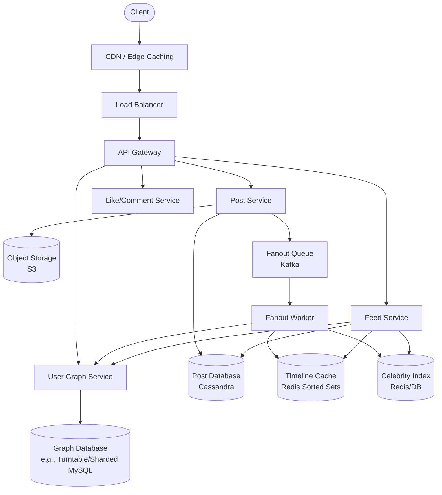

---

Design a news feed system like Twitter or Facebook.


---

## News Feed System Design

This document presents a scalable, high‑performance news feed system inspired by Twitter and Facebook. It covers functional requirements, non‑functional constraints, capacity planning, detailed architecture, data modelling, fanout strategy, and failure mitigation.

---

### 1. Requirements

**Functional**
- Users can create posts (text, images, video links).
- Users can follow/unfollow other users.
- The news feed displays posts from followed users, sorted reverse‑chronologically (default) or by a ranking engine.
- Users can like, comment, and share posts.

**Non‑functional**
- **High availability**: 99.99% uptime for core feed serving.
- **Low latency**: feed load time < 200ms (p95) for both active and inactive users.
- **Scalability**: support 1B+ total users, 500M DAU, celebrity accounts with >10M followers.
- **Eventual consistency**: minor delay in feed updates acceptable, but consistency within a few seconds.
- **Durability**: no data loss for created posts or user relations.

---

### 2. Capacity Estimates

| Metric | Value | Calculation |
|--------|-------|--------------|
| Daily Active Users (DAU) | 500 M   | – |
| Avg. follows per user | 200     | Power‑law distribution |
| Avg. followers per user | 100     | – |
| New posts / day         | 500 M   | 1 post/DAU (some silence, some multiple) |
| Write QPS (posts)       | ~5,800  | 500M ÷ 86,400 |
| Feed reads / day (10 refreshes/DAU) | 5 B | 500M × 10 |
| Read QPS (average)      | ~58,000 | 5B ÷ 86,400 |
| Read QPS peak (2×)      | ~116,000| – |
| Fanout writes (naïve push) | 580 K/s | 5,800 × 100 avg followers |

**Storage**  
- Post metadata: ~1 KB (id, author, text, timestamp).  
  500M posts/day × 1 KB = 500 GB/day → **182 TB/year**.  
- Media (images/videos) stored in S3/CDN; not included in primary storage.
- User graph (follow relationships): 1B users × 100 relations × 20 bytes = 2 TB (can be sharded).

---

### 3. High‑Level Architecture

The system uses a **hybrid fanout** (push + pull) to handle both normal users and celebrities.  
A central **Feed Cache** holds per‑user pre‑computed timelines; for heavy‑hitter accounts, posts are fetched at read time.



*Figure 1: Core components and data flow.*

---

### 4. Detailed Component Design

#### 4.1 Write Path (Creating a Post)
1. **Client → API Gateway → Post Service**  
   - Validates content, enforces rate limits, adds post metadata to **PostDB** (Cassandra – high write throughput, partitioned by user_id).
   - Media uploads go directly to **Object Storage** via pre‑signed URLs; the post stores CDN links.

2. **Fanout Decision**  
   - Post Service publishes a `PostCreated` event to **Kafka** (fanout queue) to decouple the main write from fanout work.
   - **Fanout Worker** consumes events and decides:
     - **If author is a “celebrity”** (follower count > threshold, e.g., 100K): do NOT push. Instead, write post ID into a **Celebrity Post Index** (e.g., Redis sorted set per celebrity, or a central table).
     - **Else**: fetch author’s follower list from **User Graph Service** and write the post ID into each follower’s **Timeline Cache** (Redis sorted set, key: `feed:<user_id>`, score = timestamp). Limit size to last 800 posts (evict old ones).

3. **Handling Inactive Followers**  
   - Only push to followers who have been active in the last N days (e.g., 30).  
   - A lazy‑build mechanism runs on inactive users’ first read.

#### 4.2 Read Path (Loading a Feed)
1. **Client → Feed Service**  
   - Request includes user_id, pagination cursor (last seen timestamp).

2. **Aggregate Feed**  
   - **Active user feed**: directly fetch from **Timeline Cache** (`feed:<user_id>`) – O(log N) for sorted set range.
   - **Celebrity content**: for each celebrity the user follows, fetch recent posts from the **Celebrity Post Index** (or if small count, bulk load).
   - Merge both streams, sort by timestamp, apply deduplication, and paginate.

3. **Enrichment**  
   - For the fetched post IDs, batch‑load metadata from **PostDB** (or a dedicated KV store for hot posts).  
   - Assemble likes/comments count from **Like/Comment Service** (or cache counts).

4. **Edge Caching**  
   - The **CDN** can cache complete rendered feeds for short durations (e.g., 1s) for anonymous/identical requests.

---

### 5. Data Models

**Post Table (Cassandra)**
```
CREATE TABLE posts (
    post_id      UUID,
    user_id      UUID,
    content      TEXT,
    created_at   TIMESTAMP,
    media_urls   LIST<TEXT>,
    PRIMARY KEY ((user_id), created_at, post_id)
) WITH CLUSTERING ORDER BY (created_at DESC);
```
- Partitioned by `user_id` to fetch all posts of a user efficiently (for celebrity pull).

**Timeline Cache (Redis)**
- Key: `feed:<user_id>`
- Type: Sorted Set, members: `post_id`, score: `created_at` epoch.
- Capped at 800 entries, rank by score.

**Celebrity Post Index (Redis)**
- Key: `celeb_posts:<celebrity_user_id>`
- Sorted Set of post_ids + timestamps, maintained for last 7 days.

**User Graph (Follow Relationships)**
- Stored in a graph database or a simple store with two lists per user:
  - `following:<user_id>` → Set of followed user IDs  
  - `followers:<user_id>` → Set of follower user IDs (sharded by user_id).

---

### 6. Fanout Tradeoffs: Push vs Pull

| Approach | Push‑Only | Pull‑Only | Hybrid (chosen) |
|----------|-----------|-----------|-----------------|
| **Write amplification** | Extreme (celebrity posts × millions of writes) | Low (add post to DB only) | Low (celebrity writes go to cheap index) |
| **Read complexity** | Simple: one cache lookup | High: merge many celebrity timelines | Moderate: merge pre‑built cache + few celebrity timelines |
| **Consistency** | Near real‑time | Read‑time (stale if not cached) | Real‑time for push, near‑real‑time for pull |
| **Resource cost** | Huge Redis capacity | Heavy reads on PostDB | Balanced cache usage, low read burden |

**Threshold tuning**: A user is considered a “celebrity” when follower_count > 100K. This threshold can be dynamically adjusted based on infrastructure load.

---

### 7. Ranking and Relevance

The reverse‑chronological feed is simple and cheap. To add ranking:
- An off‑line **Ranking Service** re‑scores posts using signals (engagement, recency, user affinity).
- The precomputed **Timeline Cache** can store post_ids with a relevance score instead of timestamp. Fanout workers compute a preliminary score; a final re‑rank happens at read time for the top‑N posts.

---

### 8. Scaling Strategies

- **Database sharding**:  
  - PostDB partitioned by `user_id`; Cassandra handles this natively.  
  - Follow graph sharded by `user_id` (each shard holds full follower/following sets for a range of users).
- **Redis Cluster**: Timeline Cache distributed across nodes; each shard holds a subset of users’ feeds.  
  - To avoid hot spots, high‑traffic users’ feeds are replicated or use dedicated instances.
- **Kafka partitioning**: Fanout queue partitioned by `post_id` to parallelise fanout workers.
- **CDN/Edge**: Cached feeds for logged‑in users based on stable profile; use user‑specific cache keys with short TTLs.
- **Read replicas**: PostDB replicas for scaling celebrity pull.
- **Write‑through / lazy loading**: Timeline can be built lazily if not present in cache, using a back‑pressured builder.

---

### 9. Potential Failures and Mitigations

| Failure Mode | Effect | Mitigation |
|--------------|--------|-------------|
| **Redis cluster failure** | All precomputed feeds lost; high latency on reads | Multi‑region Redis with failover; feed rebuild on read with back‑pressure. |
| **Celebrity Post Index unavailable** | Missing celebrity posts | Fallback: query PostDB directly for recent posts from followed celebrities. |
| **Fanout worker overload** | Delayed fanout, eventual consistency lag | Auto‑scale workers; separate fast/slow lanes; degrade to pull‑only for bulk posts. |
| **Hot‑key in PostDB (celebrity posts)** | High read load on a single partition | Add in‑memory cache (Redis) for latest N celebrity posts; limit read frequency. |
| **Write‑thrashing for celebrity follower updates** | Many fanout writes when a celebrity gains followers | Don’t push retroactively; new followers only see future posts (acceptable). |
| **Feed inconsistency (stale) after follow/unfollow** | Newly followed user’s posts missing | On follow action, inject recent posts from that user into the follower’s cache synchronously. |

---

### 10. Conclusion

The hybrid fanout design elegantly balances the write amplification of pure push with the read complexity of pure pull. By treating users with large follower bases as “celebrities” and serving their content via a lightweight pull path, the system achieves:

- Low latency reads for over 99% of users (precomputed feed in Redis).
- Sustainable write fanout (only to active, normal followers).
- Efficient use of caching resources, avoiding massive Redis storage for inactive or celeb‑dominated feeds.
- Graceful degradation under overload, automatically shifting to pull when fanout lags.

The design can be extended with real‑time ranking, richer media handling, and advanced personalisation without fundamental architectural changes. All components are horizontally scalable, and data partitioning ensures linear growth capacity.