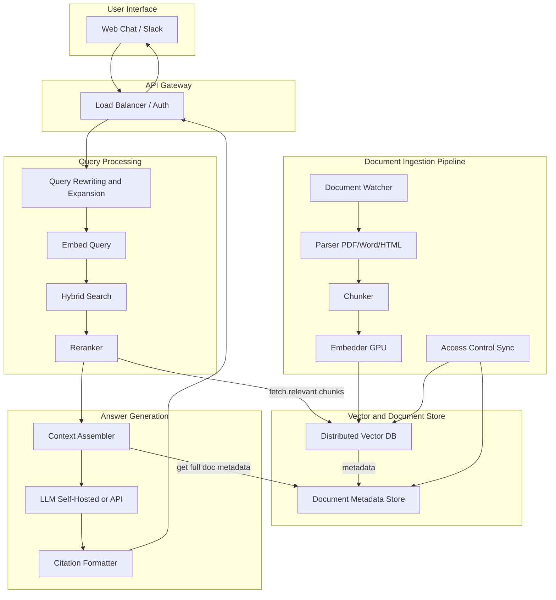

---

Design a retrieval-augmented generation (RAG) assistant that answers user questions based on a company's internal documents.

---

## 1. System Overview

The proposed RAG assistant allows employees to ask natural language questions and receive answers grounded in the company’s internal documents (policies, technical docs, meeting notes, email archives, etc.). The system follows a classic RAG pipeline:

- **Ingestion**: Continuous parsing, chunking, embedding, and indexing of new/updated documents.
- **Retrieval**: Hybrid (dense + sparse) retrieval with optional reranking to find the most relevant chunks.
- **Generation**: The retrieved chunks are fed to a large language model (LLM) along with prompt instructions to produce a concise answer with citations.

The assistant is accessed via a web chat interface or integrated into collaboration tools (Slack, Teams). It must enforce document-level access control to prevent leakage.

---

## 2. Detailed Architecture

---

## 3. Component Breakdown

### 3.1 Document Ingestion Pipeline

- **Document Watcher**: Monitors file servers, SharePoint, Confluence, etc., for new/updated documents. Uses change logs or periodic scanning.
- **Parser**: Extracts raw text from PDFs (OCR if needed), Word documents, HTML, Markdown, and other formats. Maintains a mapping from chunk → source document path.
- **Chunker**: Splits text into overlapping chunks (e.g., 500 tokens with 50‑token overlap). Chunk boundaries respect paragraph/sentence breaks to preserve semantic coherence.
- **Embedder**: Runs a sentence‑transformer model (e.g., `all-MiniLM-L6-v2`, dimension 384, or `e5-large-v2`, dimension 1024) on each chunk to produce dense vectors. Batching is used for GPU efficiency.
- **Access Control Sync**: Each chunk inherits access permissions from its source document (e.g., groups, user IDs). Permissions are stored alongside vector metadata.

### 3.2 Vector & Metadata Store

- **Vector Database**: Stores chunk embeddings, document IDs, chunk IDs, and permissions. Supports ANN (Approximate Nearest Neighbor) with hybrid search (dense + sparse). Options: self‑hosted **Milvus** (distributed, GPU‑accelerated) or managed **Pinecone** / **Weaviate**.
- **Document Metadata Store**: SQL database (PostgreSQL) storing document titles, URLs, access lists, ingestion timestamps, and update history for citation purposes.

### 3.3 Retrieval Pipeline

1. **Query Preprocessing**: User query is optionally rewritten for clarity and expanded with synonyms (using a lightweight LLM or synonym dictionary).
2. **Dense Retrieval**: The query is embedded using the same model as the documents. Top‑K candidates are retrieved via cosine similarity.
3. **Sparse Retrieval**: A BM25 index (e.g., Elasticsearch) provides keyword‑relevant candidates. This catches exact matches and named entities.
4. **Hybrid Fusion**: Results from both methods are combined using Reciprocal Rank Fusion (RRF) or a learned combiner (e.g., LambdaRank).
5. **Reranker**: A cross‑encoder model (e.g., `ms-marco-MiniLM-L-12-v2`) scores each candidate query‑chunk pair for final relevance ordering. Only the top N candidates (e.g., 20–50) are reranked.

### 3.4 Answer Generation

- **Context Assembler**: Takes the top reranked chunks (e.g., top 5), sorts by relevance, and packages them into the LLM prompt along with source metadata (title, date). A system prompt instructs the LLM to answer only from the provided context and to decline if the information is insufficient.
- **LLM**: Self‑hosted (e.g., Llama‑3‑70B, quantized, or Mixtral 8x7B) or a proprietary API (GPT‑4o mini). The context window must accommodate ~2500–4000 tokens of chunks plus query and instructions.
- **Citation Formatter**: Extracts in‑text references and appends a list of source URLs or file paths.

---

## 4. Capacity Planning

Assumptions for a mid‑size company (10,000 employees):

- **Raw text volume**: 100 GB of extracted text after parsing.
- **Chunking**: Average chunk size 500 tokens (≈750 words). 100 GB ≈ 40 million chunks (assuming 2.5 KB per chunk on average).
- **Embedding dimension**: 384 (float32). Vector size per chunk = 384 × 4 bytes = 1.5 KB. Total raw vector data = 60 GB.
- **Index overhead**: HNSW index adds ~20–30%. Storage per chunk ≈ 2 KB.
- **Total vector store**: 40 million × 2 KB = 80 GB. With replication factor 3 → 240 GB disk. Memory usage during query: a hot subset may be kept in RAM; full dataset can be served from fast SSD (NVMe) if using DiskANN or a page‑based index.
- **Embedding compute**: On a single NVIDIA A100, `all-MiniLM-L6-v2` can embed ~2,000 chunks/second (batched). 40M chunks → 20,000 sec ≈ 5.5 hours. This is a one‑time backfill; incremental ingestion adds <10% per week.
- **Query throughput**: Expected peak 100 concurrent users. Each query requires embedding (10 ms), hybrid search (~50 ms), reranking (50‑100 ms per candidate, e.g., top 50 → ~1 sec), LLM generation (500 ms for small model, 2 sec for large). With a target of p95 latency < 3 seconds, the reranker and LLM must be scaled horizontally (e.g., 2‑4 GPU replicas for LLM, CPU cluster for reranker).

### Latency Budget (target ≤ 2 seconds end‑to‑end)

| Step                       | Latency (ms) |
|----------------------------|--------------|
| Query embedding            | 10           |
| Dense retrieval (ANN)      | 20           |
| Sparse (BM25)              | 15           |
| Result fusion              | 5            |
| Reranking (top 50)         | 60           |
| Prompt construction        | 5            |
| LLM generation (200 tokens)| 800          |
| Total                      | ~920 ms      |

All times are medians; 95th percentile may be 2‑3× higher under load. With caching of frequent queries, latency can drop further.

---

## 5. Tradeoffs and Design Decisions

### 5.1 Chunking Strategy
- **Fixed‑size vs. semantic**: Fixed‑size with overlap is simple and works well; semantic chunking (based on sentence boundaries) preserves meaning better but is slower. We choose **recursive character split with sentence awareness** as a good balance.
- **Chunk size**: Larger chunks provide more context but dilute the embedding precision; 500 tokens is a common sweet spot.

### 5.2 Retrieval Models
- **Sparse + dense**: BM25 excels at exact matches (IDs, codes) while dense captures semantics. Combining them reduces misses.
- **Reranker**: Adds latency but significantly boosts precision, especially for verbose queries. Can be skipped if latency is critical.

### 5.3 LLM Choice
- **Self‑hosted (open‑source)**: Lower per‑query cost, no data egress risks, but requires GPU infrastructure and optimization (quantization, tensor parallelism). Latency can be higher than managed APIs.
- **Managed API (e.g., Azure OpenAI)**: Simpler to deploy, often lower latency at scale, but introduces risk of sensitive data leaving the corporate boundary. Contracts and on‑premise deployments can mitigate this.
- **Model size**: A 13B–70B parameter model provides good reasoning; smaller (7B) may be sufficient for simple Q&A when context is enough. The design supports swapping models.

### 5.4 Access Control
- **Pre‑filtering**: Documents tagged with ACLs are filtered at query time; only chunks whose ACL matches the user are included. This can be done in the vector DB by checking permissions before returning results. Performance impact is minimal if ACL filters are applied as a post‑search step on the top‑K results.
- **Coarse‑grained**: Entire document is public to a user group; finer access (paragraph‑level) is rarely needed and adds complexity.

### 5.5 Cost vs. Performance
- Embedding model: Smaller (384‑dim) reduces storage and retrieval latency vs. 1024‑dim, at a slight accuracy cost. Acceptable for most internal use cases.
- Hybrid search avoids expensive re‑ranking for every query; we rerank only top‑K.
- Caching embeddings for duplicate queries can save compute.

---

## 6. Failure Modes and Mitigations

| Failure Mode                | Impact              | Mitigation |
|-----------------------------|---------------------|------------|
| Stale documents             | Outdated answers    | Incremental sync every 5 min; document expiry timestamps; LLM instructed to state chunk date. |
| Missing context (retrieval misses) | Incorrect or no answer | Hybrid search + prompt to admit ignorance. Feedback loop to flag missing results. |
| Hallucination               | Factually wrong answer | Prompt engineering: “Only use the provided context. If unsure, say so.” Human evaluation dashboard. |
| Adversarial injection       | Prompt injection in documents | Input sanitization during parsing; LLM guardrails; separate system vs. user prompt. |
| Access control leakage      | Unauthorized user sees restricted content | ACL enforced at retrieval; logs for audit. |
| High latency under load     | Poor user experience | Autoscaling of LLM and reranker replicas; selective caching; degrade to dense‑only retrieval if necessary. |
| Embedding pipeline failure  | Incomplete index    | Dead‑letter queue for failed documents; alerting. |
| Model drift (LLM version)   | Inconsistent answers| Versioned deployment; A/B testing. |

---

## 7. Conclusion

The design provides a robust, scalable RAG assistant tailored for internal corporate knowledge. It combines proven techniques (hybrid search, reranking) with pragmatic tradeoffs (model size, chunk size) to balance accuracy, latency, and cost. The architecture can be deployed on‑premises or in a private cloud, ensuring data sovereignty. Continuous monitoring and feedback loops will be essential to maintain quality over time.