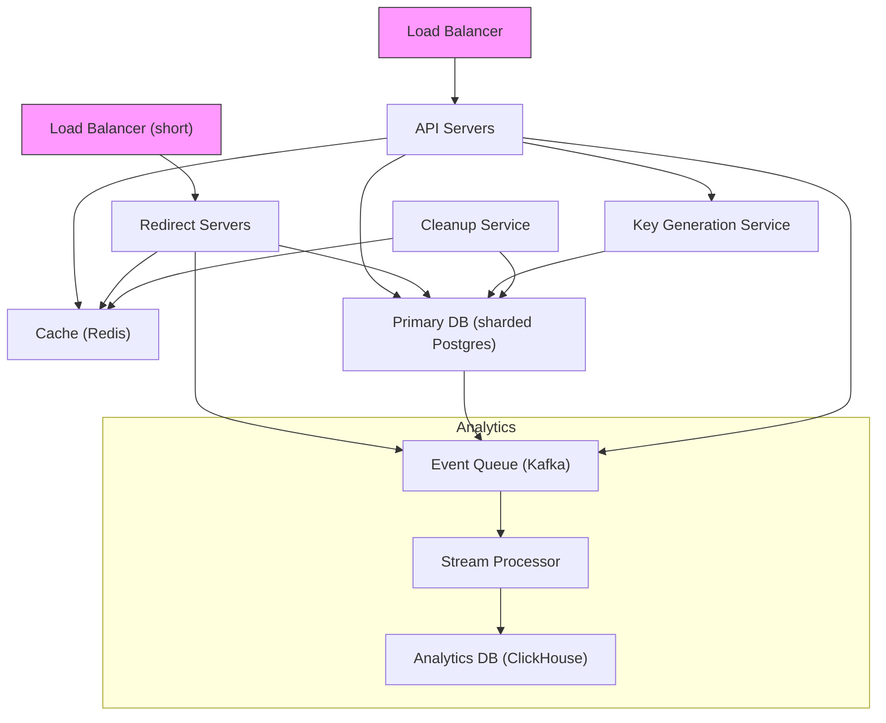
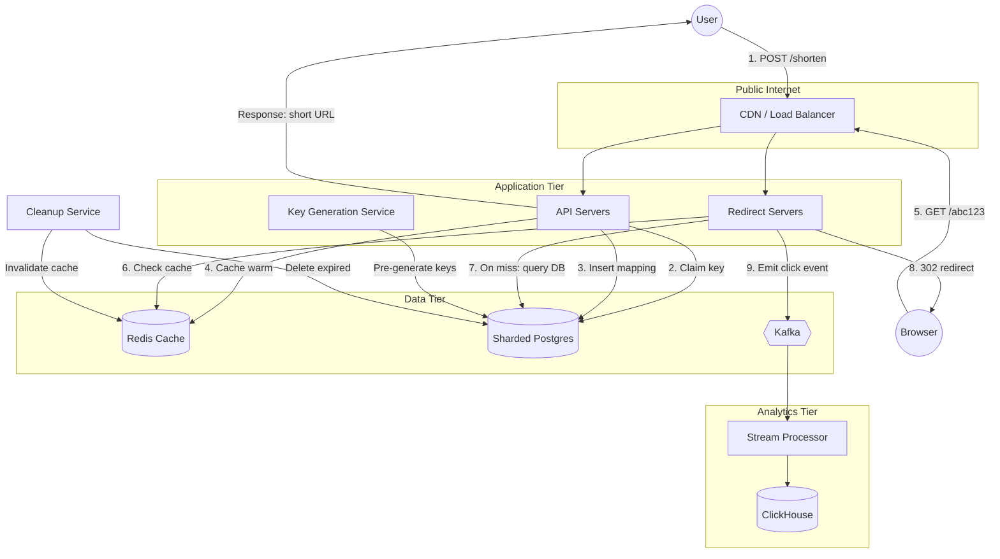

---

Design a URL shortener like bit.ly.


---

## System Design: URL Shortener (like bit.ly)

### 1. Requirements

**Functional**
- Given a long URL, generate a unique short URL (`bit.ly/abc123`)
- Redirect users from the short URL to the original long URL
- Allow custom aliases (optional)
- Set expiration time (optional)
- Basic analytics (click count, referrer, geolocation)
- REST API for shortening and retrieval

**Non-functional**
- High availability – 99.99% uptime
- Low latency – redirect < 100ms from any region
- Scalability – handle up to 1B new URLs/month
- Read-heavy: read-to-write ratio 100:1
- URL codes should never be guessable (no sequential IDs exposed)
- Durability – URLs must not be lost

### 2. Capacity Estimation

**Assumptions**
- 1 billion new URLs per month → ~400 writes/sec
- Read ratio 100:1 → ~40,000 reads/sec
- Average long URL length: 500 bytes
- Metadata (user, creation time, expiry): ~500 bytes
- Total per record: ~1 KB
- 1B URLs/month → 1 TB monthly storage → ~60 TB for 5 years

**Traffic**  
- Peak write: 2x average → 800 writes/sec  
- Peak read: 80,000 reads/sec  

**Bandwidth**  
- Write: 400 * (1 KB) = 400 KB/s incoming  
- Read: 40,000 * (1 KB response plus headers) ≈ 40 MB/s outgoing  

**Cache**  
- 20% of daily traffic accounts for 80% of reads → cache ~20% of recently accessed URLs  
- Cache size: (1B/30) * 0.2 * 1 KB ≈ 6.6 GB, plus headroom → 15 GB Redis cluster easily fits

### 3. High-Level Architecture



**Component roles**:

- **Load Balancer (LB)**: Distribute incoming HTTP requests.
- **API Servers**: Handle shorten requests, admin endpoints.
- **Redirect Servers**: Handle `GET /:shortCode`, perform 302 redirect. They are stateless and can be independently scaled.
- **Key Generation Service (KGS)**: Pre-generates unique 7‑character keys and stores them in a pool table in the DB.
- **Cache (Redis)**: Caches `shortCode → longUrl` mappings for hot URLs.
- **Primary Database**: Sharded relational DB (e.g., PostgreSQL) holding the core mapping, user data, and key pool.
- **Event Queue (Kafka)**: Durable log for click events and other operations.
- **Analytics DB (ClickHouse)**: Column‑oriented database for aggregation queries (click counts over time, referrers, etc.).
- **Cleanup Service**: Cron job or daemon that periodically removes expired URLs.

### 4. Detailed Design

#### 4.1 Database Schema (sharded Postgres)

We shard by `short_code` (the primary lookup key). Each shard holds a range of codes.

**Core `url_mapping` table** (one per shard):
```sql
CREATE TABLE url_mapping (
    short_code    VARCHAR(7) PRIMARY KEY,
    long_url      TEXT NOT NULL,
    user_id       BIGINT,
    created_at    TIMESTAMP DEFAULT NOW(),
    expires_at    TIMESTAMP,
    is_custom     BOOLEAN DEFAULT FALSE
);
CREATE INDEX idx_expires ON url_mapping(expires_at) WHERE expires_at IS NOT NULL;
```

**Key pool table** (separate, or co‑located with shards):
```sql
CREATE TABLE key_pool (
    key           VARCHAR(7) PRIMARY KEY,
    status        VARCHAR(10) DEFAULT 'free', -- 'free', 'used', 'reserved'
    reserved_at   TIMESTAMP
);
```
The KGS pre‑inserts batches of free keys. The API server atomically claims a key (e.g., `UPDATE key_pool SET status = 'used' WHERE key = (SELECT key FROM key_pool WHERE status='free' LIMIT 1) RETURNING key`).

**Analytics events** – stored in ClickHouse, not the main DB.

#### 4.2 Short Code Generation

Two mechanisms:

**Random Key from Pre‑generated Pool**
- KGS generates 7‑character base62 strings (a‑z, A‑Z, 0‑9). Total space: 62^7 ≈ 3.5 trillion.
- It ensures global uniqueness by checking against the DB before inserting into the pool.
- To avoid hotspots, the pool can be partitioned (e.g., each KGS instance has its own prefix/shard) or use a distributed lock.
- API server, when shortening, claims a key from the pool with a single atomic DB transaction.

**Custom Alias**
- User provides desired string. API server checks uniqueness in `url_mapping` and key_pool.
- If available, directly insert into `url_mapping` with `is_custom = true`.

**Why 7 characters?**  
62^6 = 56 billion is borderline for 1B/month (exhaustion ~4.7 years). 62^7 = 3.5 trillion provides over 290 years of capacity, well beyond system lifespan.

#### 4.3 Shortening Request Flow (Write)

1. Client sends `POST /shorten` with JSON body `{ long_url, custom_alias?, expiry? }`.
2. API server authenticates user (optional).
3. If `custom_alias` provided:
   - Check DB+Cache for existence; if taken, return conflict.
   - Insert mapping directly.
4. Else, claim a key from key pool:
   - Execute atomic SQL: `UPDATE key_pool SET status='used' WHERE key = (SELECT key FROM key_pool WHERE status='free' LIMIT 1) RETURNING key`.  
     (Or use a distributed counter like Snowflake and encode to base62 – then no pool needed.)
5. Insert into `url_mapping` (short_code, long_url, user_id, expires_at).
6. Return the generated short URL `https://short.domain/abc123`.
7. (Optional) Cache the mapping immediately with a TTL.

#### 4.4 Redirection Request Flow (Read)

1. Client hits `GET /:shortCode`.
2. Redirect server checks Redis cache:
   - If hit: respond with `302 Found` and `Location: long_url`. (Optionally 301 for permanent.)
   - If miss: query the DB shard responsible for this code.
3. If found and not expired:
   - Cache the mapping in Redis (TTL = min(24h, time-to-expire)).
   - Return 302.
4. If not found or expired: return 404 or a sorry page.
5. **Asynchronously** publish a click event to Kafka (short_code, timestamp, IP, User-Agent, referrer). A stream processor enriches and writes to ClickHouse.

#### 4.5 Analytics Data Pipeline

- **Producer**: Redirect servers (or API servers for API‑driven events) publish to Kafka topic `url‑clicks`.
- **Kafka**: Provides durability and decoupling. Partitioned by short_code for ordering.
- **Stream Processor**: Apache Flink or Kafka Streams consumes events, enriches with geolocation (from IP), referrer parsing, and aggregates per minute.
- **Sink**: Writes aggregated rows into ClickHouse table `click_events`:
  ```sql
  CREATE TABLE click_events (
      short_code String,
      timestamp  DateTime,
      referrer   String,
      country    String,
      count      UInt64
  ) ENGINE = SummingMergeTree() ORDER BY (short_code, timestamp, referrer, country);
  ```
- **API**: `GET /api/stats/:shortCode` queries ClickHouse for total clicks, daily counts, top referrers, etc.

#### 4.6 Cleanup Service

Runs every hour, scans `url_mapping` for `expires_at < now()` and:
- Deletes the mapping (or marks as expired, soft delete).
- Invalidates the Redis cache entry.
- Returns the key to the pool if it was a generated key (not custom). Could be done by setting `status='free'` in key_pool, but beware of race conditions with active reads (a window where the code still functions). Better to set a grace period or use a separate recycling process that waits until all caches are cold.

### 5. Scalability & Performance

**Database sharding**:  
- Partition `url_mapping` on `short_code` using consistent hashing. For 40k reads/sec, ~16‑32 shards (each handling ~2500 reads/sec) with read replicas will suffice.
- Key pool can be sharded similarly to avoid contention: for example, each KGS instance generates keys with a predefined shard prefix and only writes to its own shard’s pool.

**Caching**:  
- Redis cluster with read replicas. Cache 80% of hot reads; with 40k RPS and cache hit ratio 80%, DB handles only 8k RPS — easily managed by sharded DB.
- Use short TTL (e.g., 1 hour) to limit stale data for rarely accessed URLs.

**Rate limiting & abuse**:  
- Implement per‑IP rate limiting on both API and redirect endpoints.
- Use bloom filters to quickly reject obviously non‑existent codes before hitting DB/cache.

**Geo‑distribution**:  
- Deploy redirect servers in edge locations (CDN or multiple data centers) to reduce latency globally.
- Cross‑region replication for DB and Redis to serve local reads.

### 6. Trade‑offs & Alternatives

| Decision                | Chosen Approach               | Alternative                               | Why Chosen?                                                                 |
|-------------------------|-------------------------------|-------------------------------------------|-----------------------------------------------------------------------------|
| **Key generation**      | Pre‑generated pool + atomic DB | Hash of URL (MD5/SHA-1) with truncation  | Pool guarantees no collisions, no need for collision resolution. Hashes can collide and require retries, increasing latency. |
| **Database**            | Relational (PostgreSQL)        | NoSQL (Cassandra, DynamoDB)               | Strong consistency needed for key pool; SQL is well‑suited for sharded transactional workloads. Adds complexity of sharding. |
| **Cache**               | Redis                          | Memcached                                  | Redis provides richer data structures and built‑in replication.             |
| **Redirect response**   | 302 Found (temporary)          | 301 Moved Permanently                     | 302 allows future changes of destination and accurate analytics per click (browser re‑validates). 301 would bypass server, losing analytics. |
| **Custom aliases**      | Separate check & insert        | Same pool as generated keys               | Custom aliases require human-readable strings; mixing with random keys introduces complexity and bias in pool. |

### 7. Failure Points & Mitigation

| Failure Scenario                      | Impact                               | Mitigation                                                                                    |
|---------------------------------------|--------------------------------------|----------------------------------------------------------------------------------------------|
| **DB primary shard down**             | Writes and reads to that shard fail. | Use synchronous replication to a standby; automatic failover (e.g., Patroni/Stolon). Cache can serve reads temporarily if old data acceptable. |
| **Redis cluster down**                | Massive read load on DB.             | Redis sentinel/replicas; transiently, DB can handle increased load if capacity planned. Enable circuit‑breaker to fallback to DB directly. |
| **Key pool exhaustion**               | New URLs cannot be shortened.        | Monitor pool depth; KGS can generate keys in advance. Use longer codes (8 chars) if saturation approaches. Alerts at 70% utilization. |
| **KGS (Key Generator) failure**       | Pool not refilled; eventual exhaustion. | Multiple KGS instances per shard, no single point of failure; pool depth can absorb temporary outage. |
| **Click event data loss (Kafka)**     | Missing analytics.                   | Kafka replication (min.insync.replicas), producer acks=all. Analytics is not mission‑critical; eventual consistency acceptable. |
| **Expired URL cleanup race**          | Stale redirects or dirty reads.       | Use soft delete with grace period (5 minutes). Invalidate cache first, then delete; garbage‑collect keys after a buffer. |
| **Denial of Service (DDoS)**          | Service unavailable.                 | Cloud‑based DDoS protection (AWS Shield, Cloudflare). Aggressive rate limiting and caching at CDN level. |

### 8. Mermaid Diagram: System Components & Data Flow



### 9. Summary

The design prioritizes availability, low latency for redirects, and simplicity of key generation while keeping analytics out of the critical path. The main trade-off is the introduction of a key pool that adds operational complexity but eliminates collision hassle. With proper sharding, caching, and geo‑distribution the system can comfortably scale to billions of URLs and tens of thousands of queries per second. Failures are mitigated through replication, circuit breakers, and graceful degradation.