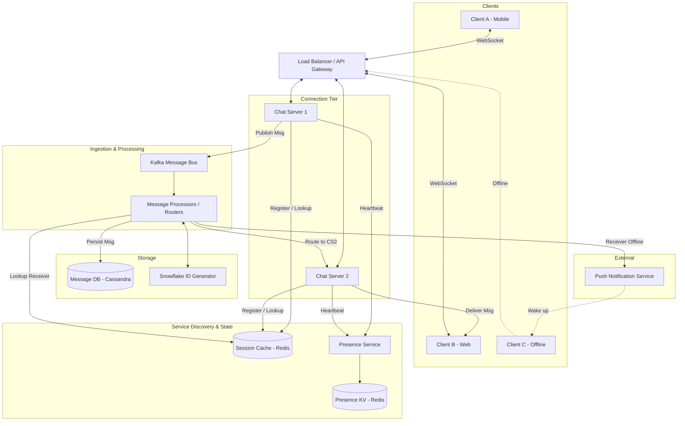

---

Design a real-time chat system like WhatsApp or Slack.

---

Here is a comprehensive system design for a real-time, highly concurrent chat application similar to WhatsApp or Slack.

---

# System Design: Real-Time Chat System

## 1. System Requirements & Scope

**Functional Requirements:**
*   1-on-1 and Group messaging (groups up to 500 members).
*   Message history and multi-device synchronization (Slack-style cloud history).
*   User presence (Online/Offline status).
*   Message delivery status (Sent, Delivered).

**Non-Functional Requirements:**
*   **Low Latency:** Real-time delivery (< 200ms).
*   **High Availability:** 99.99% uptime.
*   **Scalability:** Must handle millions of concurrent connections.
*   **Durability:** No lost messages.

---

## 2. Capacity Estimation & Math

Let's design for a scale similar to a mid-to-large tier messaging app.

*   **Daily Active Users (DAU):** 50 Million
*   **Concurrent Users (10% of DAU):** 5 Million active WebSocket connections
*   **Messages per user per day:** 100
*   **Average Message Size:** 250 bytes (including metadata, UUIDs, timestamps)

**Traffic (Throughput) Math:**
*   **Total Messages / Day:** $50 \text{M} \times 100 = 5 \text{ Billion messages/day}$
*   **Average Write QPS:** $5 \times 10^9 / 86400 \approx 58,000 \text{ msgs/sec}$
*   **Peak Write QPS (x2 multiplier):** $116,000 \text{ msgs/sec}$
*   **Read QPS:** Assuming a 1:1 read/write ratio on historical fetches = $\approx 60,000 \text{ reads/sec}$

**Storage Math:**
*   **Daily Storage:** $5 \times 10^9 \times 250 \text{ bytes} \approx 1.25 \text{ TB / day}$
*   **5-Year Storage:** $1.25 \text{ TB} \times 365 \times 5 \approx 2.3 \text{ PB}$
*   **Replication (x3):** $\approx 6.9 \text{ PB}$ over 5 years (requires horizontal scaling).

**Connection Math (Chat Servers):**
*   Assuming one modern server (e.g., written in Go/Erlang) can hold 100,000 concurrent WebSocket connections.
*   $5,000,000 \text{ connections} / 100,000 = 50 \text{ Chat Servers}$ just for maintaining connections.

---

## 3. High-Level Architecture

The system utilizes a stateful connection tier for real-time communication, decoupled from a stateless message-processing tier using a message broker.

---

## 4. Component Deep Dive

### 4.1. The Connection Tier (Chat Servers)
Clients connect to a **Chat Server** via WebSockets. These servers are *stateful* because they hold open TCP connections.
*   **Load Balancing:** The LB uses consistent hashing (based on UserID) or a simple Round Robin to assign a client to a Chat Server. 
*   **Session Management:** When Client A connects to `ChatServer-1`, the server writes a record to the **Session Cache (Redis cluster)**: `User_A -> ChatServer-1`. 

### 4.2. Message Routing & Processing
1.  Client A sends a message intended for Client B to `ChatServer-1`.
2.  `ChatServer-1` drops the message into a **Kafka** topic (`chat_ingest`).
    *   *Why Kafka?* It acts as a shock-absorber. If 10 million users send a message at midnight on New Year's Eve, Chat Servers won't crash the database. Kafka buffers the spike.
3.  A stateless **Message Processor** consumes the message. It generates a globally unique Message ID via a **Snowflake ID Generator**.
4.  The Processor persists the message to **Cassandra**.
5.  The Processor queries the **Session Cache** for Client B.
    *   *If Client B is Online:* It finds `User_B -> ChatServer-2`. The processor publishes the message to a fast internal bus (e.g., Redis Pub/Sub or gRPC stream) subscribed to by `ChatServer-2`. `ChatServer-2` pushes it via WebSocket to Client B.
    *   *If Client B is Offline:* The processor sends a payload to the **Push Notification Service** (APNs/FCM).

### 4.3. Storage Tier (Cassandra)
Chat systems are heavily Write-Intensive, with Read patterns mostly focused on recent sequential data (fetching the last 50 messages of a conversation). **Apache Cassandra** (or DynamoDB) is the perfect fit.

**Data Schema:**
*   **Table:** `messages`
*   **Partition Key:** `chat_id` (Ensures all messages for a specific 1-on-1 or group chat live on the same physical node).
*   **Clustering Key:** `message_id` (A Snowflake ID, which contains a timestamp, ensuring messages are naturally sorted chronologically on disk).

### 4.4. Presence Service (Online/Offline)
Tracking 50M users' online status in real-time is expensive.
*   **Heartbeats:** Chat servers ping the Presence Service every 5 seconds.
*   **Storage:** Stored in Redis as `UserID -> {Status: Online, LastActive: Timestamp}` with a TTL of 10 seconds.
*   **Tradeoff (Fan-out vs. Pull):** Instead of broadcasting "User A is online" to all 500 of User A's contacts (massive write fan-out), the client *pulls* presence data only for the chats currently visible on the user's screen. We only push presence updates for the *active, open chat window*.

---

## 5. Explicit Tradeoffs Made

### 5.1. WebSocket vs. Server-Sent Events (SSE) / Long-Polling
*   **Decision:** WebSocket.
*   **Tradeoff:** WebSockets are bi-directional, minimizing HTTP header overhead on every message (saving massive bandwidth). The downside is infrastructure complexity; load balancers must maintain long-lived connections, and rolling deployments of Chat Servers will aggressively disconnect clients, causing reconnection thundering herds.

### 5.2. Group Chat Routing: Fan-out on Write vs. Fan-out on Read
*   **Decision:** Fan-out on Write for standard groups (< 500 users).
*   **Tradeoff:** When User A sends a message to a 100-person group, the Message Processor duplicates the message in memory and routes it to 100 different Chat Servers. This is fast and reliable. However, if we allowed Slack-style 10,000+ member channels, Fan-out on Write would cause huge processing spikes. *If scope expanded to massive channels, we would switch to Fan-out on Read, where clients pull from a channel-specific queue.*

### 5.3. Consistency vs. Availability in Storage
*   **Decision:** Eventual Consistency (Cassandra).
*   **Tradeoff:** We prioritize High Availability and Write Speed over strict ACID transactions. There is a small edge case where a user might fetch message history and miss a message that was written milliseconds ago to a different replica. For chat applications, this eventual consistency (resolving in < 100ms) is acceptable.

---

## 6. What Could Fail & How to Handle It

### 6.1. Chat Server Crash (Thundering Herd)
*   **Failure:** `ChatServer-1` dies, dropping 100,000 WebSockets instantly.
*   **Consequence:** 100,000 clients simultaneously attempt to reconnect to the Load Balancer.
*   **Mitigation:** Clients must implement **Exponential Backoff with Jitter** for reconnections. The Load Balancer redistributes the load across the remaining 49 servers. The dead server's Redis Session mapping will naturally expire via TTL.

### 6.2. Database Slower than Ingestion (Kafka Lag)
*   **Failure:** Cassandra nodes experience disk degradation, slowing down writes.
*   **Consequence:** Message Processors slow down.
*   **Mitigation:** Kafka retains the incoming messages. The chat system degrades gracefully—users see a "Sent" tick (message ingested into Kafka) but it takes longer to get a "Delivered" tick. No messages are lost.

### 6.3. Message Out of Order
*   **Failure:** Network jitters cause Message A to reach the processor after Message B, even though A was sent first.
*   **Mitigation:** Snowflake IDs are generated at the *Processor* level, so they reflect processing time, not strictly user send time. To fix client-side visual jumping, clients assign a temporary local `sequence_id` to messages. The client UI renders the message instantly based on local time, and silently syncs the definitive `message_id` when the server ACKs it.

### 6.4. Split Brain / Redis Session Stale
*   **Failure:** A user's phone drops Wi-Fi and connects to 5G. They reconnect to `ChatServer-2`, but Redis still thinks they are on `ChatServer-1` for a brief moment.
*   **Mitigation:** When a client reconnects, the new Chat Server explicitly overwrites the Redis session key. The Message Processor always reads the most current Redis value. Any messages routed to the stale `ChatServer-1` will fail to deliver; the Processor can catch this failed delivery ACK and re-queue the message for re-evaluation.