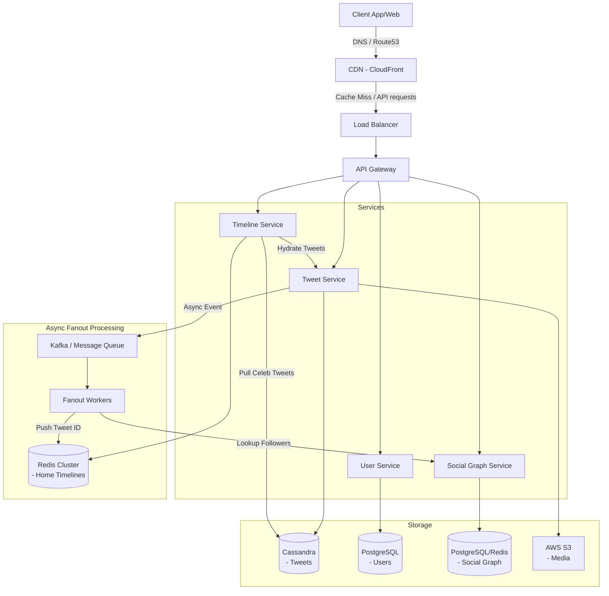

---

Design a microblogging platform like Twitter.

---

Here is a thorough, self-contained system design for a microblogging platform like Twitter. 

---

# System Design: Microblogging Platform (Twitter Clone)

## 1. Requirements & Scope

**Functional Requirements:**
*   Users can post tweets (text up to 280 characters + images/videos).
*   Users can follow and unfollow other users.
*   Users have a **Home Timeline**: a chronological stream of tweets from users they follow.
*   Users have a **User Timeline**: a chronological stream of their own tweets.

**Non-Functional Requirements:**
*   **Highly Available:** Read availability is paramount.
*   **Low Latency:** Timeline generation should take < 200ms.
*   **Eventual Consistency:** It is acceptable if a follower sees a tweet a few seconds after it is posted.
*   **Scale:** Must handle global traffic and the "Celebrity Problem" (highly skewed follow graphs).

---

## 2. Capacity Planning & Math

We will design for a massive global scale (roughly mid-era Twitter scale).

**Assumptions:**
*   **Daily Active Users (DAU):** 300 Million
*   **Write Rate:** Average 0.5 tweets/user/day $\rightarrow$ 150 Million tweets/day.
*   **Read Rate:** Average 100 timeline views/user/day $\rightarrow$ 30 Billion reads/day.
*   **Read/Write Ratio:** 200:1 (Extremely read-heavy).

**Throughput:**
*   **Writes:** $150,000,000 / 86,400 \approx \textbf{1,730 TPS}$. Peak $\approx \textbf{5,000 TPS}$.
*   **Reads:** $30,000,000,000 / 86,400 \approx \textbf{347,000 QPS}$. Peak $\approx \textbf{1,000,000 QPS}$.

**Storage (1 Year Runway):**
*   **Tweet Text + Metadata:** ~1 KB per tweet. 
    *   $150M \text{ tweets/day} \times 1 \text{ KB} = 150 \text{ GB/day}$.
    *   $150 \text{ GB} \times 365 = \textbf{55 TB/year}$.
*   **Media (Images/Video):** Assume 20% of tweets have media, average size 100 KB.
    *   $150M \times 0.2 \times 100 \text{ KB} \approx 3 \text{ TB/day}$.
    *   $3 \text{ TB} \times 365 \approx \textbf{1.1 PB/year}$.

**Bandwidth:**
*   **Ingress:** $(150 \text{ GB} + 3 \text{ TB}) / 86,400 \text{ sec} \approx \textbf{36 MB/sec}$.
*   **Egress:** $30 \text{ Billion reads/day} \times (1 \text{ KB} + 20 \text{ KB media avg}) \approx 630 \text{ TB/day} \approx \textbf{7.3 GB/sec}$. *(Heavy reliance on CDN required).*

---

## 3. High-Level Architecture

The architecture utilizes a microservices approach, decoupling the highly scalable read path from the write path.

---

## 4. Core Component Design & Tradeoffs

### A. Data Modeling & Databases
*   **Tweets (Cassandra / DynamoDB):** 
    *   *Why?* We need immense write throughput and flat key-value lookups. Relational DBs will choke on 55TB of row data without complex sharding.
    *   *Schema:* `tweet_id` (Partition Key), `user_id`, `content`, `media_urls`, `timestamp`.
*   **Users (PostgreSQL):** 
    *   *Why?* User profiles update infrequently but require ACID guarantees for billing, authentication, and state.
*   **Social Graph (PostgreSQL + Redis):**
    *   *Schema:* `follower_id`, `followee_id`, `timestamp`. 
    *   *Cache:* Redis Sets (`follower:USER_ID` -> `[Set of Followees]`).

### B. ID Generation (Snowflake)
We cannot rely on database auto-increment IDs for tweets in a distributed system. We use **Twitter Snowflake**, a 64-bit integer generating chronologically sortable IDs.
*   41 bits: Timestamp (Epoch in ms).
*   10 bits: Machine/Worker ID.
*   12 bits: Sequence number (prevents collisions in the same millisecond).

### C. The Timeline Generation Strategy (The Hardest Problem)

Serving timelines at 1,000,000 QPS requires explicit tradeoffs. We use a **Hybrid (Push + Pull) Model**.

**1. Fan-out on Write (Push Model) - For Normal Users**
*   *How:* When User A tweets, a background worker fetches all of User A's followers. It pushes the `tweet_id` into a Redis List belonging to each follower.
*   *Read Path:* $O(1)$. When a follower requests their timeline, the Timeline Service simply fetches their Redis List.
*   *Tradeoff:* **The Justin Bieber Problem.** If a user with 100 million followers tweets, pushing to 100M Redis lists takes minutes, causing heavy CPU usage and delaying timeline delivery.

**2. Fan-out on Read (Pull Model) - For Celebrities**
*   *How:* Users with > 1 million followers are marked as "Celebrities". When they tweet, the tweet is saved to Cassandra, but *not* pushed to followers' Redis lists.
*   *Read Path:* When a user requests their timeline, the system checks who they follow. If they follow celebrities, it queries those celebrities' recent tweets from Cassandra and merges them in memory with the user's Redis List.
*   *Tradeoff:* Higher read latency, but drastically protects the write/fan-out pipeline from collapsing.

---

## 5. API Design

*   `POST /v1/tweets`
    *   **Body:** `{ "content": "Hello World", "media_ids": ["img123"] }`
    *   **Response:** `{ "tweet_id": "8493029102", "timestamp": "..." }`
*   `GET /v1/timelines/home`
    *   **Params:** `cursor=184920` (Pagination), `limit=20`
    *   **Response:** `[{ "tweet_id": "...", "content": "..." }, ...]`
*   `POST /v1/users/follow`
    *   **Body:** `{ "target_user_id": "12345" }`

---

## 6. What Could Fail? (Resiliency & Mitigations)

### Failure Mode 1: Cache Stampede (Thundering Herd)
**Scenario:** A celebrity posts a controversial tweet, deleting it immediately. Millions of users refresh. The Redis cache expires or misses, causing all 1,000,000 QPS to hit Cassandra simultaneously, bringing the database down.
**Mitigation:** 
*   **Request Coalescing:** If 10,000 requests come in for the same celebrity timeline and it's missing from cache, only *one* thread is allowed to query Cassandra. The other 9,999 requests wait for the first thread to populate the cache and then read from it.

### Failure Mode 2: Redis Cluster Outage
**Scenario:** The Redis cluster holding pre-computed Home Timelines crashes.
**Mitigation:** 
*   **Graceful Degradation:** The system falls back to a pure "Pull" model. The Timeline Service queries the Social Graph for followees, then queries Cassandra for all their recent tweets. 
*   *Caveat:* This is slow. We would rate-limit timeline fetches and disable complex features (like search) to dedicate compute to bare-minimum timeline generation until Redis is rebuilt.

### Failure Mode 3: Hot Partitions in Cassandra
**Scenario:** If Cassandra is partitioned solely by `user_id`, a highly active user might exceed the partition size limit (e.g., 100MB), causing imbalanced nodes.
**Mitigation:** 
*   Use a composite partition key: `(user_id, month_year)`. This bounds the maximum size of a partition to one month's worth of tweets per user, ensuring even distribution of data across the Cassandra cluster.

### Failure Mode 4: Asynchronous Fan-out Backlog
**Scenario:** Kafka gets backed up during a major global event (e.g., the Super Bowl or an election). Timelines become stale.
**Mitigation:** 
*   Prioritize traffic routing. Introduce multiple Kafka topics: `fanout_high_priority` (for active users currently online) and `fanout_low_priority` (for users who haven't logged in for 30 days). Fanout workers scale dynamically based on topic lag.