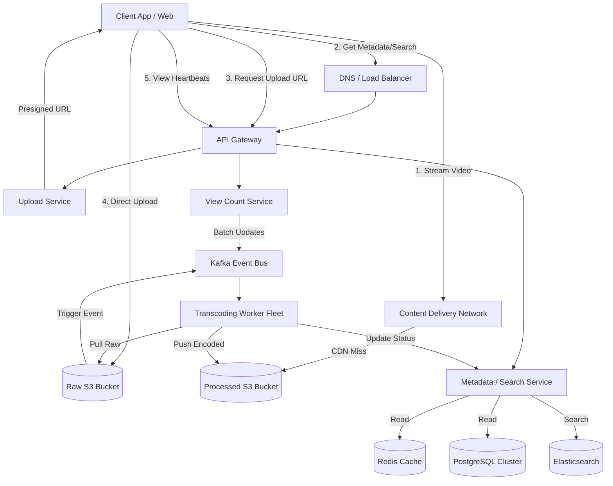

---

Design a video sharing platform like YouTube.


---

Here is a comprehensive, production-ready system design for a video sharing platform like YouTube.

---

# System Design: Video Sharing Platform (YouTube Clone)

## 1. Scope & Requirements
**Core Features:**
*   **Upload:** Users can upload videos (potentially large files).
*   **Process:** System encodes videos into multiple resolutions (1080p, 720p, etc.) for Adaptive Bitrate Streaming (ABR).
*   **View:** Users can smoothly stream videos globally with minimal buffering.
*   **Discover:** Search and view metadata (title, likes, view counts).

**Out of Scope (for focus):** Live streaming, Ads/Monetization, Recommendation ML models (we will design the data ingestion for it, but not the ML pipeline).

**System Characteristics:**
*   Highly Available (Viewing is strictly prioritized over immediate upload consistency).
*   Read-heavy architecture (Read:Write ratio is typically 1000:1 or more).
*   High bandwidth and massive storage requirements.

---

## 2. Capacity Planning & Math
*Assumptions: Target scale of 500 Million Daily Active Users (DAU).*

**Traffic Estimates:**
*   **Viewing (Read):** 5 videos watched per DAU/day = **2.5 Billion views/day**.
    *   Average Read QPS: $2.5B / 86,400 \approx \mathbf{29,000 \text{ QPS}}$. Peak: $\sim \mathbf{60,000 \text{ QPS}}$.
*   **Uploading (Write):** 1 in 1,000 users uploads 1 video/day = **500,000 uploads/day**.
    *   Average Write QPS: $\approx \mathbf{6 \text{ QPS}}$ (Low request rate, but massive payload).

**Storage Estimates:**
*   **Raw Uploads:** Average video size = 1 GB.
    *   $500,000 \times 1 \text{ GB} = \mathbf{500 \text{ TB/day}}$ of raw video.
*   **Processed Video:** Transcoding into multiple formats (H.264, VP9) and resolutions (360p to 4K) roughly doubles the raw size.
    *   Total encoded size per video = 2 GB.
    *   Total storage generated: $500,000 \times (1\text{GB} + 2\text{GB}) \approx \mathbf{1.5 \text{ PB/day}}$.
    *   **Yearly Storage:** $1.5 \text{ PB} \times 365 = \mathbf{547 \text{ PB/year}}$.

**Bandwidth Estimates:**
*   **Ingress (Upload):** 500 TB/day / 86,400 = $\mathbf{\sim 5.8 \text{ GB/sec}}$.
*   **Egress (Viewing):** Assume average stream size is 100 MB (watching part of a 720p video).
    *   $2.5 \text{ Billion} \times 100 \text{ MB} = \mathbf{250 \text{ PB/day}}$.
    *   Total Egress Bandwidth: $250 \text{ PB} / 86,400 = \mathbf{\sim 2.9 \text{ TB/sec}}$. *(This massive number dictates that we MUST use a global CDN; our origin servers cannot handle this).*

---

## 3. High-Level Architecture

The architecture is divided into two distinct paths: **The Write Path (Upload)** and **The Read Path (Viewing/Metadata)**.



---

## 4. Detailed Component Design

### 4.1. The Write Path (Video Upload & Processing)
Uploading massive files directly through application servers causes CPU/Memory bottlenecks and ties up connections.

1.  **Presigned URLs:** The client requests an upload token from the `Upload Service`. The service generates an AWS S3 Presigned URL.
2.  **Multipart Upload:** The client directly uploads the file to the `Raw S3 Bucket` in chunks (e.g., 5MB parts). If a network drop occurs, only the failed chunk is retried.
3.  **Event-Driven Processing:** Once S3 confirms the complete upload, it fires an event to a **Kafka** topic (`video-uploaded`).
4.  **Transcoding Fleet:** A distributed fleet of worker nodes (auto-scaled based on Kafka lag) pulls the video.
    *   They use FFmpeg to split the video into 10-second segments.
    *   They encode the segments into multiple resolutions (1080p, 720p, etc.) and generate a manifest file (HLS/DASH formats).
5.  **Storage & Metadata:** Encoded chunks are saved to the `Processed S3 Bucket`. The worker notifies the `Metadata Service` to change the video status from "Processing" to "Published".

### 4.2. The Read Path (Video Streaming)
We use **Adaptive Bitrate Streaming (ABR)** via protocols like HLS (HTTP Live Streaming) or MPEG-DASH.

1.  **Metadata Fetch:** The client requests video details. The `Metadata Service` returns the video title, description, and the URL to the video's `.m3u8` or `.mpd` manifest file.
2.  **Manifest & Chunks:** The client requests the manifest from the **CDN**. Based on the client's current network speed, the video player seamlessly switches between downloading 1080p chunks and 480p chunks.
3.  **CDN Hierarchy:** We use a multi-tier CDN (Edge caches $\rightarrow$ Regional caches $\rightarrow$ Origin S3). This minimizes origin egress costs and ensures >90% cache hit ratios for popular videos.

### 4.3. Data Models (Databases)

**Relational DB (PostgreSQL) - Video Metadata**
Sharded by `VideoID` to handle the large dataset.
```sql
TABLE Videos {
    VideoID UUID PRIMARY KEY,
    UserID UUID,
    Title VARCHAR(255),
    Description TEXT,
    ManifestURL VARCHAR(255),
    ThumbnailURL VARCHAR(255),
    Status ENUM ('Processing', 'Published', 'Failed'),
    CreatedAt TIMESTAMP
}
```

**NoSQL / Wide-Column (Cassandra) - High Volume Interactions**
Used for likes, dislikes, and comments, which scale rapidly and don't require strict ACID compliance across the whole database.
```text
TABLE User_Interactions {
    VideoID UUID,       // Partition Key
    UserID UUID,        // Clustering Key
    InteractionType ENUM,
    Timestamp TIMESTAMP
}
```

---

## 5. Explicit Tradeoffs Made

| Decision | Alternative Considered | Why this choice? |
| :--- | :--- | :--- |
| **Client direct upload to S3** | Uploading via our API Gateway / App Servers. | Uploading via API holds connections open for minutes/hours, exhausting server connection pools. S3 handles massive concurrent ingests natively. |
| **HLS/DASH over HTTP** | Custom UDP protocol or RTMP. | HTTP segments are cacheable by standard CDNs (Akamai, Cloudflare). Custom protocols cannot be easily cached at the edge, requiring massive proprietary server farms. |
| **Asynchronous View Counts** | Synchronous `UPDATE table SET views = views+1`. | At 29k QPS, synchronous updates to a single RDBMS row (for a viral video) will cause massive database lock contention. Eventual consistency is perfectly acceptable for view counts. |
| **Microservices architecture** | Monolith. | Transcoding requires heavy GPU/CPU compute (C++ instances). Metadata requires high memory for caching (General purpose instances). Decoupling allows independent scaling of these wildly different hardware profiles. |

---

## 6. What Could Fail? (Failure Scenarios & Mitigations)

### 1. The "Viral Video" Thundering Herd (Cache Stampede)
*   **Failure:** A celebrity posts a video. Millions of people request the metadata simultaneously before the cache is populated. All requests miss the cache and hit PostgreSQL, instantly crashing the database.
*   **Mitigation:** Implement **Probabilistic Early Expiration (PERF)** or **Cache Promise/Locking**. When the cache misses, only *one* request is allowed to query the DB; it places a "lock" in Redis. Other requests wait a few milliseconds and read the populated cache.

### 2. Transcoding Worker Crashes Mid-Job
*   **Failure:** A worker node dies (OOM, hardware failure) while 80% done encoding a 4K video.
*   **Mitigation:** Kafka requires an explicit `ACK` from the worker when a job is *finished*. If the worker drops off ZooKeeper/Kafka without ACKing, the message times out and is reassigned to a new worker. Processing is strictly idempotent.

### 3. CDN Regional Outage
*   **Failure:** A major CDN provider (e.g., Cloudflare) goes down in Europe, preventing streaming.
*   **Mitigation:** **Multi-CDN Strategy**. Client video players are programmed to fall back to a secondary manifest URL pointing to a different CDN (e.g., Akamai or AWS CloudFront) if video chunks return 5xx errors or time out.

### 4. View Count Fraud / Spam
*   **Failure:** Bots spam the View Count API to artificially inflate video popularity.
*   **Mitigation:** The client doesn't send "increment view" requests. Instead, it sends periodic "heartbeats" (e.g., every 10 seconds of playback) containing a signed token, user IP, and timestamp. A stream processing engine (like **Apache Flink**) analyzes these heartbeats in real-time, deduplicates them, filters bot IPs, and aggregates legitimate views before batch-updating the database.