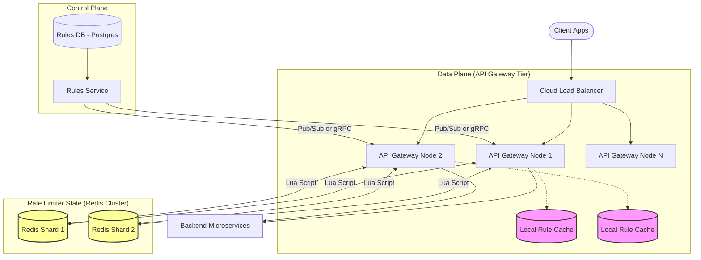

---

Design a distributed rate limiter to protect an API gateway.


---

Here is a comprehensive system design for a distributed rate limiter protecting an API Gateway.

## 1. System Requirements & Assumptions

**Functional Requirements:**
*   Limit requests based on an identifier (User ID, API Key, or IP Address).
*   Support varying limits based on tiers (e.g., Free: 100 req/min, Premium: 5,000 req/min).
*   Return HTTP 429 (Too Many Requests) when limits are exceeded.

**Non-Functional Requirements:**
*   **Ultra-Low Latency:** The rate limiter must add minimal overhead to the critical path (target: < 5ms).
*   **High Availability:** The API must not go down if the rate limiter fails (Fail-open design).
*   **High Throughput:** Handle 1,000,000 requests per second (RPS) globally.
*   **Accuracy:** Minimize race conditions in a highly distributed environment without sacrificing latency.

---

## 2. Capacity Planning & Math

Let's size the system for **1,000,000 RPS** peak and **100 million active API keys**.

### Storage (Memory) Calculation
We will use the **Token Bucket** algorithm. For each API key, we must store two values:
1.  `tokens_remaining` (Integer, 4 bytes)
2.  `last_refill_timestamp` (Unix timestamp, 8 bytes)

Assuming we use a key-value store like Redis:
*   Key size: ~20 bytes (e.g., `user:123456789`)
*   Value size: ~12 bytes
*   Redis overhead per key: ~40 bytes
*   **Total per user:** ~72 bytes. Let's round up to 100 bytes for padding.
*   **Total Memory:** $100,000,000 \text{ keys} \times 100 \text{ bytes} \approx 10 \text{ Gigabytes}$.
*   *Conclusion:* The entire state comfortably fits in the RAM of a single modern server, but we will shard for CPU/throughput reasons.

### Throughput & Network Calculation
*   At 1,000,000 RPS, we need 1,000,000 Read/Write operations per second to the datastore.
*   A single-threaded Redis node can safely process ~80,000 - 100,000 operations per second.
*   **Sharding Requirement:** We need a Redis Cluster with at least **15-20 primary nodes** to handle 1M RPS without CPU bottlenecking.
*   **Bandwidth:** $1,000,000 \text{ ops/sec} \times 150 \text{ bytes (request+response)} \approx 150 \text{ MB/s}$. Easily handled by standard 10Gbps or 25Gbps datacenter networks.

---

## 3. High-Level Architecture

We will separate the system into a **Data Plane** (handling the live requests) and a **Control Plane** (managing the rate limit rules).



### Component Breakdown
1.  **API Gateway Nodes:** Instead of a standalone Rate Limiter service (which adds a network hop), the rate-limiting logic is executed as an interceptor/middleware directly on the API Gateway (e.g., Envoy, Kong, or custom Go/Rust gateway).
2.  **Local Rule Cache:** Each Gateway node keeps an in-memory cache of the rate limit *rules* (e.g., "Tier A gets 1000/sec"). Updates are pushed via the Control Plane.
3.  **Redis Cluster:** The central source of truth for the token buckets. Sharded by `Hash(API_Key) % N_Shards`.
4.  **Control Plane:** A CRUD service backed by Postgres that allows admins to update rate limit tiers. It pushes changes to the gateways via Pub/Sub or periodic polling.

---

## 4. Core Algorithm & Concurrency Handling

We use the **Token Bucket** algorithm evaluated via a **Redis Lua Script**.

### Why Token Bucket?
It allows for short bursts of traffic while enforcing an overall average rate. It is highly memory efficient compared to Sliding Window Logs.

### Preventing Race Conditions
If Node 1 and Node 2 receive requests for the same API key at the exact same millisecond, a standard `GET` -> `Calculate` -> `SET` routine will result in a race condition (over-admitting requests).
To fix this, the evaluation must be atomic. We pass a Lua script to Redis. Redis guarantees that Lua scripts are executed atomically.

**Simplified Lua Script Logic executed on Redis:**
```lua
local rate = tonumber(ARGV[1])      -- e.g., 10 tokens per sec
local capacity = tonumber(ARGV[2])  -- e.g., 100 max tokens
local now = tonumber(ARGV[3])       -- current timestamp
local requested = tonumber(ARGV[4]) -- usually 1

local last_tokens = tonumber(redis.call("hget", KEYS[1], "tokens"))
if last_tokens == nil then last_tokens = capacity end

local last_refill = tonumber(redis.call("hget", KEYS[1], "timestamp"))
if last_refill == nil then last_refill = now end

-- Calculate refilled tokens
local delta = math.max(0, now - last_refill)
local filled_tokens = math.min(capacity, last_tokens + (delta * rate))

-- Make a decision
if filled_tokens >= requested then
    local new_tokens = filled_tokens - requested
    redis.call("hset", KEYS[1], "tokens", new_tokens, "timestamp", now)
    redis.call("expire", KEYS[1], math.ceil(capacity/rate)) -- Cleanup memory
    return 1 -- Allowed
else
    return 0 -- Rejected (429)
end
```

---

## 5. Explicit Tradeoffs & Optimizations

At 1M RPS, calling Redis for every single request introduces strict dependency and latency. Here are the tradeoffs we must consider.

### Tradeoff 1: Strict Accuracy vs. Latency (The Local Sync Approach)
*   **Strict Approach (Designed above):** Every request queries Redis. guarantees 100% accuracy.
    *   *Pros:* Perfect enforcement.
    *   *Cons:* 1-3ms latency penalty per request. Massive load on Redis.
*   **Relaxed Approach (The Stripe/Cloudflare Optimization):** API Gateways hold local token buckets in memory. If a node allows 10 requests, it asynchronously subtracts 10 from the central Redis cluster every second.
    *   *Pros:* Zero latency overhead (evaluates in nanoseconds). Massively reduces Redis RPS (e.g., from 1M to 10k).
    *   *Cons:* Allows temporary over-limit bursts. If a user has a limit of 100/sec, and hits 5 gateways simultaneously, they might get 500 requests through before the global state catches up.
*   **Decision:** For financial/mutation APIs, use Strict. For read-heavy, high-volume APIs, use Relaxed. I recommend a **configurable toggle per rule**.

### Tradeoff 2: Handling Hot Keys (Thundering Herd)
If a single bad actor blasts the API with 100,000 RPS on a single API key, all those requests hash to a single Redis node, causing CPU exhaustion on that specific shard.
*   **Mitigation (Local Block Caching):** If the Redis Lua script returns `0` (Rejected), the API Gateway caches that rejection locally for a short duration (e.g., 2 seconds). Subsequent requests for that key are rejected instantly at the Gateway layer without ever contacting Redis.

---

## 6. What Could Fail? (Resiliency & Failure Modes)

A rate limiter sits directly in the critical path. We must engineer for its failure.

1.  **Redis Cluster Outage:**
    *   *Failure:* The API Gateway cannot reach Redis (connection refused or timeout).
    *   *Mitigation:* **Fail-Open Policy**. If the rate limiter is unreachable, allow the request to pass to the backend. It is better to risk higher load on backends than to take down the entire business.
    *   *Secondary Mitigation:* Fallback to a strictly local, in-memory rate limiter on the Gateway node with a conservative default limit while Redis is down.

2.  **High Network Latency / Redis Slowdown:**
    *   *Failure:* Redis gets bogged down (e.g., due to a BGSAVE operation), and Lua scripts take 50ms instead of 1ms. Gateway worker threads block, causing a cascading failure to clients.
    *   *Mitigation:* **Strict Timeouts**. Network calls to Redis must have a strict timeout (e.g., `5ms`). If the timeout is breached, the fallback Fail-Open policy is triggered.

3.  **Clock Drift:**
    *   *Failure:* The servers calculating the time (`now`) have drifting system clocks, causing token refill math to skew.
    *   *Mitigation:* Use the Gateway node's local time and pass it as an argument (`ARGV[3]`) to Redis, rather than using Redis's `TIME` command. NTP (Network Time Protocol) must be strictly enforced on all Gateway nodes to keep drift within milliseconds.

4.  **Control Plane Outage:**
    *   *Failure:* The Postgres DB or Rules Service goes down.
    *   *Mitigation:* API Gateways rely entirely on their locally cached rules. Admins won't be able to update limits, but live traffic evaluation continues uninterrupted.