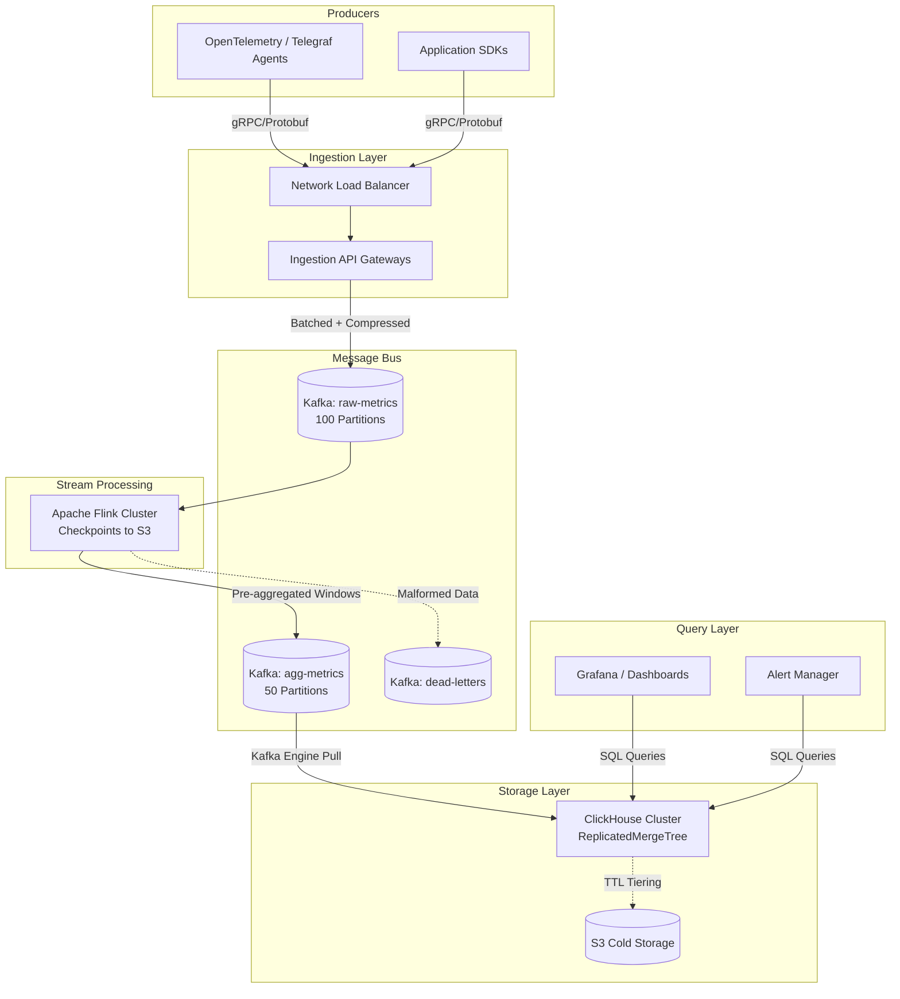

---

Design a real-time metrics aggregation pipeline that handles 100 billion events/day.

---

Here is a comprehensive system design for a real-time metrics aggregation pipeline capable of processing 100 billion events per day.

## 1. Executive Summary
This system is designed to ingest, aggregate, and store high-throughput metric data (counters, gauges, histograms) in real-time. It relies on a **Push-based** model using **Apache Kafka** for durable ingestion, **Apache Flink** for stateful stream processing (aggregation), and **ClickHouse** for high-cardinality time-series storage and analytical querying. 

## 2. Capacity Math & Sizing Requirements

### Throughput & Bandwidth
*   **Total Volume:** $100,000,000,000$ events / day.
*   **Average TPS:** $100 \times 10^9$ / $86,400$ seconds $\approx$ **$1.15$ million events/second (eps)**.
*   **Peak TPS:** Assuming a 2.5x peak-to-average multiplier $\approx$ **$2.8$ million eps**.
*   **Payload Size:** Assume an average event size of **100 bytes** (using Protocol Buffers). 
    *   *Fields:* `timestamp` (8B), `metric_id` (4B), `value` (8B), `dimensions/tags` (~80B).
*   **Ingress Bandwidth (Peak):** $2.8 \times 10^6 \times 100$ bytes $\approx$ **$280$ MB/sec ($\approx 2.2$ Gbps)**. 
    *   *Note:* 2.2 Gbps is easily handled by modern cloud networks, but requires partitioning across multiple brokers.

### Storage 
*   **Kafka Raw Storage:** $100$ bytes $\times 100$ Billion $\approx 10$ TB/day.
    *   With Snappy compression (approx. 3x ratio): $3.3$ TB/day.
    *   With Replication Factor of 3 and 3 days retention: **$\approx 30$ TB** total Kafka raw storage.
*   **Aggregation Ratio:** Assuming windowing (e.g., 1-minute tumbling windows) reduces data volume by a factor of 50. 
    *   Aggregate output: $2$ Billion events/day.
*   **Database (ClickHouse) Storage:** 
    *   $2$ Billion rows/day $\times ~50$ bytes (highly compressed columnar format) $\approx$ **$100$ GB/day**.
    *   Yearly DB storage requirement (hot): **$36$ TB**.

---

## 3. Architecture Diagram

---

## 4. Component Deep Dive

### 4.1 Ingestion Layer
*   **Protocol:** Agents send data using **gRPC** and **Protocol Buffers**. This enforces a strict schema and drastically reduces payload size compared to JSON.
*   **API Gateways:** Stateless Go or Rust microservices. Their only job is to receive connections, validate API keys, batch incoming single events into larger chunks (e.g., 500ms or 50KB batches), compress them (Snappy/LZ4), and write to Kafka.

### 4.2 Message Bus (Apache Kafka)
*   **Setup:** A cluster of ~15-20 brokers. 
*   **Partitioning:** The `raw-metrics` topic needs high parallelism. Using **100 partitions** allows up to 100 Flink consumers. Data is partitioned by `hash(tenant_id + metric_name)` to ensure all data for a specific metric goes to the same partition, which is required for accurate stateful windowing.

### 4.3 Stream Processing (Apache Flink)
Flink is chosen over Spark Streaming because it natively supports event-time processing with low latency, and handles massive state securely.
*   **Windowing:** We use **Tumbling Windows** based on *Event Time* (e.g., 1 minute). 
*   **Watermarks:** A watermark strategy of `BoundedOutOfOrderness(10 seconds)` is used. If an event arrives 10 seconds later than the current max event time, it is processed. If it arrives 1 hour late, it is dropped or sent to a side output.
*   **Pre-Aggregation (The "Combiner" Pattern):** To prevent OOM errors, Flink does not store all raw events in memory. As events arrive, Flink keeps a running accumulator: `sum`, `count`, `min`, `max`.
*   **Percentiles:** Exact percentiles require storing every data point (O(N) memory). We use the **T-Digest algorithm**. T-Digest estimates percentiles (p90, p99) highly accurately using O(1) memory by clustering data points into centroids.

### 4.4 Storage Layer (ClickHouse)
ClickHouse is optimized for high-ingestion rate and high-cardinality aggregations.
*   **Ingestion:** ClickHouse uses its native `Kafka Engine` to read directly from the `agg-metrics` Kafka topic. Materialized views transfer data from the Kafka table to the final `ReplicatedMergeTree` table.
*   **Tiering:** Data < 7 days old is stored on NVMe SSDs for fast dashboard loading. Data > 7 days is moved via TTL policies to S3-backed storage (Zero-copy tiering).

---

## 5. Explicit Tradeoffs Made

| Tradeoff | Decision | Justification |
| :--- | :--- | :--- |
| **Push vs. Pull** | **Push Model** (Agents push to API) | At 100B events, keeping track of scrape targets (Pull model like Prometheus) across ephemeral containers/serverless functions is brittle. Push scales horizontally via LB. |
| **Exact vs. Approx Percentiles** | **Approximate (T-Digest)** | Calculating exact p99 for 3 million eps requires terabytes of RAM. T-Digest provides >99% accuracy with a fixed memory footprint per window. |
| **Event Time vs. Processing Time** | **Event Time with 10s Watermark** | Processing time creates wildly inaccurate metrics if network delays occur. Event time ensures accurate aggregations, trading off a fixed 10-second delay in dashboard visibility. |
| **Data Format** | **Protocol Buffers** | JSON is human-readable but introduces huge parsing overhead and bandwidth bloat. Protobuf enforces schemas at the edge, saving network and CPU cycles. |

---

## 6. What Could Fail & How to Handle It

### 6.1 Data Skew / "Hot Key" Problem
*   **Failure:** A single tenant or metric (e.g., `cpu_usage` with no dimensions) receives 1 million eps. Because Kafka partitions by hash, one Flink TaskManager receives all 1M eps and crashes (OOM or CPU starvation).
*   **Mitigation:** Implement **Two-Stage Aggregation** in Flink. 
    1.  *Stage 1 (Local):* Add a random salt (1-100) to the key. Aggregate locally on all TaskManagers for 10 seconds.
    2.  *Stage 2 (Global):* Remove the salt and aggregate the pre-aggregated results. This limits the throughput hitting the final node to 100 eps max.

### 6.2 "Poison Pill" Events
*   **Failure:** A malformed Protobuf payload or an event with a timestamp from the year 2099 causes Flink to crash or keep windows open indefinitely (OOM).
*   **Mitigation:** 
    *   Wrap deserialization in a `try/catch`. 
    *   Send unparseable events to a **Dead Letter Queue (DLQ)** Kafka topic for debugging.
    *   Implement sanity checks on timestamps (`current_time - 1 hour < timestamp < current_time + 5 mins`).

### 6.3 Kafka Broker Outage
*   **Failure:** An AWS AZ goes down, taking down 33% of Kafka brokers.
*   **Mitigation:** 
    *   Topics are configured with `replication.factor=3` and `min.insync.replicas=2` distributed across 3 AZs.
    *   Producers use `acks=all`. During an AZ loss, leader election causes a brief pause (~2 seconds), but no data is lost. Agents buffer locally during the pause.

### 6.4 Flink State Crash
*   **Failure:** A Flink node dies. The running aggregations for the current 1-minute window are stored in its RAM.
*   **Mitigation:** Flink is configured with **RocksDB State Backend** and incremental checkpointing to S3 every 30 seconds. Upon node failure, the JobManager spins up a new TaskManager, restores state from S3, and rewinds the Kafka consumer offsets to the checkpoint. We achieve Exactly-Once semantics using two-phase commits to the output Kafka topic.

### 6.5 ClickHouse Zookeeper Spikes
*   **Failure:** High insertion rates cause Zookeeper (used by ClickHouse for replication) to bottleneck, halting ingestion.
*   **Mitigation:** Use **ClickHouse Keeper** (a RAFT-based C++ replacement for Zookeeper). Ensure ClickHouse reads from Kafka in large batches (e.g., every 5 seconds or 100,000 rows) rather than row-by-row, as MergeTree engines handle large sequential writes vastly better than small random writes.