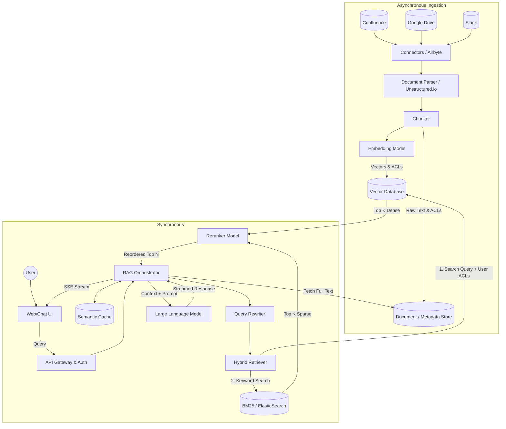

---

Design a retrieval-augmented generation (RAG) assistant that answers user questions based on a company's internal documents.

---

Here is a comprehensive system design for an Enterprise Retrieval-Augmented Generation (RAG) Assistant.

## 1. System Overview & Constraints
We are designing a centralized AI assistant capable of answering natural language questions based on internal company documents (Wikis, Jira, Slack, PDFs, Code). 

### Key Constraints & Requirements
*   **Accuracy & Hallucination Prevention:** The system must ground answers *strictly* in retrieved documents and provide citations.
*   **Access Control (RBAC):** Users must only receive answers based on documents they have authorization to read.
*   **Data Freshness:** Document updates should be reflected in the search index within 15 minutes.
*   **Latency:** Time-to-first-token (TTFT) must be under 2 seconds.

---

## 2. Capacity Planning & Math
Assume the system is built for a medium-to-large enterprise.

*   **User Base:** 10,000 employees.
*   **Usage:** 30% Daily Active Users (3,000 DAU). Average 10 queries per DAU/day = **30,000 queries/day**.
*   **Throughput:** 30,000 / 28,800 (8-hour workday) $\approx$ **1.04 QPS average**. Peak load estimated at **5 QPS**.
*   **Corpus Size:** 1,000,000 internal documents.
    *   Average document length: 2,500 words ($\approx$ 3,300 tokens).
    *   Chunking strategy: 500 tokens per chunk with 50-token overlap.
    *   Total chunks: $\approx$ 7,000,000 chunks.
*   **Vector Storage Sizing:**
    *   Embedding model (e.g., `text-embedding-3-small` or BGE-M3): 1536 dimensions.
    *   Size per vector: 1536 * 4 bytes (float32) $\approx$ 6 KB.
    *   Total Vector Data: 7,000,000 * 6 KB $\approx$ **42 GB**.
    *   Metadata (ACLs, URLs, titles): $\approx$ 2 KB per chunk = **14 GB**.
    *   *Total RAM required for Vector DB (In-memory index for speed):* **~60 GB** (Easily handled by a single high-memory instance, but we will replicate for High Availability).
*   **LLM Inference (Tokens/Day):**
    *   Context window per query: Top 10 chunks (5,000 tokens) + System Prompt (500 tokens) = 5,500 input tokens.
    *   Total input tokens/day: 30,000 * 5,500 = **165M tokens/day**.

---

## 3. Architecture Diagram

---

## 4. Component Deep Dive & Tradeoffs

### 4.1. Data Ingestion & Processing
*   **Document Parsing:** Standard text extraction breaks tables and ignores images. 
    *   *Design Choice:* Use OCR/layout-aware parsers (like Unstructured.io or Docling) to maintain tabular structures as Markdown. 
*   **Chunking Strategy:** 
    *   *Tradeoff:* Semantic chunking (splitting by logical headers) yields better LLM context but is computationally expensive during ingestion. Fixed-size chunking (500 tokens, 50 overlap) is fast but cuts off sentences.
    *   *Decision:* Hybrid approach. Split by Markdown headers first, then apply fixed-size chunking if a section exceeds 500 tokens.
*   **Embedding Model:** 
    *   *Decision:* Self-hosted `BGE-M3` (generates both dense and sparse embeddings) to prevent internal data from leaving the VPC during ingestion.

### 4.2. Storage & Retrieval (The Vector DB)
*   **Technology Choice:** 
    *   *Options:* Pinecone (Managed), pgvector (Relational), Qdrant/Milvus (Dedicated Vector DB).
    *   *Tradeoff:* `pgvector` makes RBAC joins trivial but scales poorly beyond 10M vectors. Pinecone requires sending internal data to a third party.
    *   *Decision:* **Qdrant**. It supports high-performance HNSW indexing, sparse/dense vectors natively, and allows for strict Payload Filtering (which we use for RBAC).
*   **Access Control (RBAC) Implementation:** 
    *   When ingestion connectors pull a document, they pull the associated ACL (Group IDs that can read it).
    *   These Group IDs are stored as a list in the Qdrant vector payload.
    *   At query time, the API Gateway resolves the user's Group IDs via the Identity Provider (e.g., Okta). The Orchestrator passes these IDs to Qdrant, doing a *pre-filtering* step before the vector similarity search. **This guarantees a user cannot retrieve unauthorized chunks.**

### 4.3. The Query Orchestrator
*   **Query Rewriting / HyDE:** Users ask lazy questions ("How do I set up the VPN?"). The Orchestrator calls a small, fast LLM to rewrite this into: "Steps to configure Cisco AnyConnect VPN for remote access on Mac and Windows." This drastically improves vector search accuracy.
*   **Hybrid Search & Reranking:**
    *   *Dense Search (Embeddings):* Good for semantic meaning.
    *   *Sparse Search (BM25):* Good for exact acronyms/IDs (e.g., "Error code ORA-00942").
    *   *Decision:* Fetch the top 20 results from Dense and top 20 from Sparse. Pass all 40 to a **Cross-Encoder Reranker** (e.g., `bge-reranker-large`). The Reranker scores the exact relevance of each chunk to the query and returns the top 5 to feed to the LLM. *Tradeoff:* Adds ~100-150ms of latency, but reduces hallucination by ensuring only highly relevant context reaches the LLM.

### 4.4. Generation (LLM)
*   *Prompt Engineering:* The system prompt must be aggressive: `You are an internal assistant. Answer ONLY using the context provided. If the context does not contain the answer, say "I cannot find the answer in the provided documents." Always cite the document ID.`
*   *Streaming:* Because LLM generation takes 2-5 seconds, the Orchestrator uses Server-Sent Events (SSE) to stream tokens to the UI as they are generated, achieving a Time-To-First-Token (TTFT) of ~500ms.

---

## 5. Failure Modes & Mitigations

### Failure 1: The "Lost in the Middle" Phenomenon
*   **Problem:** If we pass 20 chunks to the LLM, it often ignores facts located in the middle of the context window.
*   **Mitigation:** The Reranker enforces a strict cutoff (only top 5-7 chunks are passed). Additionally, we instruct the Orchestrator to place the highest-scoring chunks at the very beginning and very end of the prompt context.

### Failure 2: Access Control Leakage
*   **Problem:** An executive document's permissions are changed to "Restricted," but the RAG system index takes 24 hours to update, leaking data.
*   **Mitigation:** Webhooks from source systems (Confluence/Drive) push permission updates directly to a fast-path API on the Orchestrator, which immediately updates the Qdrant payload via a partial payload update, bypassing the slow re-embedding pipeline.

### Failure 3: Database/API Latency Spikes
*   **Problem:** Repeated questions (e.g., "What are the new HR holidays?") burn LLM compute and slow down the system.
*   **Mitigation:** Introduce a **Semantic Cache** (e.g., Redis + RedisVL). Before querying the Vector DB, we embed the user query and search the cache. If a previous query has a >0.95 cosine similarity, we return the cached LLM response immediately. 

### Failure 4: Hallucinations via "Poisoned" Context
*   **Problem:** The retriever pulls a heavily outdated document (e.g., a 2019 IT policy), and the LLM confidently presents it as current fact.
*   **Mitigation:** 
    1. Apply time-decay to vector search scores (boost newer documents). 
    2. Append the `[Last Modified Date]` to the text of every chunk during ingestion so the LLM explicitly "sees" how old the data is and can warn the user.