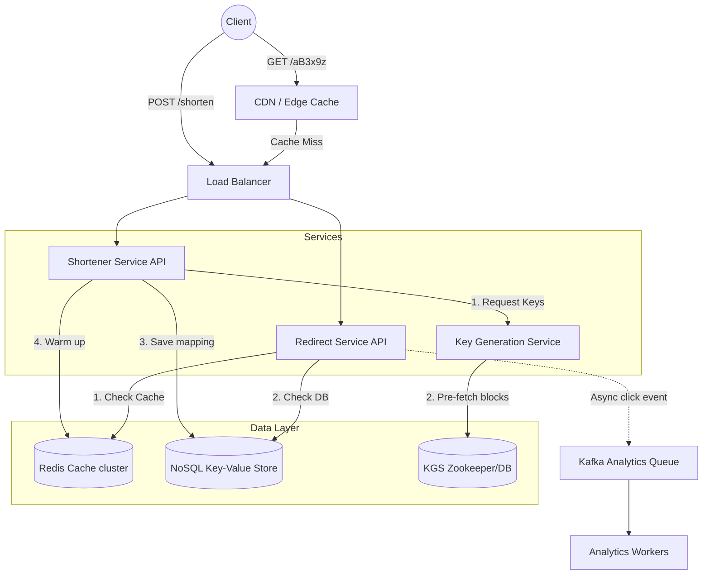

---

Design a URL shortener like bit.ly.

---

Here is a comprehensive system design for a URL shortener like bit.ly. 

---

## 1. System Requirements

**Functional Requirements:**
*   **Shortening:** Given a long URL, generate a highly available, unguessable short URL (e.g., `bit.ly/3x8aB9`).
*   **Redirection:** Given a short URL, redirect the user to the original long URL.
*   **Custom URLs:** Users can optionally specify a custom alias.
*   **Analytics:** Track click counts (out of scope for deep design, but architecture must support it).

**Non-Functional Requirements:**
*   **High Availability:** The redirect service cannot go down. If it does, millions of links break.
*   **Low Latency:** Redirection should add minimal overhead (< 50ms).
*   **Scalability:** The system is heavily read-skewed (estimated 100:1 read-to-write ratio).

---

## 2. Capacity Estimation & Constraints (The Math)

Let's assume this system operates at a moderate-to-large global scale.

*   **Traffic Assumptions:**
    *   **Writes:** 100 million new URLs generated per month.
    *   **Reads:** 100:1 read/write ratio $\rightarrow$ 10 billion redirects per month.
*   **Throughput (RPS):**
    *   **Writes:** $100,000,000 / (30 \times 24 \times 3600) \approx \mathbf{40 \text{ RPS}}$ average. (Peak: 200 RPS).
    *   **Reads:** $10,000,000,000 / (30 \times 24 \times 3600) \approx \mathbf{4,000 \text{ RPS}}$ average. (Peak: 20,000 RPS).
*   **Storage Assumptions (10-year retention):**
    *   Total Records: $100 \text{ million} \times 12 \text{ months} \times 10 \text{ years} = \mathbf{12 \text{ billion records}}$.
    *   Record Size: Short URL (7 bytes) + Long URL (up to 2048 bytes) + CreatedAt (8 bytes) + UserID (8 bytes) + Overhead $\approx \mathbf{2.5 \text{ KB}}$.
    *   Total Storage: $12 \text{ billion} \times 2.5 \text{ KB} \approx \mathbf{30 \text{ TB}}$.
*   **Memory (Caching) Assumptions:**
    *   We will cache 20% of daily read requests (Pareto principle: 20% of links generate 80% of traffic).
    *   Daily Reads: $4,000 \text{ RPS} \times 86,400 \text{ seconds} \approx 345 \text{ million}$.
    *   Cache Size: $345 \text{ million} \times 0.2 \times 2.5 \text{ KB} \approx \mathbf{172 \text{ GB}}$. (This easily fits in a standard Redis cluster).

---

## 3. High-Level Architecture Diagram

---

## 4. Core Algorithm: Shortening Logic

To support 12 billion records, we need a short string. Using **Base62 encoding** (A-Z, a-z, 0-9) is standard.
*   A 6-character Base62 string allows $62^6 \approx 56 \text{ billion}$ combinations.
*   A 7-character Base62 string allows $62^7 \approx 3.5 \text{ trillion}$ combinations.
*   *Decision:* **7 characters** to ensure we never run out and can support random/unguessable generation.

### How to generate the 7-character string?
*   *Approach 1: Hash the long URL (MD5) and take the first 7 chars.* **Flaw:** High risk of collisions. Handling collisions requires DB lookups and appending sequences, increasing write latency.
*   *Approach 2: Distributed Auto-Increment ID.* Convert a unique base-10 ID to Base62. **Flaw:** Predictable. If someone shortens a URL and gets `bit.ly/1000`, they know `bit.ly/0999` exists.
*   *Approach 3: Pre-Generated Keys via Key Generation Service (KGS).* **Winner.** 
    *   A standalone **KGS** generates random 7-character Base62 strings offline and stores them in a database.
    *   When the Shortener Service needs a key, it pulls one from KGS.
    *   This guarantees uniqueness, prevents collisions entirely at runtime, and keeps write latency strictly to DB inserts.

---

## 5. Detailed Component Design

### A. Key Generation Service (KGS)
To ensure high write performance, the KGS avoids hitting its database for every request.
1.  The KGS maintains two tables: `unused_keys` and `used_keys`.
2.  KGS instances load a "block" of keys (e.g., 10,000 keys) into memory and mark them as "used" in the DB.
3.  The Shortener API requests a key, and KGS serves it from memory in `<1ms`.
4.  If a KGS instance dies, the keys in its memory are lost. *Tradeoff:* Losing 10,000 keys out of 3.5 trillion is a perfectly acceptable loss to gain massive speed and eliminate single points of failure.

### B. Database Choice: NoSQL Key-Value Store
We need to store 30TB of data. The query pattern is extremely simple: `SELECT long_url FROM urls WHERE short_url = ?`. There are no relational joins.
*   **Choice:** **Amazon DynamoDB** or **Apache Cassandra**.
*   **Why:** They offer seamless horizontal scaling, extremely fast point-reads (O(1) lookups via hash ring), and high availability. An RDBMS (like PostgreSQL) would require complex manual sharding to handle 30TB and 20k read RPS.

### C. Caching Layer
*   **Choice:** **Redis Cluster**.
*   **Eviction Policy:** **LRU (Least Recently Used)**. 
*   **Logic:** When the Redirect Service receives a request, it checks Redis. If missing, it queries the DB, stores the result in Redis, and redirects the user.
*   **Write-around:** When a new URL is generated, the Shortener API can proactively inject it into the Cache (Cache warming).

### D. Redirection HTTP Status Codes (Explicit Tradeoff)
When returning the Long URL, we must choose an HTTP Redirect status code.
*   **HTTP 301 (Permanent Redirect):** The browser caches the redirect permanently. Subsequent visits skip our servers entirely. *Pros:* Lowest latency for user, lowest server load. *Cons:* We cannot track click analytics after the first click.
*   **HTTP 302 (Temporary Redirect):** The browser hits our server every time. *Pros:* We capture 100% of analytics (location, device, time). *Cons:* Higher load on our systems.
*   **Decision:** Support both. Default to **302** for businesses that need analytics. Allow users to toggle **301** for pure performance links.

---

## 6. What Could Fail? (Failure Modes & Mitigations)

### Failure 1: Cache Stampede (Thundering Herd)
*   **Scenario:** A massive influencer drops a short link. It gets 50,000 RPS. The link expires from Redis. Suddenly, 50,000 requests hit the NoSQL database simultaneously, causing a localized brownout (Hot Partition).
*   **Mitigation:** Implement a **Mutex Lock (Cache Lock)**. When a cache miss occurs, only the *first* thread is allowed to query the database. The other 49,999 threads wait a few milliseconds and check the cache again.

### Failure 2: Malicious URLs (Phishing / Malware)
*   **Scenario:** Bad actors use the service to mask malicious links, causing our domain (`bit.ly`) to be blacklisted by ISPs.
*   **Mitigation:** 
    *   Asynchronous scanning: Upon creation, push the link to a Kafka queue. A background worker checks the long URL against the **Google Safe Browsing API**. 
    *   If flagged, update the DB record `is_banned = true`. The Redirect Service will return an HTTP 403 Forbidden with a warning page.

### Failure 3: Data Center Outage
*   **Scenario:** The primary AWS region goes down.
*   **Mitigation:** Use a globally distributed NoSQL database (e.g., DynamoDB Global Tables or Cassandra multi-datacenter replication). Use DNS routing (Route53) to failover traffic to a secondary region. Because writes are async-replicated, some links generated in the last ~100ms might be temporarily lost, which is acceptable in a catastrophic DC failure.

### Failure 4: Exhaustion of KGS Memory Pool
*   **Scenario:** Traffic spikes dramatically, and the App servers burn through their in-memory KGS keys before the KGS can fetch more from the DB.
*   **Mitigation:** App servers should fetch keys asynchronously. When the in-memory pool drops below 20%, a background thread fetches the next batch of 10,000 keys, ensuring the main request thread never blocks waiting for keys.

---

## 7. Analytics & Tracking (Brief Overview)
Since 10 billion clicks occur monthly, synchronous tracking would crash the Redirect API.
*   Instead of writing to a DB during the redirect, the Redirect Service drops a tiny JSON payload (ShortURL, Timestamp, IP, UserAgent) onto a **Kafka Topic**.
*   A stream processing framework (e.g., Apache Flink or Spark Streaming) aggregates these clicks in real-time (e.g., grouping by minute, country, browser).
*   The aggregated data is written to an OLAP database (like ClickHouse or Amazon Redshift) for the user dashboard to query efficiently.