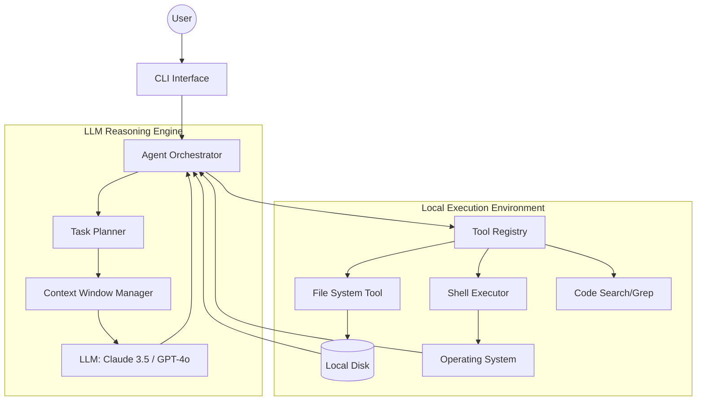

---

Design a terminal-based AI coding agent that can complete software engineering tasks.

---

This system design specifies a terminal-based AI coding agent (similar to Devin or OpenDevin) capable of autonomous software engineering. The agent operates in a **Reason-Act-Observe** loop, interacting with a local filesystem and a shell environment.

---

### 1. System Architecture

The system is designed as a decoupled loop where the LLM acts as the "brain" and a local runtime acts as the "body."

### 2. Component Detailed Design

#### A. The Agent Orchestrator (The Loop)
The orchestrator implements a state machine that manages the lifecycle of a task. It prevents the agent from entering infinite loops and manages the transition between planning and execution.

1.  **Input:** A high-level natural language goal.
2.  **Planning Phase:** The LLM generates a sequence of intended steps (e.g., "1. Locate auth logic, 2. Add JWT validation, 3. Run tests").
3.  **Execution Phase:** The LLM emits a specific tool call (JSON formatted).
4.  **Observation Phase:** The orchestrator executes the tool and feeds the `stdout` or file content back to the LLM.
5.  **Reflection Phase:** The LLM evaluates the observation and decides if the task is complete or requires a plan pivot.

#### B. Tool Registry (The Capabilities)
To avoid "hallucinated" capabilities, the agent is restricted to a strict set of tools:
*   **`read_file(path)`**: Returns the content of a file.
*   **`write_file(path, content)`**: Overwrites or creates a file.
*   **`apply_diff(path, diff)`**: Applies a unified diff to a file (more token-efficient than full writes).
*   **`execute_shell(command)`**: Runs a command in the terminal. Returns `stdout` and `stderr`.
*   **`list_files(directory)`**: Recursive directory listing to map the project structure.
*   **`search_code(query)`**: Wrapper around `ripgrep` for fast keyword searching.

#### C. Context Window Manager
Since codebases can exceed LLM context limits (e.g., 128k tokens), we implement a **Dynamic Context Strategy**:
*   **Working Set:** Only files currently being edited are kept in full.
*   **Summarization:** Once a file is processed, the agent stores a summary (purpose, exported functions) and drops the full content from the active prompt.
*   **Sliding Window:** Old tool outputs are pruned or compressed to make room for new observations.

---

### 3. Capacity Math & Constraints

We must calculate the token budget to ensure the agent doesn't "forget" the goal or crash due to context overflow.

**Assumptions:**
*   **LLM Context Window:** 128,000 tokens.
*   **Average Line of Code:** 10 tokens.
*   **Project Size:** 50,000 lines of code ($\approx 500k$ tokens).

**Token Budget Allocation:**
1.  **System Prompt:** 2,000 tokens (Tool definitions, persona, constraints).
2.  **Task Goal & Plan:** 1,000 tokens.
3.  **File Index/Map:** 3,000 tokens (A list of all filenames and high-level summaries).
4.  **Active Working Set:** 20,000 tokens ($\approx 2,000$ lines of code).
5.  **Conversation History (Observations):** 10,000 tokens.
6.  **Reserved for LLM Response:** 4,000 tokens.

**Total Used:** $\approx 39,000$ tokens.
**Safety Margin:** $\approx 89,000$ tokens.

**Throughput Calculation:**
*   Average LLM latency: $2s$ for reasoning + $10s$ for generating a long code block.
*   Average tool execution: $0.5s$ for FS, $2s-30s$ for tests.
*   **Agent Cycle Time:** $\approx 15 \text{ to } 45$ seconds per "thought step."

---

### 4. Tradeoffs and Design Decisions

#### Full File Write vs. Diff-based Edits
*   **Full Write:** LLM sends the entire file.
    *   *Pro:* Extremely reliable; no "offset" errors.
    *   *Con:* Massive token waste; slow; high risk of truncating large files.
*   **Diff-based:** LLM sends a `search-and-replace` block.
    *   *Pro:* Token efficient; fast.
    *   *Con:* High risk of failure if the LLM misses a character or the file has changed.
*   **Decision:** Use **Search-and-Replace blocks**. The orchestrator will attempt to apply the diff; if it fails, it will automatically trigger a "Read File" and ask the LLM to retry the diff.

#### Sandbox vs. Native Shell
*   **Native Shell:** Direct access to the user's terminal.
    *   *Pro:* No setup; full access to local compilers/SDKs.
    *   *Con:* **Critical Security Risk.** An LLM could hallucinate `rm -rf /` or execute a malicious script found in a dependency.
*   **Docker Sandbox:** The agent runs inside a container.
    *   *Pro:* Safe; reproducible.
    *   *Con:* Requires mounting volumes; complicates access to GUI tools or specific hardware.
*   **Decision:** Use **Dockerized Runtime** with a restricted set of capabilities, mounting only the specific project directory.

---

### 5. Failure Modes and Mitigations

| Failure Mode | Mitigation Strategy |
| :--- | :--- |
| **Infinite Loop** (AI tries the same failing test) | Implement a **Max-Iteration Limit** (e.g., 10 attempts per sub-task). If exceeded, the agent must stop and ask the user for guidance. |
| **Context Drift** (AI forgets the original goal) | **Goal Anchoring**: Inject the original user goal and the current plan into every single prompt, regardless of history depth. |
| **Hallucinated Files** (AI tries to read a file that doesn't exist) | The `read_file` tool returns a specific `FileNotFound` error. The orchestrator converts this into a "Correction Prompt" forcing the agent to run `list_files`. |
| **Destructive Commands** (AI runs `npm install` and breaks dependencies) | **Snapshotting**: Use a filesystem like ZFS or simple Git commits before allowing the agent to run "write" or "shell" operations. Allow one-click rollback. |
| **Token Exhaustion** | **LRU Cache for Files**: If the context limit is hit, the manager drops the oldest read file from the prompt and replaces it with a 1-sentence summary. |