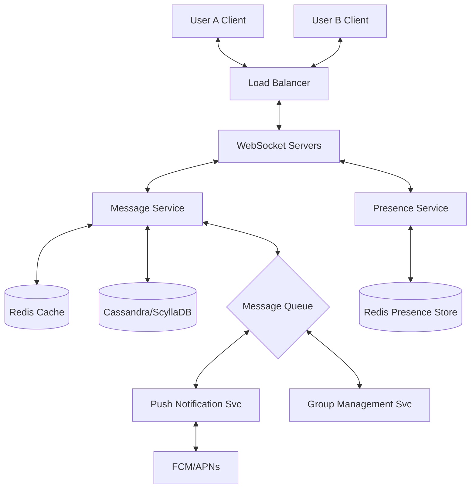

---

Design a real-time chat system like WhatsApp or Slack.

---

This design describes a highly scalable, real-time chat system capable of supporting hundreds of millions of users, focusing on low latency, high availability, and eventual consistency for message delivery.

### 1. Requirements & Scale

#### Functional Requirements
- **One-on-One Chat:** Real-time messaging between two users.
- **Group Chat:** Messaging among multiple users.
- **Presence:** Online/Offline status.
- **Delivery Status:** Sent $\to$ Delivered $\to$ Read.
- **Persistence:** Message history across devices.
- **Push Notifications:** Alerting offline users.

#### Capacity Estimation (Scale)
Assume **100 Million Daily Active Users (DAU)**.
- **Messages per user/day:** 50 messages.
- **Total Messages/Day:** $100\text{M} \times 50 = 5\text{B}$ messages.
- **Average Message Size:** 200 bytes.
- **Total Storage/Day:** $5\text{B} \times 200\text{B} \approx 1\text{TB/day}$.
- **Peak QPS (Writes):** Average is $\sim 58\text{k}$ msg/s. Peak (3x) $\approx 175\text{k}$ msg/s.
- **Presence Updates:** If users heartbeat every 30s, that's $\sim 3.3\text{M}$ requests/s.

---

### 2. High-Level Architecture

The system uses a **WebSocket-based** approach for bidirectional communication and a **NoSQL** backbone for high-write throughput.

---

### 3. Detailed Component Design

#### A. Connection Layer (WebSocket Servers)
Since HTTP is request-response and too heavy for chat, we use **WebSockets**. 
- **Statefulness:** Unlike REST, WebSocket servers are stateful. They maintain a mapping of `UserId $\to$ ConnectionObject`.
- **Scaling:** To scale, we use a **Consistent Hashing** ring or a session store (Redis) to track which server a specific user is connected to.
- **Handshake:** Client performs an HTTP Upgrade request $\to$ Server upgrades to WebSocket.

#### B. Message Service & Storage
The Message Service handles the business logic of routing and persisting messages.

**Database Choice: Cassandra/ScyllaDB**
We need a database optimized for writes and sequential reads (scrolling through chat history).
- **Schema:**
    - `Table: messages`
    - `Partition Key: conversation_id` (Groups messages by chat)
    - `Clustering Key: message_id` (Time-ordered UUID)
- **Why?** Cassandra provides linear scalability and handles the $1\text{TB/day}$ write load efficiently via LSM-trees.

**Message Flow:**
1. User A sends message to `WebSocket Server 1`.
2. Server 1 forwards it to `Message Service`.
3. `Message Service` writes to `Cassandra` and `Redis` (for recent history).
4. `Message Service` queries the `Presence Service` to find User B's location.
5. If User B is on `WebSocket Server 2`, the message is forwarded there and pushed to User B.
6. If User B is offline, a message is sent to `Kafka` $\to$ `Push Notification Service`.

#### C. Presence Service
Presence is the "chattiest" part of the system. To avoid overloading the DB:
- **Heartbeat:** Clients send a "ping" every 30 seconds.
- **Storage:** Use **Redis** with a TTL (Time-to-Live) of 60 seconds.
- **Optimization:** Instead of pushing presence updates to all friends (which is $O(N^2)$), we use a **Pull Model**. When User A opens a chat with User B, the client requests User B's status.

#### D. Group Chat Handling
For small groups, we simply iterate through the member list and send individual messages. For large groups (e.g., Slack channels):
- **Fan-out on Load:** When a message is sent to a group, the `Group Service` identifies all active members.
- **Message Queue:** Use Kafka to decouple the sender from the delivery to 1,000+ recipients. This prevents the `Message Service` from hanging while trying to notify a massive group.

---

### 4. Technical Trade-offs & Deep Dives

#### Trade-off: Strong vs. Eventual Consistency
- **Decision:** Eventual Consistency.
- **Reasoning:** In a global chat app, Availability is more important than Consistency (CAP Theorem). If a user sees a message 500ms after it was sent, it's acceptable. However, we ensure **causal consistency** by using monotonically increasing IDs (e.g., Snowflake IDs) so messages appear in the correct order.

#### Trade-off: Pull vs. Push for Presence
- **Push:** Server notifies all friends when you go online. (Heavy load, $O(\text{friends} \times \text{updates})$).
- **Pull:** Server provides status only when the user views the profile. (Low load, $O(1)$ per request).
- **Hybrid:** Use "Push" only for the users currently in an active chat window with the subject.

---

### 5. Failure Modes & Mitigation

| Failure Scenario | Mitigation Strategy |
| :--- | :--- |
| **WebSocket Server Crashes** | Client detects connection loss $\to$ Exponential Backoff reconnection $\to$ Load Balancer routes to a healthy server $\to$ Client requests "missing messages" since last received ID. |
| **Cassandra Write Latency** | Use a write-behind cache (Redis). Write to Redis first, then asynchronously flush to Cassandra via Kafka. |
| **"Thundering Herd" (Mass Reconnect)** | If a data center goes down, millions of clients reconnect at once. Implement **Jitter** in reconnection logic to spread the load over several minutes. |
| **Message Loss** | Use **Acknowledgements (ACKs)**. Client $\to$ Server (ACK1), Server $\to$ Recipient $\to$ Server (ACK2). If ACK2 is not received, mark as "Sent" but not "Delivered." |

### 6. Summary of the "Numbers"
- **Writes:** $\sim 175\text{k}$ msg/s $\to$ Handled by Cassandra's LSM-tree architecture.
- **Presence:** $\sim 3.3\text{M}$ pings/s $\to$ Handled by Redis in-memory clusters.
- **History:** $1\text{TB/day} \approx 365\text{TB/year}$ $\to$ Tiered storage (Move messages older than 1 year to S3/Cold Storage).