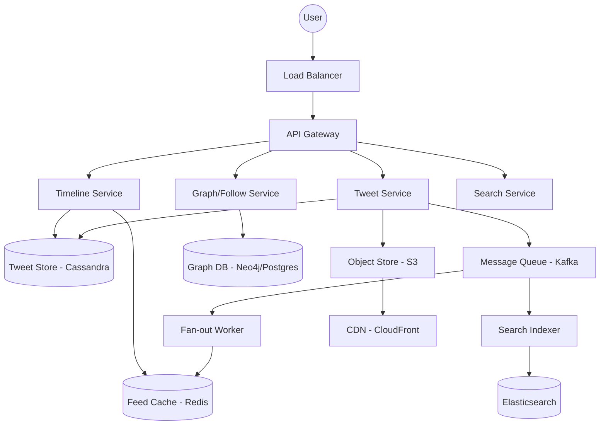

---

Design a microblogging platform like Twitter.

---

# System Design: Scalable Microblogging Platform (Twitter Clone)

## 1. Requirements & Scope

### Functional Requirements
*   **Tweet Creation:** Users can post short text messages (up to 280 characters) with optional media.
*   **Timeline (Feed):** 
    *   **User Timeline:** A chronological list of a specific user's tweets.
    *   **Home Timeline:** A combined chronological feed of tweets from all users the current user follows.
*   **Social Graph:** Users can follow and unfollow other users.
*   **Search:** Users can search for tweets via hashtags or keywords.
*   **Notifications:** Real-time alerts for mentions or follows.

### Non-Functional Requirements
*   **High Availability:** The system must be available 24/7; read availability is prioritized over immediate consistency (Eventual Consistency).
*   **Low Latency:** Feed loading should be $< 200\text{ms}$.
*   **Scalability:** Support $300\text{M}$ Monthly Active Users (MAU).
*   **Read-Heavy Load:** The read-to-write ratio is extremely high (approx. 100:1).

---

## 2. Capacity Estimation (The Math)

### Traffic Assumptions
*   **DAU (Daily Active Users):** $200\text{M}$
*   **Average Tweets per user/day:** $0.5 \rightarrow 100\text{M}$ tweets/day.
*   **Average Feed views per user/day:** $10 \rightarrow 2\text{B}$ feed requests/day.
*   **Average Followers per user:** $200$.
*   **Celebrity Status:** Users with $> 100\text{k}$ followers.

### Throughput (QPS)
*   **Write QPS (Tweets):** $\frac{100\text{M}}{86,400\text{s}} \approx 1,160 \text{ tweets/sec}$.
*   **Read QPS (Timelines):** $\frac{2\text{B}}{86,400\text{s}} \approx 23,148 \text{ requests/sec}$.
*   **Peak QPS:** Assuming $3\times$ average during major events $\approx 70\text{k}$ read QPS.

### Storage Estimates (1 Year)
*   **Text Storage:** $100\text{M tweets/day} \times 280 \text{ bytes} \approx 28\text{GB/day}$. 
    *   Annual: $\sim 10\text{TB}$.
*   **Media Storage:** Assuming $10\%$ of tweets have an image ($1\text{MB}$ avg).
    *   $10\text{M tweets/day} \times 1\text{MB} = 10\text{TB/day}$. 
    *   Annual: $\sim 3.6\text{PB}$.
*   **Social Graph:** $200\text{M users} \times 200 \text{ follows} = 40\text{B}$ edges. 
    *   At $16\text{ bytes}$ per edge (UserIDs), $\sim 640\text{GB}$.

---

## 3. High-Level Architecture

---

## 4. Detailed Component Design

### 4.1. The Feed Problem: Push vs. Pull
The core challenge is the **Home Timeline**. Generating a feed by querying all followed users' tweets in real-time is too slow ($O(N \log M)$ where $N$ is number of follows).

#### Approach A: Fan-out on Write (Push Model)
When a user posts a tweet, the system pushes the Tweet ID into the pre-computed Redis lists of all their followers.
*   **Pros:** Extremely fast reads ($O(1)$ to fetch the list).
*   **Cons:** Write heavy. If a user has $1\text{M}$ followers, one tweet triggers $1\text{M}$ writes. This is the "Celebrity Problem."

#### Approach B: Fan-out on Load (Pull Model)
The feed is constructed at read-time by fetching tweets from all followed users and merging them.
*   **Pros:** Writes are fast; no redundant storage.
*   **Cons:** Reads are slow and computationally expensive.

#### Hybrid Solution (The "Twitter" Way)
*   **Standard Users:** Use the **Push Model**. Their feeds are pre-computed in Redis.
*   **Celebrities:** Use the **Pull Model**. Their tweets are *not* pushed to followers. Instead, when a follower requests their feed, the system fetches the celebrity's latest tweets and merges them into the pre-computed feed on the fly.
*   **Threshold:** Define a "Celebrity" as anyone with $> 100\text{k}$ followers.

### 4.2. Data Storage Strategy
*   **Tweet Store (Cassandra):** Chosen for high write throughput and linear scalability. Partition key: `user_id`, Clustering key: `tweet_id` (time-sorted).
*   **Social Graph (PostgreSQL/Neo4j):** Follower relationships are highly connected. A relational DB with indexing on `follower_id` and `followee_id` is sufficient, though a Graph DB scales better for "suggested friends" (2nd-degree connections).
*   **Feed Cache (Redis):** Stores a list of Tweet IDs for each user's home timeline. 
    *   *Data Structure:* `Redis Sorted Set` (Score = Timestamp).
    *   *Retention:* Only store the latest $1,000$ tweet IDs per user to save memory.

### 4.3. Search Architecture
To support hashtag and keyword search:
1.  **Ingestion:** Tweet Service pushes the tweet to Kafka.
2.  **Indexing:** A consumer reads from Kafka and writes to an **Elasticsearch** cluster.
3.  **Querying:** Search Service queries Elasticsearch, which returns a list of Tweet IDs, which are then hydrated from the Tweet Store.

---

## 5. Trade-offs & Design Decisions

| Decision | Trade-off | Justification |
| :--- | :--- | :--- |
| **Eventual Consistency** | Update latency vs. Availability | It is acceptable if a follower sees a tweet $2$ seconds after it's posted, but it is unacceptable if the "Post" button fails. |
| **NoSQL (Cassandra)** | Complexity vs. Scalability | Relational DBs would struggle with the volume of tweets and the requirement for massive horizontal write scaling. |
| **Hybrid Fan-out** | Implementation complexity vs. Performance | Pure Push fails for celebrities; pure Pull fails for general users. Hybrid balances the load. |
| **S3 + CDN** | Cost vs. Latency | Storing media in a DB is impossible. CDN ensures images load instantly globally. |

---

## 6. Failure Analysis & Mitigation

### 1. The "Thundering Herd" (Celebrity Tweet)
When a top-tier celebrity tweets, millions of people may refresh their feeds simultaneously.
*   **Mitigation:** Use an aggressive caching layer (Varnish/Redis) for the celebrity's profile and latest tweets. Implement "Read-through" caching to prevent database collapse.

### 2. Redis Memory Exhaustion
Storing feeds for $200\text{M}$ users in RAM is expensive.
*   **Mitigation:** 
    *   **LRU Eviction:** Only keep feeds for users who have logged in within the last 30 days.
    *   **Cold Storage:** If a user returns after months, re-compute their feed from the Tweet Store (Pull model) upon first login.

### 3. Kafka Consumer Lag
If the Fan-out worker slows down, users won't see new tweets in their feeds.
*   **Mitigation:** Partition Kafka topics by `user_id` to allow parallel processing. Scale the number of consumer workers horizontally based on the lag metric.

### 4. Database Partitioning (Hotspots)
A single partition in Cassandra might become a hotspot if a user is extremely active.
*   **Mitigation:** Use a composite partition key (e.g., `user_id + month_year`) to spread data across the cluster.