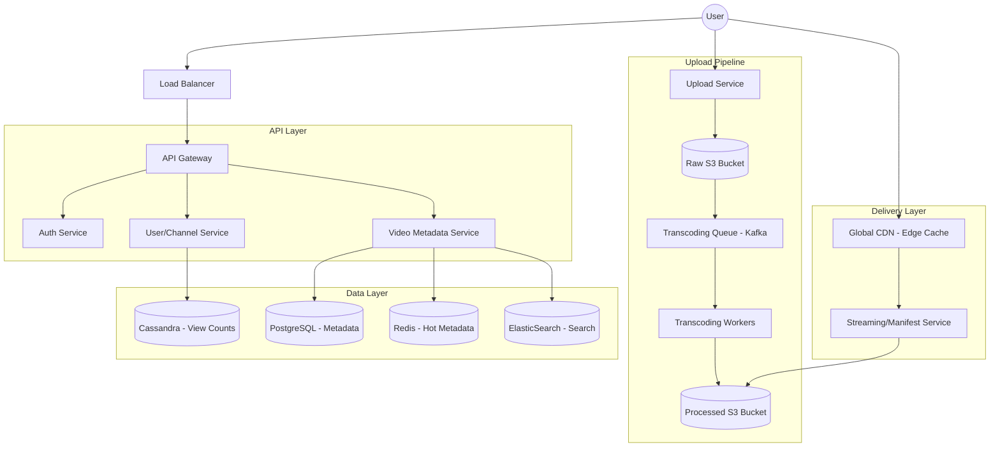

---

Design a video sharing platform like YouTube.

---

# System Design: Large-Scale Video Sharing Platform (YouTube Clone)

## 1. Requirements & Scope

### Functional Requirements
*   **Upload:** Users can upload videos of various formats and sizes.
*   **Streaming:** Users can watch videos with minimal buffering (Adaptive Bitrate Streaming).
*   **Search:** Users can search for videos by title/description.
*   **Social:** Users can like, dislike, comment, and subscribe to channels.
*   **Metadata:** Management of video titles, tags, descriptions, and user profiles.

### Non-Functional Requirements
*   **High Availability:** The system must be available $99.99\%$ of the time.
*   **Low Latency:** Video playback must start instantly; buffering must be minimized.
*   **Scalability:** Must handle millions of concurrent viewers and thousands of concurrent uploads.
*   **Reliability:** Uploaded videos must not be lost.
*   **Eventual Consistency:** View counts and like counts can be eventually consistent.

---

## 2. Capacity Estimation (The Math)

### Traffic Assumptions
*   **Daily Active Users (DAU):** 1 Billion.
*   **Average Views per User/Day:** 5 videos.
*   **Total Daily Views:** $5 \times 10^9$ views/day.
*   **Upload Rate:** 1% of DAU upload 1 video/day $\approx 10$ Million videos/day.

### Storage Calculation
*   **Average Raw Video Size:** 500 MB.
*   **Daily Raw Storage:** $10^7 \text{ videos} \times 500 \text{ MB} = 5 \text{ PB/day}$.
*   **Transcoding Multiplier:** To support different resolutions (144p, 360p, 720p, 1080p, 4K) and formats (H.264, VP9, AV1), we store roughly 3-5x the raw size.
*   **Total Daily Storage Requirement:** $\sim 15\text{--}25 \text{ PB/day}$.
*   **Annual Storage:** $\approx 5.5\text{--}9 \text{ Exabytes/year}$.

### Bandwidth Calculation
*   **Average Bitrate:** 2 Mbps (average across all resolutions).
*   **Average View Duration:** 5 minutes (300 seconds).
*   **Data per View:** $2 \text{ Mbps} \times 300\text{s} / 8 = 75 \text{ MB/view}$.
*   **Total Egress Bandwidth:** $5 \times 10^9 \text{ views} \times 75 \text{ MB} = 375 \text{ Petabytes/day}$.
*   **Peak Bandwidth:** Assuming 20% of traffic happens in a 4-hour window: 
    $\frac{375 \text{ PB} \times 0.2}{4 \times 3600} \approx 5.2 \text{ TB/s}$. 
    *Conclusion: A global CDN is non-negotiable.*

---

## 3. High-Level Architecture

---

## 4. Component Deep Dive

### A. The Upload Pipeline (Write Path)
Uploading a multi-gigabyte file via a single HTTP request is prone to failure.
1.  **Chunked Uploads:** The client splits the video into small chunks (e.g., 5MB). If a chunk fails, only that chunk is retried.
2.  **Raw Storage:** Chunks are assembled and stored in a "Raw S3 Bucket."
3.  **Asynchronous Transcoding:** A Kafka queue triggers Transcoding Workers.
    *   **Parallelization:** A single large video is split into smaller segments (GOP - Group of Pictures). Multiple workers transcode different segments of the same video in parallel.
    *   **Multi-resolution:** The worker outputs several versions (e.g., 1080p, 720p, 480p).
    *   **Packaging:** The worker creates a **Manifest File** (.m3u8 or .mpd) which tells the player where to find the chunks for each resolution.

### B. Video Streaming (Read Path)
To avoid buffering, we use **Adaptive Bitrate Streaming (ABR)** (HLS or MPEG-DASH).
1.  **The Manifest:** When a user clicks "Play," the client fetches the manifest file.
2.  **Client-Side Intelligence:** The video player monitors the user's network speed. If the bandwidth drops, the player switches to a lower-resolution chunk (e.g., 1080p $\rightarrow$ 480p) seamlessly.
3.  **CDN Strategy:** 
    *   **Edge Caching:** Popular videos are cached at CDN POPs (Points of Presence) close to the user.
    *   **Long-tail Content:** Rare videos are fetched from the "Processed S3 Bucket" (Origin) and then cached.

### C. Data Modeling
*   **Relational DB (PostgreSQL):** Stores structured metadata: `UserProfiles`, `VideoMetadata` (Title, Description, UploaderID), `Subscriptions`.
    *   *Partitioning:* Shard by `UserID` or `VideoID`.
*   **NoSQL DB (Cassandra/DynamoDB):** Stores high-write data: `ViewCounts`, `Likes`. 
    *   *Reason:* These tables experience massive write volume. Cassandra's LSM-tree architecture is optimized for this.
*   **Search (ElasticSearch):** Indexes `VideoTitle` and `Tags` for full-text search.

---

## 5. Trade-offs & Design Decisions

| Decision | Trade-off | Justification |
| :--- | :--- | :--- |
| **HLS/DASH vs Progressive Download** | Latency vs Complexity | Progressive download (MP4) requires downloading the whole file to seek. ABR allows instant start and network adaptation. |
| **Cassandra vs Postgres for Views** | Consistency vs Write Throughput | Postgres would lock rows during massive view spikes. Cassandra allows eventual consistency, which is acceptable for a view counter. |
| **Pull-through CDN vs Push CDN** | Storage Cost vs Latency | Pushing all videos to all edges is impossible (Exabytes of data). Pull-through caches only what is popular. |
| **Async Transcoding** | Real-time vs Reliability | We cannot make a user wait for transcoding to finish. Async ensures the upload is "accepted" immediately, and the video becomes "available" shortly after. |

---

## 6. Failure Analysis & Mitigations

### 1. The "Viral Video" Problem (Hotspots)
When a video goes viral, a single database shard or CDN node might be overwhelmed.
*   **Mitigation:** 
    *   **Cache Layer:** Use a multi-layered cache (L1: Local memory, L2: Distributed Redis).
    *   **CDN Replication:** Dynamically replicate the video chunks to more edge locations based on request frequency.
    *   **Read Replicas:** Use read-replicas for the metadata DB.

### 2. Transcoder Crash
If a worker crashes mid-transcode, the video remains "Processing" forever.
*   **Mitigation:** Implement a **Dead Letter Queue (DLQ)** and a **Visibility Timeout** in Kafka/SQS. If a worker doesn't acknowledge completion within $X$ minutes, the task is re-queued.

### 3. S3 Availability
While S3 is highly durable, a regional outage could kill the platform.
*   **Mitigation:** Multi-region replication. Store raw and processed videos in at least two geographic regions.

### 4. Database Write Saturation (Likes/Views)
Millions of likes per second on a single video can crash a DB.
*   **Mitigation:** **Write-back Caching.** Instead of updating the DB for every like, increment the count in Redis. Periodically (e.g., every 10 seconds), flush the aggregated count to the database.