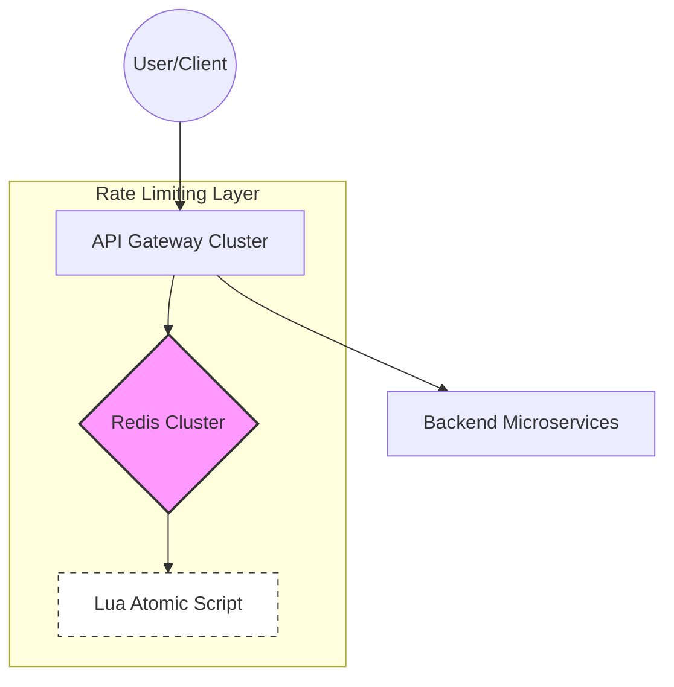

---

Design a distributed rate limiter to protect an API gateway.


---

This design specifies a high-performance, distributed rate limiter designed to protect an API Gateway from being overwhelmed by excessive traffic, ensuring fair usage and preventing Denial of Service (DoS) attacks.

## 1. System Requirements

### Functional Requirements
*   **Limit Requests:** Restrict the number of requests a user/client can make within a specific time window (e.g., 100 requests per minute).
*   **Distributed Enforcement:** The limit must be consistent across multiple API Gateway instances.
*   **Low Latency:** The rate-limiting check must add negligible overhead (sub-5ms) to the request path.
*   **Accuracy:** Minimize "bursting" issues common in simple fixed-window counters.

### Non-Functional Requirements
*   **High Availability:** The rate limiter must not become a single point of failure (if the limiter is down, the API should generally fail-open to maintain availability).
*   **Scalability:** Must support millions of unique users and hundreds of thousands of requests per second (RPS).

---

## 2. Architecture Design

The core of this design is a **Centralized State Store** using **Redis**, utilizing the **Sliding Window Counter** algorithm implemented via **Lua scripts** to ensure atomicity.

### High-Level Diagram



### The Algorithm: Sliding Window Counter
To avoid the "edge case" of Fixed Window counters (where a user can double their quota by attacking at the boundary of two windows), we use a Sliding Window.

**Logic:**
1.  Divide the time window (e.g., 1 minute) into smaller buckets (e.g., 1 second).
2.  Store the count for each bucket in a Redis Hash or Sorted Set.
3.  To check the limit, sum all buckets within the last 60 seconds.
4.  Discard buckets older than the window.

**Implementation via Redis Lua Script:**
To prevent race conditions between `GET` and `INCR`, the entire logic is wrapped in a Lua script. Redis executes Lua scripts atomically.

```lua
-- Lua script for Sliding Window Rate Limiting
local key = KEYS[1]              -- User ID / IP
local current_time = ARGV[1]     -- Current epoch in seconds
local window_size = ARGV[2]      -- e.g., 60
local limit = ARGV[3]            -- e.g., 100

-- Remove old entries outside the current window
redis.call('ZREMRANGEBYSCORE', key, 0, current_time - window_size)

-- Count remaining entries in the window
local current_count = redis.call('ZCARD', key)

if current_count < tonumber(limit) then
    -- Add current request timestamp to the sorted set
    redis.call('ZADD', key, current_time, current_time)
    redis.call('EXPIRE', key, window_size)
    return 1 -- Allowed
else
    return 0 -- Rate Limited
end
```

---

## 3. Capacity Planning & Math

### Assumptions
*   **Peak Traffic:** $100,000$ requests per second (RPS).
*   **Unique Users:** $10$ million active users per day.
*   **Rate Limit:** $100$ requests per minute (RPM) per user.
*   **Average Request Header Size:** $1$ KB.

### Storage Estimation (Redis)
We use a Redis Sorted Set (`ZSET`) per user. 
*   **Entries per user:** Max $100$ timestamps.
*   **Size per entry:** A timestamp (8 bytes) + internal ZSET overhead ($\approx 16$ bytes) $\approx 24$ bytes per request.
*   **Memory per user:** $100 \text{ requests} \times 24 \text{ bytes} \approx 2.4 \text{ KB}$.
*   **Total Memory for $10^7$ users:** $10,000,000 \times 2.4 \text{ KB} \approx 24 \text{ GB}$.
*   **Conclusion:** A standard Redis cluster with 64GB RAM can comfortably handle this.

### Throughput & Latency
*   **Network I/O:** $100\text{k RPS} \times 2 \text{ (request/response)} \times \approx 200 \text{ bytes packet} \approx 40 \text{ MB/s}$.
*   **Redis Performance:** Redis can handle $\approx 100\text{k}$ operations per second per core. With a cluster of 3 shards, we have significant headroom.
*   **Latency:** A Redis `ZADD`/`ZCARD` operation typically takes $< 1\text{ms}$. Including network round-trip within the same VPC, the overhead is $\approx 2\text{-}4\text{ms}$.

---

## 4. Tradeoffs and Design Decisions

| Decision | Tradeoff | Justification |
| :--- | :--- | :--- |
| **Redis vs Local Cache** | Consistency vs Latency | Local cache is faster but inaccurate in a distributed environment. Redis provides a "single source of truth" for a user's quota across all gateway nodes. |
| **ZSET vs Token Bucket** | Precision vs Memory | Token Bucket is more memory efficient (1 integer per user) but less precise for strict windowing. ZSET allows for an exact sliding window. |
| **Lua Scripts** | Complexity vs Atomicity | Lua scripts add slightly more CPU load on Redis but eliminate the need for distributed locks or complex "Check-and-Set" (CAS) loops. |
| **Fail-Open Policy** | Availability vs Security | If Redis is unreachable, the Gateway allows the request. This prevents the rate limiter from becoming a bottleneck that takes down the entire API. |

---

## 5. Failure Analysis & Resilience

### 1. Redis Cluster Failure
*   **Scenario:** One or more Redis shards go down.
*   **Mitigation:** Use **Redis Sentinel** or **Cluster Mode** for automatic failover. If the entire cluster is unavailable, the API Gateway is configured to **Fail-Open**, logging a critical error but allowing traffic to flow to the backend to prevent a total outage.

### 2. The "Hot Key" Problem
*   **Scenario:** A single user/bot sends $50,000$ RPS, hitting a single Redis shard.
*   **Mitigation:** 
    *   **Local L1 Cache:** Implement a tiny "short-circuit" cache on the Gateway (e.g., if a user is already blocked for the next 5 seconds, don't even call Redis).
    *   **Consistent Hashing:** Ensures users are spread evenly across shards.

### 3. Clock Drift
*   **Scenario:** API Gateway nodes have slightly different system times, leading to inconsistent window boundaries.
*   **Mitigation:** Use the **Redis Server Time** (`TIME` command) as the source of truth for the timestamp passed into the Lua script, rather than the Gateway's local time.

### 4. Race Conditions
*   **Scenario:** Two concurrent requests from the same user are processed by different Gateway nodes.
*   **Mitigation:** Solved by the **Lua script**, as Redis guarantees the script executes atomically. No other command can run while the script is executing.