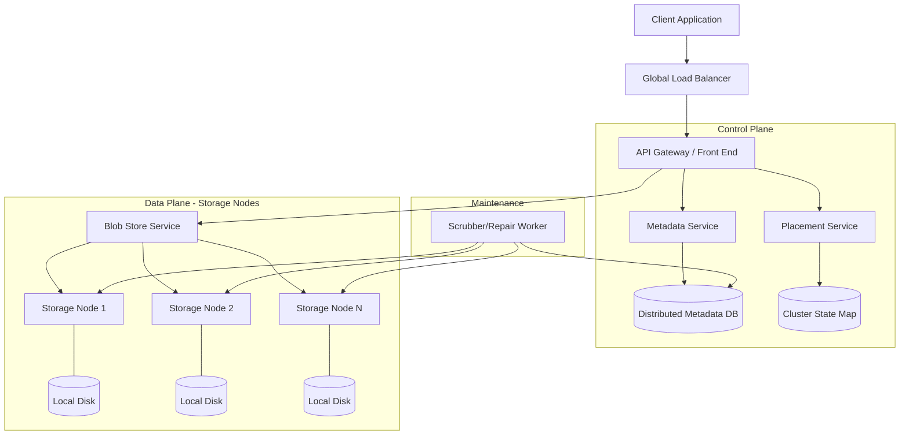

---

Design a global object storage system like S3.

---

This design specifies a global-scale object storage system capable of storing exabytes of data with high durability and availability.

### 1. Requirements & Constraints

#### Functional Requirements
*   **PUT**: Upload an object (blob) with a key into a bucket.
*   **GET**: Retrieve an object by key.
*   **DELETE**: Remove an object.
*   **LIST**: List objects within a bucket (prefix search).
*   **Durability**: 11 nines (99.999999999%)—data must not be lost.
*   **Availability**: 99.99% (Four nines).
*   **Consistency**: Strong consistency for PUTs and DELETEs (modern S3 standard).

#### Non-Functional Requirements
*   **Scalability**: Handle billions of objects and exabytes of data.
*   **Low Latency**: Low time-to-first-byte (TTFB).
*   **Global Reach**: Multi-region replication.

---

### 2. Capacity Planning & Math

**Assumptions:**
*   Total Storage: $10\text{ EB}$ (Exabytes).
*   Average Object Size: $1\text{ MB}$.
*   Total Objects: $10^{19} / 10^6 = 10^{13}$ objects (10 Trillion).
*   Write Throughput: $100\text{k RPS} \times 1\text{ MB} = 100\text{ GB/s}$.
*   Read Throughput: $1\text{M RPS} \times 1\text{ MB} = 1\text{ TB/s}$.

**Storage Overhead (Erasure Coding):**
Standard 3x replication is too expensive ($30\text{ EB}$ for $10\text{ EB}$ of data). We will use **Erasure Coding (EC)**, specifically a $10+4$ scheme (10 data shards, 4 parity shards).
*   Storage Overhead: $14/10 = 1.4\text{x}$.
*   Total Raw Storage needed: $10\text{ EB} \times 1.4 = 14\text{ EB}$.
*   Fault Tolerance: Can lose any 4 disks/nodes in a stripe without data loss.

**Metadata Scale:**
If each object metadata entry is $1\text{ KB}$:
*   Total Metadata: $10^{13} \text{ objects} \times 1\text{ KB} = 10\text{ PB}$.
*   This is too large for a single machine; requires a distributed NoSQL database (e.g., based on BigTable or Cassandra).

---

### 3. High-Level Architecture

---

### 4. Component Deep Dive

#### A. The Metadata Service (The Brain)
The metadata store maps a `(Bucket, Key)` to an `ObjectID` and its physical locations.
*   **Schema**: `{BucketID, Key, ObjectID, Size, Checksum, VersionID, ACLs, ChunkList}`.
*   **Indexing**: To support `LIST` operations (prefix searches), the Metadata DB must support range scans. We use a **Sorted Key-Value store** (LSM-tree based) where the key is `BucketID + Key`.
*   **Consistency**: To achieve strong consistency, we use a distributed consensus protocol (like Paxos or Raft) per shard of the metadata database.

#### B. The Data Plane (The Muscle)
To avoid the "massive file" problem, we split objects into **chunks** (e.g., $64\text{ MB}$ blocks).
1.  **PUT Flow**:
    *   Client sends data to API Gateway.
    *   API Gateway requests a `Placement Plan` from the Placement Service.
    *   The Gateway splits the object into 10 data shards and computes 4 parity shards (Erasure Coding).
    *   The 14 shards are streamed in parallel to 14 different storage nodes.
    *   Once the nodes acknowledge receipt, the Metadata Service is updated.
2.  **GET Flow**:
    *   API Gateway fetches the `ChunkList` from the Metadata Service.
    *   It requests the shards from the storage nodes.
    *   If all 10 data shards arrive, the object is reconstructed. If some are missing, the parity shards are used to mathematically recover the missing data.

#### C. Placement Service
This service maintains a map of the cluster (which nodes are healthy, their disk utilization).
*   **Consistent Hashing**: Used to distribute objects across nodes to minimize reshuffling when nodes are added/removed.
*   **Failure Domains**: The placement service ensures that the 14 shards of an object are spread across different racks and power zones to prevent correlated failures.

---

### 5. Detailed Tradeoffs

| Feature | Tradeoff | Decision | Justification |
| :--- | :--- | :--- | :--- |
| **Durability** | Replication vs. Erasure Coding | **Erasure Coding** | 1.4x overhead vs 3x. For EB-scale, the cost difference is billions of dollars. |
| **Consistency** | Eventual vs. Strong | **Strong** | Modern apps expect a file to be there immediately after a successful `PUT`. |
| **Indexing** | B-Tree vs. LSM-Tree | **LSM-Tree** | High write throughput for metadata (PUTs) is critical; range scans for `LIST` are supported. |
| **Granularity** | Object-level vs. Chunk-level | **Chunk-level** | Large objects (GBs) cannot be stored on a single disk. Chunks allow parallel I/O. |

---

### 6. Failure Analysis & Mitigation

#### 1. Bit Rot (Silent Data Corruption)
*   **Failure**: Over time, magnetic flip on a disk causes a bit to change.
*   **Mitigation**: Store a **checksum** (CRC32 or SHA) with every chunk. The **Scrubber** (background worker) periodically reads chunks, verifies checksums, and if a mismatch is found, uses the parity shards to rebuild the corrupted chunk on a new sector.

#### 2. Node/Rack Failure
*   **Failure**: A whole rack loses power.
*   **Mitigation**: The $10+4$ EC scheme allows us to lose 4 nodes entirely. The Placement Service detects the failure via heartbeats and triggers a "Rebalance" operation to recreate the missing shards on healthy nodes.

#### 3. Metadata Database Partition
*   **Failure**: A network partition splits the metadata cluster.
*   **Mitigation**: Use a **Quorum-based approach** (e.g., $N/2 + 1$). If a partition cannot reach a quorum, it ceases writes to prevent "split-brain" scenarios, prioritizing Consistency over Availability (CP in CAP theorem).

#### 4. Hot Objects (Thundering Herd)
*   **Failure**: A single viral file is requested 1 million times per second.
*   **Mitigation**: Implement an **Edge Cache (CDN)**. The API Gateway can cache the object in memory or a fast SSD tier (Redis/Memcached) for highly accessed objects, reducing the load on the Blob Store.

### 7. Summary of Data Flow (The "PUT" Life Cycle)
1.  **Client** $\rightarrow$ `PUT /my-bucket/photo.jpg` $\rightarrow$ **LB** $\rightarrow$ **API Gateway**.
2.  **API Gateway** $\rightarrow$ **Metadata Svc** (Check permissions, create entry).
3.  **API Gateway** $\rightarrow$ **Placement Svc** (Get 14 target nodes).
4.  **API Gateway** $\rightarrow$ Compute $10+4$ EC Shards $\rightarrow$ **Storage Nodes**.
5.  **Storage Nodes** $\rightarrow$ Write to Disk $\rightarrow$ **ACK**.
6.  **API Gateway** $\rightarrow$ **Metadata Svc** (Mark object as "Committed").
7.  **API Gateway** $\rightarrow$ **Client** (`200 OK`).