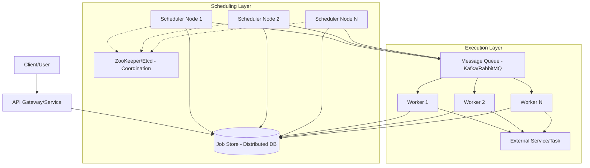

---

Design a distributed job scheduler.

---

# Distributed Job Scheduler System Design

## 1. Introduction
A distributed job scheduler is a system designed to execute tasks (jobs) at a specified time or on a recurring schedule across a cluster of machines. The system must ensure that jobs are not lost, are executed as close to the target time as possible, and handle failures gracefully without double-executing tasks (where possible).

### Functional Requirements
- **Job Submission:** Users can schedule a one-time job (at `T`) or a recurring job (Cron expression).
- **Job Execution:** The system triggers the job at the scheduled time.
- **Status Tracking:** Ability to query if a job is `PENDING`, `RUNNING`, `COMPLETED`, or `FAILED`.
- **Retries:** Automatic retry logic for failed jobs.
- **Scalability:** Support millions of scheduled jobs.

### Non-Functional Requirements
- **High Availability:** No single point of failure.
- **Durability:** Jobs must persist across system restarts.
- **Precision:** Low latency between the scheduled time and the actual execution time.
- **At-least-once Guarantee:** Every job must be executed at least once.

---

## 2. System Architecture

The system follows a decoupled architecture consisting of an API layer, a persistent store, a scheduling layer, and a worker pool.

### Component Deep Dive

#### 1. API Gateway & Job Store
The API handles job submission and validation. The **Job Store** is the source of truth. I recommend a distributed database with strong consistency (e.g., **CockroachDB** or **Postgres with Partitioning**) to prevent race conditions when multiple schedulers attempt to claim the same job.

**Data Model:**
| Column | Type | Description |
| :--- | :--- | :--- |
| `job_id` | UUID | Primary Key |
| `schedule_time` | Timestamp | When the job should run (indexed) |
| `cron_expression` | String | For recurring jobs |
| `payload` | JSON | Arguments for the task |
| `status` | Enum | PENDING, QUEUED, RUNNING, COMPLETED, FAILED |
| `retry_count` | Integer | Current attempt number |
| `version` | Integer | For optimistic locking |

#### 2. The Scheduling Layer (The "Brain")
The challenge is avoiding "thundering herd" and duplicate triggering. We use a **sharding approach based on the `job_id`**.

- **Partitioning:** The total job space is divided into $N$ shards.
- **Coordination:** Using ZooKeeper, schedulers register themselves. Each scheduler is assigned a set of shards.
- **Polling Logic:** Instead of a global lock, each scheduler polls its assigned shards for jobs where `schedule_time <= now` and `status = PENDING`.
- **Atomic Claim:** Schedulers use a conditional update to mark jobs as `QUEUED`:
  `UPDATE jobs SET status = 'QUEUED' WHERE job_id = ? AND status = 'PENDING'`

#### 3. The Execution Layer (The "Muscle")
To decouple scheduling from execution, the Scheduler pushes the `job_id` into a Message Queue (e.g., Kafka).
- **Workers** consume from the queue, fetch the full payload from the DB, and execute the task.
- **Acknowledgment:** Once the task finishes, the worker updates the DB status to `COMPLETED`.

---

## 3. Capacity Math

### Assumptions
- **Total Jobs per Day:** 100 Million.
- **Peak Traffic:** $5\times$ average load.
- **Average Job Payload:** 2 KB.
- **Retention:** Jobs kept for 7 days.

### Throughput Calculation
- **Average Jobs/Sec:** $100,000,000 / 86,400 \approx 1,157$ jobs/sec.
- **Peak Jobs/Sec:** $1,157 \times 5 \approx 5,785$ jobs/sec.

### Storage Calculation
- **Daily Storage:** $100M \text{ jobs} \times 2\text{ KB} \approx 200\text{ GB/day}$.
- **7-Day Storage:** $200\text{ GB} \times 7 \approx 1.4\text{ TB}$.
- **Index Size:** Indexing `schedule_time` and `status` will add roughly 20-30% overhead. Total storage $\approx 1.8\text{ TB}$. This easily fits on a modern distributed DB cluster.

### Bandwidth Calculation
- **Peak Write Load (API $\to$ DB):** $5,785 \text{ req/s} \times 2\text{ KB} \approx 11.5\text{ MB/s}$.
- **Peak Read Load (Scheduler $\to$ DB):** $5,785 \text{ req/s} \times 1\text{ KB (ID only)} \approx 5.8\text{ MB/s}$.

---

## 4. Explicit Tradeoffs

### Precision vs. Resource Utilization
- **Low Precision (Polling):** If the scheduler polls every 1 second, jobs may be delayed by up to 1s. This is efficient for CPU/DB.
- **High Precision (Timer Wheels):** Using a Hashed Timer Wheel in memory allows millisecond precision. However, if the node crashes, the in-memory wheel is lost, requiring a full reload from the DB, which spikes DB load.
- **Decision:** For most distributed business logic, **1-second polling** combined with a queue is the optimal tradeoff for reliability and scale.

### At-Least-Once vs. Exactly-Once
- **At-Least-Once:** Guaranteed by the Message Queue (ACKs) and DB status updates. If a worker crashes after execution but before updating the DB, the job may be retried.
- **Exactly-Once:** Impossible without the end-task being **idempotent**.
- **Decision:** The system provides **at-least-once delivery**. We mandate that users implement idempotency keys in their business logic (e.g., using the `job_id` as a unique key in the destination database).

---

## 5. Failure Analysis & Mitigation

| Failure Scenario | Impact | Mitigation |
| :--- | :--- | :--- |
| **Scheduler Node Crashes** | Shards assigned to that node are not processed. | ZooKeeper detects session timeout; remaining nodes re-balance the shards and take over the failed node's ranges. |
| **Worker Node Crashes** | Job is "RUNNING" in DB but not progressing. | A "Reaper" process scans for jobs in `RUNNING` state with a heartbeat older than $X$ minutes and resets them to `PENDING`. |
| **DB Partition Offline** | Jobs in that partition cannot be scheduled. | Use a distributed DB (CockroachDB/Cassandra) with a replication factor of 3. |
| **Message Queue Overflow** | Scheduling latency increases. | Implement backpressure in the Scheduler; if the queue length exceeds a threshold, the scheduler slows down polling. |
| **Clock Drift** | Jobs trigger too early/late across nodes. | Use NTP (Network Time Protocol) across all nodes to keep clocks synchronized within milliseconds. |

## 6. Summary of Technology Stack
- **Database:** CockroachDB (Distributed SQL, ACID compliant).
- **Coordination:** ZooKeeper (Leader election and shard management).
- **Queue:** Apache Kafka (High throughput, durability).
- **Language:** Go or Java (Strong concurrency primitives for worker pools).