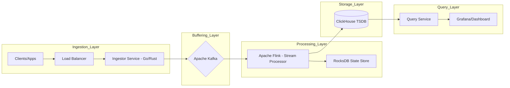

---

Design a real-time metrics aggregation pipeline that handles 100 billion events/day.

---

This design specifies a high-throughput, fault-tolerant metrics aggregation pipeline capable of processing **100 billion events per day**.

### 1. Capacity Planning & Requirements

#### 1.1 Throughput Analysis
*   **Daily Volume:** $100 \times 10^9$ events.
*   **Average Throughput:** $\frac{100 \times 10^9}{86,400 \text{ sec}} \approx 1.15 \text{ million events/sec}$.
*   **Peak Throughput:** Applying a $3\times$ peak factor $\approx 3.45 \text{ million events/sec}$.
*   **Payload Size:** Assuming a compact binary format (Protobuf) or optimized JSON.
    *   `metric_name` (string), `timestamp` (int64), `value` (double), `tags` (map<string, string>).
    *   Average event size: $\approx 200 \text{ bytes}$.
*   **Ingress Bandwidth:** $3.45 \text{M events/sec} \times 200 \text{ bytes} \approx 690 \text{ MB/s} \approx 5.5 \text{ Gbps}$.

#### 1.2 Storage Analysis
*   **Raw Data (24h retention):** $100\text{B events} \times 200\text{ bytes} = 20\text{ TB/day}$.
*   **Aggregated Data:** If we aggregate metrics into 1-minute buckets across $10^6$ unique time-series (cardinality), we produce $10^6 \text{ rows/min}$.
    *   $10^6 \text{ rows} \times 60 \text{ mins} \times 24 \text{ hours} \approx 1.44\text{B rows/day}$.
    *   This is a reduction of $\approx 70\times$ compared to raw events.

---

### 2. System Architecture

The system follows a **Kappa Architecture**, treating everything as a stream.

---

### 3. Component Design

#### 3.1 Ingestion Layer (The "Front Door")
*   **Technology:** Written in **Go** or **Rust** for low-latency, high-concurrency networking.
*   **Responsibility:** 
    *   Validate incoming Protobuf payloads.
    *   Perform basic rate limiting (per API key).
    *   Asynchronously produce messages to Kafka.
*   **Scaling:** Stateless. Scaled horizontally behind an L4 Load Balancer.

#### 3.2 Buffering Layer (The "Shock Absorber")
*   **Technology:** **Apache Kafka**.
*   **Partitioning Strategy:** Partition by `metric_id` (hash of name + tags). This ensures all data for a specific time-series arrives at the same Flink consumer instance, enabling stateful aggregation.
*   **Config:**
    *   **Replication Factor:** 3 (for high availability).
    *   **Partitions:** To handle $\sim 700\text{ MB/s}$, and assuming one partition handles $\sim 10\text{ MB/s}$, we need at least 70 partitions. We will use **500 partitions** to allow for future growth and better parallelism in Flink.

#### 3.3 Processing Layer (The "Aggregator")
*   **Technology:** **Apache Flink**.
*   **Logic:**
    *   **Tumbling Windows:** 1-minute windows to calculate `SUM`, `COUNT`, `MIN`, `MAX`, and `AVG`.
    *   **State Management:** Use **RocksDB** as the state backend to handle the large cardinality of metrics that cannot fit in RAM.
    *   **Exactly-Once Semantics:** Enabled via Flink checkpoints and Kafka offsets.
*   **Approximate Counting:** For "Unique Users" (count-distinct), we use **HyperLogLog (HLL)** sketches within the state to avoid storing millions of unique IDs per window.

#### 3.4 Storage Layer (The "Truth")
*   **Technology:** **ClickHouse**.
*   **Why ClickHouse?** It is a columnar database capable of inserting millions of rows per second and performing aggregations across billions of rows in milliseconds.
*   **Table Engine:** `SummingMergeTree`. This engine automatically aggregates rows with the same primary key during the background merge process, further reducing storage costs.
*   **Sharding:** Data sharded by `metric_id` to distribute write load across a cluster.

---

### 4. Tradeoffs & Technical Decisions

| Feature | Choice | Tradeoff |
| :--- | :--- | :--- |
| **Aggregation** | Pre-aggregation in Flink | **Pro:** Drastically reduces DB write load. **Con:** Lose the ability to do ad-hoc raw data analysis unless raw data is archived to S3. |
| **Counting** | HyperLogLog (HLL) | **Pro:** Constant memory usage regardless of cardinality. **Con:** $\approx 1\text{--}2\%$ error rate. |
| **Consistency** | Event-time Processing | **Pro:** Handles out-of-order events via Watermarks. **Con:** Higher latency (must wait for the watermark to pass). |
| **Format** | Protobuf | **Pro:** Small payload, fast serialization. **Con:** Less human-readable than JSON during debugging. |

---

### 5. Failure Analysis & Resilience

#### 5.1 What could fail?
1.  **Kafka Broker Failure:** Handled by a replication factor of 3. If a leader fails, an ISR (In-Sync Replica) is promoted.
2.  **Flink Job Crash:** Flink saves snapshots of its state (including windowed sums) to an S3-compatible store. Upon restart, it resumes from the last checkpoint.
3.  **ClickHouse Backpressure:** If ClickHouse slows down, Flink's write sink will backpressure. This flows back to Kafka, which buffers the data. Kafka acts as the ultimate buffer for the system.
4.  **Hot Partitions:** A single metric (e.g., `cpu_usage` for a global load balancer) might produce $100\times$ more events than others. 
    *   *Mitigation:* Use "Two-Phase Aggregation." Flink first aggregates by `metric_id + random_salt` in a local window, then aggregates the partial sums in a second global window.

#### 5.2 Data Integrity
*   **Late Arriving Data:** We define a **Watermark** (e.g., 30 seconds). Events arriving after the watermark are either dropped or routed to a "side output" for separate late-arrival processing.
*   **Duplicate Events:** Kafka's idempotent producer and Flink's exactly-once processing prevent double-counting.

### 6. Summary of Resource Estimates

| Resource | Estimate | Calculation |
| :--- | :--- | :--- |
| **Ingestor Nodes** | $\approx 20$ nodes | $3.5\text{M req/s} \div 175\text{k req/s per node}$ |
| **Kafka Nodes** | $\approx 12$ nodes | $700\text{ MB/s}$ total $\div 60\text{ MB/s per node}$ |
| **Flink TaskManagers** | $\approx 40$ nodes | Based on CPU for HLL and windowing state |
| **ClickHouse Nodes** | $\approx 8$ nodes | Sharded cluster for $\sim 1.4\text{B rows/day}$ |