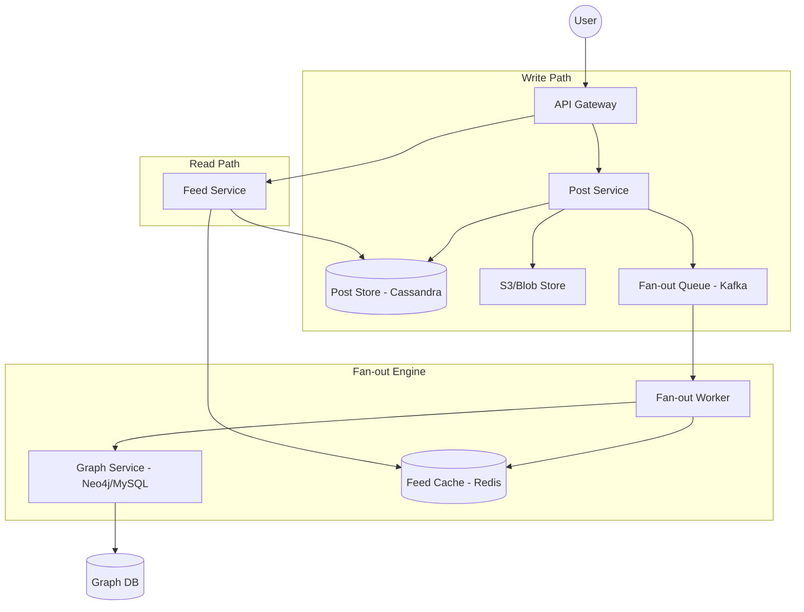

---

Design a news feed system like Twitter or Facebook.

---

This is a comprehensive system design for a large-scale News Feed system (e.g., Twitter, Facebook).

---

# System Design: Large-Scale News Feed

## 1. Requirements & Scope

### Functional Requirements
*   **Post Creation:** Users can publish posts (text, images, video).
*   **Feed Generation:** Users see a scrollable feed of posts from people they follow.
*   **Following:** Users can follow/unfollow other users.
*   **Timeline/Feed Sorting:** Posts are sorted by time (chronological) or relevance (algorithmic).
*   **Latency:** Feed loading should be $< 200\text{ms}$.

### Non-Functional Requirements
*   **High Availability:** The system must be available even if partial components fail.
*   **Scalability:** Support 500 million Daily Active Users (DAU).
*   **Eventual Consistency:** It is acceptable if a post takes a few seconds to appear in all followers' feeds.
*   **Read-Heavy:** The ratio of reads (viewing feeds) to writes (posting) is likely $100:1$ or higher.

---

## 2. Capacity Estimation (Back-of-the-Envelope)

### Traffic Estimates
*   **DAU:** $500\text{M}$
*   **Average posts per user/day:** $0.1$ (Most users consume; few produce)
*   **Total posts per day:** $500\text{M} \times 0.1 = 50\text{M}$ posts/day.
*   **Write QPS:** $50\text{M} / 86,400 \text{ sec} \approx 580 \text{ writes/sec}$.
*   **Avg. Feed Views per user/day:** $10$
*   **Read QPS:** $(500\text{M} \times 10) / 86,400 \text{ sec} \approx 58,000 \text{ reads/sec}$.

### Storage Estimates
*   **Post Metadata:** Assuming $200\text{ bytes}$ per post.
*   **Daily Metadata Storage:** $50\text{M} \times 200\text{ bytes} \approx 10\text{ GB/day}$.
*   **Media Storage:** If $10\%$ of posts have a $1\text{MB}$ image, that's $5\text{M} \times 1\text{MB} = 5\text{TB/day}$.
*   **Social Graph:** $500\text{M}$ users, avg $200$ follows each $\approx 100\text{B}$ edges. If each edge is $16\text{ bytes}$, that's $1.6\text{TB}$ for the graph.

---

## 3. High-Level Architecture

The system uses a **Hybrid Fan-out approach** to balance write and read performance.

---

## 4. Detailed Design

### A. The Fan-out Strategy (The Core Challenge)
There are two primary ways to deliver posts to followers:

1.  **Push Model (Fan-out on Write):**
    *   When a user posts, the system pushes the post ID into the pre-computed feed (Redis) of every follower.
    *   **Pros:** Reads are extremely fast (just read the Redis list).
    *   **Cons:** Writing is slow. If a user has $10\text{M}$ followers, one post triggers $10\text{M}$ Redis writes. This is the **"Celebrity Problem."**

2.  **Pull Model (Fan-out on Load):**
    *   The feed is not pre-computed. When a user requests their feed, the system fetches the list of followed users, gets their latest posts, and merges them.
    *   **Pros:** Writes are instant. No wasted storage for inactive users.
    *   **Cons:** Reads are slow and computationally expensive.

#### The Hybrid Solution
*   **Standard Users:** Use the **Push Model**. Their posts are pushed to their followers' caches.
*   **Celebrities (e.g., $> 10\text{k}$ followers):** Use the **Pull Model**. Their posts are *not* pushed. Instead, when a follower requests their feed, the system pulls the celebrity's latest posts and merges them into the pre-computed feed results.

### B. Data Storage
*   **Post Store (Cassandra):** Chosen for high write throughput and ability to store time-series data. The partition key is `user_id`, and the clustering key is `post_id` (time-sorted).
*   **Social Graph (Neo4j or Indexed MySQL):** Stores "who follows whom." This requires fast lookups of "Get all followers for User X."
*   **Feed Cache (Redis):** Stores a list of `post_ids` for each user.
    *   *Data Structure:* Redis Sorted Set (`ZSET`).
    *   *Score:* Timestamp of the post.
    *   *Value:* Post ID.
    *   *Limit:* Keep only the latest $500\text{--}1000$ post IDs per user to save memory.

### C. The Read Flow
1.  User requests feed.
2.  `FeedService` fetches pre-computed `post_ids` from **Redis**.
3.  `FeedService` identifies which "celebrities" the user follows (via `GraphService`).
4.  `FeedService` fetches latest posts for those celebrities from the **Post Store**.
5.  `FeedService` merges the two lists, sorts by timestamp, and hydrates the `post_ids` with actual content (text/URLs) from the **Post Store**.

---

## 5. Tradeoffs and Failure Analysis

| Tradeoff | Choice | Justification |
| :--- | :--- | :--- |
| **Consistency** | Eventual | Users don't mind if a post appears 2 seconds late, but they do mind if the feed takes 5 seconds to load. |
| **Storage** | Redis Cache | We trade RAM (expensive) for latency (critical). |
| **Database** | Cassandra | We prioritize write availability and linear scaling over ACID transactions. |

### Potential Failures & Mitigations
1.  **Redis Cache Miss/Failure:**
    *   *Failure:* The pre-computed feed is lost.
    *   *Mitigation:* Fall back to a full "Pull Model" query against the Post Store. It will be slower, but the service remains available.
2.  **Fan-out Lag:**
    *   *Failure:* Kafka queue backs up during peak hours (e.g., New Year's Eve).
    *   *Mitigation:* Implement priority queues. New posts are prioritized over older posts; drop updates for users who haven't logged in for 30+ days.
3.  **The "Hot Key" Problem:**
    *   *Failure:* A celebrity's post metadata in Cassandra is requested millions of times per second.
    *   *Mitigation:* Use a local cache (LRU) inside the `FeedService` instances to store the most popular posts of the hour.

---

## 6. Final Capacity Math (Refined for Redis)

If we store $1,000$ post IDs per user for $500\text{M}$ DAU:
*   **Total IDs:** $500\text{M} \times 1,000 = 500\text{B}$ IDs.
*   **Memory per ID:** $8\text{ bytes}$ (long).
*   **Total Memory:** $500\text{B} \times 8\text{ bytes} \approx 4\text{TB}$.
*   **Cluster Size:** With Redis replication and overhead, $\sim 8\text{--}10\text{TB}$ of RAM is required. This is easily achievable with a Redis Cluster of $50\text{--}100$ nodes.