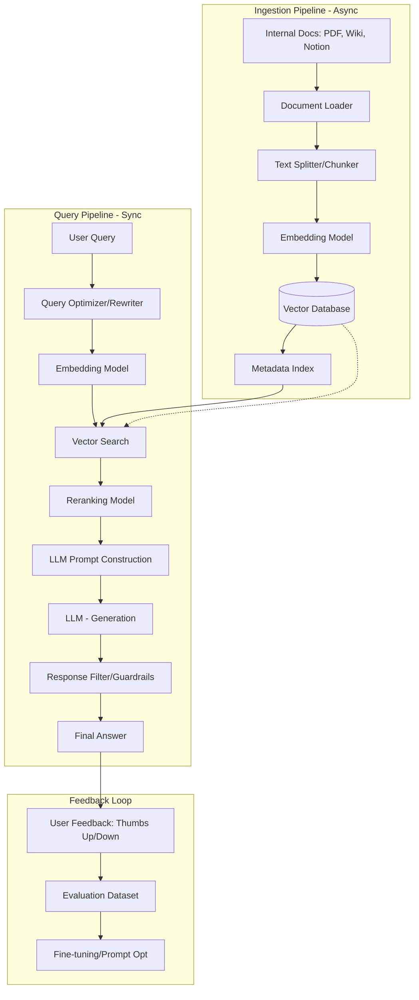

---

Design a retrieval-augmented generation (RAG) assistant that answers user questions based on a company's internal documents.

---

# System Design: Enterprise RAG Assistant

This document outlines the design for a Retrieval-Augmented Generation (RAG) system designed to answer employee queries using a company's internal knowledge base.

## 1. High-Level Architecture

The system is divided into two primary pipelines: the **Ingestion Pipeline** (offline/asynchronous) and the **Retrieval & Generation Pipeline** (online/synchronous).

### System Diagram

---

## 2. Component Detailed Design

### 2.1 The Ingestion Pipeline
To ensure the LLM has accurate context, we must transform unstructured data into a searchable format.

1.  **Document Loader:** Connectors for Confluence, SharePoint, Slack, and S3.
2.  **Chunking Strategy:** We will use **Recursive Character Text Splitting** with an overlap. 
    *   *Chunk Size:* 512 tokens.
    *   *Overlap:* 50 tokens (to prevent context loss at boundaries).
3.  **Embedding Model:** Use a dense vector model (e.g., `text-embedding-3-small` or HuggingFace `BGE-base`).
4.  **Vector Database:** A database supporting HNSW (Hierarchical Navigable Small World) for approximate nearest neighbor (ANN) search.

### 2.2 The Query Pipeline
1.  **Query Rewriting:** The system transforms a vague query (e.g., "How do I do that?") into a standalone query ("How do I request PTO in the HR portal?") using the conversation history.
2.  **Hybrid Search:** We combine **Dense Retrieval** (semantic meaning) with **BM25 Keyword Search** (exact terms like project codes or product IDs).
3.  **Re-ranking:** Vector search returns the top 20 candidates. A cross-encoder model (e.g., Cohere Rerank) narrows this down to the top 5 most relevant chunks. This significantly reduces noise for the LLM.
4.  **Generation:** The prompt is constructed as:
    *   *System Prompt:* "You are a helpful internal assistant. Answer only using the provided context. If the answer isn't there, say 'I don't know'."
    *   *Context:* [Top 5 Re-ranked Chunks]
    *   *User Query:* [Optimized Query]

---

## 3. Capacity Planning & Math

### 3.1 Assumptions
*   **Documents:** 1 million documents.
*   **Avg Doc Size:** 2 KB (~500 words).
*   **Users:** 10,000 employees.
*   **Daily Query Volume:** 10,000 queries/day.
*   **Peak QPS:** 5 queries per second.

### 3.2 Storage Calculations
*   **Total Text Volume:** $1,000,000 \text{ docs} \times 2 \text{ KB} = 2 \text{ GB}$.
*   **Chunking:** If each doc is split into $\sim 2$ chunks $\rightarrow 2 \times 10^6$ chunks.
*   **Embedding Size:** Using 1536-dimensional vectors (float32 = 4 bytes).
    *   $\text{Vector Data} = 2 \times 10^6 \text{ chunks} \times 1536 \text{ dims} \times 4 \text{ bytes} \approx 12.28 \text{ GB}$.
*   **Index Overhead:** HNSW indices typically add $\sim 20-50\%$ overhead.
    *   $\text{Total Storage} \approx 12.28 \text{ GB} \times 1.5 \approx 18.4 \text{ GB}$.
*   **Conclusion:** The entire vector index fits comfortably in the RAM of a single high-memory cloud instance (e.g., AWS r6g.large), allowing for sub-10ms retrieval.

### 3.3 Latency Budget
| Stage | Latency (ms) | Note |
| :--- | :--- | :--- |
| Embedding Query | 50ms | Local or API call |
| Vector Search | 20ms | HNSW on RAM |
| Re-ranking | 100ms | Cross-encoder is slower than vector search |
| LLM Generation | 1500-3000ms | Bottleneck (depends on token length) |
| **Total** | **~1.6s to 3.2s** | Acceptable for a chatbot |

---

## 4. Trade-offs and Design Decisions

### 4.1 Dense vs. Hybrid Search
*   **Trade-off:** Dense search (embeddings) is great for concepts but fails on specific IDs (e.g., "Error Code XJ-99").
*   **Decision:** Use **Hybrid Search**. We combine vector similarity with keyword matching to ensure high recall for both conceptual and specific queries.

### 4.2 Chunking: Fixed vs. Semantic
*   **Trade-off:** Fixed-size chunking is fast but can cut a sentence in half. Semantic chunking (splitting by paragraph/sentence) is slower but preserves meaning.
*   **Decision:** Use **Recursive Character Splitting** with overlap. It provides a middle ground of performance and context preservation.

### 4.3 LLM: Proprietary vs. Open Source
*   **Trade-off:** GPT-4o has superior reasoning but poses data privacy risks and higher costs. Llama-3 (70B) hosted on-prem is private and free per token.
*   **Decision:** Use a **Private VPC deployment of Llama-3 or Azure OpenAI** to ensure data never leaves the company's security perimeter.

---

## 5. Failure Modes and Mitigations

| Potential Failure | Impact | Mitigation Strategy |
| :--- | :--- | :--- |
| **Hallucinations** | User receives false info | **Grounding:** Use a "Cite your sources" prompt. If the LLM can't find the answer in the provided chunks, it must admit it doesn't know. |
| **Data Leakage** | User sees a CEO-only doc | **ACL Integration:** Store Document IDs and Access Control Lists (ACLs) in the metadata. Filter vector results by the user's permission group before passing to the LLM. |
| **Outdated Info** | User gets old policy | **TTL/Versioning:** Implement a "last modified" timestamp in metadata. Give higher weight to newer documents during the re-ranking phase. |
| **Query Drift** | LLM loses context in long chats | **Windowed Memory:** Only feed the last 5 turns of conversation into the query rewriter. |
| **Vector DB Downtime** | System cannot retrieve context | **Read Replicas:** Deploy vector DB in a clustered configuration across multiple availability zones. |