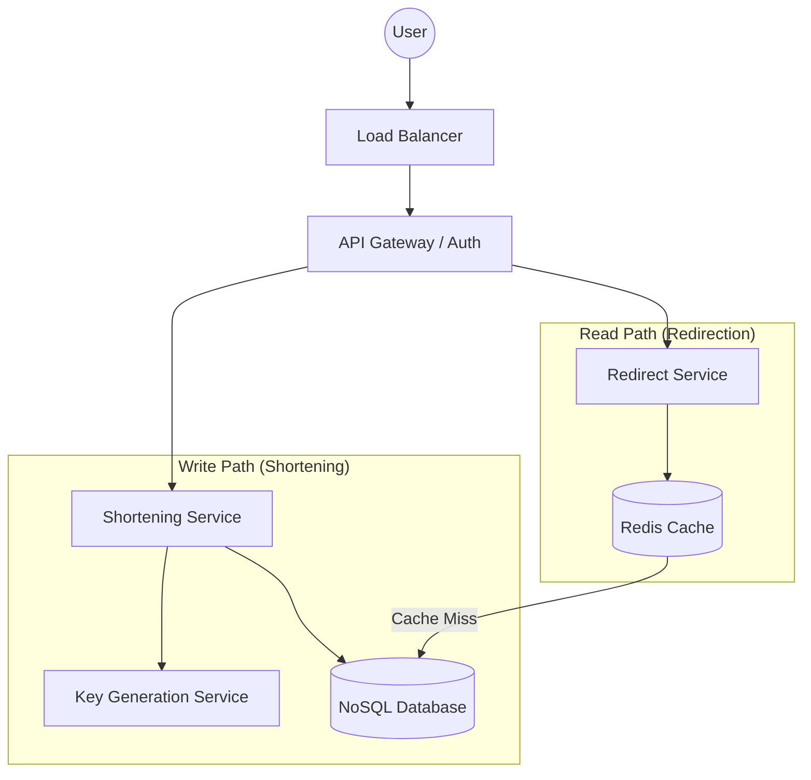

---

Design a URL shortener like bit.ly.

---

This is a comprehensive system design for a scalable, high-availability URL shortener similar to Bitly.

---

## 1. Requirements & Scope

### Functional Requirements
*   **Shortening:** Given a long URL, the system generates a unique, shorter alias.
*   **Redirection:** Given a short URL, the system redirects the user to the original long URL with minimum latency.
*   **Custom Aliases:** Users can optionally provide a custom short string.
*   **Expiration:** Links should have a default or user-defined expiration date.

### Non-Functional Requirements
*   **High Availability:** The redirection service must be available $99.99\%$ of the time.
*   **Low Latency:** Redirection should happen in milliseconds.
*   **Scalability:** Must handle a massive volume of reads (Read-heavy workload).
*   **Unpredictability:** Short URLs should not be easily guessable to prevent "URL scraping."

---

## 2. Capacity Planning & Math

### Traffic Assumptions
*   **New URLs per month:** 500 Million.
*   **Read/Write Ratio:** 100:1 (Read-heavy).
*   **Write QPS:** $\frac{500 \times 10^6}{30 \times 24 \times 3600} \approx 193$ requests/sec.
*   **Read QPS:** $193 \times 100 \approx 19,300$ requests/sec.

### Storage Estimation (10-Year Horizon)
*   **Total Records:** $500 \text{M} \times 12 \text{ months} \times 10 \text{ years} = 60 \text{ Billion URLs}$.
*   **Record Size:**
    *   Short URL (Key): 7 chars $\approx 7$ bytes.
    *   Long URL (Value): Avg 100 bytes.
    *   Created/Expiry timestamps: 16 bytes.
    *   Total per record $\approx 123$ bytes.
*   **Total Storage:** $60 \times 10^9 \times 123 \text{ bytes} \approx 7.38 \text{ TB}$.

### Bandwidth
*   **Write Bandwidth:** $193 \text{ req/s} \times 123 \text{ bytes} \approx 24 \text{ KB/s}$.
*   **Read Bandwidth:** $19,300 \text{ req/s} \times 123 \text{ bytes} \approx 2.3 \text{ MB/s}$.

---

## 3. High-Level Architecture

---

## 4. Detailed Design

### 4.1 The Shortening Algorithm
To map a long URL to a short one, we need a unique ID. We will use **Base62 encoding** $[0-9, a-z, A-Z]$.

*   **Why 7 characters?** $62^7 \approx 3.5 \text{ Trillion}$ unique combinations. This far exceeds our 10-year requirement of 60 billion.
*   **Avoiding Collisions:** Instead of hashing (which requires collision checks), we use a **distributed counter (Range Handler)**. 
    *   A centralized service (using Zookeeper or etcd) assigns ranges of IDs to different application servers (e.g., Server A gets 1–1,000, Server B gets 1,001–2,000).
    *   Servers increment their local counter. Once a range is exhausted, they request a new one.
    *   The numeric ID is then converted to Base62 (e.g., ID `125` $\rightarrow$ `cb`).

### 4.2 Data Model
Since the data is essentially a Key-Value pair and we need to scale horizontally, a **NoSQL Database (e.g., DynamoDB or Cassandra)** is preferred over a relational DB.

**Table: `url_mapping`**
| Column | Type | Description |
| :--- | :--- | :--- |
| `short_url_hash` (Partition Key) | String | The Base62 encoded ID |
| `original_url` | String | The destination URL |
| `user_id` | String | For ownership/analytics |
| `created_at` | Timestamp | Creation date |
| `expires_at` | Timestamp | Expiration date |

### 4.3 Redirection Logic (The Read Path)
1.  **Request:** User hits `bit.ly/abc1234`.
2.  **Cache Check:** The Redirect Service checks **Redis**.
    *   *Cache Hit:* Immediately return the long URL.
    *   *Cache Miss:* Query the NoSQL DB.
3.  **Update Cache:** Store the DB result in Redis for future requests.
4.  **HTTP Response:**
    *   **301 (Permanent Redirect):** Browser caches the mapping. Reduces server load but prevents the system from tracking click analytics.
    *   **302 (Temporary Redirect):** Browser always hits our server. **Chosen approach** to allow for analytics and link updates.

---

## 5. Trade-offs and Deep Dives

### Trade-off: Hash vs. Counter
| Approach | Pros | Cons |
| :--- | :--- | :--- |
| **Hashing (MD5/SHA)** | Stateless, no central coordinator. | Collisions require DB lookups $\rightarrow$ Latency. |
| **Counter (Base62)** | No collisions, guaranteed unique. | Requires a Range Handler (Zookeeper) to manage state. |
| **Decision:** Counter approach for maximum performance. | | |

### Trade-off: 301 vs 302 Redirect
*   **301 Moved Permanently:** Best for SEO and reducing server traffic.
*   **302 Found:** Necessary if we want to track who clicked the link, where they came from (Referer), and their device/location.
*   **Decision:** 302 for business intelligence.

### Handling "Viral" URLs (Hot Keys)
A single URL (e.g., a celebrity tweet) could cause a "thundering herd" on a specific database partition.
*   **Solution:** Use a multi-layer cache. A local in-memory cache (LRU) on the Redirect Service instances can store the top 1% of most accessed URLs to prevent Redis from becoming a bottleneck.

---

## 6. Failure Analysis & Mitigation

| Failure Scenario | Impact | Mitigation Strategy |
| :--- | :--- | :--- |
| **Redis Node Crash** | Latency spike as all traffic hits DB. | Use **Redis Sentinel** or **Redis Cluster** for automatic failover and replication. |
| **Zookeeper/Range Handler Down** | New URLs cannot be shortened. | Range Handler provides "buffers" (ranges of 10k IDs). Servers can continue shortening until their current buffer is empty. |
| **DB Partition Overload** | Slow redirection for specific links. | Implement **Consistent Hashing** to distribute keys evenly across shards. |
| **Database Growth** | Storage costs increase. | Implement a **TTL (Time to Live)** on NoSQL records. Use a background cleanup job (TTL indexing) to purge expired links. |

## 7. Final Summary of Technology Stack
*   **API Gateway:** Nginx / Kong.
*   **App Tier:** Java Spring Boot or Go (for high concurrency).
*   **Coordination:** Zookeeper (Range management).
*   **Cache:** Redis (LRU eviction).
*   **Database:** DynamoDB or Cassandra (Wide-column store).
*   **Encoding:** Base62.