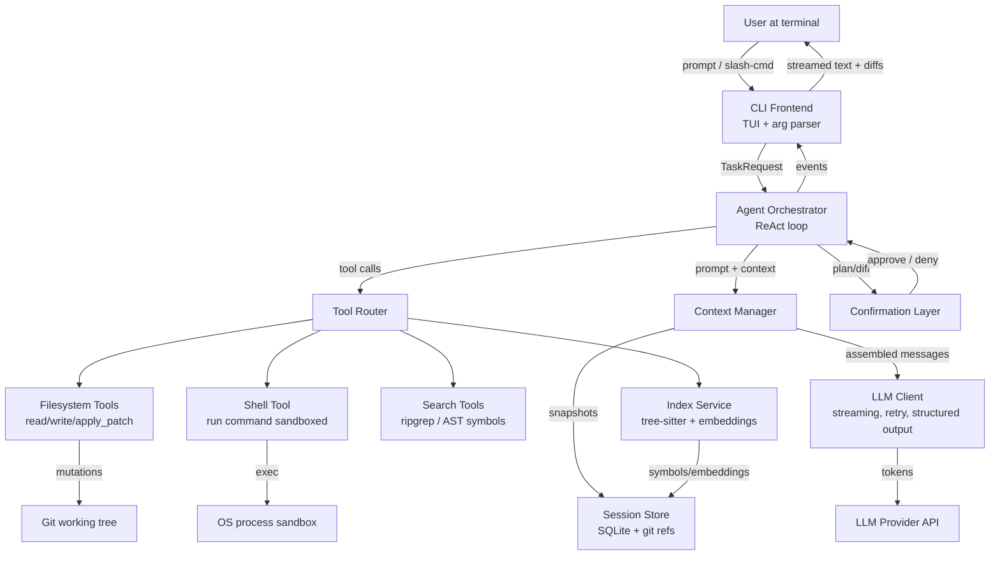

---

Design a terminal-based AI coding agent that can complete software engineering tasks.


---

# Terminal-Based AI Coding Agent — System Design

## 1. Problem & Scope

Design a **terminal-native agent** (`ai-dev`) that accepts a natural-language software-engineering task ("refactor the auth module to use JWT", "fix the failing test in `payments/`"), autonomously explores a codebase, proposes edits, runs build/test commands, and iterates until the task is done or it needs human input. It runs locally in the user's shell, operates on their checkout, and streams progress to stdout.

**Target user:** a developer on a laptop (8–16 cores, 16–64 GB RAM, SSD). Not a server product.

**Non-goals:** IDE integration, multi-repo orchestration, training/fine-tuning, GUI.

---

## 2. Top-Level Architecture



---

## 3. Component Design

### 3.1 CLI Frontend

- **Input modes:** interactive REPL (readline-style with history), one-shot `ai-dev "task"`, pipe mode `git diff | ai-dev "review this"`.
- **Output:** streaming Markdown rendered for a terminal ( ANSI colors via a lightweight renderer, code blocks syntax-highlighted with tree-sitter, collapsible diff hunks).
- **Slash commands:** `/undo`, `/diff`, `/compact`, `/model`, `/approve-all`, `/abort`, `/resume <session>`.
- **Signals:** SIGINT → interrupt current tool execution, not the whole session. SIGINT twice within 500ms → abort agent loop.
- **Tradeoff:** Build TUI on **`ratatui` + `crossterm`** (Rust) vs. just line-buffered stdout. Chosen: line-buffered by default, optional full-screen TUI for diff review. Full TUI everywhere hurts scriptability and makes log capture painful.

### 3.2 Agent Orchestrator (ReAct loop)

State machine:

```
PLAN -> ACT -> OBSERVE -> REFLECT -> (PLAN | DONE | ASK_HUMAN)
```

- **Max iterations:** configurable, default 50. Hard stop at 200 to prevent runaway loops and cost.
- **Termination:** model emits `task_complete` tool, or user aborts, or iteration budget exhausted.
- **Reflection:** every N=5 steps, inject a system note: *"Summarize progress, remaining sub-goals, and whether to continue."* This catches stuck loops.
- **Concurrency:** tool calls within a single turn may run in parallel when the model emits multiple independent tool calls (e.g., two `read_file` calls). Shell commands and file writes stay serialized to avoid races.

### 3.3 Tool Layer

All tools return a `ToolResult{ok, stdout, stderr, truncated, error}` capped at a per-call byte budget (default 20 KB; larger results are truncated with a "use `head`/narrow your query" hint).

| Tool | Purpose | Key behavior |
|---|---|---|
| `read_file(path, start?, end?)` | Read file slices | Line-range arg to fit context; refuses paths outside workspace root unless `--allow-external` |
| `write_file(path, content)` | Full overwrite | Requires confirmation unless in auto-apply mode |
| `apply_patch(unified_diff)` | Surgical edit | Validates diff applies cleanly; on failure, re-reads file and re-plans |
| `run_command(cmd, timeout)` | Build/test/exec | See §3.6 sandbox |
| `grep(pattern, glob?)` | Text search | Wraps `rg`; returns ranked, capped hits with file:line |
| `find_symbol(name)` | AST lookup | Uses tree-sitter index |
| `list_dir(path)` | Browse tree | Skips `.git`, `node_modules`, build artifacts by default |
| `git(diff/log/show)` | VCS ops | Read-only by default; commits require confirmation |
| `task_complete(summary)` | End loop | Emits final report |

**Tradeoff — `write_file` vs `apply_patch`:** Full-file writes are robust but burn tokens on large files. Patches are token-efficient but fail when line numbers drift. Strategy: **prefer `apply_patch`**; if it fails twice, fall back to `write_file` on that target.

### 3.4 Codebase Index Service

Runs lazily on first task; incrementally updated via filesystem watcher.

- **AST index (tree-sitter):** per-language grammar. Extracts definitions (functions, classes, methods, types) with file:line:signature. Stored in SQLite. ~100k symbols for a 100k-LOC repo.
- **Chunk embeddings:** split files at AST boundaries (function/class granularity), embed with a small local model (e.g., `bge-small-en`, 384-dim) to avoid per-query API cost. ~5k chunks for 100k LOC, ~1.5M floats, ~6 MB. Stored in SQLite via `sqlite-vec`.
- **Hybrid retrieval:** for a query, run (a) BM25 over chunk text, (b) cosine over embeddings, (c) ripgrep for exact identifiers. RRF fusion, top-K=20 chunks fed to `Ctx`.
- **Refresh cost:** on file save, re-parse only that file (~1–5 ms). Embedding recompute only for changed chunks.

**Tradeoff — local embeddings vs API embeddings:** Local keeps latency low (no network), cost zero per query, and works offline. Quality is ~5–10% lower than `text-embedding-3-large` on retrieval benchmarks but acceptable for code where lexicals matter.

### 3.5 Context Manager

Assembles the message list sent to the LLM each turn. Budget is the model's context window minus reserved output tokens.

- **Token accounting:** per-message byte→token estimate (chars/3.5 for code, /4 for prose), refined post-hoc with the provider's usage counts.
- **Sections (priority order):**
  1. System prompt (tool defs, repo facts, language, git branch) — ~2k tokens, persistent.
  2. Retrieved chunks (from §3.4) — ~8k tokens.
  3. File slices currently open / recently edited — ~4k tokens.
  4. Conversation history — grows over time.
  5. Most recent tool results.
- **Compaction:** when usage exceeds 75% of window, summarize turns [0..k] into a 300-token recap ("Files changed: …; Decisions: …; Open sub-goals: …") and drop the raw messages. Keep the last ~8 turns verbatim. Compaction is a dedicated LLM call with a cheap model.
- **Sticky facts:** user can pin messages (e.g., "always remember we're on Node 18") that never get compacted.

**Capacity math (200k-token window, e.g., Claude Sonnet-class):**
- System: 2k. Retrieval: 8k. Open files: 4k. Reserved output: 8k. → Fixed ~22k.
- Available for history: ~178k tokens ≈ ~600k chars ≈ ~15k lines of code-equivalent.
- That's enough for ~30–50 turns with tool results before compaction triggers. For a 2-hour session with ~120 turns, expect 2–4 compactions.

### 3.6 Shell Tool & Sandbox

The single riskiest component. It runs arbitrary commands (`npm test`, `make`, `cargo build`, scripts).

- **Allowlist + confirmation:** commands split into (a) safe-read commands (`ls`, `cat`, `rg`, `git status`, `node -v`) auto-approved; (b) build/test runners auto-approved once per session after first confirmation; (c) everything else (network calls, `rm`, `git push`, package managers mutating global state) requires explicit y/N.
- **Execution environment:**
  - Working dir = repo root.
  - Wall-clock timeout default 120 s, CPU 2× wall, memory cap = 50% of host RAM via `ulimit -v`/cgroups.
  - Captured: stdout, stderr, exit code, wall time, peak RSS. Output streamed live to the terminal so the user sees progress.
  - No network by default unless user granted `--net` (prevents data exfiltration and supply-chain surprises).
- **Failure handling:** non-zero exit → result fed back to agent as an observation; agent typically will read logs and patch. Timeout → killed, `SIGKILL`, reported as timeout.
- **Tradeoff — Docker isolation vs in-process:** Docker gives stronger isolation but adds friction (image build, volume mounts, permission mismatches with the user's toolchain). For a dev-laptop product, in-process with cgroups + allowlist is the pragmatic choice; document that `--dangerously-skip-sandbox` is the escape hatch.

### 3.7 Confirmation & Safety Layer

- **Edits:** before applying a patch, render a colored unified diff and prompt `[y]es / [n]o / [a]ll / [e]dit / [q]uit`. In `--auto` mode, skip prompts but still log every mutation to the undo log.
- **Undo log:** every successful `apply_patch`/`write_file` writes the inverse diff to SQLite and creates a git stash ref `refs/ai-dev/checkpoint-<n>`. `/undo` pops the last; `/undo 5` rewinds. Up to 100 checkpoints.
- **Git integration:** agent never commits unless told; on `task_complete`, agent shows `git diff --stat` and offers to commit with a generated message.
- **Toxic-output guard:** a lightweight classifier on shell-command strings blocks obvious destructive patterns (`rm -rf /`, `dd of=/dev/`, `:(){ :|:& };:`, `git push --force` to protected branches). Hard block, not prompt.

### 3.8 LLM Client

- **Provider abstraction:** interface `complete(messages, tools, stream) -> tokens`. Implementations for Anthropic, OpenAI, a local Ollama endpoint. Selected via config.
- **Streaming:** SSE parsed in a background task; partial text streamed to TUI; tool-call JSON accumulated and validated before dispatch.
- **Structured output:** tool calls validated against a JSON schema; on invalid, retry once with the error message appended, then surface to user.
- **Retry policy:** exponential backoff on 429/5xx, max 3, base 1s, cap 30s. Idempotency: tool calls are deterministic given inputs, so replays are safe except `run_command` — for those we attach a per-call nonce and skip replay on resume.
- **Cost metering:** tracks input/output tokens and running $ cost; shows in status bar. Configurable hard cap (default $5/session) → agent halts and asks to raise.

### 3.9 Session Persistence (SQLite)

Schema (sketch):

```
sessions(id, repo, branch, created_at, model, status)
turns(id, session_id, idx, role, content_json, tokens_in, tokens_out, cost_usd, ts)
tool_calls(id, turn_id, tool, args_json, result_json, duration_ms, exit_code)
checkpoints(id, session_id, inverse_diff, git_ref, ts)
index(symbols..., chunks..., embeddings via sqlite-vec)
```

- `/resume <id>` reloads turns, replays compacted summary, and continues.
- DB file lives at `~/.ai-dev/sessions.db`; index DB at `<repo>/.ai-dev/index.db` (repo-local so it travels with clones and can be `.gitignore`d).

---

## 4. End-to-End Flow (example: "fix flaky test in `payments/refund_test.go`")

1. CLI parses task → Agent enters PLAN.
2. Agent calls `grep("refund_test")` + `read_file("payments/refund_test.go")`. Observations: test uses `time.Sleep(100ms)` waiting on a goroutine.
3. Agent calls `find_symbol("ProcessRefund")` → reads `payments/refund.go`. Reads via index.
4. Agent drafts patch replacing `Sleep` with a channel wait. Confirmation prompt → user approves.
5. `apply_patch` succeeds; checkpoint written; `run_command("go test ./payments/ -run TestRefund -count=5")`.
6. Tests pass 5/5. Agent calls `task_complete` with summary. CLI prints diff stat and suggested commit message.

---

## 5. Capacity & Cost Math

Assume a 100k-LOC repo, 2-hour session, Sonnet-class model at $3/M input / $15/M output.

- **Index build (one-time):** 5k chunks × ~500 tokens = 2.5M tokens through local embedder (free, ~90s on CPU). AST parse ~10s.
- **Per turn:** ~30k input tokens (system + retrieval + history tail + tool results), ~1.5k output tokens. Cost ≈ 30k·$3/M + 1.5k·$15/M ≈ $0.1125.
- **100-turn session:** ≈ $11.25. Cap of $5 → ~45 turns, realistic for small fixes; large refactors need a raised cap.
- **Latency per turn:** model TTFT ~600ms + generation ~1.5k tokens × 60 tok/s ≈ 25s wall, plus tool exec. User sees streaming text within ~1s.
- **Local resource:** index DB ~50 MB, session DB grows ~2 MB/hour, embedder RAM ~400 MB. Comfortable on 16 GB laptop.

---

## 6. Failure Modes & Mitigations

| Failure | Impact | Mitigation |
|---|---|---|
| Agent loops editing same file | Cost burn, no progress | Reflection every 5 turns; detect repeated tool args hash → force plan change or halt |
| `apply_patch` context drift | Edit fails repeatedly | Fallback to `write_file`; re-read before retry |
| Shell command hangs | Session stalls | Wall + CPU timeout, SIGKILL, report to agent |
| Model emits path traversal (`../../etc/passwd`) | Security | Path canonicalization against workspace root; reject outside-root unless flag |
| Context window exceeded mid-turn | API error | Pre-flight token estimate; auto-compact and retry the turn |
| Provider outage | Dead session | Switch to configured fallback model; if none, persist and offer `/resume` |
| Bad retrieval (wrong file) | Wasted turns | Hybrid retrieval RRF; agent can call `grep`/`list_dir` to self-correct; track retrieval hit-rate as a metric |
| Undo log corruption | Can't revert | Every checkpoint also a git ref; git is source of truth, SQLite is convenience |
| Large file read blows budget | Token waste | `read_file` caps at 2k lines default; force the agent to use ranges |
| Non-deterministic tool exec on resume | Replay hazards | Skip `run_command` replay; re-show result from DB |
| User edits file mid-task | Race with agent | FSWatcher flag dirty files; agent re-reads before editing; warn if external modification detected |

---

## 7. Explicit Tradeoffs Summary

- **Autonomy vs safety:** default to confirmation prompts; `--auto` for trusted workflows. Errs safe; hurts throughput.
- **Local embeddings vs API:** chose local for cost/latency/offline; accept ~5–10% retrieval-quality hit.
- **In-process sandbox vs containers:** chose in-process for UX; weaker isolation. Acceptable for a dev tool, not for hosted multi-tenant.
- **Patches vs full writes:** patches primary for token economy; full writes as fallback for robustness.
- **One model vs routing:** single configured model for simplicity; no cheap-model routing of sub-tasks. Could route `compaction` and `symbol summarization` to a cheaper model as a future optimization (~20% cost reduction).
- **Streaming vs buffered output:** streaming for UX; requires careful partial-JSON tool-call buffering.

---

## 8. Future Extensions

- Multi-file refactor planner using call-graph from AST index.
- Test-generation mode: agent writes failing test first, then implements.
- Shared session replay for code review (export turns as a deterministic script).
- MCP (Model Context Protocol) tool server mode so the same agent core drives an IDE plugin without rewriting tools.