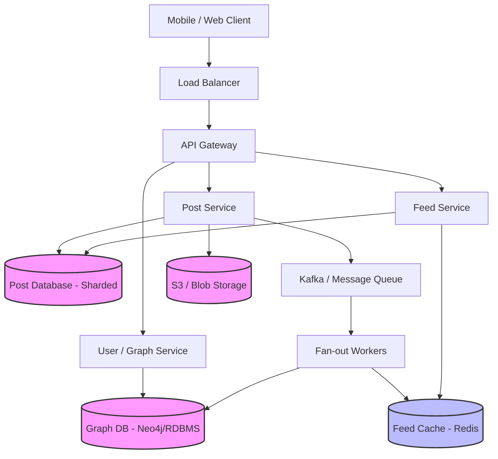

---

Design a news feed system like Twitter or Facebook.

---

Here is a comprehensive system design for a scalable News Feed system, modeled after Twitter/Facebook.

### 1. Requirements

**Functional Requirements:**
1. Users can publish a post (text, image, video).
2. Users can follow/unfollow other users.
3. System generates and serves a personalized news feed of recent posts from followed users.
4. Feed must support pagination (infinite scroll).
5. Posts must maintain chronological order (or ranked order, but we'll assume reverse chronological for simplicity).

**Non-Functional Requirements:**
1. **High Availability:** The system must survive node failures (feed generation is critical).
2. **Low Latency:** Feed generation and delivery should happen in < 200ms.
3. **Eventual Consistency:** It is acceptable if a newly published post takes a few seconds to appear in all followers' feeds.
4. **Scalability:** System should handle massive spikes in traffic (e.g., during major events).

### 2. Capacity Estimation (Back-of-the-Envelope)

Let's assume a Twitter-like scale:
* **Daily Active Users (DAU):** 300 million.
* **Posts per day:** 100 million.
* **Feed requests per day:** Each user views their feed 10 times a day. $300M \times 10 = 3B$ feed requests/day.
* **Follow ratio:** Average user follows 200 people. Celebrities have 50M+ followers.

**Storage Math:**
* Assume average post size is 500 bytes (text + metadata).
* 100M posts/day $\times$ 500 bytes = 50 GB of new post data per day.
* If we store posts for 10 years: $50 GB \times 365 \times 10 \approx 180 TB$.
* *Images/Media:* Assume 20% of posts have an average 1MB media attachment. $20M \times 1MB = 20 TB/day$. Media is stored in object storage (S3).

**Bandwidth Math:**
* Write bandwidth: 50 GB/day $\approx 0.5 MB/s$ (very small for text).
* Read bandwidth: 3B requests/day. Assuming each feed fetch returns 20 posts $\times$ 500 bytes = 10 KB.
* $3B \times 10 KB = 30 TB/day \approx 350 MB/s$ of read bandwidth (text only). Media will dominate bandwidth.

### 3. High-Level Architecture

### 4. Detailed Component Design

#### A. User / Graph Service
Manages user profiles and the directed graph of who follows whom.
* **Storage:** An RDBMS (e.g., PostgreSQL) or a Graph Database. For RDBMS, a simple `Followers` table (`user_id`, `follower_id`, `created_at`).
* **Sharding:** Sharded by `user_id` to quickly find all followers of a specific user.

#### B. Post Service
Handles the ingestion of new posts.
* Writes post metadata to a sharded RDBMS or NoSQL store (Cassandra) by `post_id`.
* Uploads media to an Object Storage service (S3) and stores the URL.
* Publishes an event to a Message Queue (Kafka) containing `post_id`, `user_id`, and `timestamp`.

#### C. Feed Generation (Fan-out Strategy)
The core of the system. We use a **Hybrid Fan-out Approach**:

1. **Fan-out on Write (Push Model) - for normal users:**
   When a user posts, the Fan-out worker consumes the Kafka event, queries the Graph DB for their followers, and *pushes* the `post_id` into a pre-computed Redis list for each follower.
   * *Pros:* Feed reads are $O(1)$ and extremely fast.
   * *Cons:* Write amplification. If a user has 10,000 followers, we do 10,000 Redis writes.

2. **Fan-out on Read (Pull Model) - for celebrities:**
   If a user has > 50,000 followers (celebrity), we do *not* push to all followers. Instead, we mark their posts with a flag. When a follower requests their feed, the Feed Service fetches the pre-computed list from Redis, but also dynamically queries the celebrity's recent posts and merges them into the feed in memory.
   * *Pros:* Prevents massive write spikes when a celebrity tweets.
   * *Cons:* Read latency increases slightly due to the dynamic merge.

#### D. Feed Cache (Redis)
* Stores feeds as Redis Sorted Sets or Lists. Key: `feed:user_id`. Value: List of `post_id`s.
* To save memory, we only cache the top 1000 recent `post_id`s per user. If they scroll past 1000, we fall back to querying the Post DB.
* TTL of 7 days for older feed items.

#### E. Feed Service
1. Receives a request for a user's feed.
2. Fetches `post_id` list from Redis.
3. Checks if the user follows any "celebrities". If yes, fetches recent posts from those celebrities from the Post DB.
4. Merges the celebrity posts with the cached feed, sorts by timestamp (descending).
5. Fetches the actual post payloads (text, media URLs) from the Post DB cache.
6. Returns paginated results to the client.

### 5. Capacity Math & Explicit Tradeoffs

**The Celebrity Problem:**
Assume Justin Bieber has 100M followers. If we use purely Fan-out on write:
* 1 Post = 100M Redis `LPUSH` commands.
* If Redis can handle 100K ops/sec per node, it takes 1000 seconds just to push one tweet to all followers. This is unacceptable.

**Tradeoff Resolution (Hybrid Model):**
* Normal user (avg 200 followers): 1 post = 200 Redis writes. Takes ~2ms. Highly efficient.
* Celebrity (100M followers): 1 post = 0 Redis writes. Instead, 100M users perform a read-time merge. Since the celebrity's recent posts are cached heavily at the Post DB layer, the merge operation takes ~10ms extra per user.

**Storage Tradeoff:**
Caching 1000 post IDs for 300M users = $300M \times 1000 \times 8 \text{ bytes (int)} = 2.4 \text{ TB}$.
This easily fits in a Redis cluster (e.g., 20 nodes of 150GB each).

### 6. Failure Scenarios & Mitigations

1. **Redis Node Failure (Feed Cache):**
   * *Impact:* Users assigned to that shard lose their pre-computed feeds. Feed Service will timeout or fail.
   * *Mitigation:* Use Redis Cluster with replicas. If a primary fails, a replica takes over. If the entire shard is lost, the Feed Service falls back to a "cold start" path: it queries the Graph DB for followees, pulls recent posts from the Post DB, constructs the feed on the fly, and re-populates Redis.

2. **Kafka Backlog during Spikes:**
   * *Impact:* A major event (e.g., World Cup goal) causes a massive spike in posts. Fan-out workers fall behind. Users don't see posts in their feed for minutes.
   * *Mitigation:* Auto-scaling Fan-out worker pods based on Kafka consumer lag. Ensure Post DB and Graph DB can handle the read spikes from the workers.

3. **Graph DB Unavailability:**
   * *Impact:* Fan-out workers cannot fetch follower lists. Posts are dropped or stuck in queue.
   * *Mitigation:* Active-active multi-region deployment for Graph DB. Additionally, cache the top-tier (most active) followers of a user in Redis so partial fan-out can continue if the Graph DB degrades.

4. **Hotkey/Thundering Herd on Celebrity Post DB:**
   * *Impact:* When millions of users read their feed simultaneously, they all query the celebrity's recent posts at read-time.
   * *Mitigation:* Use a distributed cache (Memcached/Redis) with a short TTL (e.g., 5 seconds) for celebrity post lists. Only one request hits the DB per 5 seconds; the rest hit the cache.