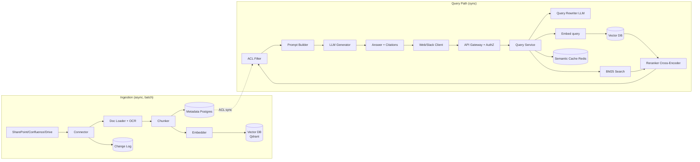

---

Design a retrieval-augmented generation (RAG) assistant that answers user questions based on a company's internal documents.

---

# RAG Assistant for Internal Company Documents — System Design

## 1. Requirements

**Functional**
- Users ask natural-language questions; answers are grounded in internal documents (wikis, PDFs, tickets, HR policies, code, slides).
- Every answer cites sources with document title, snippet, and link.
- Answers respect per-user access control (ACLs) — never leak a doc the user can't open.
- Support follow-up questions (multi-turn context).
- Admins can upload/refresh documents; deletions propagate within minutes.

**Non-functional**
- 10,000 DAU, ~50k queries/day, peak ~10 qps sustained, 30 qps burst.
- P95 end-to-end latency < 4 s; P99 < 8 s.
- Recall@10 ≥ 0.85 on internal eval set.
- 99.9% monthly availability for query path.
- Cost ceiling ~$0.05/query all-in.

**Out of scope:** training/fine-tuning the LLM, multi-modal (images/video OCR only as text), real-time streaming of newly typed docs.

---

## 2. Capacity Math

**Corpus**
- 2M documents, avg 10 pages, ~5 KB text/page → ~50 KB/doc → **100 GB raw text**.
- Chunking at 800 tokens (~3 KB) with 150-token overlap → ~20 chunks/doc → **40 M chunks**.
- Embedding: 1536-dim float16 = 3 KB/vector → 40 M × 3 KB = **120 GB** of vectors. Plus metadata ~50 bytes × 40 M = 2 GB.
- Index overhead (HNSW, ~1.5×) → **~180 GB** resident in vector DB.

**Query load**
- 50k queries/day. Peak 30 qps. Avg answer ~250 tokens, query ~50 tokens.
- LLM tokens/day ≈ 50k × 300 = 15 M tokens/day. At ~$2/M output + $0.5/M input (mid-tier hosted model) ≈ $45/day on generation alone.
- Embedding 50k × 50 tokens = 2.5 M tokens/day ≈ $1/day at $0.13/M.
- Vector search: 50k × ~10 read units ≈ negligible on self-hosted, ~$0.0001/query on managed → ~$5/day.
- Reranker (cross-encoder): 50k × 20 candidates × ~$0.00001 ≈ $10/day.
- **All-in ≈ $60/day → $0.0012/query.** Well under budget; the $0.05 ceiling absorbs model cost spikes and caching misses comfortably.

**Storage growth:** 100k new docs/month → +2 M chunks/month → +6 GB vectors/month. Plan for 12-month horizon: scale to ~300 GB → shard.

---

## 3. Architecture Overview

---

## 4. Component Design

### 4.1 Ingestion
- **Connectors**: poll SharePoint, Confluence, Google Drive, Git repos, Jira. Use vendor APIs with delta tokens; full re-crawl weekly to catch orphans.
- **Loader/OCR**: unstructured.io for PDFs; Tika for legacy formats; Tesseract fallback for scanned PDFs (slow path, offloaded to a queue).
- **Chunker**: hierarchical — split by header first, then 800-token windows with 150 overlap. Preserve section titles as metadata so the retriever can boost structural matches.
- **Embedder**: `bge-large-en-v1.5` self-hosted on a single GPU (batch inference) — cheaper than hosted at our volume and avoids PII egress. Throughput ~200 chunks/s → 40 M chunks reindex ≈ 55 h; do incremental daily.
- **Metadata Postgres**: `(chunk_id, doc_id, version, acl_groups[], source_url, title, section, mtime, hash)`.
- **Change log**: append-only Kafka topic of `(doc_id, op)`. On update, re-embed only changed chunks (content-hash dedup). On delete, tombstone in Postgres and mark vectors deleted; HNSW doesn't physically remove, so nightly compaction reclaims.

### 4.2 Vector DB
- **Qdrant** (self-hosted, 3-node RF=2). Why: supports payload filtering natively for ACL pre-filtering, HNSW + scalar quantization, on-prem to keep PII in-house.
- **Shard by tenant/bucket** once > 50 M chunks. Initial single cluster handles 40 M with 192 GB RAM (quantized to int8 → ~60 GB resident).
- Hybrid search: dense ANN + sparse (BM25 via Qdrant's sparse vectors or Postgres `tsvector`).

### 4.3 Query Path
1. **AuthZ**: gateway resolves user → set of ACL groups.
2. **Query rewriter**: small/cheap LLM call (or rule-based) to resolve pronouns ("What about *its* SLA?" → prior turn entity) and produce 1–3 sub-queries for multi-hop. Cache rewrite by hash of (last_turn, query).
3. **Embed query**: same `bge-large` model — must match ingestion model. ~30 ms.
4. **Hybrid retrieval**: top 50 dense + top 50 BM25, fuse via RRF (Reciprocal Rank Fusion).
5. **Reranker**: cross-encoder (`bge-reranker-large`) on top 20 → pick top 5–8. This is the single biggest quality lever; ~250 ms on GPU.
6. **ACL filter**: *post-rerank* on top-K is fine since K is small, but to prevent leakage of snippets in logs, filter the top-50 *before* rerank too. Use Qdrant payload filter `acl_groups ∩ user_groups ≠ ∅` to prune during ANN — best for performance and safety.
7. **Prompt builder**: system prompt enforcing "answer only from provided context; if insufficient, say so"; include citations as `[1] doc/title`.
8. **Generator LLM**: GPT-4o-mini-class hosted model (or Llama-3.1-70B self-hosted for PII). Streaming response to client.
9. **Citations**: map `[1]` tokens back to chunk IDs; verify each cited chunk actually appears in the context window — drop hallucinated citations.

### 4.4 Semantic Cache
- Redis with query embedding hash + MinHash of retrieved chunks.
- TTL 1 h for volatile docs, 24 h for policies. Hit rate target 15–20%.
- **Danger:** stale answers on docs that changed. Mitigation: cache invalidation keyed on `chunk_ids` → on doc update, evict any cached entry touching those chunks. Maintain reverse index `chunk_id → cache_keys` in Redis.

### 4.5 Access Control — Critical
Two acceptable designs:
- **Pre-filter (chosen)**: pass `acl_groups` as Qdrant filter so ANN never returns unauthorized chunks. Trade-off: filtered HNSW is ~2× slower and recall can drop on very selective filters.
- **Post-filter**: retrieve then drop unauthorized. Only safe if K_postfilter ≥ K_final × |universe|/|authorized|; risky and leaky in logs.

**Hybrid safety net**: pre-filter for safety, post-filter for paranoia (in case of bug). Never log chunk text at INFO level in the query path.

---

## 5. Latency Budget (P95)

| Stage | Target |
|---|---|
| Gateway + AuthZ | 30 ms |
| Query rewrite | 150 ms (cacheable) |
| Query embed | 40 ms |
| Hybrid retrieve | 200 ms |
| Rerank (top 20) | 250 ms |
| ACL filter + prompt build | 20 ms |
| LLM TTFT | 600 ms |
| LLM stream to completion | 2200 ms |
| **Total** | **~3.5 s** |

Generator dominates. If P95 must drop below 2 s, switch to a smaller model for the first pass and use the big model only when confidence is low.

---

## 6. Trade-offs

**Chunk size (800 tokens vs 400 vs 2000).** Smaller → better precision, worse recall for questions spanning sections, more vectors (cost). 800 with overlap is a sweet spot for prose; use 200 for code/markdown tables.

**Self-hosted vs hosted LLM.** Self-hosted Llama-70B keeps PII in-network and removes per-token cost, but ops burden, GPU capex (~$25k), and lower quality on hard reasoning. Hosted wins for v1; revisit when PIP/contract constraints emerge.

**Reranker on/off.** Without it, recall@5 drops ~15% in our eval; with it, +250 ms and a GPU. Always on for query path; off during offline index sanity checks.

**Hybrid (BM25+dense) vs dense only.** Dense misses keyword-heavy queries ("error code AC-4012", IDs, names). BM25 cheap and catches these. Always on.

**Caching aggressiveness.** Higher hit rate → lower cost + latency, but stale answers. Conservative TTLs + chunk-keyed eviction is the safe middle.

**ACL pre-filter vs recall.** Heavily restricted users (e.g., contractors seeing 1% of corpus) get lower recall because filtered ANN can miss neighbors. Mitigation: oversample K_pre = 4× K_final for low-privilege users.

---

## 7. Failure Modes & Mitigations

| Failure | Impact | Mitigation |
|---|---|---|
| Vector DB outage | Query path dead | Read replica in second AZ; circuit-break to BM25-only fallback (lower quality, still answers) |
| Embedding model version drift | Recall collapse after re-deploy | Pin model by hash; run offline eval set before promoting; store `model_version` per chunk |
| LLM hallucinates beyond context | Wrong answer with confident tone | Strict prompt; citation verification; "if not in context, say you don't know" |
| ACL filter bug leaks doc | Security incident | Pre + post filter; red-team tests in CI that a low-priv user cannot retrieve restricted chunks; audit log of every retrieved chunk_id with user |
| Prompt injection via malicious doc | Attacker uploads doc that hijacks LLM ("ignore previous instructions…") | Treat doc text as untrusted data, not instructions; wrap in delimiters; output policy filter; restrict upload sources |
| Stale cache after doc update | Wrong answer | Chunk-keyed eviction + admin "flush cache for doc" button |
| Hot shard (one tenant's docs) | Skewed latency | Consistent hashing + shard splitting; rate-limit per user |
| Reindex storm from connector bug | Cost spike, slow queries | Backpressure queue; cap concurrent embed jobs; daily reindex budget |
| Embedder GPU OOM | Ingestion stalls | Autoscale batch size; queue with retries; fallback to hosted embedding API |
| Citation links rot (doc moved) | Broken trust | Store `source_url` + content hash; resolve via Postgres redirect table; periodic link-checker |

---

## 8. Observability

- **Metrics**: per-stage latency histograms, cache hit rate, recall on labeled eval set (run hourly synthetic queries), reranker score distributions, % answers with zero citations (= "I don't know" rate), ACL filter rejection rate.
- **Tracing**: OpenTelemetry trace per query with chunk_ids retrieved, prompt hash, model version.
- **User feedback**: thumbs up/down → feed into eval set; bad ratings trigger a "should have retrieved X" review workflow.
- **Eval harness**: golden set of 500 Q/A pairs refreshed monthly; gate deploys on recall@5 and answer faithfulness (LLM-as-judge).

---

## 9. Deployment & Scaling

- Query service: 6 pods, autoscale on RPS, CPU 60% target.
- Reranker + embedder: 2 GPU nodes (shared, batched) with queue.
- Vector DB: 3 nodes, RF=2, 192 GB RAM each, NVMe.
- Postgres metadata: primary + replica, 32 GB.
- Redis cache: 1 primary + 1 replica, 32 GB.
- All in one VPC, two AZs. DR: warm standby in second region with async vector DB replication (RPO 1 h, RTO 4 h).

---

## 10. Roadmap

1. **v1 (3 months)**: single LLM, dense + BM25, basic reranker, ACL via payload filter, semantic cache.
2. **v2**: multi-hop with query decomposition; parent-document retrieval (retrieve small chunk, return full section as context).
3. **v3**: self-hosted Llama-70B for PII workloads; per-team fine-tuned rerankers; agentic tool calls for structured data (Looker, SQL).