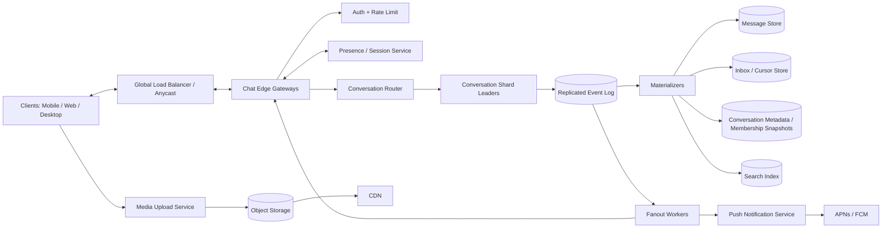
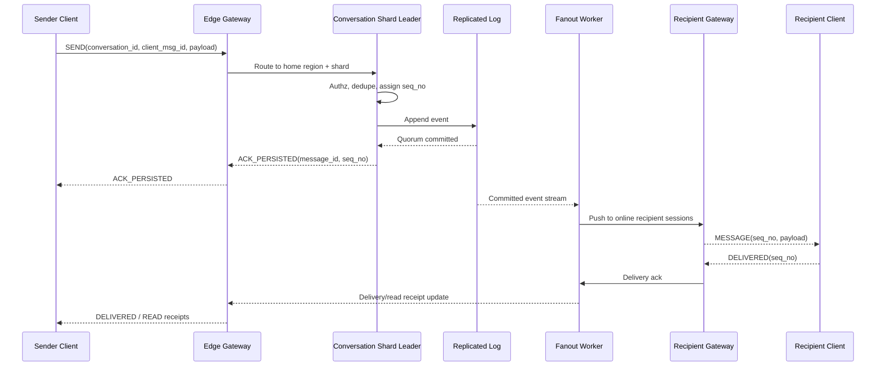

---

Design a real-time chat system like WhatsApp or Slack.


---

Below is a design for a global real-time chat system that covers both:

- **WhatsApp-like** behavior for 1:1 and small groups
- **Slack-like** behavior for large channels/workspaces

The core idea is:

1. **Maintain long-lived connections** to online clients
2. **Serialize events per conversation** to guarantee order
3. **Durably append before ACK**
4. Use **hybrid fanout**:
   - **eager** for DMs/small groups
   - **lazy** for large channels
5. Keep **presence, typing, receipts** as best-effort/ephemeral, not on the critical durability path

---

## 1) Requirements

### Functional
- 1:1 chat
- group chat
- large channels
- message history sync across devices
- delivery and read receipts
- presence / last seen
- typing indicators
- attachments (images/files)
- push notifications for offline users
- message edits/deletes
- search (Slack-like mode)

### Non-functional
- low latency:
  - send ACK p99 < 150 ms in-region
  - online delivery p99 < 300 ms in-region
- very high availability (99.99%+)
- no message loss after persisted ACK
- scale to tens/hundreds of millions of users
- per-conversation ordering
- support multi-region deployment

### Non-goals for this design
- voice/video calling
- feed/ranking
- advanced moderation ML pipeline

---

## 2) Scale assumptions and capacity math

I’ll design for a fairly large service.

### Assumptions
| Metric | Value |
|---|---:|
| DAU | 100 million |
| Peak concurrent connected users | 10 million |
| Messages sent / DAU / day | 40 |
| Produced messages / day | 4 billion |
| Avg stored size / message | 1 KB |
| Peak factor over average | 8x |

Why **1 KB/message**?  
Even if text is only a few hundred bytes, once you include metadata, IDs, sender, conversation, indexing overhead, encryption wrapper, etc., 1 KB is a reasonable planning number.

### Ingest rate
\[
4 \times 10^9 / 86400 \approx 46,296 \text{ msgs/sec average}
\]

Peak:
\[
46,296 \times 8 \approx 370,000 \text{ msgs/sec peak}
\]

So the core write path must support roughly **370k produced messages/sec peak globally**.

---

## 3) Delivery fanout assumptions

Not every message should be handled the same way.

Assume:
- **70%** of messages are 1:1
- **25%** are small groups, average **8 members total** → **7 recipients**
- **5%** are large channels, average **500 members**, but only **2% actively viewing** at a time

### Real-time delivery events/day
#### 1:1
\[
4B \times 70\% \times 1 = 2.8B
\]

#### Small groups
\[
4B \times 25\% \times 7 = 7.0B
\]

#### Large channels with lazy fanout
Active viewers/message:
\[
500 \times 2\% = 10
\]

So:
\[
4B \times 5\% \times 10 = 2.0B
\]

### Total realtime deliveries/day
\[
2.8B + 7.0B + 2.0B = 11.8B
\]

Average:
\[
11.8B / 86400 \approx 136,574 \text{ deliveries/sec}
\]

Peak:
\[
136,574 \times 8 \approx 1.09M \text{ deliveries/sec}
\]

So we need around **1.1 million real-time delivery events/sec peak globally**.

### Why hybrid fanout matters
If we naively fanout every large-channel message to all 500 members:

\[
4B \times 5\% \times 500 = 100B \text{ delivery ops/day}
\]

That is far too expensive.  
So large channels need **fanout-on-read / active-viewer push**, not full fanout-on-write.

---

## 4) Storage math

### Message storage
Produced messages only; store each message body **once**.

\[
4B \times 1KB = 4TB/day \text{ primary}
\]

With replication factor 3:
\[
12TB/day
\]

### Retention
- 30 days hot storage:
  \[
  4TB \times 30 = 120TB \text{ primary}
  \]
  Replicated:
  \[
  360TB
  \]

- 1 year archive:
  \[
  4TB \times 365 = 1.46PB \text{ primary}
  \]

This is why we should:
- keep **hot history** in a fast distributed DB
- move older history to **cheap object storage / cold tier**

### Presence heartbeat load
If 10M connected users send a heartbeat every 60 seconds:

\[
10,000,000 / 60 \approx 166,667 \text{ heartbeats/sec}
\]

This is a lot, but manageable in a sharded in-memory presence system.

---

## 5) High-level architecture



---

## 6) Core design choices

### 6.1 Transport: WebSocket over TLS
Use **WebSocket** (or HTTP/2 bi-di if you control clients) for:
- low latency
- bidirectional communication
- server push
- presence / typing / receipts

Use **protobuf/binary frames**, not JSON, to reduce bandwidth and CPU.

For background mobile apps:
- socket often drops
- use **APNs/FCM** push to wake app
- app resyncs via cursor on reconnect

---

### 6.2 Per-conversation ordering
We only guarantee **order within a conversation**, not globally.

Each conversation is assigned:
- a **home region**
- a **logical shard**
- a **leader**

That leader serializes:
- message sends
- edits/deletes
- membership changes

This is critical: it avoids races like:
- user removed from group
- but still receives later messages

---

### 6.3 Durable append before ACK
A message is ACKed to sender only after it is written to a **replicated event log**.

That gives:
- durability
- replayability
- a clean source for fanout, storage, search, analytics

The event log is the authoritative acceptance path.

---

### 6.4 Hybrid fanout
#### Small conversations: eager fanout
For:
- 1:1
- small groups (say up to 256 members)

Do:
- push immediately to online recipient devices
- update recipient inbox summary / unread counters

#### Large channels: lazy fanout
For:
- large Slack-like channels
- very large groups

Do:
- store message once in conversation log
- push only to **active viewers**, mentioned users, and maybe starred/followers
- others fetch on demand using sequence numbers

This is the main scaling trick.

---

## 7) Sharding and partitioning

### 7.1 Logical conversation shards
Use **4096 logical conversation shards** globally.

At peak:
\[
370,000 / 4096 \approx 90 \text{ msgs/sec average per logical shard}
\]

That leaves lots of headroom, and hot conversations can be moved to dedicated shards.

### 7.2 Home region
Each conversation has a **home region**:
- DMs: hash of participant IDs or creator region
- enterprise/workspace channels: tenant’s data region
- groups: creator region or majority-member region

All writes route there.  
This simplifies ordering and conflict resolution.

### 7.3 Why not active-active multi-leader?
Because chat wants:
- simple ordering
- no conflicting message timelines
- predictable receipt semantics

Multi-leader across regions creates hard problems:
- concurrent inserts
- inconsistent order
- duplicate sequence assignment
- complex conflict resolution

For chat, **single leader per conversation** is usually the right tradeoff.

---

## 8) Data model

### 8.1 Message event
```text
message_id          globally unique
conversation_id
seq_no              monotonically increasing within conversation
sender_user_id
sender_device_id
client_msg_id       for idempotency
event_type          MESSAGE / EDIT / DELETE / ADD_MEMBER / REMOVE_MEMBER / REACTION ...
created_at
payload_ref         inline text or attachment reference
encryption_mode
metadata
```

### 8.2 Message history store
Use a wide-column store like **Scylla/Cassandra**.

Partition key:
```text
(conversation_id, bucket_id)
```

Clustering key:
```text
seq_no
```

Where:
```text
bucket_id = floor(seq_no / 10000)
```

Why bucket?
- avoids giant partitions for hot channels
- supports efficient range scans by seq_no

### 8.3 Conversation metadata / membership snapshot
```text
conversation_id
type                 DM / GROUP / CHANNEL
home_region
policy               eager_fanout / lazy_fanout
member_count
last_seq
membership_version
```

Membership rows:
```text
(conversation_id, user_id) -> role, state, join_seq, leave_seq
```

### 8.4 Cursor store
Track progress by user/device:

```text
(user_id, conversation_id, device_id) -> delivered_seq, read_seq, updated_at
```

Important optimization:
- store **highest contiguous delivered/read seq**
- not per-message booleans

That keeps receipts compact.

### 8.5 Inbox summary
For small chats/groups:
```text
(user_id, conversation_id) -> last_seq, last_preview, unread_count, updated_at, mute_state
```

This is **not** a copy of the full message body.  
It’s just a per-user summary/index.

---

## 9) Write path



### Detailed steps
1. Client sends message with:
   - `conversation_id`
   - `client_msg_id`
   - payload / attachment ref
2. Edge gateway:
   - authenticates token
   - checks rate limits
   - forwards to conversation’s home shard leader
3. Shard leader:
   - verifies sender is a member
   - checks ACLs
   - deduplicates using `(sender_device_id, client_msg_id)`
   - assigns `seq_no`
4. Leader appends event to replicated log
5. After quorum commit, sender gets **ACK_PERSISTED**
6. Consumers process event:
   - fanout to online recipients
   - materialize message store
   - update inbox summaries
   - update search index
   - notify APNs/FCM if recipients are offline

### Idempotency
Clients retry on timeout.  
To prevent duplicate messages:
- client generates `client_msg_id`
- server stores dedupe key per device for a retention window (e.g. 24h)
- duplicate send returns original `message_id` and `seq_no`

---

## 10) Read path and sync

### 10.1 Online recipients
If recipient is connected:
- fanout worker looks up current sessions
- pushes message to those gateways
- recipient client ACKs delivery

### 10.2 Offline recipients
If recipient is offline:
- do **not** store a separate full offline copy per recipient
- instead:
  - message already exists in conversation history
  - per-device cursor tells what the device has seen
  - on reconnect, client fetches messages with `seq_no > delivered_seq`

This is much cheaper than per-recipient message duplication.

### 10.3 Reconnect / catch-up
Client reconnects with:
- auth token
- last sync token / cursors

Server returns:
1. conversations changed since last sync
2. for each changed conversation, message ranges after last delivered seq

### 10.4 Gap detection
Clients use `seq_no` to detect holes.

If client receives:
- 103, then 105

It requests missing:
- 104

This handles:
- dropped pushes
- reconnects
- temporary gateway issues

---

## 11) Presence, typing, receipts

### 11.1 Presence
Presence is **ephemeral and approximate**.

Store:
```text
user_id -> device_id -> edge_id, region, active_conversation, expires_at
```

Rules:
- heartbeat every ~60s
- TTL maybe 90s
- “online” means heartbeat recently observed

Tradeoff:
- cheap and scalable
- not perfectly accurate to the second

That’s acceptable for chat.

### 11.2 Typing indicators
Typing indicators should:
- never hit durable storage
- use ephemeral pub/sub with short TTL (e.g. 5 seconds)

If dropped, no problem.

### 11.3 Delivery receipts
Delivery receipt:
- recipient device received message and ACKed it

Store:
- highest contiguous delivered seq per user/device

### 11.4 Read receipts
Read receipt:
- client says conversation visible up to seq X
- store highest `read_seq`

For user-level read status:
- aggregate from device-level cursor
- usually `max(read_seq across user devices)`

---

## 12) Large channels vs small groups

This is where WhatsApp-like and Slack-like behavior differ.

### Small group / DM mode
Use **eager fanout** when:
- members <= 256 (example threshold)

Behavior:
- immediate push to all online members
- update inbox/unread for every recipient
- great latency
- simple UX

### Large channel mode
Use **lazy fanout** when:
- members > 256 or configured as channel

Behavior:
- append once to channel log
- push only to active viewers / mentioned users
- compute unread from `head_seq - read_seq`
- on open, fetch delta from store

### Why this matters
Example: a 100k-member channel at 5 msgs/sec.

Naive fanout:
\[
100,000 \times 5 = 500,000 \text{ recipient deliveries/sec}
\]

If only 1% are actively viewing:
\[
1,000 \times 5 = 5,000 \text{ pushes/sec}
\]

That is the difference between feasible and infeasible.

---

## 13) Attachments / media

Attachments must be out of band.

### Upload flow
1. client requests upload token
2. media service returns pre-signed URL
3. client uploads directly to object storage
4. async virus scan / image processing / transcoding
5. client sends chat message containing attachment reference
6. recipients fetch via signed CDN URL

Why:
- chat servers should not proxy large blobs
- reduces bandwidth and CPU on hot path

### Storage
Use:
- object storage for originals
- CDN for delivery
- thumbnails/previews for fast UI

---

## 14) Search

For Slack-like mode:
- index messages asynchronously into **OpenSearch / Elasticsearch**
- not on the write critical path
- eventual consistency is fine

For WhatsApp-like E2E mode:
- server-side search is largely impossible on encrypted content
- you either:
  - skip server search
  - do client-side local search only

---

## 15) Multi-region design

### Chosen model
- clients connect to nearest edge
- writes forward to conversation’s **home region**
- committed events replicate to other regions
- local regional fanout workers can deliver to local users

### Why
This preserves:
- per-conversation order
- simple consistency model
- easier failover

### Tradeoff
A user far from the home region pays extra RTT on sends.

That’s acceptable because:
- message frequency per user is low compared to web requests
- correctness/order matter more than shaving every last ms
- enterprise workspaces often require data residency anyway

### DR / failover
Replicate log to a backup region.

If home region fails:
- promote backup for affected shards
- RTO: minutes
- RPO: seconds if async replication

If you require **RPO=0 across region loss**, you need synchronous geo-replication, which will significantly hurt write latency.  
Most chat systems choose:
- **sync within region across AZs**
- **async across regions**

---

## 16) Capacity sizing by component

### 16.1 Edge gateways
Assume one well-tuned gateway handles **50k concurrent WebSockets**.

For 10M concurrent users:
\[
10,000,000 / 50,000 = 200 \text{ gateway nodes}
\]

Provision with 2x headroom:
- **400 edge nodes globally**

### 16.2 Conversation shard leaders
Peak produced messages:
- 370k/sec globally

Assume busiest region gets 40%:
\[
370k \times 40\% = 148k/sec
\]

If one shard-leader node safely handles ~5k msg/sec:
\[
148k / 5k \approx 30 \text{ nodes}
\]

Provision:
- **60 shard leader nodes** in busiest region

### 16.3 Fanout workers
Peak delivery events:
- ~1.09M/sec globally

If one worker handles 25k push events/sec:
\[
1.09M / 25k \approx 44
\]

Provision:
- **~100 fanout workers globally**

### 16.4 Presence store
Heartbeats:
- 166k/sec

If one in-memory shard handles 50k ops/sec:
\[
166k / 50k \approx 4
\]

Provision:
- **8–10 shards** for headroom/failover

### 16.5 Event log throughput
Peak produced message ingest:
- 370k msgs/sec
- at 1 KB internal event size:
  \[
  370MB/sec
  \]

With RF=3:
\[
1.11GB/sec \text{ replicated write traffic globally}
\]

Spread across regions, this is very reasonable for Kafka/Pulsar-scale clusters.

---

## 17) Consistency model

### Strong / ordered
- message order within a conversation
- membership change ordering within a conversation
- persisted ACK means message is durable in replicated log

### Eventual
- inbox counts
- search indexing
- presence
- delivery/read receipts
- cross-region replicas

This is the right split: keep the critical chat timeline strong, keep everything else eventually consistent.

---

## 18) Failure modes and mitigations

| Failure | Impact | Mitigation |
|---|---|---|
| Edge gateway crashes | clients disconnect | reconnect with session resume token; fetch missing seq range |
| Client retries after timeout | duplicate sends | idempotency via `client_msg_id` |
| Shard leader dies | temporary write pause for that shard | leader election + fencing token + replay from log |
| Slow consumer on socket | buffer growth | bounded per-socket buffers, then disconnect and resync |
| Event log partition unavailable | writes blocked for shard | RF=3 across AZs, fast leader election |
| Materializer lag | inbox/search stale | replay from log, monitor lag, recent-cache for active conversations |
| Presence store outage | inaccurate online status | degrade gracefully; messaging still works |
| Hot channel overload | push storm | switch to lazy fanout, isolate shard, rate-limit |
| APNs/FCM outage | no background wakeups | app catches up on next foreground/reconnect |
| Region outage | affected conversations unavailable for writes briefly | backup region promotion, async replica |

### Important subtle failures

#### Split brain shard leaders
Need fencing/epoch tokens so an old leader cannot continue writing after failover.

#### Membership race
Must serialize membership changes and messages through the same shard ordering path.

#### Client clock skew
Never use client timestamps for ordering; use server `seq_no`.

---

## 19) Tradeoffs

| Decision | Choice | Benefit | Cost |
|---|---|---|---|
| Ordering | single leader per conversation | simple, correct ordering | cross-region RTT |
| Durability | log-first before ACK | replayable, robust | slight materialization lag |
| Delivery semantics | at-least-once + dedupe | simpler and highly available | clients need dedupe/gap handling |
| Fanout | eager small / lazy large | scalable for both WhatsApp and Slack patterns | two modes to operate |
| Presence | approximate TTL | cheap and scalable | not exact |
| Search | async index | low write latency | eventual consistency |
| Cross-region replication | async | lower latency | small RPO on region loss |

---

## 20) Security and privacy

### Baseline
- TLS everywhere
- encryption at rest
- per-device auth tokens
- rate limits and abuse detection
- audit logs for admin actions
- tenant isolation for enterprise

### WhatsApp-like E2E mode
If you need true WhatsApp behavior:
- server stores ciphertext only
- use device identity keys + prekeys (Signal-style approach)
- server can route, store, and fanout ciphertext
- server-side search/moderation become limited or impossible

### Slack-like enterprise mode
If you need Slack behavior:
- server-side encryption with KMS / tenant-managed keys
- server-side search
- compliance export, retention, legal hold

You generally can’t maximize both:
- strong E2E privacy
- rich server-side search/compliance

That’s a real product tradeoff, not just an implementation detail.

---

## 21) What I would build first

### MVP
- WebSocket edges
- single home-region per conversation
- replicated log
- message store
- small-group eager fanout
- reconnect/cursor sync
- APNs/FCM
- basic presence and receipts

### Then add
- lazy fanout for large channels
- search
- media pipeline
- multi-region DR promotion
- enterprise retention/compliance
- optional E2E mode

---

## 22) Final summary

A scalable chat system like WhatsApp/Slack should be built around:

- **stateful edge gateways** for real-time connections
- **per-conversation ordered shard leaders**
- a **replicated durable log** before ACK
- **materialized stores** for history, inboxes, search
- **hybrid fanout**
  - eager for DMs/small groups
  - lazy for large channels
- **cursor-based sync** instead of per-recipient full message copies
- **ephemeral presence/typing**
- **out-of-band media uploads**
- **single-home-region conversations** with async cross-region replication

If you want, I can also provide:
1. a **deep dive on message ordering and exactly-once semantics**, or  
2. a **more interview-style 45-minute answer** with concise talking points.