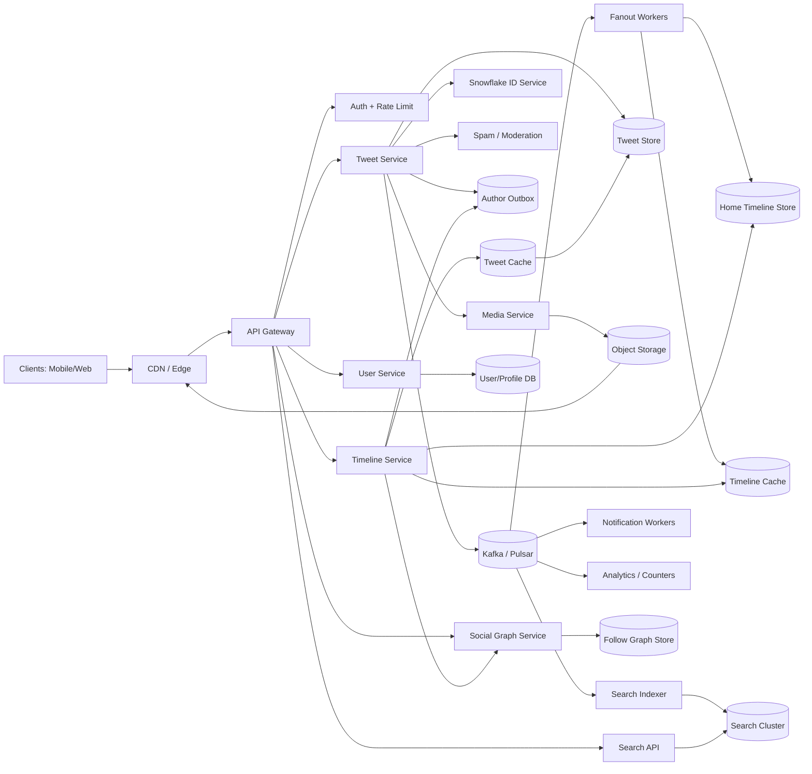
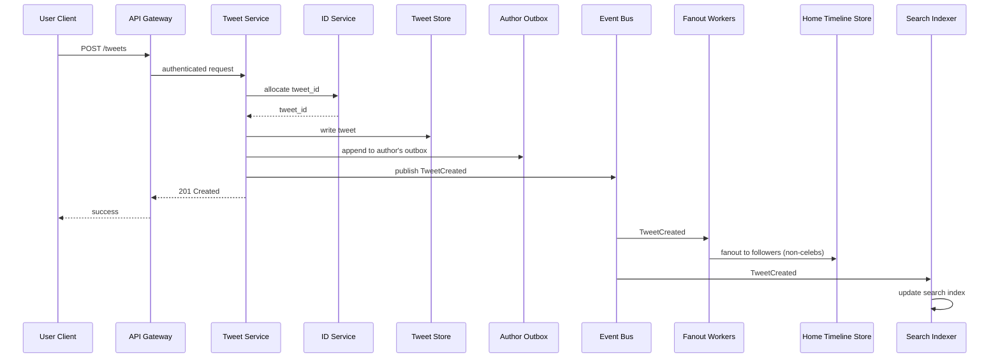

---

Design a microblogging platform like Twitter.


---

Below is a practical design for a Twitter-like microblogging system at large scale.

---

## 1) Requirements

### Core features
- Sign up / login
- Follow / unfollow users
- Post short messages (“tweets”), replies, reposts/retweets, quotes
- Attach media (images/video)
- Read:
  - user profile timeline
  - home timeline from followed accounts
  - tweet detail / conversation thread
- Like / unlike
- Search by text, hashtag, user
- Notifications for mentions, replies, follows, likes

### Non-functional requirements
- Very high read QPS
- Low write latency for posting a tweet
- Home timeline should usually load in a few hundred ms
- High availability across regions
- Eventual consistency is acceptable for:
  - like counts
  - search indexing
  - timeline fanout delays of a few seconds
- Stronger consistency needed for:
  - auth
  - follow/unfollow state
  - tweet durability once acknowledged

---

## 2) Scale assumptions and capacity math

I’ll pick realistic round numbers.

### Assumptions
- **600M registered users**
- **250M DAU**
- **500M tweets/day**
- Average user opens home timeline **25 times/day**
- Average user follows **200 accounts**
- **20%** of tweets include media
- Peak traffic is **10x** average

### Derived traffic

#### Tweet creation
- 500M tweets/day
- `500,000,000 / 86,400 ≈ 5,787 writes/sec average`
- Peak ≈ **60k tweets/sec**

#### Home timeline reads
- `250M users * 25 opens/day = 6.25B home timeline requests/day`
- `6.25B / 86,400 ≈ 72k req/sec average`
- Peak ≈ **720k req/sec**

If each timeline page returns 50 tweets:
- `6.25B * 50 = 312.5B tweet impressions/day`
- `≈ 3.6M tweet objects/sec average hydrated`
- Peak ≈ **36M/sec**

#### Social graph
- `600M users * 200 follows/user = 120B follow edges`

### Storage math

#### Tweet storage
Assume average tweet object:
- text + metadata + ids + flags + pointers ≈ **500 bytes**

So:
- `500M/day * 500B = 250 GB/day raw`
- Per year: `250 * 365 ≈ 91 TB/year raw`
- With replication/index overhead (~3x): **~275 TB/year**

#### Follow graph storage
Assume each edge stored in both directions:
- follower list and following list
- effective storage per edge with metadata/indexing ≈ **64 bytes total**

Then:
- `120B * 64B = 7.68 TB raw logical`
- With replication + overhead: **20–30 TB**

#### Media storage
Assume:
- 20% of tweets have media
- avg media payload after processing = **1 MB**

Then:
- `500M * 20% = 100M media tweets/day`
- `100M * 1MB = 100 TB/day`

This dominates storage, so media must live in cheap object storage + CDN, not in primary DBs.

---

## 3) Key design choice: hybrid fanout

The main problem in Twitter-like systems is generating the **home timeline**.

### Naive fanout-on-write
When a user tweets, push that tweet ID into every follower’s home timeline.

Problem:
- If average followers = 200:
  - `500M tweets/day * 200 = 100B timeline inserts/day`
- Worse: a celebrity with 50M followers creates a huge burst.

### Pure fanout-on-read
When user opens home timeline, read recent tweets from all followed accounts and merge.

Problem:
- If user follows 200 accounts, each request becomes a large multi-source merge.
- Very read-expensive at 720k req/sec peak.

### Best approach: **hybrid**
- **Normal users**: fanout-on-write
- **Celebrities / hot accounts**: fanout-on-read
- Often also fan out only to **recently active followers**

This is the standard answer because follower distribution is highly skewed.

### Example math
Suppose:
- 80% of tweets are from non-celebs
- average eligible fanout for those = 100 active followers

Then push writes:
- `500M * 80% * 100 = 40B timeline inserts/day`
- `40B / 86,400 ≈ 463k inserts/sec average`
- Peak ≈ **4.6M inserts/sec**

That is large but feasible with sharded timeline stores and batched writes.

And celebrity tweets are handled lazily on read, so one 50M-follower account doesn’t melt the system.

---

## 4) High-level architecture



---

## 5) API sketch

### Tweets
- `POST /v1/tweets`
- `GET /v1/tweets/{tweet_id}`
- `DELETE /v1/tweets/{tweet_id}`
- `POST /v1/tweets/{tweet_id}/like`
- `POST /v1/tweets/{tweet_id}/retweet`

### Timelines
- `GET /v1/home_timeline?cursor=...&limit=50`
- `GET /v1/users/{user_id}/tweets?cursor=...`
- `GET /v1/tweets/{tweet_id}/replies?cursor=...`

### Social graph
- `POST /v1/users/{id}/follow`
- `DELETE /v1/users/{id}/follow`
- `GET /v1/users/{id}/followers?cursor=...`
- `GET /v1/users/{id}/following?cursor=...`

### Search
- `GET /v1/search?q=...&type=tweet|user`

Use **cursor-based pagination**, not offset, because timelines change continuously.

---

## 6) Data model and storage choices

### 6.1 User/profile data
Use a relational DB or strongly consistent distributed SQL for:
- account info
- settings
- privacy flags
- verification state

**Why not graph DB for everything?**
Because most access patterns are simple key lookups and adjacency lists, not deep graph traversals.

---

### 6.2 Tweet store
Use a write-optimized distributed KV / wide-column store like:
- Cassandra / Scylla / Bigtable / DynamoDB

Store by `tweet_id`.

Example tweet object:
```text
Tweet {
  tweet_id,
  author_id,
  type: POST | REPLY | REPOST | QUOTE,
  text,
  media_ids[],
  reply_to_tweet_id?,
  quoted_tweet_id?,
  conversation_id,
  created_at,
  visibility,
  deleted_flag,
  language,
  counters_ptr
}
```

### 6.3 Author outbox / user timeline
A per-user append-only index:
- key: `author_id`
- sort by reverse time / tweet_id desc
- value: `tweet_id`

Used for:
- profile timeline
- celebrity pull during home timeline reads

This is cheap:
- 500M tweets/day
- just storing IDs and timestamps in outboxes is tiny compared to media

---

### 6.4 Social graph
Store both directions:
- `following_by_user(user_id -> followed_ids[])`
- `followers_by_user(user_id -> follower_ids[])`

Partition by user ID.

Important: for large accounts, don’t keep one giant row.
Use segmented partitions:
- `(user_id, shard_no)` where shard size might be 5k or 10k followers

This avoids hot partitions when reading celebrity followers.

---

### 6.5 Home timeline store
Materialized per-user inbox for recent tweets from non-celebs.

Schema:
- key: `viewer_user_id`
- sort key: `score_or_created_at desc`
- value: `tweet_id, author_id, source_type`

Use:
- persistent wide-column store for durability
- Redis/Memcached for hot head of timeline

Retention:
- keep last **500–1000 entries** or last **7–30 days**
- older items can be recomputed from author outboxes if needed

Example size:
- 250M DAU * 500 IDs/user = 125B entries
- at ~16 bytes raw per entry = ~2 TB raw minimum
- with overhead/replication: **~8–10 TB**
Feasible distributed.

---

### 6.6 Search index
Use Elasticsearch/OpenSearch/Solr for:
- text search
- hashtag search
- user search

Search is updated asynchronously from the event bus.

---

### 6.7 Media
- Upload via pre-signed URL
- Store in object storage (S3/GCS/etc.)
- Generate thumbnails/transcoded variants asynchronously
- Serve via CDN

---

## 7) Write path: posting a tweet

### Steps
1. Client sends `POST /tweets`
2. API gateway authenticates, rate-limits
3. Tweet service:
   - validates payload
   - runs spam/moderation checks
   - gets a unique time-sortable ID (Snowflake-style)
4. Persist tweet to Tweet Store
5. Append tweet ID to author outbox
6. Publish `TweetCreated` event to Kafka/Pulsar
7. Return success to client
8. Async consumers do:
   - fanout to follower home timelines
   - search indexing
   - hashtag extraction
   - notifications (mentions/replies)
   - analytics counters

### Important design point
**Return success after durable write + event publish**, not after full fanout.

Otherwise post latency becomes coupled to follower count.

---

## 8) Read path: loading home timeline

### For ordinary content
Read from the user’s materialized home timeline.

### For celebrity content
Pull recent tweets from followed celebrity authors’ outboxes and merge at read time.

### Timeline read flow
1. Read top N IDs from timeline cache/store
2. Get followed celebrity list for this viewer
3. Pull a small number of latest tweets from those celebrity outboxes
4. Merge + dedupe + filter:
   - blocked/muted users
   - deleted tweets
   - protected/private visibility
5. Hydrate tweet objects from tweet cache/store
6. Rank (optional) or sort reverse-chronologically
7. Return first 50 + cursor

### Why this works
- Most reads hit precomputed materialized timelines
- The celebrity set per viewer is usually small
- Hot celebrity outboxes can be cached

---

## 9) Sequence diagram for posting



---

## 10) Partitioning strategy

### Tweet store
Partition by `tweet_id` or hash(tweet_id).
- Good write spread
- Direct lookup by ID is easy

For per-user timelines, don’t scan tweet store.
Use separate outbox index by author.

### Social graph
Partition by `user_id`.
- follower list segmented for large users

### Home timeline
Partition by `viewer_user_id`.

This is nice because:
- reads are mostly per user
- writes from fanout are naturally spread across many viewers

### Counters
Like/reply/repost counts can become hot.
Use sharded counters:
- split each logical counter across many shards
- aggregate on read or periodically compact

---

## 11) Caching

### Cache layers
1. **CDN** for images/video and public profile assets
2. **Tweet cache** for tweet objects
3. **Timeline cache** for the head of home timeline
4. **Profile cache** for user metadata
5. **Celebrity outbox cache** for latest few tweet IDs

### Expected behavior
- Tweet cache hit rate should be high because many users read the same hot tweets
- Timeline cache reduces pressure on home timeline store
- Outbox cache prevents celebrity pull from hammering storage

### Cache invalidation
- Tweet delete => tombstone + invalidate caches
- Profile change => invalidate profile cache
- Block/mute changes are usually filtered at read time, because back-removing from all old materialized timelines is expensive

---

## 12) Consistency model

### Strong / near-strong
- tweet acknowledged only after durable write
- follow/unfollow should be durable before responding
- private account access control must be correct

### Eventual consistency
- home timeline fanout may lag a few seconds
- search may lag
- counts may lag
- delete propagation may lag, but read path must honor tombstones

### ID generation
Use **Snowflake-style IDs**:
- time sortable
- no DB bottleneck
- useful for pagination cursors

---

## 13) Multi-region design

A global service should not depend on one region.

### Practical setup
- 3+ regions
- within each region: 3 AZs
- assign each user a **home region**
- writes go to the user’s home region
- replicate events asynchronously to other regions

### Why not global synchronous consensus for every tweet?
Too slow and too expensive at this write/read volume.

### Tradeoff
- cross-region timeline propagation may lag slightly
- but write latency stays low and system remains available

### Failover
- if user home region is down, route to secondary region
- recent timelines may be slightly stale
- tweet durability relies on replicated logs / quorum storage

---

## 14) Failures and how to handle them

### 1. Fanout backlog grows
**Cause:** spikes, celebrity events, worker outage  
**Effect:** tweets missing from home timeline for some users

**Mitigation**
- use Kafka backlog monitoring
- degrade to more pull-on-read if inbox is stale
- prioritize recent tweets
- batch writes per user shard

---

### 2. Celebrity hot spots
**Cause:** one account with tens of millions of followers  
**Effect:** follower list read storm, cache hot keys

**Mitigation**
- never push to all celebrity followers
- cache latest celebrity outbox
- segment follower lists
- apply adaptive celeb threshold

---

### 3. Duplicate events
**Cause:** retries, at-least-once message delivery  
**Effect:** duplicate tweets in timelines or duplicate notifications

**Mitigation**
- idempotency key on tweet creation
- dedupe by `(viewer_id, tweet_id)` in timeline writes
- consumers must be idempotent

---

### 4. Tweet deleted after fanout
**Effect:** stale entries remain in home timelines

**Mitigation**
- tombstone in tweet store
- read path filters deleted tweets
- async cleanup removes from cached/materialized timelines

---

### 5. Cache outage
**Effect:** DB thundering herd

**Mitigation**
- request coalescing
- per-key rate limits
- fallback to persistent store
- staggered TTLs / jitter
- circuit breakers

---

### 6. Search cluster lag or failure
**Effect:** search incomplete/stale

**Mitigation**
- keep search decoupled from posting
- degrade gracefully; core timeline still works

---

### 7. Social graph inconsistency
**Effect:** seeing tweets from unfollowed users or missing from newly followed users

**Mitigation**
- follow/unfollow updates written synchronously
- read path always checks current relationship/visibility
- background repair for older materialized timeline entries

---

## 15) Moderation, abuse, and privacy

This is essential in a Twitter-like product.

### Abuse controls
- rate limiting by user/IP/device
- spam scoring on write
- link reputation checks
- bot detection
- shadow-ban / downranking hooks

### Privacy
- protected accounts: only approved followers can read
- blocks/mutes: filtered at read time; optionally stop future fanout
- compliance/GDPR deletion pipeline

### Why filter on read?
Because retroactively editing millions of timeline entries after every block/mute is expensive.

---

## 16) Tradeoffs summary

### Push vs pull
- **Push**: fast reads, expensive writes
- **Pull**: cheap writes, expensive reads
- **Hybrid** is the right answer at Twitter scale

### Cassandra/Bigtable-style stores vs relational joins
- Timelines and tweets are high-volume append/read patterns
- distributed KV/wide-column fits better than relational joins

### Async pipelines
- better latency and resilience
- but introduces eventual consistency and duplicate handling

### Materialized timelines
- more storage and write amplification
- much lower read latency, which matters most

---

## 17) Final recommended design

If I were building this system, I would choose:

- **Hybrid home timeline**
  - push for normal users
  - pull for celebrities/hot accounts
- **Tweet store** in Cassandra/Scylla/Bigtable-like DB
- **Social graph** as sharded adjacency lists, not a graph DB
- **Home timeline store** materialized by user_id
- **Redis/Memcached** for hot timeline heads and tweet objects
- **Kafka/Pulsar** for all async pipelines
- **Object storage + CDN** for media
- **OpenSearch/Elasticsearch** for search
- **User-homed multi-region architecture** with async replication

This design gives:
- low tweet post latency
- fast home timeline reads
- controllable fanout cost
- tolerance for celebrity skew
- clean failure isolation between core feed and secondary features like search

If you want, I can next provide:
1. a **deeper home-timeline design**,  
2. a **database schema**, or  
3. a **low-level API + data partitioning interview answer**.