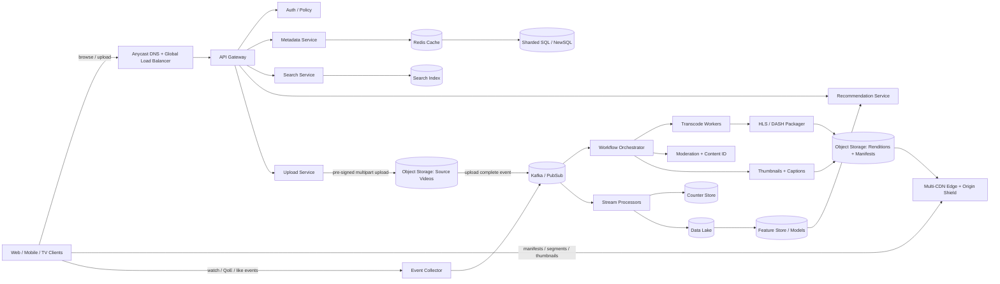

---

Design a video sharing platform like YouTube.

---

Below is a design for a large-scale **video sharing platform like YouTube**, focused on the core VOD experience:

- upload videos
- process/transcode them
- serve playback globally
- search/discover videos
- track views/likes/comments
- power recommendations/home feed

I’ll treat **live streaming, ads, and monetization** as extensions, not the main scope.

---

## 1) Requirements

### Functional
1. Users can upload videos.
2. Videos are processed into multiple resolutions/bitrates.
3. Users can watch videos on web/mobile/TV.
4. Search by title/tags/channel/transcript.
5. Show metadata: title, description, channel, thumbnails, captions, counts.
6. Likes, comments, subscriptions.
7. Home/recommended feed.
8. Privacy controls: public, unlisted, private.
9. Moderation and copyright checks.

### Non-functional
1. **Very high read scale**; write scale is smaller but uploads are large.
2. **Global low-latency playback**.
3. **High durability** for uploaded content.
4. **High availability** for watch path.
5. **Cost efficiency**: storage + egress dominate cost.
6. **Eventual consistency is okay** for counts/search/recommendations; not okay for access control/privacy.

### Suggested SLOs
- Playback start success: **99.99%**
- Playback API p95: **< 150 ms**
- Search p95: **< 300 ms**
- Upload publish latency:
  - baseline SD/HD availability: **< 1 minute** for short videos
  - full ladder/AV1 may take longer
- Source video durability: **11+ nines**

---

## 2) Scale assumptions and capacity math

I’ll size for a very large global platform:

### Assumptions
- **200M DAU**
- Each DAU watches **5 videos/day**
- Total **1B video starts/day**
- Average watched duration: **8 min**
- Average delivered bitrate across ABR playback: **3 Mbps**
- **2M uploads/day**
- Average uploaded video length: **10 min**
- Average source bitrate: **8 Mbps**
- Peak traffic factor: **3x average**

### Watch traffic
**Per view bytes delivered**
- 8 min = 480 sec
- 3 Mbps × 480 sec = 1440 Mb = **180 MB/view**

**Daily video egress**
- 1B views/day × 180 MB = **180 PB/day**

**Average global egress**
- 180 PB/day ÷ 86,400 sec ≈ **2.08 TB/s**
- In bits: **16.7 Tbps average**

**Peak egress**
- 3x average ≈ **50 Tbps peak**

This is why the platform must use a **CDN-first architecture**.

### Segment request rate
Assume 4-second segments for ABR:
- 8 min / 4 sec = **120 segments/view**
- 1B views/day × 120 = **120B segment requests/day**

**Average segment RPS**
- 120B / 86,400 ≈ **1.39M req/s**

**Peak**
- ≈ **4.2M req/s**

Again, most of this must terminate at CDN edges, not origin.

### CDN offload
Target **95% byte hit ratio** at CDN + origin shield.

Then origin serves:
- 5% of 180 PB/day = **9 PB/day**
- Average origin egress: **~0.83 Tbps**
- Peak origin egress: **~2.5 Tbps**

Origin request rate:
- 5% of 1.39M req/s = **~69k req/s average**
- Peak: **~210k req/s**

This is feasible with several regional origins + shield layers.

### Upload traffic
Source size per upload:
- 10 min × 8 Mbps = 4800 Mb = **600 MB**

Daily ingest:
- 2M uploads/day × 600 MB = **1.2 PB/day**

Average ingest bandwidth:
- 1.2 PB/day ÷ 86,400 ≈ **13.9 GB/s**
- ≈ **111 Gbps average**, **~333 Gbps peak**

### Transcoding compute
Total input minutes/day:
- 2M uploads × 10 min = **20M input minutes/day**

Assume one GPU worker can produce the baseline H.264 ladder at **10x real time**:
- 1 worker/day = 1440 min × 10 = **14,400 input min/day**

Workers needed:
- 20,000,000 / 14,400 ≈ **1,389 GPU workers**

With headroom, failures, re-encodes, and bursts:
- provision around **2,000–2,500 workers**

AV1/4K can be deferred and encoded only for popular content.

### Storage
Assume initial stored outputs:
- Source original: **600 MB/video**
- H.264/CMAF ladder total: about **750 MB/video**
- Total logical stored per video: **1.35 GB**

Daily logical storage:
- 2M × 1.35 GB = **2.7 PB/day**

Yearly logical storage:
- **~985 PB/year**

Physical storage strategy:
- Source videos: cross-region replicated + erasure coded
- Derived renditions: single-region durable store + regenerate on DR

If erasure coding overhead is ~1.4x:
- Source physical/year: 438 PB × 2 regions × 1.4 ≈ **1.23 EB**
- Derived physical/year: 547 PB × 1.4 ≈ **0.77 EB**
- Total physical/year ≈ **2.0 EB**

That is massive, so cost controls matter:
- cold/archive tiering
- prune rarely used renditions
- generate AV1/4K lazily
- regenerate derived outputs instead of replicating everything

---

## 3) High-level architecture

---

## 4) Core design choices

## A. Upload path

### Why direct-to-object-store upload?
Do **not** send multi-GB video uploads through app servers.

Instead:
1. Client calls `initiateUpload`
2. Upload service creates `video_id`, metadata row, and returns **pre-signed multipart URLs**
3. Client uploads directly to object storage
4. Object store emits `upload-complete` event
5. Pipeline begins

### Benefits
- API fleet doesn’t become a bandwidth bottleneck
- better retry/resume support
- cheaper and easier to scale

### Upload API examples
- `POST /v1/videos:initiateUpload`
- `POST /v1/videos/{videoId}:complete`
- `GET /v1/videos/{videoId}`

### Metadata state machine
A simple lifecycle:

`CREATED -> UPLOADING -> PROCESSING -> READY | BLOCKED | FAILED -> DELETED`

This state lives in the canonical metadata DB.

---

## B. Media processing pipeline

After upload completes:

1. **Validate file**
   - checksum
   - container/codec validation
   - malware scan
2. **Moderation checks**
   - NSFW/violence/abuse models
   - copyright fingerprinting / Content ID
3. **Thumbnail extraction**
4. **Caption generation / ASR**
5. **Transcode into adaptive bitrate ladder**
6. **Package into HLS/DASH manifests**
7. **Publish metadata + index search**

### Packaging
Use **CMAF/fMP4 segments** so HLS and DASH can share the same media chunks.  
Only manifests differ.

This avoids storing separate copies for HLS and DASH.

### Rendition strategy
Generate immediately:
- 240p, 360p, 480p, 720p, 1080p H.264
- audio-only

Generate later / selectively:
- AV1 / VP9
- 1440p / 4K / 8K
- HDR variants

### Important tradeoff
**Encode everything eagerly** gives best playback efficiency later, but is expensive.  
Best practical approach:

- **Eagerly encode baseline H.264 ladder**
- **Defer expensive codecs/resolutions** until a video becomes popular

This reduces compute/storage while keeping publish latency low.

### Publish rule
A video becomes visible when:
- moderation passed (or trusted creator soft-publish policy applies)
- baseline transcodes succeeded
- manifests/thumbnails are written

Then metadata state flips to `READY`.

---

## C. Playback path

### Watch flow
1. Client requests video metadata page
2. Client calls playback endpoint: `GET /v1/videos/{id}/playback`
3. Playback service checks:
   - public/private/unlisted
   - geo restrictions
   - age restrictions
   - signed-in entitlement if needed
4. Returns:
   - video metadata
   - signed manifest URL or signed cookie/token
   - available renditions, captions, thumbnails
5. Client fetches manifest + segments from CDN
6. Player uses ABR to choose bitrate based on throughput/buffer

### Why ABR?
Network conditions vary a lot. ABR minimizes rebuffers and startup latency.

### Segment size
Use **4–6 second segments**.

Tradeoff:
- shorter segments: better adaptation, lower live latency, more request overhead
- longer segments: fewer requests, better CDN efficiency, worse adaptation

For VOD, **4 seconds** is a good balance.

### CDN strategy
Use **multi-CDN** with:
- edge POPs
- regional shield caches
- a few durable origins

Cache behavior:
- **segments**: immutable, cache for a long time
- **manifests**: short TTL
- **thumbnails**: long TTL
- **metadata API responses**: cache at app layer / Redis, not CDN-only

### Why versioned immutable URLs?
Never overwrite segments in place.

Use paths like:
`/video/{videoId}/{version}/h264/720p/segment-00123.m4s`

Benefits:
- no cache poisoning/confusion
- simple rollback
- easy atomic publish by switching manifest pointer to new version

---

## 5) Data storage design

Use different stores for different access patterns.

| Data | Store | Why | Consistency |
|---|---|---|---|
| Canonical video metadata, ACL, status | Sharded SQL / NewSQL | transactions, schema, strong reads/writes | strong |
| Media bytes (source + renditions + thumbnails) | Object storage | cheap, durable, huge scale | object-level |
| Search documents | OpenSearch / Elasticsearch | full-text, filters, autocomplete | eventual |
| View/like counters | Redis/Scylla/Cassandra + stream aggregation | hot keys, high write rate | eventual |
| Watch/QoE events | Kafka/PubSub + data lake | append-only analytics stream | at-least-once |
| Recommendation features | feature store | low-latency online features | eventual |

## Canonical metadata schema
A video record might contain:
- `video_id`
- `owner_id / channel_id`
- `title`
- `description`
- `tags`
- `status`
- `visibility`
- `duration_sec`
- `source_uri`
- `manifest_uri`
- `thumbnail_uri`
- `created_at`
- `moderation_state`
- `transcode_state`
- `region_home`
- `version`

### Metadata DB choice
A good practical choice:
- **MySQL + Vitess** for sharding and operational maturity

Alternative:
- **Spanner/CockroachDB** if you want stronger global consistency and simpler multi-region writes, at higher cost/latency/complexity tradeoffs.

Because video metadata write QPS is modest, either works.

### Counter design
Do **not** update the canonical DB on every view.

Instead:
- send watch events into Kafka
- stream processors validate and aggregate
- maintain **sharded counters** per video to avoid hotspotting
- periodically compact into durable stores

This lets a viral video avoid hammering one DB row.

---

## 6) Search and discovery

## Search
Index:
- title
- description
- tags
- channel
- transcript/captions
- language
- publish time
- popularity signals

On metadata update or publish:
- emit event
- index asynchronously
- search becomes consistent within seconds

### Search QPS
If even 10% of DAUs issue 1 search/day:
- 20M searches/day
- ~230 QPS average
- ~700 QPS peak

That’s small compared to playback traffic. Search isn’t the main scaling challenge; indexing freshness and relevance are.

## Recommendations / home feed
Use a separate pipeline:
1. Collect watch/like/subscribe events
2. Build user and video features
3. Generate candidates from:
   - subscriptions
   - related videos / co-watch graph
   - trending in locale
   - embedding similarity ANN index
4. Rank candidates online

Important: **recommendations should not be on the playback critical path**.  
If recs fail, watching must still work.

---

## 7) Likes, comments, subscriptions

These are not the hardest part of YouTube, but they matter.

### Likes/dislikes
- Store user→video reaction in key-value / wide-column store
- Idempotent upsert
- Aggregate counts asynchronously

### Comments
Partition by `video_id`:
- efficient fetch of comments for a video
- paginate by time or rank
- store top comments separately or cache ranked results

### Subscriptions
Store channel followers as graph edges:
- `subscriber_id -> channel_id`
- `channel_id -> subscriber_id`

For notifications, use hybrid fanout:
- small/medium channels: fanout on write
- mega-channels: pull at read time or delayed fanout

---

## 8) Detailed request flows

## Upload flow
1. Client calls `initiateUpload`
2. Service creates metadata row with `CREATED`
3. Service returns multipart pre-signed URLs
4. Client uploads directly to object store
5. Client calls `completeUpload`
6. Object store emits completion event
7. Workflow starts:
   - validate
   - moderate
   - transcode
   - generate thumbnails/captions
8. Packager writes manifests + segments
9. Metadata updates to `READY`
10. Search/recommendation pipelines are notified

## Watch flow
1. User opens video page
2. App reads metadata from cache/DB
3. Playback endpoint authorizes access
4. Client gets signed manifest URL/cookies
5. Player requests manifest from CDN
6. Player downloads segments from CDN
7. Client emits watch milestones/QoE events
8. Counters and recommendation features update asynchronously

---

## 9) Partitioning and scaling details

## Sharding
### Metadata
Shard by `video_id`.

Need extra lookup patterns:
- channel uploads page → secondary table keyed by `channel_id`
- recent uploads → time-ordered index
- search → separate index, not SQL scan

### Object storage layout
Avoid hot prefixes:
- hash or prefix by video ID
- e.g. `/ab/cd/{videoId}/...`

### Events
Different consumers want different keys:
- by `video_id` for counters/trending
- by `user_id` for personalization
- by `channel_id` for creator analytics

Common pattern:
- ingest once
- derive multiple downstream topics/streams

## Caching
### API cache
Use Redis/memory cache for:
- video metadata
- channel info
- top comments
- recommendation results

### CDN
Use for:
- manifests
- segments
- thumbnails
- caption files

### Hot video protection
A newly viral video can create a cache-miss storm.  
Mitigations:
- origin shield
- request coalescing
- proactive prewarming for trending content

Example:
If one video has **1M concurrent viewers**, with 4-second segments:
- roughly **250k requests/sec** for the “current” segment globally

Without cache coalescing, origin could melt.  
With edge caching + shield, each POP fetches once, not per viewer.

---

## 10) Reliability, durability, and failure modes

## Multi-region strategy
- Stateless APIs: **active-active** in multiple regions
- Upload goes to nearest region
- Source object replicated asynchronously to backup region
- Metadata DB replicated across regions
- CDN can fail over to secondary origin

## Key failure modes and mitigations

| Failure | Impact | Mitigation |
|---|---|---|
| Upload interrupted | user loses progress | resumable multipart upload, part checksums |
| App servers overloaded by large uploads | upload failures | direct-to-object-store upload |
| Queue backlog in transcode pipeline | long publish delays | autoscale workers, priority queues, backpressure, defer AV1/4K |
| Transcoder crashes mid-job | stuck video | idempotent jobs, workflow retries, checkpointing, DLQ |
| Moderation service outage | cannot safely publish | hold at PROCESSING or soft-publish only for trusted creators |
| Metadata shard outage | page/playback failures | replicas, failover, cache serving, regional isolation |
| Viral video cache-miss storm | origin overload | origin shield, request coalescing, CDN prewarm |
| Region outage | origin/data unavailable | source replicated cross-region, multi-region API failover, secondary origin |
| Event duplication/loss | wrong counters/recs | at-least-once bus + idempotent consumers + replay from logs |
| Search cluster outage | search unavailable | degrade gracefully; playback path unaffected |
| Privacy change or delete while content cached | stale access | short-lived signed URLs, revoke via auth, purge manifest, async object GC |

## Important durability decision
**Replicate source videos across regions.**  
Do **not** necessarily replicate every derived rendition.

Why:
- source is irreplaceable
- renditions are reproducible from source

This cuts storage cost significantly.

---

## 11) Consistency model

Use strong consistency only where it matters.

### Strong consistency
- upload session creation
- privacy/ACL changes
- delete/takedown actions
- metadata state transitions (`PROCESSING -> READY`)

### Eventual consistency
- view counts
- likes counts
- search indexing
- recommendations
- trending feeds
- comment ranking

This is the right tradeoff for scale.

---

## 12) Security, moderation, and abuse prevention

1. **Authentication/authorization**
   - OAuth/session tokens
   - ACL checks for private/unlisted
2. **Signed playback URLs/cookies**
   - short TTL to reduce hotlinking/leaks
3. **Encryption**
   - TLS in transit
   - at-rest encryption with KMS
4. **Upload scanning**
   - malware
   - bad file formats
5. **Content policy**
   - visual/audio moderation
   - hash matching for known illegal content
6. **Copyright**
   - perceptual fingerprinting pipeline
7. **Abuse**
   - rate limits
   - WAF
   - bot/fraud detection for views/likes/comments
8. **Compliance**
   - geo-blocking
   - age restrictions
   - GDPR delete/audit logs

### View counting
A “view” should not be a raw request count.
Use:
- watch-time threshold or milestone
- anti-bot heuristics
- dedupe per session/device/IP patterns

Counts may lag by seconds/minutes, which is acceptable.

---

## 13) Cost-sensitive optimizations

The two biggest costs are **egress** and **storage**.

### To reduce egress
- multi-CDN negotiation
- AV1/VP9 for popular content
- better ABR ladders
- thumbnail/caption caching at edge

### To reduce storage
- keep source permanently
- store only baseline ladder for all videos
- generate expensive codecs/resolutions on demand
- archive cold originals to cheaper tiers
- prune unused renditions for long-tail content

### Good practical policy
- baseline H.264 ladder for everyone
- AV1 only after popularity threshold
- 4K/8K only for videos that justify it

---

## 14) Tradeoffs summary

| Area | Choice | Why | Tradeoff |
|---|---|---|---|
| Upload path | Direct to object store | avoids API bottleneck | more client complexity |
| Transcoding | eager baseline, lazy premium codecs | faster publish, lower cost | some viewers won’t get optimal codec immediately |
| Media storage | object store + CDN | scale and durability | eventual consistency around deletes/purges |
| Metadata | sharded SQL/NewSQL | clean transactional model | more effort than pure KV |
| Counters | stream-aggregated eventual counts | handles hotspots | counts not instantly exact |
| Delivery | multi-CDN + origin shield | global scale and resilience | operational complexity |
| DR strategy | replicate source, regenerate renditions | major cost savings | slower full recovery after disaster |

---

## 15) What I would keep off the critical playback path

These should degrade gracefully without breaking watch:

- search indexing
- recommendations refresh
- exact view count updates
- AV1/4K generation
- caption generation
- creator analytics
- notifications
- comment ranking

The critical path should be only:

- auth/policy
- metadata lookup
- manifest issuance
- CDN delivery

---

## 16) Final design summary

A YouTube-like platform is really three systems combined:

1. **Control plane**
   - metadata
   - auth
   - search
   - recommendations
   - likes/comments/subscriptions

2. **Media pipeline**
   - upload
   - moderation
   - transcoding
   - packaging
   - thumbnails/captions

3. **Delivery plane**
   - CDN
   - origin shield
   - object storage
   - ABR player

The main architectural principles are:

- **Upload directly to object storage**
- **Use async workflows for processing**
- **Serve video through CDN, not application servers**
- **Keep source videos maximally durable**
- **Treat counters/search/recommendations as eventually consistent**
- **Optimize cost by generating premium renditions lazily**
- **Design for viral hotspots and regional failures**

If you want, I can next turn this into:
1. a **45-minute interview-style answer**,  
2. a **deep dive on the upload/transcoding pipeline**, or  
3. a **database schema + API design** version.