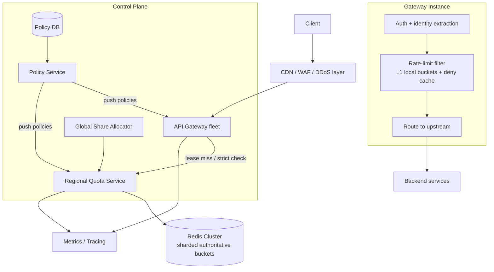

---

Design a distributed rate limiter to protect an API gateway.


---

Here’s a practical design for a **distributed rate limiter in front of an API gateway**.

## 1) Goals and assumptions

I’ll assume the gateway must support:

### Functional
- Rate limits by:
  - API key / tenant
  - user
  - source IP
  - route / method
  - optional cluster-wide safety limits
- Bursts + sustained limits
- Dynamic policy updates without restart
- Return `429 Too Many Requests` with `Retry-After`
- Work across many gateway instances and AZs

### Non-functional
- **Peak load:** 1,000,000 req/s per region
- **Gateway fleet:** 200 gateway instances per region
- **Added latency budget:** p99 < 5 ms
- **Availability:** 99.99%
- No single point of failure
- Protect the gateway itself during abuse

### Important reality
There is a tradeoff between:
- **strict exactness**
- **low latency**
- **very high throughput**

For a gateway, the best design is usually **hybrid**:
- **local decisions** for the common path
- **central authoritative state** for distributed correctness

---

## 2) High-level choice

### Algorithm choice
Use **token bucket** as the primary algorithm.

Why:
- O(1) state per key
- naturally supports bursts
- easy to compute `Retry-After`
- works well with **token leasing**

### Why not other algorithms?
- **Fixed window:** simple but causes boundary bursts
- **Sliding log:** accurate but too much memory
- **Sliding window counter:** okay, but token bucket is simpler operationally
- **Leaky bucket/GCRA:** also good; GCRA is elegant, but token bucket is easier when we want to lease chunks of quota to gateway nodes

---

## 3) Core design: hierarchical distributed limiter

The key idea:

1. **Each gateway instance has an in-memory local limiter**
2. The gateway holds a small **leased quota** for each active key
3. When local quota is exhausted, it asks a **regional quota service**
4. The quota service updates **authoritative state** in a **sharded Redis cluster**
5. Policies are distributed by a **policy service**
6. Optional **global share allocator** handles multi-region “global” limits

This gives:
- very fast common path
- bounded load on the central store
- no per-request network hop in the steady state

---

## 4) Architecture



---

## 5) Components

## A. Gateway rate-limit filter
Runs in-process with the API gateway.

Responsibilities:
- extract rate-limit descriptors from the request:
  - tenant id
  - API key
  - user id
  - source IP
  - route
- evaluate applicable policies
- consume local tokens if available
- on miss, request a lease from quota service
- deny quickly when over limit

### Local state per active key
For each `(policy_id, subject_key)`:
- `tokens_available`
- `lease_expiry`
- `policy_version`
- optional short deny cache: `deny_until`

This state is small and ephemeral.

---

## B. Policy service
Stores and distributes rate-limit rules.

A policy might look like:

```json
{
  "policy_id": "tenant-write-api",
  "match": {
    "route_prefix": "/v1/write",
    "method": "POST"
  },
  "dimension": "tenant_id",
  "rate_per_sec": 1000,
  "burst": 2000,
  "mode": "leased",
  "scope": "regional",
  "fail_mode": "closed"
}
```

Useful policy fields:
- `dimension`
- `rate`
- `burst`
- `scope = regional | global`
- `mode = strict | leased`
- `cost` per request
- `fail_mode = open | closed`
- priority / order

Policies should be pushed to gateways, not fetched per request.

---

## C. Regional quota service
Stateless service between gateways and Redis.

Responsibilities:
- receive batch lease requests
- compute/adapt lease size
- issue atomic updates to Redis via Lua
- return:
  - granted tokens
  - retry-after
  - remaining estimate
- batch and pipeline requests by Redis shard

Why not let gateways hit Redis directly?
- centralizes logic
- better observability
- easier rollout/versioning
- better batching and backpressure

---

## D. Redis cluster as authoritative state
Use Redis because:
- very high throughput
- atomic Lua scripts
- TTL support
- in-memory latency

State per bucket key:
- `tokens`
- `last_refill_ms`

Key format:
`rl:{policy_id}:{subject_hash}`

Use a **hashed subject key** instead of raw PII to reduce size and exposure.

---

## E. Global share allocator
For cross-region “global” limits, don’t do synchronous cross-region checks on every request.

Instead:
- maintain a global policy
- split it into **regional quotas**
- periodically rebalance based on observed traffic

Example:
- global limit = 300k req/s
- regions allocated:
  - us-east: 150k
  - eu-west: 90k
  - ap-south: 60k

This avoids WAN latency on the request path.

---

## 6) Request flow

## Normal path
1. Request arrives at gateway
2. Gateway authenticates and derives descriptors
3. For each matching policy:
   - check local deny cache
   - try to consume token from local lease
4. If all policies pass, forward request

## Lease miss path
If local tokens are insufficient:
1. Gateway sends a batched `AcquireLease` request to quota service
2. Quota service updates authoritative bucket(s) in Redis
3. If granted, gateway caches the tokens locally and consumes one
4. If denied, gateway returns `429`

## Denial path
Return:
- `429 Too Many Requests`
- `Retry-After`
- optionally `X-RateLimit-*` headers

---

## 7) Authoritative algorithm

For one bucket:

- rate = `r` tokens/sec
- burst capacity = `B`
- current stored state = `(tokens, last_ts)`

On request at time `now`:

\[
tokens' = min(B, tokens + r \cdot (now - last\_ts))
\]

If `tokens' >= cost`:
- allow
- set `tokens = tokens' - cost`

Else:
- deny
- retry after:

\[
retry\_after = \frac{cost - tokens'}{r}
\]

### Use integers, not floats
Store fixed-point integers, e.g. microtokens, to avoid floating-point drift.

---

## 8) Token leasing

This is the main scaling trick.

Instead of centralizing every request, a gateway asks for a **chunk** of tokens.

Example:
- policy = 1000 req/s, burst 2000
- gateway requests lease of 50 tokens
- local filter can then approve 50 requests without a network call

### Lease sizing
A good default:
- lease = **50 ms worth of traffic**
- capped by `burst / 4`
- minimum 1 token
- maximum maybe 100 or 500 depending on policy

Formula:

\[
lease\_size = clamp(1,\ rate \times 0.05,\ burst/4)
\]

Examples:
- 20 req/s policy → lease = 1
- 1000 req/s policy → lease = 50
- 10,000 req/s policy → lease capped, e.g. 100

### Why 50 ms?
Because it balances:
- low central load
- bounded over-admission
- decent fairness

### Overshoot bound
With leasing, the limit is no longer perfectly exact per request.

Worst-case over-admission for a key is roughly:

\[
active\_gateways\_for\_key \times lease\_size
\]

Example:
- tenant limit = 1000 req/s
- lease size = 50
- requests currently spread across 4 gateways

Worst-case extra admitted ≈ `4 × 50 = 200`

For many APIs this is acceptable.
For very sensitive endpoints, use **strict mode**.

---

## 9) Strict mode vs leased mode

Not all policies need the same strictness.

### Leased mode
Use for:
- high-QPS public APIs
- tenant fairness
- gateway protection
- DDoS-ish throttling

Pros:
- scalable
- low latency

Cons:
- bounded overshoot

### Strict mode
Use for:
- low-QPS admin APIs
- expensive write endpoints
- billing-sensitive operations

In strict mode:
- every miss is effectively a central check of cost 1
- more exact, more expensive

A useful policy field is:
- `mode = strict | leased`

---

## 10) Multiple limits per request

A request often matches several limits at once, for example:
1. per-IP
2. per-tenant
3. per-route safety cap

A request must satisfy **all** applicable policies.

### Ordering
Check in this order:
1. cheap local gateway self-protection rules
2. coarse route/global safety caps
3. tenant/account limits
4. user/IP fine-grained limits

This minimizes wasted work.

### Note on atomicity across multiple keys
If policies map to different Redis shards, full cross-key atomicity is expensive.

We accept this behavior:
- some tokens may be consumed for policy A even if policy B later denies
- this causes slight **under-admission**, not unsafe over-admission

That is a good tradeoff for a gateway limiter.

---

## 11) Capacity math

Let’s do actual numbers.

## Assumptions
- **1,000,000 req/s** peak per region
- average **2.5 applicable policies** per request
- **95% local lease hit rate**
- safe Redis throughput per primary shard for Lua updates: **50,000 ops/s**

### Without leasing
Every policy check hits Redis:

\[
1,000,000 \times 2.5 = 2,500,000\ ops/s
\]

Required Redis primaries:

\[
2,500,000 / 50,000 = 50\ primaries
\]

This is expensive and adds network latency to every request.

### With leasing
Only 5% of checks go to Redis:

\[
1,000,000 \times 2.5 \times 0.05 = 125,000\ ops/s
\]

Redis primaries needed:

\[
125,000 / 50,000 = 2.5
\]

So **3 primaries** is the minimum.
In practice I would provision **8 primaries + 8 replicas** for:
- failover
- hot-key skew
- maintenance headroom
- growth

---

## 12) Memory sizing

Assume:
- 2,000,000 active subjects in the last few minutes
- average 3 bucket keys per active subject
- so about **6,000,000 active bucket keys**

If each Redis key consumes about **200 bytes** including overhead:

\[
6,000,000 \times 200B = 1.2GB
\]

With replicas:

\[
1.2GB \times 2 = 2.4GB
\]

Add fragmentation and headroom:
- provision roughly **6–8 GB usable RAM** across the cluster minimum
- in practice 8 primaries with several GB each is plenty

### Important caveat: high-cardinality attacks
Random-IP attacks can create huge key cardinality.
So do **not** blindly create distributed state for every anonymous IP forever.

Mitigations:
- short TTL for IP-based buckets
- local pre-filter for anonymous traffic
- WAF/CDN before the gateway
- cap creation rate of new distributed keys

---

## 13) Latency budget

### Local hit
- in-process map lookup + token decrement
- around **tens of microseconds**

### Miss path
Typical path:
- gateway → quota service: 0.3–0.8 ms
- quota service → Redis: 0.2–0.8 ms
- Lua/script work: 0.1–0.3 ms
- return path: similar

Typical miss path:
- **1.5–3 ms**
- p99 under **5 ms** if regional and well-provisioned

### Average added latency
If 95% are local hits:

\[
0.95 \times 0.05ms + 0.05 \times 2ms \approx 0.15ms
\]

Very reasonable for a gateway.

---

## 14) Multi-region design

### Regional limits
Default mode should be **regional**.
Reason:
- avoids WAN latency
- avoids global dependency
- better availability

### Global limits
There are two practical patterns:

## Option A: Global quota split into regional shares
Recommended for high-QPS APIs.

Pros:
- fast
- resilient
- no cross-region request path

Cons:
- temporary imbalance
- not perfectly exact globally

Example:
- global limit = 300k req/s
- rebalance every 2 seconds
- if traffic shifts suddenly, one region may deny early while another has unused share

## Option B: Single home-region authority
Use only for low-QPS strict limits.

Pros:
- more exact

Cons:
- high latency
- cross-region dependency
- worse availability

For gateway protection, **Option A is almost always better**.

---

## 15) Failure modes and mitigations

## A. Quota service unavailable
Effect:
- lease misses cannot be refreshed

Mitigation:
- gateways keep using existing local leases until expiry
- deploy quota service statelessly behind load balancing
- use policy-specific fallback:
  - `fail-open` for low-risk authenticated traffic
  - `fail-closed` for anonymous/public abuse-prone endpoints

---

## B. Redis shard failure / failover
Effect:
- temporary inability to update authoritative state
- possible small state loss during primary failover

Mitigation:
- one replica per primary, spread across AZs
- client retries only when safe
- for ambiguous timeout after mutation: **do not blindly retry**
- degrade by policy:
  - strict policies: usually fail closed
  - public APIs: may fail open briefly with local emergency caps

### Subtle point
Redis replication is not perfectly CP.
During failover, some recently spent tokens may be “forgotten,” causing a little over-admission.
For gateway rate limiting, this is usually acceptable.
If not, you need a stronger-consistency store, but throughput will drop sharply.

---

## C. Network partition between gateway and quota service
Mitigation:
- local leases continue briefly
- local emergency per-IP and per-route limits stay active
- fail-open/closed by policy
- short circuit breakers to avoid retry storms

---

## D. Hot key
Example:
- one tenant or one route gets massive traffic
- a single Redis shard becomes hot

Mitigation:
- leasing drastically reduces per-request load
- request coalescing (`singleflight`) at gateway for concurrent misses
- deny cache after a rejection
- optional sticky routing by tenant/API key to improve locality
- special-case very hot strict keys if needed

---

## E. High-cardinality abuse
Example:
- attacker rotates source IPs or API keys

Mitigation:
- upstream WAF/CDN
- local approximate filters for anonymous traffic
- short TTLs
- rate-limit creation of new bucket state
- separate policies for authenticated vs unauthenticated traffic

---

## F. Policy update race
If a limit is lowered sharply, gateways may still hold leased tokens.

Mitigation:
- policy version in every lease
- invalidate local cache on policy update
- use short lease TTLs
- accept bounded overshoot up to outstanding leases

---

## 16) Operational details

## Observability
Track:
- allow / deny rate by policy
- quota-service QPS and latency
- Redis shard QPS, CPU, memory
- local lease hit ratio
- top hot keys
- fail-open count
- policy version skew
- 429s per route / tenant / IP
- estimated overshoot for leased policies

## Alerts
Alert on:
- quota service errors
- local hit ratio dropping sharply
- one shard much hotter than others
- fail-open activation
- abnormal new-key creation rate

## Security
- gateway derives rate-limit keys from trusted auth context
- never trust client-provided rate-limit identity headers
- hash subject keys before storage
- separate environments and tenants cleanly

---

## 17) API between gateway and quota service

A simple internal gRPC API:

```text
AcquireBatch(
  requests: [
    {
      policy_id,
      subject_key_hash,
      cost,
      requested_tokens,
      policy_version
    }
  ]
) -> [
  {
    granted_tokens,
    retry_after_ms,
    remaining_estimate,
    decision
  }
]
```

Notes:
- `requested_tokens = 1` in strict mode
- `requested_tokens = lease_size` in leased mode
- batch by request to reduce round trips
- quota service pipelines by shard

---

## 18) What I would actually ship

### Recommended production design
- **In-gateway local token buckets**
- **Regional quota service**
- **Redis cluster with Lua for authoritative token buckets**
- **Leased mode by default**
- **Strict mode for selected sensitive endpoints**
- **Regional enforcement first**
- **Global limits via regional quota shares**
- **Emergency local per-IP and per-route caps**
- **WAF/CDN in front for volumetric abuse**

This gives the best balance of:
- correctness
- performance
- cost
- operational simplicity

---

## 19) Main tradeoffs

| Decision | Benefit | Cost |
|---|---|---|
| Token bucket | Simple, burst-friendly | Not perfectly fair by itself |
| Local leases | Huge scale, low latency | Bounded overshoot |
| Redis authoritative store | Fast, operationally common | Failover is not perfectly strongly consistent |
| Regional enforcement | Low latency, resilient | Global limits become approximate |
| Strict mode option | Exact where needed | More load and latency |

---

## 20) Final answer in one sentence

Build a **hierarchical distributed rate limiter** where each API gateway enforces **local leased token buckets**, a **regional quota service** maintains **authoritative token bucket state in sharded Redis**, and **global limits** are handled via **regional quota shares**, giving low latency at 1M+ RPS while keeping over-admission bounded and configurable.

If you want, I can also provide:
1. a Redis Lua script for the bucket update, or  
2. an Envoy/NGINX-oriented version of this design.