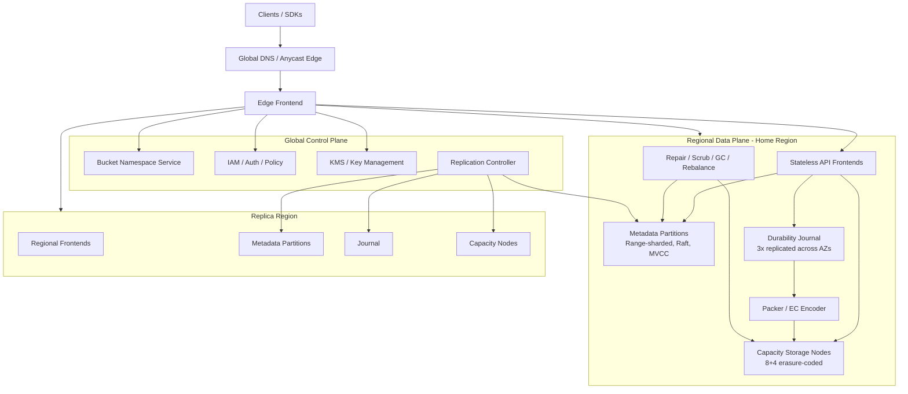
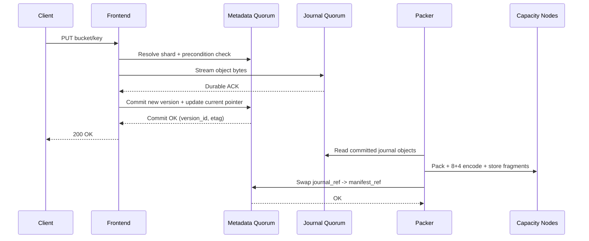

---

Design a global object storage system like S3.

---

Below is a practical design for a **global object storage system like S3**.

I’ll optimize for what real cloud object stores actually need:

- **Very high durability**: target **11 nines**
- **Regional strong consistency** for object operations and listing
- **Global reach** via edge endpoints and multi-region replication
- **Exabyte-scale storage**
- Support for:
  - `PUT/GET/HEAD/DELETE`
  - `LIST`
  - **multipart upload**
  - **versioning**
  - **byte-range reads**
  - **bucket policies / auth**
  - **cross-region replication**

I’ll use **regional buckets** with a **global control plane**, because that’s the best tradeoff for latency, availability, and operational simplicity at this scale.

---

# 1) Requirements

## Functional
- Create/delete bucket
- Put/get/delete object by `(bucket, key)`
- List objects by prefix, paginated
- Multipart upload for large objects
- Versioning
- Object metadata (headers, tags)
- Access control (IAM-like policies, presigned URLs)
- Byte-range GET
- Cross-region replication
- Lifecycle rules (optional extension)

## Non-functional
- **Durability**: 99.999999999% (11 nines)
- **Availability**: 99.99%+ for regional endpoint
- **Strong read-after-write consistency** for:
  - new PUT
  - overwrite PUT
  - DELETE
  - LIST
- Survive:
  - disk failure
  - node failure
  - rack failure
  - AZ failure
- Scale to **EBs of data** and **millions of requests per second**
- Low operational blast radius

## Non-goals
- POSIX filesystem semantics
- cross-object transactions
- atomic rename of directories
- globally linearizable writes across all regions by default

---

# 2) Core design choices

## Key choices
1. **Buckets are created in a home region**
   - Strong consistency is provided **within that region**
   - Global clients access via edge endpoints that route to the home region
   - Optional **async cross-region replication** for DR / geo-local reads

2. **Separate control plane and data plane**
   - Control plane: bucket namespace, IAM, replication config, policies
   - Data plane: object reads/writes/listing
   - Control plane outages should not take down existing data access

3. **Regional cells**
   - Each region is divided into multiple independent **cells**
   - Each cell contains:
     - stateless frontends
     - metadata partitions
     - write journal
     - capacity storage nodes
   - Limits blast radius

4. **Immutable object versions**
   - Each PUT creates a new immutable version blob
   - “Current object” is just a metadata pointer
   - Simplifies overwrite, versioning, replication, GC

5. **Write to a durable journal first, then compact to erasure-coded storage**
   - Better small-object performance
   - Easier strong consistency
   - Decouples client latency from background packing

6. **Range-partitioned metadata with consensus**
   - Needed for strong LIST semantics
   - Supports prefix scans and pagination

---

# 3) API surface

A minimal S3-like API:

- `PUT /{bucket}/{key}`
- `GET /{bucket}/{key}`
- `HEAD /{bucket}/{key}`
- `DELETE /{bucket}/{key}`
- `GET /{bucket}?prefix=&continuation-token=&max-keys=`
- `POST /{bucket}/{key}?uploads` → initiate multipart
- `PUT /{bucket}/{key}?partNumber=&uploadId=`
- `POST /{bucket}/{key}?uploadId=` → complete multipart
- `DELETE /{bucket}/{key}?uploadId=` → abort multipart

Important headers/options:
- `If-Match`, `If-None-Match`
- `Range`
- checksum headers
- SSE encryption headers
- version ID in responses

---

# 4) Capacity assumptions

I’ll use **decimal** units for fleet capacity (PB/EB) and **binary** units for chunk sizes (MiB).

## Assumptions
- **12 regions**, each with **3 AZs**
- **10 EB logical data stored globally**
- **1 trillion objects**
- average object size ≈ **10 MB**
- global ingress: **50 PB/day**
- global egress: **150 PB/day**
- peak traffic = **3× average**
- object max size: **5 TB**
- multipart recommended for large objects

## Derived throughput
### Ingress
- `50 PB/day / 86400 ≈ 579 GB/s global average`
- peak ≈ **1.74 TB/s global**
- per region average: `579 / 12 ≈ 48 GB/s`
- per region peak: **145 GB/s**

### Egress
- `150 PB/day / 86400 ≈ 1.74 TB/s global average`
- peak ≈ **5.2 TB/s global**
- per region average: **145 GB/s**
- per region peak: **435 GB/s**

## Request rate estimate
Assume:
- average GET transfer size seen by backend ≈ **4 MB**
- average upload part/object ≈ **8 MB**

Then:
- reads/day: `150 PB / 4 MB ≈ 37.5B GETs/day`
  - ≈ **434k GET/s avg**
  - ≈ **1.3M GET/s peak**
- writes/day: `50 PB / 8 MB ≈ 6.25B PUT/part ops/day`
  - ≈ **72k PUT/part/s avg**
  - ≈ **216k PUT/part/s peak**
- plus HEAD/LIST/DELETE/multipart control:
  - assume **~3–5M API ops/s peak** globally

This is comfortably within a modern large-scale distributed system if we partition aggressively.

---

# 5) High-level architecture

---

# 6) Data model

## Namespaces
- **Bucket**
  - globally unique name
  - owner/account
  - home region
  - policy
  - versioning flag
  - lifecycle rules
  - replication config
- **Object**
  - identified by `(bucket_id, key)`
  - points to a current version
- **Version**
  - immutable
  - size
  - checksum / etag
  - storage location reference
  - timestamps
  - encryption info
- **Multipart upload**
  - upload ID
  - uploaded part manifests
  - not visible until complete

## Metadata tables
1. **Bucket table**
   - bucket_name → bucket_id, home_region, config, policy_version

2. **Current object index**
   - `(bucket_id, key)` → current_version_id or tombstone

3. **Version table**
   - `(bucket_id, key, version_id)` → immutable version metadata

4. **Manifest table**
   - `manifest_id` → extent tree / chunk references

5. **Multipart table**
   - `upload_id` → parts, owner, initiated_at, status

---

# 7) Control plane

The control plane is **global**, relatively low QPS, and must be strongly consistent.

## Components
- **Bucket namespace service**
  - globally unique bucket names
  - maps bucket → home region
- **IAM / policy service**
  - account identities
  - bucket policies
  - auth decisions
- **KMS**
  - manages bucket/account keys
- **Replication config service**
  - source bucket → destination bucket/regions

## Implementation
Use consensus across **3 control-plane regions**.

Why global consensus is acceptable here:
- bucket create/delete/policy changes are low frequency
- unlike object PUT/GET, control-plane latency is not critical
- data-plane routing caches bucket map aggressively

## Important property
If control plane is degraded:
- **existing bucket data access still works**
- because edges/frontends cache:
  - bucket home region
  - shard map
  - recent policy versions

---

# 8) Regional data plane internals

Each region is split into multiple **cells**.

Example:
- region stores ~833 PB logical
- if each cell is ~100 PB logical,
- region has roughly **10–12 cells**

Each cell has:
- API frontends
- metadata cluster
- journal nodes
- capacity nodes
- background workers

This gives:
- smaller failure domains
- easier upgrades
- predictable scaling

---

# 9) Metadata service design

This is the heart of consistency.

## Requirements
- point lookup by `(bucket, key)`
- range scan by prefix for LIST
- strong consistency
- high write rate
- snapshot pagination

## Partitioning
Use **range sharding** by `(bucket_id, key)`.

Why not pure hash sharding?
- hash is great for point lookups
- but terrible for `LIST prefix=...`
- S3-like object stores need ordered prefix scans

So:
- each bucket’s keyspace is split into **key ranges**
- hot ranges split automatically
- cold ranges merged

## Replication
Each metadata shard is replicated via **Raft** across **3 AZs**.

- leader handles writes
- followers serve snapshot reads / lease reads
- survive 1 AZ loss

## Consistency model
Use **MVCC** with a regional timestamp allocator / HLC-like clock.

- Each committed mutation gets a commit timestamp
- `GET/HEAD` can be linearizable
- `LIST` obtains a **snapshot timestamp T**
- all relevant partitions return rows visible at `T`
- continuation token includes:
  - last key
  - snapshot timestamp
  - partition-map epoch

This gives **strong LIST consistency**, which is much harder than point GET.

## Metadata sizing
Assume:
- 1T objects global → ~83.3B objects per region
- average on-disk metadata including indexes/MVCC ≈ **1 KB/object**

Then per region:
- logical metadata ≈ **83 TB**
- with 3-way replication ≈ **249 TB**
- with 50% headroom/compaction ≈ **375 TB**

If using **96 metadata nodes** with **8 TB NVMe** each:
- raw NVMe = **768 TB**
- enough capacity + throughput headroom

---

# 10) Object storage format

## Large objects
Objects are split into **extents**.

Choose:
- extent size = **64 MiB**

Each extent is encoded using **Reed-Solomon 8+4**:
- 8 data fragments
- 4 parity fragments
- 12 total fragments
- overhead = `12/8 = 1.5x`

Each fragment is:
- `64 MiB / 8 = 8 MiB`

Placement:
- 12 fragments on **12 different nodes**
- spread across **3 AZs**
- **4 fragments per AZ**
- avoid same rack / power domain

This can survive:
- any 4 fragment losses
- including loss of an entire AZ (4 fragments)

## Small objects
Small objects are expensive with EC due to metadata and fan-out.

Optimization:
- keep very small objects (say **<256 KiB**) in a **replicated small-object pack tier**
- or pack many small objects into larger journal/segment files before EC

This avoids:
- 12-way fanout for tiny reads
- excessive metadata overhead

## Manifests
A version points to a **manifest tree**:
- small objects: single manifest
- large objects: multi-level tree

For a 5 TB object:
- `5 TB / 64 MiB ≈ 78k extents`
- too large for one metadata row
- so root manifest points to leaf manifests

This also makes **Range GET** efficient:
- read only the affected extents

---

# 11) Write path

I’ll use a **journal-first write path**.

Why:
- lower latency than writing directly to cold EC storage
- better for small objects
- easier to provide strong semantics
- journal handles bursty writes; packer smooths to HDD tier

## PUT flow
1. Client sends signed PUT to edge/frontend
2. Frontend authenticates and resolves bucket home region/cell
3. Frontend streams object data into the **regional journal**
   - journal is replicated across 3 AZs
   - ACK after quorum / durable policy is satisfied
4. Frontend computes checksum / etag
5. Frontend commits metadata transaction:
   - create new immutable version row
   - update current pointer atomically
6. Return success to client
7. Background packer later:
   - reads journal objects
   - packs/segments small objects
   - erasure-codes extents
   - writes EC fragments to capacity nodes
   - atomically updates version’s location from `journal_ref` to `manifest_ref`
   - frees journal space after grace period

The critical point:
- object is visible **only after metadata commit**
- journal data without metadata is garbage-collectable
- metadata without durable journal data is never committed

## PUT sequence

## Why not write directly to EC storage?
You can, but journal-first is better because:
- direct EC means every small write hits many disks/nodes
- read-modify-write or tiny-stripe inefficiency
- journal helps absorb spikes and reduces tail latency

Tradeoff:
- extra background compaction
- temporary space overhead

---

# 12) Journal design

Journal is a **durable hot tier**.

## Properties
- append-heavy
- NVMe-backed
- replicated across 3 AZs
- short retention, e.g. **12 hours**
- stores:
  - newly written objects/parts
  - recently hot objects
  - pending multipart parts

## Capacity math
Per region ingress:
- average ≈ **48 GB/s**
- peak ≈ **145 GB/s**

For **12-hour retention**:
- logical journal bytes/region ≈ `4.17 PB/day / 2 = 2.08 PB`

With 3-way replication:
- raw stored in journal ≈ **6.25 PB**

At 75% fill:
- installed raw ≈ **8.3 PB**

If each journal node has:
- 24 × 7.68 TB NVMe ≈ **184 TB raw/node**

Then nodes needed for capacity:
- `8.3 PB / 184 TB ≈ 45 nodes`

But throughput drives the count higher.

At peak internal replicated write traffic:
- client ingest 145 GB/s
- 3x replication means ~**435 GB/s internal journal writes**

If one journal node sustains ~7 GB/s safely,
- need `435 / 7 ≈ 62 nodes`

So provision about **72–80 journal nodes per region**.

---

# 13) Capacity storage nodes

Cold/steady-state data lives on HDD-based capacity nodes.

## Fleet math per region
Logical stored:
- `10 EB / 12 ≈ 833 PB`

With 8+4 EC:
- encoded bytes ≈ `833 × 1.5 = 1.25 EB`

At 75% max utilization:
- installed raw ≈ `1.25 / 0.75 = 1.67 EB`

Assume each storage node has:
- 60 × 24 TB HDD = **1.44 PB raw/node**

Needed:
- `1.67 EB / 1.44 PB ≈ 1,160 nodes`

Add ~30% headroom for:
- repair
- rebalancing
- growth
- maintenance

Provision about **1,500 capacity nodes per region**.

## Network
If each node has **2 × 100 Gbps**:
- **200 Gbps = 25 GB/s/node**
- region aggregate = `1,500 × 25 GB/s = 37.5 TB/s`

This easily covers:
- peak egress ~435 GB/s
- rebuild traffic
- background packing

---

# 14) Read path

## GET flow
1. Client reaches edge/frontend
2. Frontend authenticates request
3. Resolve metadata for `(bucket, key)` or specific `versionId`
4. If object still in journal:
   - read from nearest healthy journal replica
5. If object packed into EC storage:
   - fetch required fragments for needed extents
   - for normal read, fetch 8 data fragments
   - if any missing/corrupt, reconstruct using parity
6. Stream response back to client

## Optimizations
- frontend manifest cache
- metadata cache
- range GET reads only required extents
- read-ahead for sequential ranges
- hot-object cache / CDN integration for popular content

## Latency note
EC reads involve multiple nodes and cross-AZ traffic. That is fine internally, but:
- small objects are better served from journal/packed-replicated tier
- very hot content should sit behind a CDN

---

# 15) LIST path

LIST is tricky because S3-like systems now expect strong semantics.

## Requirements
- prefix scan
- delimiter emulation
- pagination
- consistent under concurrent writes

## Flow
1. Frontend resolves bucket and prefix range
2. Obtain snapshot timestamp `T`
3. Query all relevant metadata shards with snapshot `T`
4. Merge results in lexicographic order
5. Return up to `max-keys`
6. Continuation token contains:
   - last returned key
   - snapshot timestamp `T`
   - shard map epoch

This guarantees:
- no missing committed keys before `T`
- no duplicates across pages
- list-after-write consistency

---

# 16) Multipart upload

Large objects should use multipart upload.

## Why
- retry only failed parts
- parallel uploads
- avoids restarting huge uploads

## Design
### Initiate
- create `upload_id`
- store in multipart table

### UploadPart
- each part written to journal as hidden immutable object
- metadata recorded under `upload_id, part_number`

### CompleteMultipartUpload
- validate parts and checksums
- build root manifest from part manifests
- single metadata transaction publishes final object version

### AbortMultipartUpload
- mark upload aborted
- background GC deletes hidden parts

## Failure handling
If client uploads parts but never completes:
- lifecycle/TTL GC cleans them up

---

# 17) Delete, overwrite, and versioning

## Delete
- if versioning disabled:
  - write tombstone to current index
- if versioning enabled:
  - create delete marker
  - older versions remain accessible

## Overwrite
- create a new immutable version
- atomically swap current pointer

## Garbage collection
Data is immutable and may be referenced by:
- current version
- older versions
- in-progress replication
- multipart manifests
- server-side copy refs

Avoid synchronous refcount updates in write path.

Instead:
- maintain delayed-delete queues
- run periodic **mark-and-sweep** / reachability scan per cell
- delete unreferenced manifests/fragments after safety window

---

# 18) Durability strategy

Durability does not come from just one thing; it comes from multiple layers:

1. **journal replication across 3 AZs**
2. **EC across 3 AZs in steady state**
3. **checksums on every fragment**
4. **background scrubbing**
5. **repair on loss/corruption**
6. **immutable data + atomic metadata**
7. **cell isolation**
8. **optional cross-region replication**

## Simple repair probability intuition
Assume disk AFR = **2%**.

Per-disk hourly failure probability:
- `0.02 / 365 / 24 ≈ 2.28e-6/hour`

If repair window is 6 hours:
- per-disk failure probability in that window ≈ `1.37e-5`

For one 8+4 stripe on 12 independent disks, probability of 5+ failures in the same 6h window is astronomically low.

In reality, **correlated failures dominate**:
- rack power loss
- firmware bugs
- human error
- latent corruption

That’s why we also:
- spread across AZs and racks
- scrub continuously
- use multiple cell boundaries
- rate-limit risky fleet operations
- optionally replicate across regions

## Scrubbing
Background scrubbers:
- verify fragment checksums
- compare against object checksum
- detect bit rot early
- repair from parity before another failure happens

---

# 19) Failure scenarios

## 1. Disk failure
- extremely common
- affected fragments reconstructed from remaining fragments
- replacement drive/node filled in background

### Drive-failure rate
Per region:
- ~69k drives
- AFR 2%
- expected failures/year ≈ `69,000 × 0.02 = 1,380`
- ≈ **3.8 drive failures/day per region**

This is normal and must be fully automated.

## 2. Node failure
- frontends stop routing to node
- reads reconstruct from other fragments
- repair service re-creates missing fragments elsewhere

If one node stores 1.44 PB raw and fails:
- rebuild is throttled, parallelized
- frontends can still serve reads from remaining fragments

## 3. Rack failure
- placement rules avoid too many fragments in same rack
- no stripe should lose more than rack budget

## 4. AZ failure
- metadata Raft still has quorum across remaining 2 AZs
- journal still writes with remaining quorum
- EC objects remain readable because one full AZ’s 4 fragments can be lost

## 5. Metadata leader crash
- Raft elects new leader
- clients retry idempotently
- expected failover < 1–2 seconds

## 6. Control plane outage
- existing data path continues on cached bucket maps/policies
- bucket creation or policy edits may fail/degrade

## 7. Region outage
Baseline regional bucket semantics:
- home region unavailable
- bucket is unavailable unless client/app uses replicated failover strategy

Optional mitigation:
- **cross-region replication**
- **multi-region access point** routing reads to healthy replica
- writes still typically go to source region unless using a more complex global-write design

---

# 20) Cross-region replication

A true S3-like global system needs multi-region support.

## Default model
- bucket has a **home region**
- other regions are replicas
- replication is **asynchronous**

Why async?
- WAN consensus on every PUT would destroy latency and availability
- most object-store use cases prefer regional strong consistency + async DR

## Replication pipeline
1. Source region commits object version locally
2. Change log emits version event
3. Replication workers copy object/manifests to target region
4. Target region writes replica version metadata
5. replication status updated

Ordering:
- preserve per-key order
- version IDs preserve lineage

## Read behavior
- normal regional endpoint reads from home region
- multi-region endpoint can route GET to closest healthy replica
- replica reads may lag slightly behind source until replication catches up

---

# 21) Security and multi-tenancy

## Authentication
- SigV4-like request signing
- STS-style temporary credentials
- presigned URLs for delegated access

## Authorization
- IAM policies
- bucket policies
- optional object ACLs
- authz decision cached at edge/frontend with short TTL

## Encryption
- TLS in transit
- encryption at rest by default
- envelope encryption:
  - per-object or per-segment DEK
  - DEK encrypted with bucket/account KEK from KMS

## Integrity
- object-level checksum recorded in metadata
- fragment checksums stored with fragments
- verify on PUT and on read/scrub

## Tenant isolation
- per-account rate limits / quotas
- request shaping
- noisy-neighbor protections
- cell-level isolation of hot tenants when needed

---

# 22) Observability and operations

## Metrics
- GET/PUT/LIST QPS
- p50/p95/p99 latency
- journal fill and packer lag
- metadata leader load
- replication lag
- EC repair backlog
- scrub error rate
- per-cell saturation

## Logging/audit
- bucket/object API logs
- auth decision logs
- admin/control-plane logs
- immutable audit trail for policy changes

## Alerts
- journal nearing full
- repair backlog too high
- metadata shard hot spots
- rising checksum failures
- replication lag SLA breach
- abnormal delete spikes

## Operational controls
- rate-limit background repair/rebalance to protect foreground traffic
- progressive rollouts per cell
- maintenance drain mode
- chaos testing: disk/node/AZ failure drills

---

# 23) Hotspots and scaling challenges

## Hot prefixes
Range partitioning can hotspot on a single prefix.

Mitigations:
- auto-split hot shards
- separate listing shards from storage placement
- cache bucket shard map at frontend
- for extremely hot single objects, rely on CDN/read cache

## Very hot single key
All updates to one key are serialized.

That is acceptable because:
- object stores are not designed for extremely high write rates to the same key
- clients can version keys or use content-addressed keys if needed

## Small-object explosion
Metadata can dominate.

Mitigations:
- pack tiny objects
- minimum billing size
- compact metadata
- avoid storing tiny payload inline in consensus DB except maybe for very tiny control objects

---

# 24) Tradeoffs

## A. Regional buckets vs globally linearizable buckets
### Chosen: regional strong consistency
Pros:
- low latency
- higher availability
- no WAN consensus on PUT/DELETE/LIST
- simpler failure model

Cons:
- region loss can make source bucket unavailable
- replica reads are async

Alternative:
- globally linearizable writes via Spanner-like metadata + geo-replicated storage
- much higher latency/cost/complexity

## B. Journal-first vs direct EC write
### Chosen: journal-first
Pros:
- great for small writes
- smoother write latency
- easier retries and strong commit
- separates ingest from HDD layout

Cons:
- extra hot-tier cost
- packer complexity

## C. Range shard metadata vs hash shard metadata
### Chosen: range shard
Pros:
- efficient LIST by prefix
- natural lexicographic ordering

Cons:
- hot-prefix risk
- shard split/merge complexity

## D. 3x replication vs erasure coding for cold data
### Chosen: EC 8+4
Pros:
- 1.5x overhead instead of 3x
- large cost savings at EB scale

Cons:
- more complex reads/repairs
- higher small-object overhead
- more cross-node fanout

---

# 25) What could fail badly?

These are the real scary failure modes:

## 1. Metadata bug, not disk loss
Most catastrophic outages in storage systems come from software or operator error.

Mitigations:
- immutable versions
- shadow reads
- staged rollouts
- metadata snapshots + PITR
- cell canaries
- change freeze during incidents

## 2. Correlated device/firmware failures
A bad firmware push can kill many disks/nodes at once.

Mitigations:
- mixed batches/vendors
- canary rollout by rack/cell
- placement across diverse failure domains

## 3. Journal backlog explosion
If packer falls behind:
- journal fills
- writes eventually throttle or fail

Mitigations:
- backpressure before full
- emergency spill to slower tier
- autoscale packers
- per-tenant throttling

## 4. Hot metadata shard
One bucket/prefix can melt a leader.

Mitigations:
- aggressive shard splitting
- cache manifest for GET-heavy keys
- isolate hot tenants
- enforce request budgets

## 5. Silent corruption
The most dangerous failures are invisible ones.

Mitigations:
- end-to-end checksums
- periodic scrubbing
- verify during replication and repair
- immutable audit of repairs

---

# 26) Final design summary

## Final architecture
- **Global control plane**
  - bucket namespace
  - auth/policy
  - KMS
  - replication config

- **Regional data planes**
  - buckets live in a home region
  - strong consistency inside region
  - multiple independent cells

- **Metadata**
  - range-partitioned by `(bucket, key)`
  - Raft across 3 AZ
  - MVCC snapshot reads for LIST

- **Writes**
  - journal-first
  - ACK after durable journal + metadata commit
  - background pack to EC

- **Storage**
  - immutable extents
  - `64 MiB` extents
  - `8+4` Reed-Solomon across 3 AZs
  - small-object optimized path

- **Reads**
  - metadata lookup
  - read from journal or EC manifests
  - range GET reads only needed extents

- **Durability**
  - journal replication
  - cross-AZ EC
  - scrubbing + repair
  - optional cross-region replication

- **Scale**
  - ~**1,500 capacity nodes/region**
  - ~**72–80 journal nodes/region**
  - ~**96 metadata nodes/region**
  - handles **EB-scale data** and **millions of requests per second**

---

If you want, I can also give:
1. a **deep dive on the metadata subsystem**,  
2. a **multi-region active-active variant**, or  
3. an **interview-style 10-minute condensed answer**.