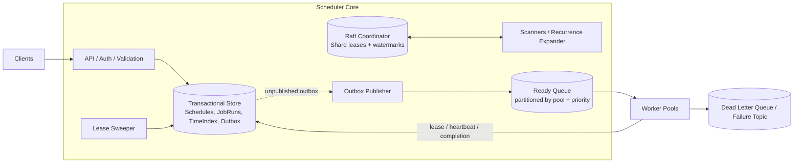
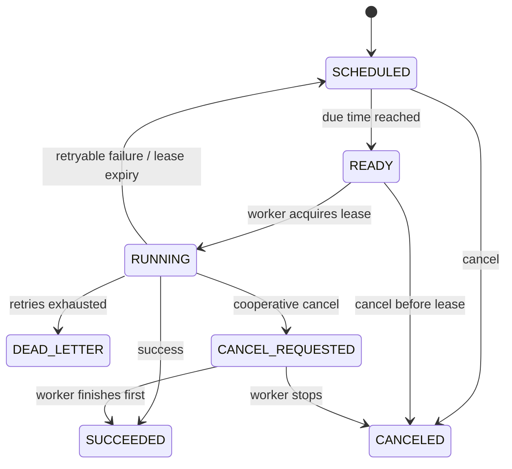

---

Design a distributed job scheduler.


---

I’ll assume **“distributed job scheduler”** means a **durable temporal scheduler** for background jobs:

- one-time jobs: “run this at 2026-05-05T10:00Z”
- recurring jobs: cron / interval
- retries, timeouts, cancellation
- dispatch to worker pools

Not a Kubernetes/Borg-style resource bin-packing scheduler. If you meant that, the placement half changes a lot.

---

# 1) Requirements

## Functional

1. Schedule **one-time** and **recurring** jobs.
2. Support:
   - priority
   - retries with backoff
   - timeouts
   - cancellation / pause / resume
   - per-tenant quotas
   - job status lookup
3. Dispatch jobs to the right **worker pool**.
4. Handle worker failure and reschedule.
5. Dead-letter jobs after retry exhaustion.

## Non-functional

1. **Durable**: once the create API returns success, a job is not lost.
2. **Highly available** across multiple AZs.
3. **Horizontally scalable**.
4. **At-least-once execution**.
5. Scheduling accuracy:
   - target: **P99 enqueue lag < 2s**
   - precision: **1 second**
6. Multi-tenant isolation and fairness.

## Explicit non-goals

- Exactly-once side effects across arbitrary user code.
- DAG orchestration / workflow engine.
- Sub-100ms timer precision.

---

# 2) Capacity assumptions

Let’s size for a realistic large deployment.

| Metric | Assumption |
|---|---:|
| Tenants | 100,000 |
| Active schedules | 20 million |
| Job executions/day | 1 billion/day |
| Average executions/sec | 1,000,000,000 / 86,400 ≈ **11,574/s** |
| Peak due rate | **120,000/s** |
| Avg job runtime | **5s** |
| Peak concurrent running jobs | 120,000 × 5 = **600,000** |
| Hot retention in primary DB | **7 days** |
| Archive retention | **30 days** |
| Queue envelope size | **250 B** |
| Job payload inline limit | **8 KB** |

Notes:

- The peak is much higher than the daily average because cron workloads bunch at `:00`, `:05`, etc.
- Large payloads should be stored in object storage and referenced by pointer.

---

# 3) High-level design

Core idea:

- **Transactional store** is the source of truth.
- A **bucketed time index** makes “what is due now?” cheap.
- **Scheduler scanners** own time shards and move due jobs to READY.
- An **outbox** bridges the DB to a **durable queue**.
- Workers acquire a **lease token** before running.
- A **lease sweeper** detects dead workers and retries jobs.

## Architecture



## Why this split?

- The **DB** gives durability, conditional updates, idempotency, and repairability.
- The **queue** gives high-throughput fan-out to workers.
- The **time index** avoids expensive range scans like `WHERE due_at <= now()` on a hot secondary index.

---

# 4) Data model

## 4.1 ScheduleDefinition

For recurring schedules.

```text
ScheduleDefinition(
  schedule_id        PK,
  tenant_id,
  cron_spec,
  timezone,
  worker_pool,
  payload_ref,
  priority,
  max_retries,
  retry_policy,
  timeout_sec,
  concurrency_key,
  spread_window_sec,
  misfire_policy,        -- catch_up / skip / fire_once_now
  next_fire_at_utc,
  status,                -- ACTIVE / PAUSED / CANCELED
  version,
  created_at,
  updated_at
)
```

## 4.2 JobRun

Represents one execution instance.

```text
JobRun(
  run_id              PK,
  schedule_id         nullable,
  tenant_id,
  scheduled_at_utc,
  state,              -- SCHEDULED / READY / RUNNING / SUCCEEDED / DEAD_LETTER / CANCELED
  attempt,
  max_retries,
  worker_pool,
  priority,
  payload_ref,
  timeout_sec,
  lease_owner,
  lease_until_utc,
  lease_token,        -- fencing token
  last_error,
  result_ref,
  created_at,
  updated_at
)
```

## 4.3 TimeIndex

Generic bucketed index for things driven by time.

```text
TimeIndex(
  kind,               -- JOB_DUE / SCHEDULE_TICK / LEASE_EXPIRY
  bucket_sec,         -- floor(timestamp)
  shard,              -- hash(ref_id) % N
  ref_id,             -- run_id or schedule_id
  created_at
)
PRIMARY KEY (kind, bucket_sec, shard, ref_id)
```

Important: **TimeIndex is not source of truth**.  
It is a durable accelerator. If corrupted, it can be rebuilt from primary tables.

## 4.4 Outbox

```text
Outbox(
  outbox_id           PK,
  topic,
  key,
  payload,
  published_at        nullable,
  created_at
)
```

## 4.5 Optional quota tables

```text
TenantQuota(tenant_id, max_running, max_dispatch_rate, ...)
ConcurrencyToken(tenant_id, key, current_running, limit, version)
```

---

# 5) APIs

## Client APIs

### Create one-time job

`POST /v1/jobs`

```json
{
  "tenant_id": "t1",
  "run_at": "2026-05-05T10:00:00Z",
  "worker_pool": "email",
  "payload_ref": "s3://jobs/abc",
  "priority": "high",
  "max_retries": 5,
  "retry_policy": {"type":"exponential","base_sec":10,"max_sec":3600},
  "timeout_sec": 300,
  "idempotency_key": "req-123"
}
```

### Create recurring schedule

`POST /v1/schedules`

```json
{
  "tenant_id": "t1",
  "cron": "0 * * * *",
  "timezone": "America/New_York",
  "worker_pool": "billing",
  "payload_ref": "s3://jobs/def",
  "spread_window_sec": 60,
  "misfire_policy": "catch_up"
}
```

### Cancel / pause / resume

- `DELETE /v1/jobs/{run_id}`
- `POST /v1/schedules/{schedule_id}:pause`
- `POST /v1/schedules/{schedule_id}:resume`

### Status

- `GET /v1/jobs/{run_id}`
- `GET /v1/schedules/{schedule_id}`

## Worker side

Workers consume from the broker, then call internal RPC/DB-backed endpoints to:

- acquire lease
- heartbeat / extend lease
- complete
- fail and request retry

---

# 6) Core flows

## 6.1 One-time job creation

1. Client calls create API with an idempotency key.
2. In one transaction:
   - insert `JobRun(state=SCHEDULED)`
   - insert `TimeIndex(kind=JOB_DUE, bucket_sec=floor(run_at), shard=hash(run_id)%N, ref_id=run_id)`
3. Return `run_id`.

Why transactional?  
So we never have a `JobRun` without an index entry or vice versa.

---

## 6.2 Recurring schedule creation

1. Parse cron and timezone.
2. Compute first `next_fire_at_utc`.
3. In one transaction:
   - insert `ScheduleDefinition`
   - insert `TimeIndex(kind=SCHEDULE_TICK, bucket=next_fire_at, shard=hash(schedule_id)%N, ref_id=schedule_id)`

We do **not** pre-materialize all future runs. Only the next tick.

This keeps storage bounded.

---

## 6.3 Recurrence expansion

A scanner owning a `SCHEDULE_TICK` shard processes due schedule buckets.

For each schedule:

1. Read schedule row.
2. Verify:
   - `status=ACTIVE`
   - `next_fire_at_utc == this bucket time`
3. Compute deterministic `run_id = hash(schedule_id, scheduled_at_utc)`.
4. In one transaction:
   - insert `JobRun(run_id, schedule_id, state=SCHEDULED, ...)`
   - insert `TimeIndex(kind=JOB_DUE, ...)`
   - compute next cron fire time
   - update `ScheduleDefinition.next_fire_at_utc`
   - insert next `SCHEDULE_TICK` index row

If the expander runs twice due to failover, the deterministic `run_id` / unique constraint prevents duplicate runs.

---

## 6.4 Due-job dispatch

A scanner owning `JOB_DUE` shards processes buckets in order.

For each batch of run IDs:

1. Read `JobRun` rows.
2. Filter to rows where:
   - `state=SCHEDULED`
   - `scheduled_at_utc <= now`
   - not canceled
3. In one transaction:
   - update `state: SCHEDULED -> READY`
   - insert one outbox row per job

Then the **Outbox Publisher** asynchronously publishes to the queue and marks the outbox rows as published.

Why not publish directly from the scanner?  
Because otherwise you can lose a job in the classic “DB write succeeded, publish failed” or vice versa problem.

---

## 6.5 Worker execution

1. Worker consumes a queue message.
2. Worker attempts to acquire a lease in the DB:

```sql
UPDATE JobRun
SET state='RUNNING',
    lease_owner=?,
    lease_until_utc=?,
    lease_token=lease_token+1,
    attempt=attempt+1
WHERE run_id=?
  AND state='READY';
```

3. If successful:
   - insert `TimeIndex(kind=LEASE_EXPIRY, bucket=floor(lease_until), ...)`
   - ack queue message
   - execute the job
4. For long-running jobs, heartbeat every `lease/3`:
   - extend `lease_until`
   - increment / preserve current token
   - move lease-expiry index entry
5. On success:
   - `RUNNING -> SUCCEEDED` **only if lease_token matches**
6. On retryable failure:
   - compute `next_attempt_at`
   - `RUNNING -> SCHEDULED`
   - insert `JOB_DUE` index for retry time
7. On final failure:
   - `RUNNING -> DEAD_LETTER`
   - emit failure event / DLQ message

### Why the lease token matters

If a worker loses connectivity, its lease may expire and another worker may retry the job.  
The old worker must not be allowed to later overwrite the result.

So completion uses a fenced update like:

```sql
UPDATE JobRun
SET state='SUCCEEDED', result_ref=?, ...
WHERE run_id=? AND state='RUNNING' AND lease_token=?;
```

If token mismatches, that worker is stale.

---

## 6.6 Lease expiry / worker death

Lease sweeper scans `LEASE_EXPIRY` buckets.

For each expired run:

- if still `RUNNING` and `lease_until <= now`
  - if `attempt < max_retries`: move back to `SCHEDULED`, insert retry
  - else: mark `DEAD_LETTER`

This makes worker crashes recoverable without relying on the queue for redelivery.

---

## 6.7 Cancellation

### Before run starts
Set job state to `CANCELED`.

We usually **do not remove** the TimeIndex entry immediately.  
That is a deliberate tradeoff: lazy invalidation is much simpler and safer than deleting from all bucket/index structures.

When scanners or workers see the canceled state, they drop it.

### While running
Set `cancel_requested=true` (or move to `CANCEL_REQUESTED`).

If the worker cooperates, it stops and marks `CANCELED`.  
If not, the job may complete anyway. This is normal for arbitrary user code.

---

# 7) State machine



---

# 8) Partitioning and scaling

## 8.1 Time shard partitioning

Use **512 logical shards** for `TimeIndex`.

Shard key:

```text
shard = hash(ref_id) % 512
```

Key:

```text
(kind, bucket_sec, shard, ref_id)
```

This prevents hot spots when many jobs are scheduled for the same second.

## 8.2 Shard ownership

Use a small Raft-based coordinator (etcd/ZooKeeper equivalent) for:

- shard lease ownership
- persistent scan watermarks

Each scheduler node renews its lease every 2s with a 6s TTL.

On failure:

- a new node takes the shard lease
- resumes from the last watermark
- duplicate processing is safe due to CAS updates and unique constraints

## 8.3 Queue partitioning

Partition ready jobs by:

- worker pool
- priority lane
- hash(run_id)

Example:

- topic `email.high`
- topic `email.normal`
- topic `email.low`

Workers consume with weighted polling, e.g. `8:2:1` high:normal:low.

This gives **approximate priority**, not strict global priority.

---

# 9) Capacity math

## 9.1 Time index scanning

Peak due rate = **120,000/s**  
Shards = **512**

Jobs per shard per second:

```text
120,000 / 512 ≈ 234 jobs/shard/s
```

If we run **32 scheduler nodes**, each owns:

```text
512 / 32 = 16 shards/node
```

Per node due load:

```text
16 × 234 ≈ 3,744 jobs/s/node
```

If scanner batches are **500 jobs**, each node does:

```text
3,744 / 500 ≈ 7.5 batches/s
```

That is very manageable.

---

## 9.2 Database write load

Approximate writes per execution:

1. create run
2. mark READY + outbox
3. acquire lease
4. complete / retry / DLQ

So roughly **4 writes per execution**.

Average:

```text
1B/day × 4 = 4B writes/day
4,000,000,000 / 86,400 ≈ 46,296 writes/s average
```

Assume peak is 8× average due to bursts and retries:

```text
≈ 370,000 writes/s peak
```

A distributed SQL/KV cluster with **24 nodes**, each safely handling ~20k writes/s, gives:

```text
24 × 20,000 = 480,000 writes/s
```

That leaves headroom.

---

## 9.3 Queue throughput

Peak queue publish rate:

```text
120,000 msg/s
```

At **250 B** per envelope:

```text
120,000 × 250 B = 30,000,000 B/s ≈ 30 MB/s logical
```

With replication factor 3:

```text
≈ 90 MB/s physical
```

On **12 broker nodes**:

```text
90 / 12 ≈ 7.5 MB/s/node
```

Very comfortable.

---

## 9.4 Storage

## Hot JobRun storage

Assume average hot row footprint after indexes/overhead is **500 B**.

7 days hot:

```text
1B/day × 7 × 500 B = 3.5 TB raw
```

With replication factor 3:

```text
≈ 10.5 TB physical
```

Archive older history to object storage.

## Active schedules

```text
20M × 1 KB ≈ 20 GB raw
```

Even with indexes and replication, this is small.

## Pending time index

Suppose at most **20M pending entries**.

```text
20M × 150 B ≈ 3 GB raw
```

Also small.

## Queue backlog during outage

If publishers or workers are down for 10 minutes at peak:

```text
120,000/s × 600s = 72M messages
72M × 250 B = 18 GB raw
```

With replication factor 3:

```text
≈ 54 GB physical
```

So queue disks should have plenty of headroom.

---

# 10) Failure modes and mitigations

| Failure | What happens | Mitigation |
|---|---|---|
| Client retries create after timeout | Duplicate jobs | `idempotency_key` unique per tenant |
| Scanner crashes after DB update but before queue publish | READY jobs not yet delivered | transactional **Outbox** |
| Outbox publisher publishes twice | Duplicate queue messages | worker lease CAS on `READY -> RUNNING` |
| Worker crashes after queue ack | job would be lost if queue were source of truth | DB lease + `LEASE_EXPIRY` sweeper reschedules |
| Worker finishes side effect but crashes before marking success | duplicate external effect on retry | only **at-least-once** is guaranteed; require idempotent handlers / dedupe keys |
| Old worker reports success after lease expiry | stale result overwrites newer attempt | **lease_token fencing** |
| Broker outage | no new dispatch | outbox accumulates; replay when broker recovers |
| DB quorum loss | new scheduling and status writes stall | multi-AZ quorum DB; running workers may continue briefly, but retries/cancellations stall |
| Coordinator split brain | two scanners may process same shard | Raft leases + idempotent transitions |
| Clock skew | early/late firing | NTP, monotonic timers, do not fire before due time, 1s precision budget |
| Top-of-hour surge | hot partitions, worker overload | hash-sharded buckets, optional `spread_window`, quotas, backpressure |
| Large backlog after outage | flood of old jobs | process by watermark, per-pool rate limits, misfire policy for recurring jobs |

---

# 11) Key design tradeoffs

| Decision | Chosen design | Why | Cost |
|---|---|---|---|
| Delivery guarantee | At-least-once | realistic with arbitrary worker side effects | duplicates possible |
| Time tracking | Durable bucketed `TimeIndex` | cheap due scans, easy sharding | ~1s precision, extra rows |
| Recurring schedules | materialize only next occurrence | bounded storage | expander work every tick |
| Queue handoff | DB outbox + broker | no dual-write loss | extra component and lag metric |
| Cancel | lazy invalidation | simpler, safer | some wasted scans/messages |
| Priority | separate lanes + weighted pull | scalable | approximate priority only |
| Fairness | quotas + optional concurrency keys | simple and effective | not perfect weighted-fair queuing |

### Why not a global min-heap?
A single global heap is great in one process, terrible as a durable distributed primitive.

### Why not rely only on the queue?
Queues are good for “run now”, not for billions of durable future timers plus cron semantics plus status queries.

### Why not exactly once?
Because user code may call email APIs, payment gateways, webhooks, etc. You cannot atomically commit both “job success” and “external side effect” without expensive or impossible coordination.

---

# 12) Fairness, quotas, and overload control

At scale, the hard problem is often not “can I schedule it?” but “can I prevent one tenant from crushing everyone else?”

## Recommended controls

1. **Create-time quotas**
   - max active schedules per tenant
   - max future one-time jobs
   - max jobs/day

2. **Dispatch-time quotas**
   - max concurrent running per tenant
   - max rate per worker pool

3. **Concurrency keys**
   - example: `concurrency_key=customer_123` with limit 1
   - prevents parallel duplicate processing

4. **Spread window**
   - optional for cron jobs
   - example: 6M hourly jobs at `:00` is impossible for most systems
   - with `spread_window=60s`, expected load drops from ~6M in one second to ~100k/s on average

If strict per-tenant weighted fair queuing is required, add a dedicated **dispatcher** layer between queue and workers. I would not start there unless fairness is a hard requirement.

---

# 13) Observability

## Must-have metrics

### Scheduling path
- due bucket lag: `now - oldest_unprocessed_bucket`
- jobs enqueued/sec
- outbox backlog
- publish latency

### Execution path
- queue lag by pool/priority
- lease acquisition failures
- running jobs
- lease expiries/sec
- retry rate
- DLQ rate
- duplicate-start attempt rate

### Multi-tenant
- per-tenant scheduled/sec
- per-tenant running count
- quota rejections

## Logs and tracing

- trace id from create API through worker completion
- audit log for create/cancel/pause/resume
- structured logs with `run_id`, `schedule_id`, `tenant_id`, `lease_token`

## Alerts

- due lag > SLO
- outbox backlog growing
- broker publish failures
- expired leases spike
- DLQ spike
- coordinator lease churn spike

---

# 14) Security

1. **AuthN/AuthZ**
   - tenant-scoped API tokens
   - RBAC for schedule management
2. **Data isolation**
   - tenant_id in every primary key / secondary index path
3. **Encryption**
   - TLS in transit
   - encrypted payload blobs at rest
4. **Secrets**
   - payload should reference secrets by ID, not inline credentials
5. **Audit**
   - immutable audit trail for schedule changes

---

# 15) Multi-region strategy

Base design: **single region, multi-AZ**.  
That is the right first version.

If you need DR:

- replicate DB and queue metadata asynchronously to a secondary region
- assign each tenant or schedule a **home region**
- only the home region may emit or lease jobs
- on failover, flip ownership with fencing

Tradeoff:

- **active-active** temporal scheduling is hard because double-firing is worse than brief failover
- prefer **active-passive** or home-region ownership unless latency or residency requires more

---

# 16) Final design summary

I would build the scheduler around these principles:

1. **Transactional DB is the source of truth**
2. **Bucketed time index** for efficient due-time scans
3. **Shard ownership via Raft leases**
4. **Outbox** to safely hand off to a broker
5. **Workers acquire leases with fencing tokens**
6. **Lease sweeper** reschedules dead workers
7. **At-least-once semantics**, with idempotent jobs as the contract
8. **Optional quotas and spread windows** to survive cron spikes

That gives a scheduler that is:

- durable
- horizontally scalable
- operationally understandable
- resilient to scanner, broker, and worker failures

If you want, I can next turn this into:
1. an **interview-style whiteboard answer**,  
2. a **deep dive on only the scheduling algorithm**, or  
3. a **Kubernetes/Borg-style cluster job scheduler** instead.