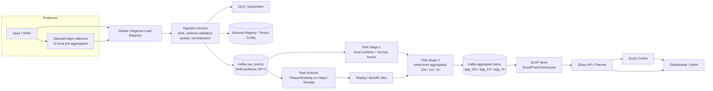

---

Design a real-time metrics aggregation pipeline that handles 100 billion events/day.


---

Below is a concrete design for a **real-time metrics aggregation pipeline** that handles **100 billion events/day**.

## 1) Requirements and assumptions

### Functional
- Ingest metric events from many producers.
- Aggregate by:
  - time bucket: 10s, 1m, 1h
  - metric name / metric id
  - dimensions (service, region, status, etc.)
- Support common metric types:
  - counters: count, sum, rate
  - gauges: min/max/last/avg
  - distributions: percentiles via mergeable sketches
  - distinct counts via HLL
- Query recent and historical aggregates for dashboards and alerts.
- Allow replay/backfill if aggregation logic changes.

### Non-functional
- **Scale:** 100B events/day
- **Freshness:** live dashboards should see data within ~10–15s
- **Finalization:** minute rollups should be “final” within ~2 minutes
- **Availability:** no data loss after ack
- **Retention:** example:
  - raw events in Kafka: 3 days
  - raw events in object storage: 30–90 days
  - 10s rollups: 6 hours
  - 1m rollups: 30 days
  - 1h rollups: 1 year

### Critical assumption
At this scale, the hard problem is **not only throughput**. It is:
1. **high cardinality**
2. **hot keys / skew**
3. **late / duplicate events**
4. **query cost**

So the design must control cardinality, not just scale hardware.

---

## 2) Back-of-the-envelope sizing

### Event rate
\[
100\text{B} / 86400 \approx 1.157\text{M events/sec average}
\]

Design for **5x peak**:
\[
1.157\text{M} \times 5 \approx 5.8\text{M events/sec peak}
\]

Round to **6M events/sec peak**.

### Event size
At this scale, do **not** accept arbitrary JSON as the canonical wire format. Use Protobuf/Avro.

Assume:
- average serialized event = **180 bytes**
- Kafka compression ~2:1 => **90 bytes stored**

Then:
- raw ingress/day:
\[
100\text{B} \times 180B = 18\text{TB/day}
\]
- average ingress bandwidth:
\[
18\text{TB}/86400 \approx 208\text{MB/s}
\]
- peak ingress bandwidth:
\[
208 \times 5 \approx 1.04\text{GB/s}
\]
That is roughly **8.3 Gbps**, before protocol/TLS overhead. Plan for **12–15 Gbps** inbound headroom.

### Request rate with batching
If clients batch **500 events/request**:
- avg requests/sec:
\[
1.157\text{M}/500 \approx 2314\text{ RPS}
\]
- peak requests/sec:
\[
5.8\text{M}/500 \approx 11600\text{ RPS}
\]

That is manageable. Without batching, this design falls apart.

---

## 3) High-level architecture



---

## 4) Core design choices

### Chosen stack
For concreteness:

- **Ingestion:** stateless gRPC/HTTP2 services
- **Durable log:** Kafka
- **Stateful stream processing:** Flink
- **Query store:** OLAP DB like **Druid**  
  (Pinot or ClickHouse also work; tradeoffs later)
- **Cold/raw archive:** S3/GCS + Parquet/Iceberg

### Why this shape?
Because we need all of these:
- **durability + burst absorption** → Kafka
- **event-time windowing + large state + replay** → Flink
- **fast slice/group-by over time ranges** → OLAP store
- **cheap long-term replay** → object storage

---

## 5) Data model

Each metric event should look roughly like:

```text
tenant_id
metric_id
event_time
metric_type         // counter, gauge, histogram, distinct
value               // numeric or distribution bucket/sample
dimensions          // bounded set; e.g. service, region, status
producer_id
sequence_number     // optional for idempotency
```

### Aggregation key
For partitioning and state:
```text
(tenant_id, metric_id, canonical_dimensions, bucket_start, rollup_granularity)
```

Internally compute:
```text
series_id = hash128(tenant_id, metric_id, canonical_dimensions)
```

But keep actual dimension columns in OLAP so users can filter and group.

### Mergeable aggregates
For scalability, aggregation state must be mergeable:
- `count`, `sum`, `min`, `max`, `last`
- `DDSketch` / `t-digest` for percentiles
- `HyperLogLog` for cardinality

This enables:
- local combine
- tree aggregation
- regional aggregation + global merge
- backfill/replay

---

## 6) Write path in detail

## 6.1 Ingestion service
Responsibilities:
- authenticate tenant
- validate schema
- enforce dimension whitelist
- normalize dimension ordering
- apply quotas/rate limits
- reject absurd timestamps
- write to Kafka with `acks=all`
- only ack client after Kafka commit

### Important operational rule
Ingestion nodes must not do synchronous metadata lookups per event.  
Schema and tenant config must be **cached in memory** and refreshed asynchronously.

### Example size
Peak ~11.6k RPS if 500 events/request.

A practical deployment:
- **32–48 ingestion nodes**
- each handles roughly:
  - 250–350 RPS
  - 15–30 MB/s payload
This is fine.

---

## 6.2 Kafka raw topic
Use Kafka as the write-ahead log and replay buffer.

### Example config
- topic: `raw_events`
- partitions: **2048**
- replication factor: **3**
- retention: **72 hours**
- producer: idempotent, batched, compressed
- consumer lag alarms

### Why 2048 partitions?
Peak ingress:
\[
6\text{M eps} / 2048 \approx 2930\text{ eps per partition}
\]

At 180 B/event:
\[
2930 \times 180B \approx 527KB/s
\]
per partition at peak. Very safe.

### Kafka storage math
Stored size/day:
\[
100\text{B} \times 90B = 9\text{TB/day}
\]

With 3-day retention and RF=3:
\[
9 \times 3 \times 3 = 81\text{TB}
\]

Add 30% headroom:
\[
81 \times 1.3 \approx 105\text{TB}
\]

### Example Kafka cluster
- **16 brokers**
- each with:
  - 16–32 vCPU
  - 128 GB RAM
  - 8 TB NVMe
  - 25 Gbps NIC

Per broker, rough peak leader ingress:
\[
1.04\text{GB/s} / 16 \approx 65\text{MB/s}
\]

Cluster-internal replication and consumer reads make actual network higher, but still comfortably within that hardware.

---

## 6.3 Raw archive
A separate consumer writes raw Kafka events to object storage:
- Parquet
- hourly partitions
- optional Iceberg table for replay and schema evolution

### Why archive raw events?
Without this, any aggregation bug requires data loss or partial recovery.

### Size
At ~9 TB/day compressed:
- 30 days = **270 TB**
- 90 days = **810 TB**

That is large but cheap in object storage compared to keeping it in Kafka or OLAP.

---

## 6.4 Flink aggregation pipeline

### Stage 1: local combine
Read raw events, then do very short-lived in-task aggregation (e.g. 1s mini-batches) before shuffling.

Why:
- reduce network shuffle
- reduce downstream state updates
- smooth hot bursts

If local combine gives only **5x reduction**:
- peak shuffle drops from **6M eps** to **1.2M partials/sec**

If it gives **10x**, even better.

### Stage 2: keyed event-time aggregation
Repartition by aggregation key and compute:
- 10s live rollups
- 1m canonical rollups
- 1h long-term rollups

Use:
- event-time windows
- watermarks
- allowed lateness (e.g. 2 minutes)

### Hot key handling
A single metric+dimset can be extremely hot.

If one key reaches, say, 200k eps, naive keying sends all traffic to one task.  
Mitigation:
- detect heavy hitters
- fan out hot keys using a salt:
  ```text
  key = (agg_key, salt)
  ```
- combine salted partials in a second merge step

This is a standard fix for skew.

### State sizing
Assume:
- peak = 6M eps
- allowed lateness = 2 min
- peak raw events potentially “in flight” across open windows:
\[
6\text{M} \times 120 = 720\text{M events}
\]

If average collapse factor into a 10s aggregate is **20:1**:
\[
720\text{M} / 20 = 36\text{M active aggregate states}
\]

If average state is **220 B**:
\[
36\text{M} \times 220B \approx 7.9\text{GB logical state}
\]

With RocksDB and checkpoint overhead, call it **~25 GB cluster-wide**.

Even if collapse factor degrades to **5:1**, state is still manageable with SSD-backed RocksDB.

### Example Flink cluster
Assume a task slot handles **75k input eps** with sketches and state.

Needed for 6M eps:
\[
6\text{M}/75k \approx 80\text{ slots}
\]

With 2x headroom:
- **160 slots**

Example deployment:
- **24 Flink workers**
- 8 slots each
- total **192 slots**
- local SSD for RocksDB state

---

## 6.5 Aggregate topics
Flink emits to Kafka aggregate topics:
- `agg_10s`
- `agg_1m`
- `agg_1h`

These topics decouple stream processing from the query store and provide replay if OLAP ingestion fails.

Retention can be longer than raw, e.g. **7 days**.

---

## 6.6 OLAP store
Store pre-aggregated rollups, not raw events.

For concreteness, use **Druid** because it is good at:
- time-partitioned analytics
- real-time ingestion
- sketches
- immutable segments + deep storage

Pinot or ClickHouse are also valid.

### Retention policy
- **10s rollups:** 6 hours
- **1m rollups:** 30 days
- **1h rollups:** 1 year

### Storage math
Assume:
- 10s rollup reduction = **20:1**
- 1m rollup reduction = **100:1**
- compressed aggregate row size = **80 B**

#### 10s
Rows/day:
\[
100\text{B}/20 = 5\text{B rows/day}
\]

But only 6 hours retained hot:
\[
5\text{B} \times 6/24 = 1.25\text{B rows resident}
\]

Storage:
\[
1.25\text{B} \times 80B \approx 100\text{GB}
\]

#### 1m
Rows/day:
\[
100\text{B}/100 = 1\text{B rows/day}
\]

30 days:
\[
30\text{B rows}
\]

Storage:
\[
30\text{B} \times 80B = 2.4\text{TB}
\]

With RF=2:
\[
4.8\text{TB}
\]

Add indexes/overhead: roughly **8–12 TB total cluster footprint** is realistic.

That is very manageable for an OLAP cluster.

### Key insight
If the effective rollup reduction collapses from 100:1 to 10:1 because tenants send near-unique dimension sets, storage cost increases by **10x**.  
So **cardinality governance is mandatory**.

---

## 7) Query path

A query planner chooses the right rollup level:

- range <= 6h and fine granularity requested → use **10s**
- 6h to 30d → use **1m**
- >30d → use **1h**

If a range crosses boundaries, union results.

### Freshness semantics
- **Last 2 minutes:** treat as **provisional**
- **Older than 2 minutes:** use finalized 1m data

This is much cleaner than pretending all data is instantly final.

### Caching
Dashboards cause repeated identical queries. Add:
- 1–10s query result cache
- per-widget cache key
- admission control for expensive group-bys

---

## 8) Correctness model

## 8.1 What can be exactly once?
After Kafka ingestion, yes:
- Kafka idempotent producers
- Flink checkpoints + transactional sinks
- OLAP ingestion from Kafka offsets

So from **Kafka onward**, we can get effectively exactly-once behavior.

## 8.2 What cannot be magically solved?
Client retries before Kafka can duplicate events unless the producer provides identity.

If strict dedupe is needed:
- require `(producer_id, sequence_number)`
- keep per-producer sequencing state at ingestion

For most metrics systems, slight client-side duplication is acceptable. For billing, it is not.

## 8.3 Late events
Use event time + watermark.

Policy example:
- allow lateness: **2 minutes**
- events later than that:
  - either drop to DLQ
  - or send to backfill/recompute path

---

## 9) Cardinality control: the real safety valve

This is the most important operational control.

A tenant sending:
```text
metric=request_latency
dimensions={user_id, request_id}
```
can destroy the system.

### Controls
1. **Dimension whitelist per metric**
2. **Max unique series per tenant / metric / minute**
3. **Reject or hash disallowed dimensions**
4. **Per-tenant quotas**
5. **Alert on cardinality slope, not only absolute value**
6. **Approximate structures for distinct/percentiles**
7. **Optional downsampling / coarser rollup for low-priority tenants**

If you skip this, the system will ingest fine and then fail in aggregation/state/query layers.

---

## 10) Failure modes and mitigations

| Failure | What happens | Mitigation |
|---|---|---|
| Ingestion node dies | clients retry | stateless nodes behind LB |
| Kafka broker dies | partition unavailable if under-replicated | RF=3, rack-aware placement, min ISR=2 |
| Flink job restarts | temporary lag | checkpoints, savepoints, replay from Kafka |
| Hot key overload | one task backpressures | key salting + multi-stage aggregation |
| Cardinality explosion | state/store blow up | strict quotas and dimension governance |
| OLAP cluster down | query outage, ingest lag | aggregate topics retained for replay |
| Schema registry down | new schemas fail | cached configs on ingestion nodes |
| Object store outage | backfill/checkpoint issues | keep Kafka buffer; degrade safely |
| Bad aggregation code deploy | wrong numbers published | raw archive + versioned backfill/replacement |
| Regional outage | total unavailability in single region | multi-region ingest and regional pre-aggregation |

---

## 11) Example deployment summary

A realistic starting point for this load:

### Ingestion
- **32–48 stateless ingest nodes**
- gRPC/HTTP2, 500–1000 events/batch

### Kafka
- **16 brokers**
- 2048 raw partitions
- RF=3
- ~105 TB usable for 3-day raw retention incl. headroom

### Flink
- **24 workers**
- ~192 task slots
- RocksDB state on local SSD
- checkpoint to object storage

### OLAP
- **8–12 data nodes** for hot aggregated storage
- separate query routers/brokers
- deep storage on object storage

### Object storage
- raw archive: 30–90 days
- segment storage/checkpoints

---

## 12) Tradeoffs

## Why not write directly into OLAP?
Because you lose:
- durable buffering
- replay
- decoupling
- controlled backpressure

At 100B/day, you want a log in the middle.

## Why not aggregate only in the database?
Because stream processors are much better for:
- event time
- lateness
- large keyed state
- checkpointed recovery
- hot-key handling

## Why multiple rollup resolutions?
Because querying 30 days of 10-second buckets is wasteful.  
10s / 1m / 1h is a good cost/latency tradeoff.

## Why Druid / Pinot / ClickHouse?
All can work.

- **Druid**
  - good for real-time time-series analytics and sketches
  - operationally more specialized
- **Pinot**
  - excellent low-latency serving
  - very good for dashboard-style queries
- **ClickHouse**
  - superb performance and SQL
  - mutable real-time upsert/merge semantics can require more care

For this use case, I’d lean **Kafka + Flink + Druid** or **Kafka + Flink + Pinot**.

---

## 13) If traffic is global: better architecture

If producers are in many regions, do **regional raw ingestion + regional pre-aggregation**, then send only **regional rollups** to a global merge layer.

Why this is powerful:
- aggregation is associative/commutative
- WAN traffic drops massively
- regional outages are isolated

So instead of shipping 18 TB/day of raw globally, you might ship only a few hundred GB/day of rollups.

---

## 14) Final recommendation

The design I would actually build is:

1. **Binary batched ingestion** into stateless frontends
2. **Kafka raw log** as the durability boundary
3. **Flink two-stage aggregation** with:
   - local combine
   - keyed event-time windows
   - hot-key fanout
4. **Multiple rollups**: 10s, 1m, 1h
5. **OLAP store** for query serving
6. **Raw archive** in object storage for replay/backfill
7. **Strict cardinality governance** per tenant/metric

The headline number—100B events/day—is very feasible with this design.  
The make-or-break issue is whether you control **cardinality and skew**.

If you want, I can also provide:
- an **API/schema design**
- a **multi-region version**
- or a **detailed capacity plan per node type**.