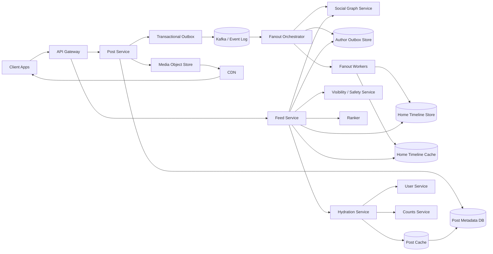

---

Design a news feed system like Twitter or Facebook.

---

Below is a practical design for a large-scale **news feed / home timeline** system that can behave like:

- **Twitter/X**: mostly follow-based, fresh, near-reverse-chronological
- **Facebook**: heavily ranked, mixed candidate sources, more ML

The core design is the same: **hybrid fanout**.

---

## 1) What we’re designing

A system where users can:

- create posts
- follow/unfollow other users
- open a personalized home feed
- scroll/paginate
- see new content within seconds
- avoid seeing deleted/blocked/private content

### Key product behaviors

- **Freshness**: newly published posts should appear quickly
- **Low read latency**: feed opens should be fast
- **Scale with celebrity users**: users with millions of followers must not melt the system
- **Ranking support**: can support chronological or ML-ranked feeds

---

## 2) Requirements

## Functional

1. User creates a post
2. User follows/unfollows other users
3. User requests home feed
4. Feed supports pagination/infinite scroll
5. Feed respects:
   - blocks/mutes
   - privacy settings
   - deletes
   - moderation decisions
6. Optional:
   - ads/recommendations
   - ranking instead of strict chronological order

## Non-functional

- Feed read p95: **< 200 ms**
- New post visible to followers: **seconds**
- High availability: **99.95%+**
- Eventual consistency is acceptable
- No hard dependency on globally consistent ordering

---

## 3) Scale assumptions and capacity math

I’ll assume roughly **Twitter-like scale**.

| Metric | Assumption |
|---|---:|
| Registered users | 500M |
| DAU | 250M |
| Avg followees per user | 300 |
| Posts/day | 400M/day |
| Feed sessions per DAU/day | 8 |
| Page fetches per session | 3 |
| Posts per page | 50 |
| Peak / average factor | 5x |

### Traffic

### Post writes
- 400M posts/day
- `400M / 86400 ≈ 4.6k posts/sec average`
- Peak ~ **25k posts/sec**

### Feed reads
- `250M * 8 * 3 = 6B page fetches/day`
- `6B / 86400 ≈ 69k req/sec average`
- Peak ~ **350k req/sec**

### Items returned
- `350k req/sec * 50 posts/page = 17.5M post cards/sec` at peak

That’s why the system must avoid expensive on-demand merging of hundreds of followees for every request.

---

## 4) High-level idea: hybrid fanout

There are two classic approaches:

### A. Fanout-on-write (push)
When Alice posts, push that post into every follower’s home timeline.

**Pros**
- Very fast feed reads
- Good for ordinary users

**Cons**
- Massive write amplification
- Terrible for celebrities with millions of followers

### B. Fanout-on-read (pull)
When Bob opens feed, fetch recent posts from all people Bob follows and merge them.

**Pros**
- Cheap writes
- Handles celebrities well

**Cons**
- Expensive reads
- Slow if a user follows hundreds/thousands

## Chosen design: **hybrid**
- **Normal users**: push to followers
- **Celebrities / high-fanout authors**: don’t push; pull from their author outbox at read time

This is the standard real-world answer because it balances write and read cost.

---

## 5) Architecture

---

## 6) Core data model

We only store **post IDs / candidate references** in feeds, not full post blobs.

That is important:
- deletes become easier
- edits/counters don’t require rewriting millions of feed copies
- storage stays smaller

## Tables / stores

### 1. Posts
**PostMetadata**
- `post_id`
- `author_id`
- `created_at`
- `text_ptr / body`
- `media_ptrs`
- `visibility_state`
- `deleted_flag`
- small denormalized metadata

Store in a distributed KV / wide-column store.

---

### 2. Social graph
**FollowingByUser**
- key: `user_id`
- values: followee IDs

**FollowersByAuthor**
- key: `(author_id, bucket_id)`
- values: follower IDs

We store both directions because:
- read path needs followees
- fanout path needs followers

For very large follower lists, bucket them:
- e.g. `10k followers per bucket`

---

### 3. Author outbox
For every author, keep recent post IDs:

**AuthorOutbox**
- key: `author_id`
- clustered by `created_at desc`
- values: `post_id`

This is used:
- always on write
- by read path for celebrity accounts
- for backfill after follow

---

### 4. Home timeline
**HomeTimeline**
- key: `viewer_id`
- clustered by `insertion_time desc` or `candidate_time desc`
- values:
  - `post_id`
  - `author_id`
  - lightweight metadata

Only keep latest **N** entries, like 500–1000.

---

## 7) Capacity math for storage

## Social graph

- 500M users
- avg 300 follows
- total directed edges = `500M * 300 = 150B edges`

If each edge record is ~32 bytes logical including metadata:
- one direction: `150B * 32B = 4.8TB`
- both directions: `9.6TB`
- with 3x replication: about **29TB**, plus storage-engine overhead

This is large but absolutely manageable in a distributed KV system.

---

## Posts

Assume metadata/text average ~1 KB per post:
- `400M/day * 1KB = 400GB/day raw`
- with replication x3: **1.2TB/day**
- 1 year: **~438TB replicated**

Media is much bigger, so store media in object storage + CDN.

---

## Home timeline storage

If we keep 1000 candidate references per active user:
- 250M users * 1000 entries = **250B entries**
- if each entry is ~32 bytes logical:
  - `250B * 32B = 8TB raw`
- replicated x3 = **24TB**

In practice:
- only active users need fully materialized home timelines
- entries are compact
- older entries are trimmed aggressively

So timeline storage is large but still very feasible.

---

## 8) Fanout throughput math

Assume:
- 90% of posts come from ordinary users
- these ordinary users have ~200 active followers on average

Then push writes/day:
- `400M * 0.9 * 200 = 72B timeline insertions/day`
- `72B / 86400 ≈ 833k inserts/sec average`
- Peak ~ **4.2M inserts/sec**

This is why:
- batching is mandatory
- push cannot be used for celebrities
- active-user filtering matters

---

## 9) Important optimization: only push to active users

Do not fan out aggressively to users who haven’t opened the app in weeks.

Maintain an **active-user bitmap**:
- 500M users => 500M bits
- `500M / 8 = 62.5 MB`

That means fanout workers can keep a region-local active bitset in memory and skip inactive followers cheaply.

This dramatically cuts wasted writes.

---

## 10) Write path

## Posting flow

1. Client calls `POST /posts`
2. Post service:
   - allocates `post_id` (e.g. Snowflake-like ID)
   - stores post metadata
   - stores media to object store if needed
3. Post service writes an event to a **transactional outbox**
4. Outbox relays to Kafka
5. Fanout orchestrator consumes event
6. It always writes post to **AuthorOutbox(author_id)**
7. It decides:
   - **push** for normal users
   - **pull-only** for celebrities/high-fanout users
8. For push:
   - fetch follower buckets from social graph
   - emit fanout tasks
   - workers batch insert into follower home timelines
9. Update poster’s own feed synchronously so they get read-after-write on self-view

## Why transactional outbox?
Without it, you can get the classic dual-write bug:
- post stored in DB
- Kafka publish fails
- followers never see it

The outbox pattern avoids that.

---

## 11) Read path

When user opens home feed:

1. Fetch top candidate IDs from **HomeTimeline cache/store**
2. Fetch recent posts from celebrity/high-fanout followees’ **AuthorOutboxes**
3. Merge + dedupe candidates
4. Filter through visibility service:
   - deleted?
   - blocked?
   - muted?
   - private account access valid?
   - moderation hold?
5. Rank:
   - reverse chronological for Twitter-like behavior
   - ML score for Facebook-like behavior
6. Hydrate top 50:
   - post text/media URLs
   - author info
   - counts
7. Return results + cursor

---

## 12) Ranking strategy

A full Facebook-style feed is rarely precomputed as final ranked output because ranking changes constantly:
- new likes/comments
- user activity
- freshness decay
- negative feedback
- ads/recommendations

## Better design: precompute **candidates**, rank on read

### Candidate generation sources
- home timeline push candidates
- outbox pull candidates from celebrities
- recommendations
- ads

### Online ranking features
- recency
- affinity between viewer and author
- predicted click / comment / dwell
- whether viewer usually engages with this author/topic
- content quality / spam score
- social proof

### Fallback
If ranker times out:
- return reverse chronological feed

This is a very important resilience pattern.

---

## 13) Sharding strategy

## Posts
Shard by `post_id` hash.

## Social graph
Shard by `user_id` hash.

For `FollowersByAuthor`, use bucketed keys:
- `(author_id, bucket_id)`

This lets fanout process buckets in parallel.

## Home timelines
Shard by `viewer_id` hash.

Each timeline is a private, mostly independent partition:
- easy horizontal scaling
- low cross-partition coordination

## Kafka partitioning
Partition post events by `author_id` so all posts from one author stay ordered.

---

## 14) Celebrity handling

This is the hardest part.

If a user with 50M followers posts, push fanout is not realistic.

## Strategy
Define “celebrity” dynamically, not with a hard-coded follower count only.

Example:
- if `active_followers * recent_post_rate` exceeds threshold, switch to pull-only

### For celebrity authors
- write post to `AuthorOutbox`
- do **not** insert into millions of home timelines
- on feed read, merge from their outbox

### Why this works
Most users follow only a small number of very large accounts, so pulling from those few author outboxes is much cheaper than globally pushing their posts.

---

## 15) Caching

## A. Home timeline cache
Store top portion of home timeline in Redis / memory store.

Useful for:
- repeated refreshes
- first page latency

## B. Post card cache
Cache hydrated post cards:
- text
- author snippet
- media thumbnail URLs
- counters snapshot

Avoid N+1 DB lookups on every feed request.

## C. User/profile cache
Cache user metadata.

## D. First-page response cache
Optional, short TTL (e.g. 15–30 sec) for high-refresh users.

Tradeoff:
- better latency and lower cost
- slightly worse freshness

---

## 16) Pagination

Do **not** paginate by page number.

Use an opaque cursor containing:
- last score / timestamp
- last post_id
- merge offsets for pulled celebrity streams
- maybe a ranked-session token

### If feed is ranked
Pagination is trickier because scores can change between page fetches.

Practical solution:
- on first request, materialize top ~200–500 ranked candidates
- store a short-lived session snapshot (2–5 min)
- cursor references that snapshot

Otherwise users will see duplicates/reordering while scrolling.

---

## 17) Consistency model

This system is mostly **eventually consistent**.

## Acceptable guarantees
- user sees own new post immediately
- followers see new post within seconds
- counts may lag
- some feed ordering may shift slightly

## Important policy decisions

### Follow
When Bob follows Alice:
- future posts should appear immediately
- optionally backfill Alice’s last 20–50 posts into Bob’s feed

### Unfollow / block / mute
Do **not** synchronously purge every stored copy from all caches/stores.
Instead:
- mark relationship change in graph immediately
- enforce at read time via visibility filter
- purge stale entries asynchronously in background

### Delete
Same rule:
- mark post tombstoned
- filter on read immediately
- background purge from caches/timelines later

This is critical for correctness at scale.

---

## 18) Failure modes and what can go wrong

## 1. Dual-write inconsistency
**Failure**: post saved, Kafka event lost  
**Fix**: transactional outbox

---

## 2. Fanout backlog
**Failure**: consumer lag grows; feed freshness degrades  
**Fixes**:
- monitor lag
- prioritize active users
- celebrity fallback to pull
- backpressure lower-priority fanout
- read path can supplement from author outboxes

---

## 3. Duplicate fanout due to retries
**Failure**: same post appears twice  
**Fix**:
- at-least-once delivery + idempotent timeline writes
- dedupe by `(viewer_id, post_id)`

---

## 4. Cache outage
**Failure**: Redis cluster fails  
**Fix**:
- read from persistent timeline store
- degrade ranking if needed
- rebuild cache lazily

---

## 5. Ranker timeout
**Failure**: feed request becomes slow or fails  
**Fix**:
- strict timeout
- fallback to reverse chrono

---

## 6. Delete/privacy leak
**Failure**: deleted/private post still exists in timeline store  
**Fix**:
- visibility filtering on read is mandatory
- never trust materialized timelines alone

---

## 7. Hot partitions
**Failure**: one author or one graph shard overloaded  
**Fixes**:
- follower bucketization
- celebrity pull mode
- hash-based sharding
- write batching

---

## 8. Regional outage
**Failure**: one datacenter/region down  
**Fixes**:
- multi-AZ within region
- async cross-region replication
- serve from secondary region with slightly stale data if needed

---

## 19) Latency budget example

For a p95 target under 200 ms:

| Stage | Budget |
|---|---:|
| Timeline candidate fetch | 15 ms |
| Celebrity outbox merge | 20 ms |
| Visibility checks | 15 ms |
| Ranking | 25 ms |
| Hydration | 50 ms |
| Network + serialization | 40 ms |
| Buffer | 35 ms |

Total: **~200 ms**

This only works if:
- most post/user lookups hit cache
- candidate generation is cheap
- ranker is bounded tightly

---

## 20) Why not use only SQL joins?

A naive relational approach would do something like:
- fetch all followees
- fetch their recent posts
- join, sort, paginate

This works at small scale, but breaks at large scale because:
- reads become too expensive
- celebrity fanout causes huge merge sets
- personalized ranking becomes hard to serve under low latency

A distributed KV / wide-column + event-driven pipeline is a better fit.

---

## 21) Recommended tech choices

Not mandatory, but realistic:

- **API layer**: stateless services
- **Event log**: Kafka / Pulsar
- **Home timeline store**: Cassandra / Scylla / HBase-like wide-column store
- **Social graph store**: Cassandra/Scylla or custom graph KV
- **Cache**: Redis / Memcached
- **Post metadata**: distributed KV or document store
- **Media**: object storage + CDN
- **Ranking**: online model service + feature store

---

## 22) Final design summary

The best production design is:

1. **Store posts durably**
2. **Publish events via outbox + Kafka**
3. **Always append to author outbox**
4. **Push fanout to active followers for normal users**
5. **Pull from author outboxes for celebrities**
6. **Store only candidate post IDs in home timelines**
7. **Rank on read**
8. **Enforce deletes/privacy/blocks on read**
9. **Use caches heavily**
10. **Fallback to reverse chrono when smart systems fail**

That gives:

- fast reads
- manageable writes
- support for both Twitter-like freshness and Facebook-like ranking
- resilience against celebrity fanout explosions

If you want, I can also provide:
1. a **detailed API design**,  
2. a **deeper database schema**, or  
3. a **multi-region deployment design** for this system.