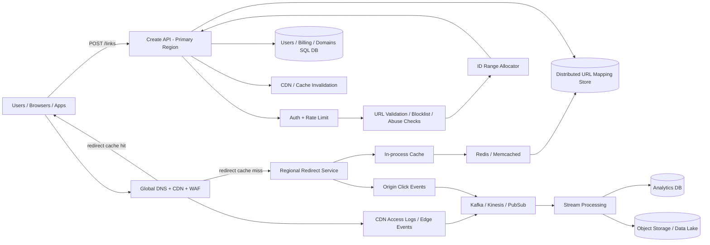

---

Design a URL shortener like bit.ly.


---

Here’s a production-style design for a URL shortener like Bitly.

---

# 1) What we’re building

A URL shortener has two dominant operations:

1. **Create short URL**  
   Input: long URL  
   Output: short URL like `https://bit.ly/Ab3xYz1`

2. **Redirect**  
   Input: short code  
   Output: HTTP redirect to the original long URL

Optional but realistic features:

- custom aliases (`bit.ly/sale2026`)
- link expiration
- link disable/delete
- click analytics
- branded domains (`go.company.com/launch`)
- abuse/spam prevention

The service is deceptively simple. The hard parts are:

- generating **short, unique codes** at scale
- serving redirects with **very low latency**
- keeping the system **highly available**
- collecting analytics **without slowing down redirects**

---

# 2) Requirements

## Functional requirements

- Shorten a long URL
- Redirect from short URL to long URL
- Support custom aliases
- Support expiration / disabling links
- Basic analytics: clicks, country, referrer, device
- Support multiple domains / branded domains

## Non-functional requirements

- Very low latency redirects
- Very high availability for redirects
- High durability of mappings
- Massive read/write asymmetry: redirects >> creations
- No duplicate codes
- No code reuse after delete/expire
- Analytics must not be on the critical redirect path

---

# 3) Back-of-the-envelope capacity planning

Let’s design for a fairly large service.

## Assumptions

- **100 million new short URLs/day**
- **10 billion redirects/day**
- Read:write ratio = **100:1**
- Peak traffic = **10x average**
- Average long URL stored = **150 bytes**
- Metadata per mapping = **~150 bytes**
- Total per mapping record = **~300 bytes raw**

## QPS

### Writes
- 100,000,000 / 86,400 = **1,157 writes/sec average**
- Peak ≈ **11,600 writes/sec**

### Reads
- 10,000,000,000 / 86,400 = **115,741 reads/sec average**
- Peak ≈ **1.16 million reads/sec**

So the system is overwhelmingly **read-heavy**.

## Storage for URL mappings

- 100M/day * 300 bytes = **30 GB/day raw**
- Per year: 30 GB * 365 = **10.95 TB/year raw**

Now account for:
- replication factor 3
- index/LSM/compaction overhead ~1.5x

Total capacity to plan:
- 10.95 TB * 3 * 1.5 ≈ **49 TB/year**

That is very manageable for a distributed KV store.

## Analytics storage

Click events are much larger in volume.

Assume a compressed event record of **100 bytes**:
- 10B/day * 100 bytes = **1 TB/day**

So:
- keep raw click logs in cheap object storage
- keep aggregates in OLAP
- do **not** store raw click events in the primary OLTP store

---

# 4) Key design choices

## Choice 1: Code format

Use **Base62** (`0-9a-zA-Z`), because it gives the shortest codes.

Capacity:
- 62^6 = **56.8 billion**
- 62^7 = **3.52 trillion**
- 62^8 = **218 trillion**

At 100M new links/day:
- 6 chars lasts ~568 days
- 7 chars lasts ~35,200 days = **~96 years**

So **7-character codes** are enough for a very long time.

### Why Base62 instead of Base36?
Base36 is case-insensitive and more user-friendly, but much less dense.  
Since most short links are clicked, not typed manually, Base62 is usually worth it.

---

## Choice 2: ID generation strategy

There are 3 common options:

### A. Database auto-increment
- simplest
- but central bottleneck / single hot dependency

### B. Random 7–8 char codes
- good for non-enumerability
- but collisions must be checked
- 7-char random is too collision-prone at high scale over time
- 8-char random is fine, but links get longer

### C. **Leased sequential IDs + Base62 encoding**  ✅
- no collisions
- short codes
- very high throughput
- easy to operate

I would choose:

- a small **ID allocator service** hands out **ranges** of IDs to app servers
- app servers use those IDs locally without calling allocator on every request
- encode the numeric ID in Base62
- optionally apply a reversible permutation / obfuscation so codes are not obviously sequential

This gives short links **and** avoids a central per-request bottleneck.

---

## Choice 3: Primary store

The redirect path is a simple key-value lookup:

`(domain, short_code) -> long_url + metadata`

This is best served by a **distributed KV store**, e.g.:

- DynamoDB
- Cassandra
- Bigtable

Why not only MySQL/Postgres?
- point lookups are fine
- but billions of rows + multi-region + very high read traffic makes a distributed KV store a better fit for the hot path

Use SQL separately for:
- users/accounts
- billing
- domain ownership
- admin metadata

---

## Choice 4: Multi-region model

Reads are global; writes are relatively small.

A good tradeoff is:

- **active-active redirects**
- **primary-region writes** for link creation and edits

Why?
- redirect traffic needs global low latency and high availability
- writes are only ~1k/sec average, so routing creation to a primary region is acceptable
- uniqueness for custom aliases is much easier with a primary writer

If stricter global read-after-write is required, use a globally consistent DB (e.g. Spanner/Cockroach), but that increases cost/latency/complexity.

---

# 5) High-level architecture



---

# 6) APIs

## Create short URL

```http
POST /v1/links
Content-Type: application/json
Idempotency-Key: 8b7c...

{
  "long_url": "https://example.com/products/summer-sale?ref=abc",
  "custom_alias": "summer2026",   // optional
  "domain": "bit.ly",             // optional branded domain
  "expire_at": "2026-08-01T00:00:00Z",
  "redirect_type": 302
}
```

Response:

```json
{
  "code": "Ab3xYz1",
  "short_url": "https://bit.ly/Ab3xYz1",
  "created_at": "2026-05-05T12:00:00Z"
}
```

## Redirect

```http
GET /Ab3xYz1
```

Response:
- `302 Found` with `Location: <long_url>` by default
- possibly `301` for immutable links

## Update / disable

```http
PATCH /v1/links/{code}
DELETE /v1/links/{code}
```

## Analytics

```http
GET /v1/links/{code}/stats?granularity=day
```

---

# 7) Data model

## Core mapping table (KV store)

Primary key:
- `pk = domain#code`

Value:
- `long_url`
- `owner_user_id`
- `created_at`
- `expires_at`
- `status` (`ACTIVE`, `DISABLED`, `DELETED`)
- `redirect_type` (`301`, `302`)
- `version`
- `abuse_state`

Example:

```text
PK: bit.ly#Ab3xYz1
{
  long_url: "https://example.com/...",
  owner_user_id: 12345,
  created_at: 1714900000,
  expires_at: 1785542400,
  status: "ACTIVE",
  redirect_type: 302,
  version: 3,
  abuse_state: "CLEAN"
}
```

## User listing table / index

For dashboard queries like “show me all links created by user X”:

- `pk = user_id`
- `sk = created_at#domain#code`

This should not be the same access path as the redirect hot path.

## Analytics tables

Do not put click counters on the mapping row; that creates hot keys.

Instead:
- raw events in object storage / log bus
- aggregates in OLAP by minute/hour/day
- approximate uniques with HyperLogLog

---

# 8) Redirect flow

This is the most important path.

## Redirect read path

1. User requests `https://bit.ly/Ab3xYz1`
2. CDN checks edge cache
3. If hit, return redirect immediately
4. If miss, request goes to nearest regional redirect service
5. Redirect service checks:
   - in-process cache
   - then Redis
   - then KV store
6. If found and active:
   - return 302/301 with `Location`
   - emit analytics asynchronously
7. If not found / disabled / expired:
   - return 404/410 or warning page

## Why use cache layers?

Without caching, the DB must handle up to **1.16M reads/sec peak**.

A realistic cache profile:

- CDN hit rate: **70%**
- Of remaining 30%, in-process cache hits **50%**
- Of the rest, Redis hits **90%**

Then DB reads at peak become:

- Start: 1.16M/s
- After CDN: 348k/s
- After L1 cache: 174k/s
- After Redis: **17.4k/s**

That is a huge reduction.

## Negative caching

Many public shorteners get random scans of non-existent codes.  
Cache 404/miss results for a short TTL (e.g. 1–5 min) so invalid probes do not hammer the DB.

---

# 9) Why 302 by default, not 301

A common trap in URL shortener design is to say “always use 301 because it’s permanent.”

In practice, **302 is usually the better default**.

Why?

1. **Editable links**  
   Many shorteners allow destination changes later.

2. **Analytics accuracy**  
   Browsers and intermediaries cache 301 aggressively.  
   That can reduce future requests to your service, which means you miss clicks.

3. **Operational safety**  
   If you accidentally redirect somewhere wrong, 301 can be sticky in browsers.

Use:
- **302** by default
- **301** only for explicitly immutable links where stronger caching is desirable

---

# 10) Create flow

## Create write path

1. Authenticate user / apply rate limits
2. Validate URL syntax and scheme
3. Check blocklists / known-malicious domains
4. If custom alias:
   - validate alias
   - conditional insert to ensure uniqueness
5. Else:
   - generate next ID from locally leased range
   - encode to Base62
   - optionally obfuscate
6. Write mapping to KV store
7. Write metadata to SQL/user index if needed
8. Warm/purge caches
9. Return short URL

## Idempotency

Clients retry. Without protection, duplicate requests may create multiple short links.

Use an `Idempotency-Key`:
- store `(user_id, idempotency_key) -> created_link`
- if request retries, return the original result

---

# 11) ID allocator design

We do **not** want every create request to call a central counter.

Instead:

- allocator hands out blocks like `[900000000, 900999999]`
- each app server caches a block locally
- when nearly exhausted, it requests another block

If each app instance gets **1 million IDs**, and we have 100 creator pods:

- Peak global writes = 11,600/s
- Per pod ≈ 116/s
- 1M IDs lasts `1,000,000 / 116 ≈ 8,620 seconds` = **~2.4 hours**

So allocator traffic is tiny.

### If allocator fails
Creation still works until pods exhaust their current ranges.  
That’s much better than a per-request centralized counter.

---

# 12) Partitioning and replication

## Partitioning

Partition the mapping store by hash of:

`hash(domain#code)`

Benefits:
- uniform distribution
- good scaling
- no hot shard from sequential IDs

## Replication

Replicate across:
- multiple AZs in a region
- multiple regions for disaster recovery and low-latency reads

Recommended model:
- **writes** go to primary region
- **redirect reads** served regionally from replicas/caches

### Consistency model

- **Same-region read-after-write**: should be immediate
- **Cross-region visibility**: eventual, typically seconds
- **Analytics**: eventual, minutes is okay

If the product absolutely requires a newly created link to work instantly from every region in the world, choose a globally strongly consistent store.  
Tradeoff: higher latency and operational cost.

---

# 13) Analytics design

Analytics should be separated from the redirect critical path.

## Important nuance: CDN hides traffic from origin

If CDN serves a redirect from cache, the origin never sees that click.

So analytics must come from:
- **CDN access logs / edge events**
- plus origin logs for misses

## Pipeline

1. CDN/origin produce click events
2. Events land in Kafka/Kinesis/PubSub or are batched into object storage
3. Stream processors:
   - parse IP to country
   - parse user agent
   - compute aggregates
   - update near-real-time counters
4. Store:
   - raw events in object storage
   - aggregated stats in OLAP (ClickHouse, Druid, Pinot, BigQuery)

## What to store

Per event:
- code
- timestamp
- IP prefix / anonymized IP
- user-agent summary
- referrer
- region/country
- domain

## Unique visitors

Use approximate structures like:
- HyperLogLog for unique users
- Top-K sketches for referrers/countries if needed

Why approximate?
Because exact distinct counting at billions of events/day is expensive and usually unnecessary.

---

# 14) Cache strategy

## CDN / edge cache

Best for:
- extremely hot links
- reducing origin latency
- surviving traffic spikes

TTL choices:
- immutable 301 links: long TTL
- editable 302 links: short TTL, e.g. 5–15 minutes

## Redis / Memcached

Regional cache for:
- origin misses from CDN
- very fast key-value lookups

## In-process cache

Tiny hot set per app instance:
- cheapest lookup
- great for repeated hot links

## Cache invalidation

On edit/disable/delete:
- purge CDN entry
- invalidate Redis entry
- bump mapping version

There may still be a brief stale window; that is the normal tradeoff of caching.

---

# 15) Reliability and failure modes

## 1. Cache outage
**Problem:** Redis cluster fails; DB sees huge spike.

Mitigations:
- CDN absorbs a lot of hot traffic
- local in-process cache
- request coalescing for same key
- circuit breakers
- auto-scale redirect service / DB
- short-lived stale cache serving if safe

## 2. DB issues
**Problem:** mapping store degraded or unavailable.

Mitigations:
- multi-AZ replication
- regional failover
- CDN can continue serving hot links from cache
- do not couple redirects to analytics or SQL metadata

## 3. Hot key / celebrity link
**Problem:** one short code gets millions of requests/sec.

Mitigations:
- CDN caching
- pre-warm caches
- request collapsing at origin
- edge caching by exact path

## 4. Primary region outage
**Problem:** create/update traffic fails.

Mitigations:
- active-active redirect path still works from replicas/caches
- fail over write primary if needed
- creator nodes retain leased ID ranges temporarily

## 5. Replication lag
**Problem:** link created in primary not immediately visible elsewhere.

Mitigations:
- same-region read-after-write guarantee
- async replication target under a few seconds
- if stricter requirement, use global strong consistency

## 6. Analytics backlog
**Problem:** Kafka/stream pipeline slows down.

Mitigations:
- analytics is decoupled from redirect path
- buffer in log storage
- degrade dashboard freshness, not redirect availability

## 7. Stale cached redirects after edit
**Problem:** users hit old destination briefly.

Mitigations:
- short cache TTL for mutable links
- explicit purge
- use 302, not 301, for editable links

## 8. Deleted code reused accidentally
**Problem:** old cached/code references redirect to a new target.

Mitigation:
- **never reuse short codes**

---

# 16) Security and abuse prevention

A public URL shortener is an abuse magnet.

## Protections

### Rate limiting
- per-IP
- per-user
- per-domain
- stricter limits for anonymous users

### Malware / phishing detection
- block known bad domains at creation time
- async rescans for existing links
- disable compromised links quickly

### Domain verification
For branded domains:
- DNS or HTTP verification
- managed TLS certificates

### Enumeration resistance
Sequential codes are easy to scrape.
Mitigations:
- obfuscate sequential IDs before Base62 encoding
- rate limit scanners
- WAF/bot detection

### Privacy
- anonymize IPs where required
- retention limits
- GDPR/CCPA deletion support for analytics if applicable

---

# 17) Tradeoffs recap

## Sequential IDs + permutation vs random codes
**Chosen:** sequential range leasing + optional obfuscation

Pros:
- short codes
- no collision checks
- high throughput

Cons:
- extra allocator component
- true secrecy not guaranteed unless using stronger obfuscation

## Primary-write vs global multi-write
**Chosen:** primary-write

Pros:
- simpler uniqueness guarantees
- easier operational model
- writes are low enough

Cons:
- higher create latency for far regions
- small replication lag globally

## CDN caching vs analytics fidelity
Caching reduces load and latency, but can hide events from origin.  
So we capture analytics from edge/CDN logs.

## 302 vs 301
**Chosen:** 302 by default

Pros:
- editable links
- better analytics
- less sticky mistakes

Cons:
- slightly less cacheability than 301

---

# 18) A practical “v1 to v2” evolution

## v1 (small scale)
- Postgres for mappings
- Redis cache
- single region
- background job for analytics

Good up to moderate scale.

## v2 (Bitly-scale)
- distributed KV store for mappings
- CDN/edge caching
- multi-region redirects
- primary-write creation
- Kafka + OLAP analytics pipeline
- ID range allocator

That’s the design described above.

---

# Final design summary

The best production design is:

- **Base62 short codes**, usually 7 chars
- **Range-leased ID generation** to avoid collisions and central bottlenecks
- **Distributed KV store** for `code -> URL` mappings
- **CDN + in-process cache + Redis** for redirect latency and scale
- **Active-active global redirect path**
- **Primary-region create path**
- **Asynchronous analytics pipeline**
- **302 redirects by default**
- **No code reuse ever**
- **Strong abuse prevention and rate limiting**

If you want, I can also provide:
1. a **deep dive on schema and database choice**,  
2. a **sequence diagram for create + redirect**, or  
3. a **simpler interview-style 10-minute answer**.